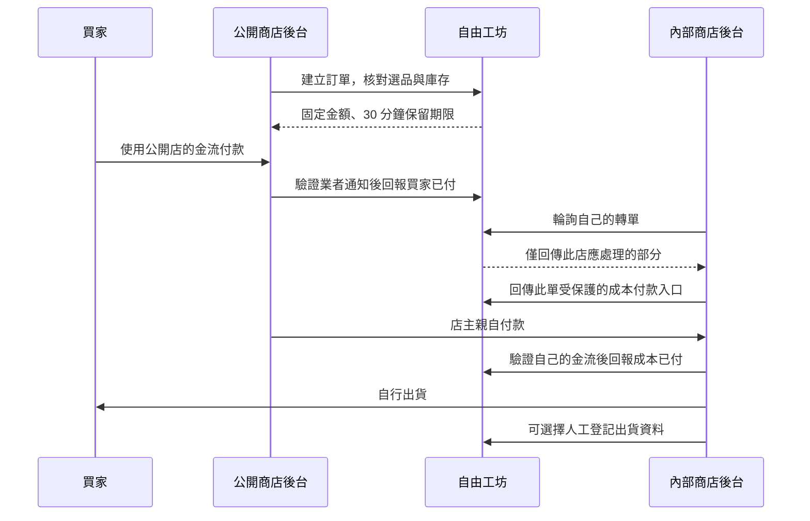

# AI 雙商店：設計規劃與 Agent 交接

**下一位 Agent 從這份開始讀。** 頁面標記為 `page:supplier`、`page:retail`。

本文件整理已定案的產品方向、實際實作、未完成部分與續作依據。記錄時間：2026-09-30；程式基準 `071d5b43a17ff883b8cb7268f79dc801dc088e5c`。文件隨後另行提交，接手時必須重新讀取最新 Git／PR 狀態。

PR：[FreeTWAI-AI/freedom-platform #46](https://github.com/FreeTWAI-AI/freedom-platform/pull/46)。Fork：`arumwu/freedom-platform`；工作分支：`feat/supplier-retail-pricing-preview`；上游預設分支在本次核對時是 `main`。分支名稱是沿用名稱，不代表本次只做價格試算。

第 11 節寫目前程式已經接上的平台機制，以及仍然不能上線收真錢的缺口。兩店、會員自己的 AI、平台不保管資金維持不變。

## 1. 為什麼要做這個設計

原始討論的問題是：有商品的人希望有人幫忙賣，但推廣者如果只拿很少的分潤，很容易花了製作網站與行銷的時間卻沒有足夠收益。使用者希望讓願意推廣的人真正經營自己的商店、自行定價；有商品的人專心整理商品、收取約定成本並出貨。

因此，兩方都是店主，差別是商店服務的對象。介面不強迫人先選「供應商／經銷商」身分；同一個人也可以兼做兩邊、販售自己的商品。

平台降低開店與合作的操作成本：把複雜工作整理進 MD，交給會員原本會用的 AI 完成。中央保存可驗證格式的商品／商店資料與交易回報，不接管商家的收款資金，也不經營物流系統。

「平台不經手金流」是確定方向；「雙方一定拿得到錢」不是可保證的結果。商店回報、金流業者實收、退款及履約是不同事實，下一位 Agent 不得把它們合併成保證。

## 2. 已定案的分工

| 對象 | 做什麼 | 收誰的款 | 網站可見性 |
| --- | --- | --- | --- |
| 我有東西要賣（內部商店） | 整理自己的商品與條件、接轉單、出貨 | 公開店支付的商品成本及約定運費 | 由外部商店真正驗證登入與授權；中央不公開其入口 |
| 我可以賣東西（公開商店） | 選品、自主定價、網站、推廣、買家客服 | 買家支付的零售款 | 公開商品頁，店主及買家訂單後台仍需各自保護 |
| 自由工坊 | 發 MD、成果預覽與歸檔、共用分單、付款回報與人工出貨登記 | 不代收、不保管、不分帳、不自動扣款 | 目錄供完成會員權限的人選品，公開店有受限的公開資料入口 |

物流由出貨方處理。願意回來登記時，只填交付方式、日期、物流公司與單號；自送／自取不要求單號。平台不接物流商、不追蹤包裹、不推定簽收。

## 3. 會員真正走的流程

### 有商品的人

下載內部商店 MD → 附到自己的 AI 對話 → 提供授權商品來源 → AI 整理商品、做有登入保護的網站並引導金流申請 → 拿回成果檔 → 上傳／预覽／確認歸檔 → 取得工坊商店金鑰並放入外部主機秘密設定 → AI 完成交易串接及測試。

商品價格、可供數量、圖片權利、出貨及退貨條件不能由 AI 猜。本人完成身分、銀行驗證與契約；AI 完成它能做的程式與測試，不要求會員懂 GitHub 或手寫 JSON。

### 想賣東西的人

在工坊挑選商品 → 下載帶有選品資料的公開商店 MD → AI 與本人確認售價，做公開商店與自己的金流 → 帶回成果檔並確認歸檔 → 設定專屬金鑰 → 呼叫 `/connection` 取得 `selection_id` → 跑完整測試交易。

### 避免首次連線的循環依賴

首次先做「尚未連線、不可結帳」的測試网站與成果。歸檔後才有商店代號及金鑰，公開店再取得選品代號。不能要求先有真實成交才能歸檔，也不能把未連線展示頁當成可交易商店。

先用 `mode=test`。本人核准正式上線後，建立 `mode=live` 的正式成果與新金鑰，兩邊商品與商店模式一致。MD 不是已完成商店的證明，分享頁也不等於具備私密後台。

## 4. 一筆交易怎麼走



「自動轉單」目前指中央建好分單、在買家已付款回報後讓各內部店讀取；外部店後台依 MD 每 30–60 秒輪詢。**沒有已實作的推送 webhook 或自動成本扣款。**

500 元例子：零售款 500 元歸公開店；商品 300 元加每件運費 60 元，由公開店主親自支付內部店 360 元。在供貨方接受這一版售價、且買家付款已由商店後台驗證之前，140 元只是試算，不叫淨利或已收到的現金。360 元是店主要付的成本加運費，不是 `SupplierPayable`。

付款狀態由各店後台驗證業者資料後上報，證據標記固定是 `merchant_backend_report`。點付款連結、付款頁跳轉、會員自己按「完成」都不會成為中央付款成功證明。

## 5. 已實作的不變條件

- 內部店和公開店有獨立商店及金鑰。金鑰單店、90 天、只存雜湊；輪替使舊金鑰失效，原文不進 command receipt 或 MD。
- 成果先預覽，不寫商品；本人確認後才整批原子匯入。相同會員／相同成果雜湊不重複建立。
- 公開店保存選品時的價格與條件快照。訂單只用中央固定資料算錢，不信任瀏覽器售價。
- 建單先保留數量 30 分鐘，庫存不足不建單。相同外部訂單代號及付款事件重送不可重複扣留或記款。
- 金額以整數分為單位；500 元為 50000。TWD／USD 不換匯；供貨成本按件加運費，公開售價自行包含要向買家收的費用。
- 買家付款與商品成本付款分開保存。各自全額退款，必須引用原收款交易；買家退款不等於成本也已退。
- 內部店在買家付款回報後才可看到自己的轉單與已接受的實際售價，不看其他店資料，也不看公開店的整張訂單金額。轉單包含原 SKU 與來源公開店資訊。
- 兩筆均回報已付、且未退款，才允許出貨方人工登記。記錄標 `shipper_entered`，沒有物流核實。
- 買家姓名、電話、地址不存中央 manifest 或 MD；中央只存不含個資的 `delivery_ref`。安全的跨店收件資料交付仍由兩家外部店建立並驗收。
- 建單、付款、取消及出貨等交易處理以社群鎖排序；**等到鎖之後必須重新讀取可變接單狀態**。已有確定性測試防止暫停接單時仍用舊值開單。

## 6. 視覺與互動：不要再誤解的定案

1. 保留原本頁框、左右留白、側欄與文字內距。使用者說的「滿版」指茶葉目錄這種**單一商品卡片填滿商品列表**，不是整個頁面貼齊螢幕。不要重新加入 `shop-shell` 的零 padding 覆寫。
2. 商品列表用 `auto-fit`，只有一件時佔滿整排；多件依可用寬度排列。320 px 手機不橫向溢出。
3. 三個商店主要按鈕同排等寬，使用短而清楚的文字，不讓標籤斷成二、三行；完整意思保留在可存取名稱。桌面按鈕列不無限制拉長。
4. 兩頁以下載 MD、選品、上傳成果為主；不把原本一堆商品表單搬回主要流程。舊資料保留在收合區，不能逕自刪除或冒充新模式商店。
5. 右上「頁面說明」已有各六步教學。每次改 UI，要給使用者看實際新畫面；不可只報 commit 或拿未部署的本機畫面說成正式站。

## 7. 程式與文件的依據

| 要改的內容 | 先讀的權威來源 |
| --- | --- |
| 範圍、協作、設計 | [AGENTS](../../AGENTS.md)、[CONTRIBUTING](../../CONTRIBUTING.md)、[DESIGN](../../DESIGN.md) |
| 平台已定的交易機制（本功能已接上接受、應付與 margin；未啟用資金移動） | [領域與狀態](../platform-plan/03-domain-events-state-machines.md) §3.6–3.9、[模組規格](../platform-plan/04-module-specifications.md) §3、[架構](../platform-plan/02-architecture-repositories.md)、[決策](../platform-plan/07-decisions-risks-traceability.md) ADR-026／028／030／031／063；對照見本文第 11 節 |
| 產品操作與部署程序 | [AI 雙商店規格](supplier-retail-pricing.md) |
| 前置審查、併發修正證據 | [審查紀錄](agent-shop-review.md) 與 PR 最新補充 |
| 兩頁實際畫面 | [CommercePanels.tsx](../../apps/portal-web/src/modules/CommercePanels.tsx)、[AgentShops.css](../../apps/portal-web/src/modules/AgentShops.css) |
| 人看的操作教學 | [page-help.ts](../../apps/portal-web/src/page-help.ts) |
| AI 指引原文 | [common.md](../../packages/shop-agent/common.md)、[internal.md](../../packages/shop-agent/internal.md)、[public.md](../../packages/shop-agent/public.md) |
| 完整下載檔組裝 | [kit.ts](../../modules/agent-commerce/kit.ts)、[runtime text 產生器](../../scripts/generate-runtime-text.mjs) |
| 實際成果欄位與限制 | [schema.ts](../../modules/agent-commerce/schema.ts) |
| 商品選品、預覽、匯入、抓取 | [imports.ts](../../modules/agent-commerce/imports.ts) |
| 訂單、付款、暫停、金鑰、出貨 | [orders.ts](../../modules/agent-commerce/orders.ts) |
| URL、驗證與路由權限 | [agent-commerce.ts](../../apps/platform-api/src/routes/agent-commerce.ts)、[platform-app.ts](../../apps/platform-api/src/platform-app.ts) |
| 資料表與約束 | [055_agent_shops.sql](../../migrations/055_agent_shops.sql)、[056_commerce_distribution.sql](../../migrations/056_commerce_distribution.sql) |
| 行為驗收 | [runtime](../../tests/runtime/agent-commerce.test.ts)、[E2E](../../tests/e2e/agent-shops.spec.ts) |
| Node／Worker 實際部署規矩 | [Cloudflare README](../../deploy/cloudflare/README.md) |

變更 MD 原文後執行 `npm run generate:runtime-text`，不可只編輯 generated 檔。完整下載檔還含 API 基址、成果範例與實際選品，不是只把某一份原文 MD 直接送出。

文件說明意圖，schema／路由與測試說明目前實作。發現不一致時先列出具體差異，再依使用者已定案方向修正；不能為符合舊程式就默默改產品定義。

## 8. 已完成與尚未完成

### 已完成於 PR

兩頁主流程及教學、角色 MD 與共用交易指引、成果歸檔、目錄選品、單店連線、中央分單／付款紀錄、人工出貨、庫存保留、重送去重、暫停接單與舊資料保留。以上有本機測試，不等於正式平台已提供服務。

截至程式基準，交易 runtime 12 項通過；旧 commerce／client-connections／development-map 22 項通過；教學及開發入口 E2E 6 項通過，最後版型定向 E2E 3 項通過；Worker 10 項通過。前輪完整 runtime 首跑 595 項有 3 項因本機 Python 缺套件失敗，補指定套件後對應兩套 23 項重跑通過，不能寫成整批一次全過。完整命令／範圍見 PR。

### 未完成，不得宣稱已完成

- 上游 PR 合併、最新 head 的 CI 通過、staging／正式 migration 與平台發布。
- 各店真人金流帳號申請、真實收款與退款驗收。
- 外部網站實際發布、內部店登入隔離與兩店收件資料通道的真實驗收。
- 工坊同源託管外部網站程式、任意 CodeSandbox／分享頁網址匯入。現在只歸檔目錄與外部入口；其他主機可交成果檔。

本次最後核對時，GitHub 上游 `push/maintain/admin` 都是 false；CI 為 `action_required`。使用者已要求審查後合併，但文字授權不會自動增加 GitHub 權限。接手時重新核對；不要改用未知帳號、跳過受保護分支或使用 admin bypass。

Jev 已前置審查並促成併發修正，但其 gate／review 曾回 `escalate`。這是需进一步覆核的結果，不是自動放行。分開記錄具體 findings、測試證據及自動判斷；不能只報「Jev 跑過」。

## 9. 下一位 Agent 的工作順序

### 第一優先：把現有 PR 正確交付

讀本文件及 repo 規則 → 讀取最新分支、diff、PR／CI → 保留未提交變更 → Jev 先看相符來源與測試，人工覆核 SQL／MD 及發現 → 完成所需驗證 → 更新同一 PR。

有權維護者完成審查與最新 CI 後才能合併；保存 merged SHA。有部署授權及正確私有 overlay 的操作者再按既有程序先 staging、後正式，先備份、核對 055／056 migration 與 runtime grants，最後讀回 release SHA 及頁面。沒有權限就提供確切阻礙，不能冒稱已發布。

### 第二優先：驗證一組真正能合作的外部商店

中央與 MD 已具備接口；接下來最有價值的是用一間內部店＋一間公開店走完整測試模式流程，查核 AI 是否能僅依下載檔做出網站、接好兩家金流測試環境、互相授權收件資料、完成付款與退款回報。

先用合成商品及資料；真實扣款、商家申請、秘密設定及對外發布沿用本人實際授權。若缺哪段教程或接口，將可重現問題補到原文 MD／中央測試，避免再靠臨時聊天補丁才能使用。

### 後續候選，不是本次已授權必做

- 商品／庫存／價格更版流程：現在匯入是新商店／新版本，沒有原地編輯。須防同一庫存重複開售，保存舊訂單快照。
- 中央管理畫面的訂單翻頁：機器 API 有 offset，畫面目前只列最新 100 筆。未完成的舊訂單不能因列表限制失去處理入口。
- 更通用的成果來源：保持大小、來源、重新導向及內容限制，不直接抓任意私網或執行外部 HTML。
- 非即時付款、部分退款、合併運費等：目前未支援，需另定業務條件、失敗補償與測試，不能直接取消現有保留期或金額檢查。

這些是需再確認優先序的規劃，不能以本文件為由自動擴張成金流平台、物流平台或通用網站託管服務。


## 10. 最小驗收與重跑入口

修改中央交易時，至少確認：跨店／跨社群拒絕、暫停與並行建單、超賣、事件重送、到期、兩筆付款及退款分離、未付款不能登記出貨。改 UI 時確認四種寬度、正常內距、單件商品填滿列表、按鈕不換行及功能仍可操作。

```sh
npm run typecheck
npm run generate:runtime-text
npm run build
npx tsx --test --test-concurrency=1 tests/runtime/agent-commerce.test.ts tests/runtime/commerce.test.ts tests/runtime/client-connections.test.ts tests/runtime/development-map.test.ts
npm run test:e2e -- tests/e2e/agent-shops.spec.ts tests/e2e/development-guide.spec.ts
npm run worker:dry-run
npm run worker:dry-run:admin-sync
npm run test:worker
python3 scripts/update-inventory.py
npm run verify:inventory
git diff --check
```

依 repo CI 與修改範圍補跑完整 runtime、contracts、consumer repo 測試；以上不是取代 CI 的全部清單。使用隔離 PostgreSQL，不以正式資料做測試。瀏覽器必須在新 build 後跑；缺瀏覽器或 Python 套件時用核准的本機環境及 repo 指定版本，不偽造通過。

每次交接附：程式 SHA、PR／CI 連結、實跑結果、Jev 結果及處置、實際畫面、未驗證事項、下一個明確動作。不要只有「已完成」三個字。

## 11. 已接上的平台機制與仍不能當真上線的部分

對照上游 `main` 的 `docs/platform-plan/`（02、03、04、07）。兩店、MD 交給會員自己的 AI、買家付公開店、公開店主付內部店、平台不代收不保管，都保留。沒有新建錢包、代扣或另一套付款平台。

### 11.1 程式現在會做的事

- 公開店每一筆選品是一版 `SellerListingRevision`。快照含實際售價、供應淨額、運費、明示稅（目前為 0）與 `SellingArrangement=reseller` 的六個責任：`seller_of_record`、`payment_collector`、`invoice_issuer`、`refund_owner`、`price_owner` 都是公開店主，`fulfillment_party` 是內部店主。
- 內部店主以會員登入、對 exact `listing_sha256` 做 `DistributionAcceptance`（接受、拒絕、要求修改或撤回）。這不是匯入確認，也不是 `internal_preview`。商店金鑰與 AI 不能代簽。未接受不能結帳；撤回只擋新訂單，保留期內已建立的訂單仍可付款。
- 買家付款經商店後台驗證後，才為該筆已接受的明細建立不可覆寫的 `SupplierPayable`（供應淨額）與 `record_only` 結算。運費與稅分開列，不混進應付。介面只寫「已記錄」。`money_movement_enabled=false`，`platform_collects=false`，`auto_debit=false`。沒有 `TransferJob`，沒有自動扣款。
- 賣家 margin 只在該驗證付款與已接受同時存在時計算：實付金額 − 供應應付 − 明示運費與稅。標成「預估差額」，`cash_received=false`。在那之前，500／360／140 只以試算出現。買家全額退款追加 reversal，不刪應付，也不自動退錢；margin 不再顯示。
- 內部店看得到自己明細的實際售價。公開店的整張訂單金額與 margin 不給內部店。出貨仍是出貨方登記，不是平台履約授權。

舊目錄 `modules/catalog-commerce` 的 `internal_preview` 仍只服務收合區的演練，不開門結帳，也不被這條結帳流程拿來當接受。

### 11.2 還沒有、所以還不能對真實資金上線的部分

- 沒有銀行對帳。`merchant_backend_report` 不是 `reconciled_received`，平台沒有核實入帳。
- 沒有 `SettlementMandate`，沒有付款人 A4 加 Ted 對同一 digest 的付款類 A4，因此不能變成 `authorized_mandate`。範圍內自動撥款未啟用。
- 沒有賣家收款、付款人撥款、受益人收款三種 connection，沒有綠界或其他 provider 的真實扣款。
- 沒有獨立 QC、`official` 或法律用的電子簽章供應商。這裡的接受是會員在平台對 exact digest 的決定，不是 DocuSign。
- 沒有物流追蹤、部分退款、或跨店收件資料的信任通道。055／056 尚未套用到正式資料庫；本變更不部署。
