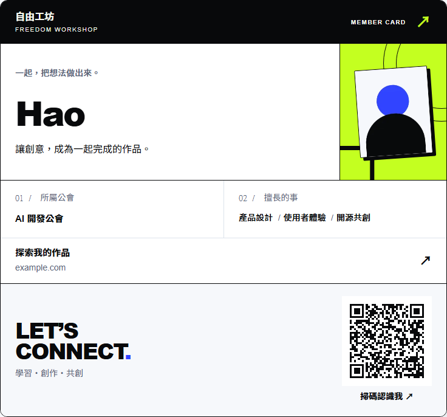
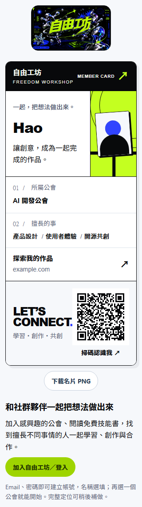

# 工坊誌會員名片

## 本輪交付

依 Hao 提供的平面設計參考，採粗體姓名、非對稱網格、細線、幾何圖形及留白，以自由工坊的白、墨黑 `#08090b`、萊姆綠 `#c4ff20` 和少量電藍 `#3044ff` 製作「工坊誌」模板。參考圖只提供構圖方向；沒有複製海報、品牌、字型或第三方圖片。原始自由工坊品牌圖保留在公開頁入口。

本分支接續 [PR #86](https://github.com/FreeTWAI-AI/freedom-platform/pull/86) 的 `c1d45b55df141f885b8aab1630f0e9f132b7c7af`，保留 Ted 的作者紀錄、四款舊模板、介紹與連結編輯。此輪新增：

- 「工坊誌」作為新名片預設，既有會員選擇不變；五款樣式均可產生 QR Code。
- 本人及會員詳細名片的摘要也採用相同品牌模板；會員資料細節與可見聯絡方式保留在下方。
- 自動載入姓名、頭像、主要公會與三項精選專長。名稱及頭像保存後即更新本人預覽，不必重整頁面。分享介紹與作品連結由本人選擇。
- QR Code 在瀏覽器本機產生，只包含當前來源上的有效格式分享網址；不呼叫外部 QR 服務，也不在碼中加入 UUID、Email、追蹤參數或聯絡資料。
- 公開頁與本人預覽可下載兩倍解析度的 PNG。產圖套件按下載時才載入；未保存設定時禁止下載，失敗會顯示可重試提示。

## 資料與隱私

沿用分享預設關閉、頭像另行勾選、版本檢查及可撤銷 token。匿名頁只使用 `/public/member-cards/:token` 回傳的公開欄位；已登入會員的額外資料不納入 PNG。本人預覽使用自己的受保護頭像路徑及版本，以立即反映圖片更新；只有已保存的頭像公開選擇才允許匯出。匯出圖片是光柵像素，沒有把受保護頭像路徑或本人 ID 變成分享網址。產圖快取保留圖片版本參數，避免第二次匯出沿用舊頭像。

分享停用時本人預覽移除 QR 與下載按鈕。更換連結時使用新 QR，舊分享網址及其頭像端點回傳 404。已下載圖片不會被遠端刪除；其中的舊 QR 會開啟失效頁，需要重新下載新名片。公開頁在重新載入時重新驗證分享狀態。沒有新增權限、XP 或身分證明。

## 檔案入口

- `apps/portal-web/src/modules/MemberECard.tsx`：可重用模板與五款選擇。
- `apps/portal-web/src/modules/MemberEditorialCard.css`：桌面、手機、品牌色及焦點樣式。
- `apps/portal-web/src/modules/MemberCardQr.tsx`：四個模組寬的白色保留區、深色 QR、同來源分享路徑校驗。
- `apps/portal-web/src/modules/MemberCardDownload.tsx`：PNG 匯出、錯誤與過期操作處理。
- `MemberShare.tsx`、`Membership.tsx`、`PublicMemberPage.tsx`：本人預覽、個人名片與公開頁接線。
- `migrations/069_member_card_editorial.sql`：新增允許的樣式與新卡預設；不改既有卡片的選擇。部署須先納入 #86 的 068，再依正常發布流程執行 069。若上游先占用編號，合併前需重新編號並調整部署 manifest。

## 套件與素材

| 套件 | 版本 | 用途／來源 |
| --- | --- | --- |
| qrcode | 1.5.4 | QR 編碼；[官方原始碼](https://github.com/soldair/node-qrcode)，MIT |
| html-to-image | 1.11.13 | 使用者操作時匯出 PNG；[官方原始碼](https://github.com/bubkoo/html-to-image)，MIT |
| jsqr | 1.4.0 | 僅測試使用的獨立解碼器；[官方原始碼](https://github.com/cozmo/jsQR)，Apache-2.0 |

執行時套件與 dijkstrajs 的授權原文保存在 `apps/portal-web/public/licenses/member-card/`。qrcode 核心亦保留 Ryan Day（2011）及 Kazuhiko Arase（2009）的來源署名。本輪無新增生成圖；範例頭像為測試程式畫的幾何圖形。下面的畫面使用隔離資料庫的合成會員，QR 指向已結束的本機測試，不是正式會員名片。

## 實跑驗證

2026-10-02，本機 Node 24／隔離 PostgreSQL schema：

- `npm run typecheck`、`npm run build`：通過；前端仍有既有大 bundle 提示。
- `tsx --test --test-concurrency=1 tests/runtime/member-card-qr.test.ts tests/runtime/member-ecard.test.ts tests/runtime/member-connections.test.ts`：17/17。涵蓋 QR 獨立解碼、不同部署網域、公開欄位、撤銷、版本與既有模板保留。
- `playwright test tests/e2e/member-editorial-card.spec.ts tests/e2e/member-ecard.spec.ts tests/e2e/member-connections-51.spec.ts tests/e2e/member-directory.spec.ts`：13/13。涵蓋 1280／820／390／320px、長名、缺頭像、空欄位、三主題、名字更新、圖片下載解碼、失敗提示、QR 更新與撤銷、舊四模板及既有名冊。
- 在加入圖片版本快取處理後，再執行 `playwright test tests/e2e/member-editorial-card.spec.ts`：3/3，確認同頁第二次匯出採用新頭像、QR 仍解碼至相同連結。中間一次測試誤將頭像版本寫死為 2，已改為驗證版本實際增加；上述 3/3 為修正後結果。
- `npm run worker:dry-run`：local／staging-next／next 三環境通過，沒有部署。
- `npm audit --omit=dev`：0 漏洞；全依賴 audit 仍列出上游既有 miniflare／undici／wrangler 開發工具鏈問題，此輪沒有升級發布工具。

沒有宣稱 staging／正式站驗收或已上線。合併及發布由維護者處理。
