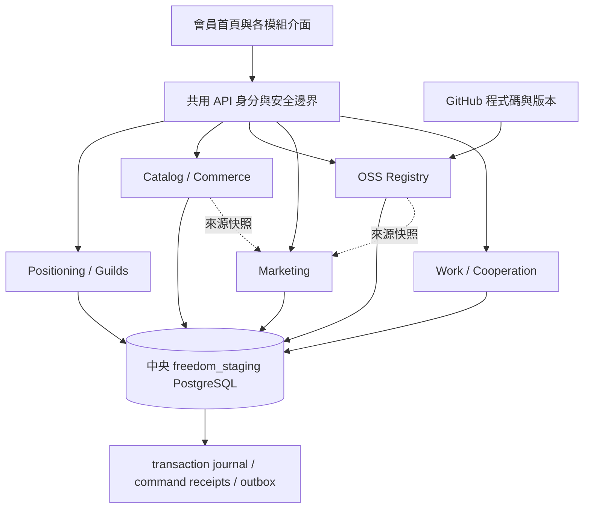

# 會員模組擴建與中央資料設計

本設計依 Ted 對產品入口的修正：會員要先能辨認「我的定位、供貨、零售、開源作品」，再使用共同工作／合作流程。對齊 [架構 §3](../platform-plan/02-architecture-repositories.md#3-8-個使用體驗模組與-5-個共同營運核心)、[模組規格](../platform-plan/04-module-specifications.md)、[產品與社群](../platform-plan/01-product-community-model.md)。各模組以可保存資料的內部 staging 操作推進，不以新選單代替功能。

## 使用入口與責任

| 入口 | 會員能做的事 | 唯一資料責任 |
| --- | --- | --- |
| 會員首頁 | 理解自己的參與方式，直接進入各模組 | 各模組資料的導覽／讀取；不複製資料 |
| 我的定位 | 編輯背景、能力、目標與時間；確認可修改的方向 | Positioning：本人定位卡；Organization：職業／公會成員關係 |
| 職業公會 | 瀏覽縱向 Guild 與可選職業；本人加入／離開 | Organizations & Professions |
| 供貨中心 | 提交實體商品與照片連結，建立供貨版本，處理店主提出的供貨需求 | Catalog：Product、SupplierOfferVersion；Distribution：供貨回應 |
| 開店與銷售 | 建立自己的 Store、選品、設定 listing 草稿與售價、提出供貨合作 | Commerce：Store、SellerListingRevision／供貨關係 |
| 開源作品 | 登記 public GitHub repo，保存 stable repository ID、exact commit／license，說明用途與協作入口 | Skills／OSS：候選專案與版本紀錄；GitHub 仍是程式碼權威 |
| 行銷工作室 | 以來源事實編輯行銷草稿，保存人工分享紀錄 | Marketing：private draft、source snapshot、manual share record |
| 我的工作／合作紀錄 | 處理已認領工作、交付與雙方合作 | Opportunity／Project／Work；供貨商品不必繞經一般 Showcase |

定位是可跳過的導覽，不是註冊／加入／供貨／使用作品的門檻。一個人可以同時有供貨、銷售、開發與行銷角色；職業、公會 rank、office appointment、每案責任互不推定。新增職業方向不更動 legacy assessment 的原型或分數。

## 中央 PostgreSQL 與模組寫入邊界



- 相同會員 user／community／session；模組不另建登入系統或另一份會員真相。
- 每個模組只透過自己的 command 寫入所屬資料；跨模組使用唯讀投影／服務與明示 ref。禁止從行銷改商品價格或從作品展示冒充 repo owner。
- 每個 command 與 receipt／journal 同一交易；可重送的 mutation 帶 Idempotency-Key，既有 aggregate 更新核對 If-Match。
- 本人資料按 user scope、公會與作品按明示社群可見性隔離；擁有 repo URL 不代表擁有或管理該 repo。
- Product offer、listing、OSS version、campaign source 保留版本／digest，既有引用不隨下一次編輯悄悄改動。
- `freedom_staging` 使用獨立非 superuser 應用帳號；`freedom_local` 只供開發測試。測試建立唯一暫存 schema，不清空 staging。
- 遷移採新增 migration；部署前停止舊 app、備份並複製現有資料，套用新 migration，再切換 app 的 DATABASE_URL。舊 DB 保留作回退來源。
- 目前 DB 仍在 Castle。managed PostgreSQL、異地備份、Workers／Hyperdrive 屬後續實際雲端資源，不宣稱本輪已完成。

## 供貨與零售

```text
供貨者：建立 Product → 保存 SupplierOfferVersion（供貨價／可供數量／交付條件）
店主：建立自己的 Store → 選品 → 建 listing revision → 提出供貨合作
供貨者：閱讀 exact listing snapshot → 本人在 staging 回應接受／婉拒
店主：看到該版本的供貨回應 → 準備後續銷售
```

本輪供貨接受是內部演練，並非 production DistributionAcceptance A4。正式訂單／付款尚未啟用；介面不能稱已可真實結帳、銀行已收款、QC 已認證或平台已付款。下個完整商業階段依 canonical 補足 SupplierParty／SellerParty、簽名、QC、單一 Seller checkout、庫存 reservation、履約與 record_only reconciliation。

商品照片僅在使用者瀏覽器以 HTTPS 載入，不由 server 代抓任意網址。原始圖檔上傳、R2／quarantine、惡意檔案掃描另作實際功能，不以 URL 欄位宣稱完整資產庫已建好。

## GitHub 與開源作品

登記 public GitHub repository → 從限制的 GitHub API 讀取 metadata → 保存 stable repo ID／default-branch exact commit／該版本 license → 本人補用途 → 社群瀏覽候選作品。更新時 stable ID 必須一致，無法讀取就保留原版本並提示重試。

不任意 clone／執行上游程式，不抓私人 repo，不把提交者稱作已驗證維護者；缺少授權資訊就呈現未知，不能替 repo 補造 open-source license。Penpot 如有使用，作為後續設計稿／原型外部協作接點；不取代 GitHub 或本平台 registry。

## 行銷與外部接線

RefRef／Refferq 的 referral attribution、partner journey 是參考重點。平台 Campaign 起點應有來源作品或商品的 exact facts，人工分享與外部 provider confirmed publication 分開。沒有真實 click／conversion／payment evidence 時不顯示虛構轉換數、獎勵或已結算。

LINE Node SDK 是未來官方 Messaging API adapter，不是 Store backend。台灣電商工具集中可參考 payment／invoice／logistics 接點與 payload；真正的 provider credentials、sandbox callback、驗簽／去重／對帳要逐個接，程式碼存在不表示接線完成。

## 分工與交付順序

1. 中央 DB、共用 session／command、安全邊界、module navigation：整合主線。
2. Positioning／Guilds：獨立 migration、API、定位卡與公會頁面。
3. Supplier／Retail：獨立 migration、API、商品與商店頁面。
4. OSS／Marketing：獨立 migration、API、GitHub registry 與行銷草稿頁面。
5. 合併後驗證跨角色流程、community isolation、持久保存、舊流程回歸；再部署同一 exact SHA。

後續依賴順序：供貨／作品穩定資料 → 行銷外部發布與 LINE／Discord 接線 → Seller-owned sandbox 訂單／履約／金流紀錄；依實際需求接 Worker／Queue／R2。八模組原本的陪跑與媒體尚不在本輪完整實作範圍。
