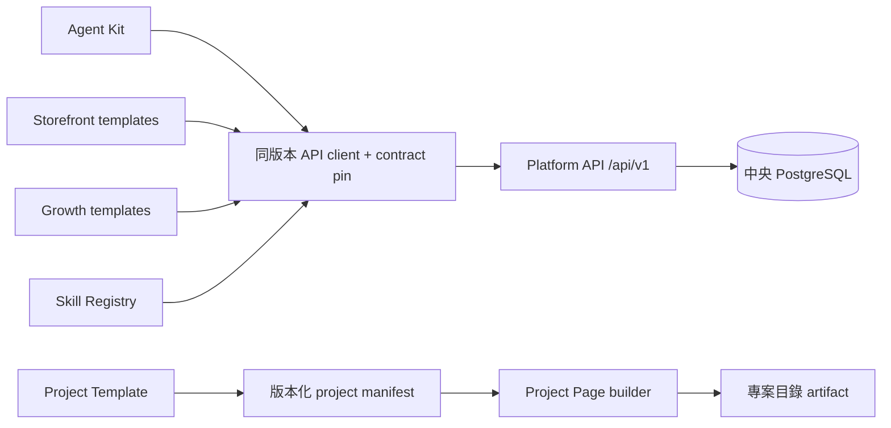

# Repo 分工與模板串接

目前依大計畫 §4 分倉：中央 domain commands 與資料保留在 Platform；可維護／fork 的產品模板獨立。會員定位、供貨與 Guild 不各複製一套 DB。

| Repo | 本輪內容／資料接點 |
| --- | --- |
| freedom-platform | 會員、定位、公會、供貨、零售、作品、行銷 canonical commands；32 個 preview operations、OpenAPI／SDK 及中央 PostgreSQL |
| freedom-agent-kit | 共用 protocol／client、CLI 會員工作摘要、各 AI 工具 adapter 說明；不複製工作資料 |
| freedom-storefront | master-store／catalog-store／single-product／service-offer 模板，店主 API helper、靜態內部預覽；service-offer API 尚未接入 |
| freedom-growth-automation | 草稿／分享 API helper、來源固定的文案與 LINE 格式本機預覽；正式發布／media 執行待接 |
| freedom-skill-registry | declaration index、文件型 skill starter、GitHub project import client；不是第二份會員／作品 DB |
| freedom-project-template | 新專案可運行骨架、測試與身分初始化指引 |
| freedom-project-page | 公開 manifest 的固定介紹頁 builder；不宣稱 signed status／official |
| FreeTWAI-AI.github.io | 九倉專案目錄來源與靜態 build；Pages 尚未啟用 |
| .github | 社群模板、共用驗證 workflow；中央 ruleset 強制執行尚未配置，不宣稱已有管理員 gate |



## 可重跑的串接

Core 的 `tests/integration/repositories.test.ts` 啟動真正的 HTTP API 與唯一 PostgreSQL 測試 schema，再從其他 repo 匯入它們自己的 SDK/helper，驗證選品→供貨回覆、商品→行銷來源、作品→行銷版本與介紹頁。GitHub 對外 response 在該 suite 用明示 fixture；不能把這個 fixture 稱為 provider live 驗收。另已有 staging 真 GitHub import 證據。

```sh
npm run contracts:build
npm test
FREEDOM_REPOSITORIES_ROOT=/absolute/path/to/consumer-checkouts npm run test:repos
```

`repositories.lock.json` 記錄跨倉實測的 exact commits；CI 下載固定 commits，不能偷偷測各倉最新 main。Consumer `contracts.lock.json` 反向 pin 中央協定的確切 commit/hash；支援程式與事件 schema 都只有一處 authoring source。

## Auth 與副作用邊界

本輪是使用現有會員 session 的內部模板接線。瀏覽器沿用同源 Portal，不放寬 CORS。Node demo login 只接受 HTTP loopback 及已播種的三個假帳號；CLI 不輸出 session cookie／CSRF。正式外部 Store、Agent、growth worker 須各接原計畫 purpose token／ExecutionGrant／leased Job API，不能拿會員 demo session 當 production service account。

寫入需本人已有 authority、明確重送 key 與原版本。409／412 要重新讀取確認；來源 snapshots 不被後續供貨改價或 GitHub 更新覆寫。事件 transport、provider publication、結帳與金流沒有因檔案放入 repo 就啟用。

各 repo 使用真實 GitHub repository／owner ID；copy template 後必須重新初始化 project identity。程式碼授權目前 NOASSERTION，沒有本輪自行新增的授權條款。公開 source、template flag、CI green 和 official／正式發布是不同事實。
