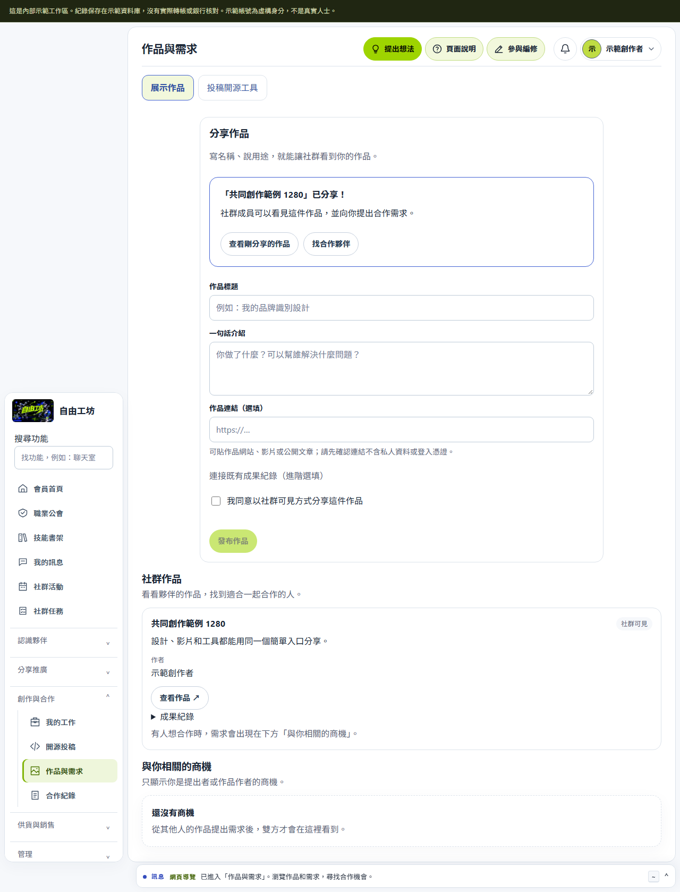
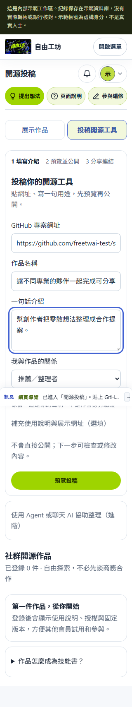
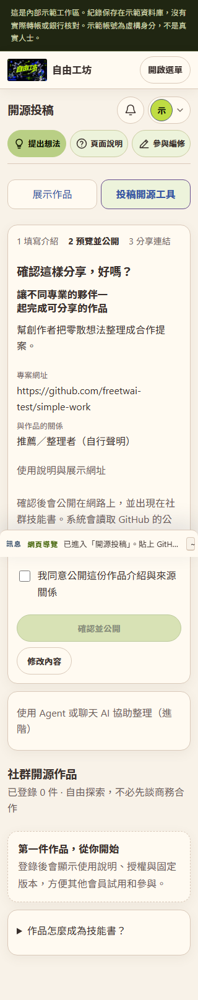

# 自由工坊：簡單分享作品與投稿工具

## 這一版解決什麼

Hao 希望自由工坊成為 AI 時代的共創社群與商業合作入口。這一版先完成最基本的旅程：**分享作品 → 看見夥伴 → 提出合作需求**，以及 **投稿工具 → 公開作品頁 → 分享連結／邀請一起開發**。

原本一般作品要填 `artifact:template-v1` 等內部代號；開源投稿先呈現 Agent 指令、JSON、金鑰與多個入口。新版直接提供可操作的表單，使用既有三款主題與品牌資產。

## 使用者流程

### 展示作品

1. 填作品名稱與一句介紹；作品網站、影片或文章連結選填。
2. 勾選社群可見，按「發布作品」。
3. 完成區提供查看剛發布的作品和找合作夥伴；其他會員可按「我想找你合作」。

成果引用由 API 自動產生。已有成果代號的整合仍可使用進階選填欄位。展示作品只給社群會員查看；沒有新增匿名作品公開頁。外部作品連結只開新分頁，不抓取、不內嵌。

發布成功後直接以 API 回傳的真實作品更新列表，省掉再次載入作品／需求的請求；不以樂觀畫面假裝寫入成功。

### 投稿開源工具

1. 貼 GitHub 網址、填名稱與一句介紹，選擇本人與來源的關係。預設推薦／整理者，不推定作者。
2. 「預覽投稿」只在目前頁面預覽，不產生憑證、不寫入 API。可回頭修改。
3. 勾選同意公開，按「確認並公開」。系統先保存私人草稿，再沿用正式投稿服務查驗公開 GitHub 來源、固定版本與授權。
4. 成功後建立公開作品頁，列入社群技能書，提供複製連結與一起開發入口。

使用說明、展示網址收在選填區。未填使用說明時只提供「先讀原作 README」的通用引導，不捏造安裝指令。分享短文以使用者輸入組成一則，沒有強迫使用者準備 100 則內容。

Agent／聊天 AI／CLI 上傳保留在進階工具中；其既有 100 則短文驗證、一次性憑證與金鑰權限不變。技能書架的主要投稿按鈕直接開啟簡單表單。

### 公開失敗與修改

公開失敗時保留同一份私人草稿，可以直接重試，或重載後從「繼續未公開的草稿」恢復。尚未公開的手動草稿可以修改；API 檢查本人、版本和狀態。Agent 草稿仍用既有工具管理，已公開投稿不提供這個修改入口。

## API 與資料

- `POST /api/v1/showcases`：`artifact_ref` 改為選填，未提供時在同一交易內產生；新增選填 `public_url`。保留舊 request 與既有引用規則。
- `POST /api/v1/me/skill-submissions/manual`：只保存本人私人草稿；不建立 upload key 或 bearer grant。
- `POST /api/v1/me/skill-submissions/:id/manual`：只修改本人、尚未公開、沒有 Agent grant 的手動草稿；要求 If-Match。
- `POST /api/v1/me/skill-submissions/:id/publish`：沿用現有公開機制、來源查驗、稽核與交易回滾。
- 私人投稿 DTO 新增 `can_edit`，不回傳 grant hash。
- 新 migration：`migrations/071_showcase_public_url.sql`。避開 #88 的 069 公會分級與 #87 的 070 工坊誌名片；不依賴兩者。

手動內容解析與 Agent 協議獨立。仍要求 session、Origin／CSRF、會員資格、rate limit、idempotency 和本人公開同意；客戶端不能寫入 official、owner 或會員身分。公開 API 保留原作者、來源關係（自行聲明）、固定 SHA、授權與正式收錄尚未審核的狀態。

## 檔案入口

- [SimpleSkillSubmission.tsx](../../apps/portal-web/src/modules/SimpleSkillSubmission.tsx)：表單、預覽、公開、草稿恢復及成功入口。
- [WorkSharingEntry.tsx](../../apps/portal-web/src/modules/WorkSharingEntry.tsx)、[WorkSharing.css](../../apps/portal-web/src/modules/WorkSharing.css)：兩種分享方式與沿用主題的簡約樣式。
- [App.tsx](../../apps/portal-web/src/App.tsx)：一般作品分享與合作需求。
- [投稿 service](../../modules/skill-submissions/service.ts)、[投稿 routes](../../apps/platform-api/src/routes/skill-submissions.ts)。
- [作品 service](../../modules/opportunity-project-work/business.ts)、[migration](../../migrations/071_showcase_public_url.sql)。
- [新流程 E2E](../../tests/e2e/simple-work-sharing.spec.ts)、[既有流程測試](../../tests/runtime/flows.test.ts)、[投稿 runtime 測試](../../tests/runtime/skill-submissions.test.ts)。

## 後續共創社群電商方向

以下為下一階段產品規劃，不是這一版已完成或已部署的功能。

| 階段 | 真實使用旅程 | 驗收與觀察 |
| --- | --- | --- |
| 1（本 PR） | 展示作品／投稿工具 → 分享 → 找夥伴／提出需求 | 完整流程、同意範圍、失敗恢復、手機和三主題；正式站採用成效待觀察 |
| 2 | 把合作需求整理成清楚的專案，列出所需角色、交付、期限和報酬 | 找到第一位夥伴的時間、需求回覆率、雙方同意率、實際交付率 |
| 3 | 用 AI 協助整理需求、比較公開的能力與作品，再由人選擇夥伴 | 推薦理由能追溯公開資料、可修改與拒絕；不自動聯絡或授予權限 |
| 4 | 商品／服務 → 合作約定 → 交付 → 外部 Seller 收款 → 可追溯成果分享 | 真實成交／收款證據、退款與爭議流程、回購和再次合作 |

先用「創作者 × 小品牌」的實際合作驗證。介面應讓來訪者很快看見真作品、真資源、可參與的事；合作與報酬條款由參與者確認。貢獻、推廣點擊、工作驗收與收入是不同紀錄，不能直接互換。

這一版沒有新增推薦模型、訂單結帳、平台代收、分潤計算、XP 政策或正式站成效埋點。下一輪依實際使用瓶頸推進，不把 PR 通過當成商業驗證。

## 驗證與畫面

本機使用 Node 24、每次新建的 PostgreSQL 測試 schema；GitHub 回應使用明示的合成 fixture。測試會員與圖片不是真實公開會員。

測試涵蓋：不用內部代號的作品分享、另一位會員提出合作、預覽零 API 寫入、公開同意、正式作品頁和書架、失敗保留草稿、修改同一份草稿、idempotent replay、來源與權限限制，以及 1280／390／320px 與三主題。

實跑結果：

- `npm run typecheck`、`npm run build` 通過。
- `tsx --test --test-concurrency=1 tests/runtime/flows.test.ts tests/runtime/skill-submissions.test.ts`：最終 **36/36**。
- 7 份相關瀏覽器 suite 共 54 案例，最後廣泛回歸 **53 通過／1 失敗**：恢復草稿時混入分享短文欄位，已改成明確欄位投影。
- 修正上述問題及作品列表即時更新後，重跑新流程與兩項合作流程 **7/7**；之後桌機主按鈕改為小尺寸，再 build 並跑手機／桌機／三主題 **3/3**。
- `npm run worker:dry-run`：local／staging-next／next 三環境通過，沒有發布。

完整全倉 E2E、runtime、跨倉與靜態契約交給 GitHub CI，不把局部測試當成全站驗收。

發布與完整 CI 結果以此 PR 的最新 head 為準；本機沒有部署到 staging 或 Live。Hao 與 Codex 協作完成程式、介面與測試，既有品牌圖片和作者授權保留。
