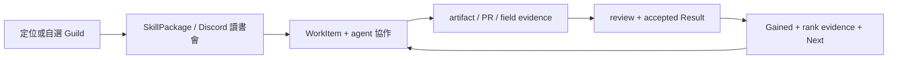
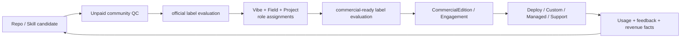
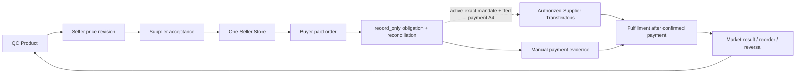

# 產品、社群與組織運轉模型

> 狀態：現行 canonical baseline（2026-09-19 低維運互惠修訂）；planning 文件，不代表已部署。

本文產品／營運測試均未跑（另見 2026-09-19 靜態契約檢查）；文中的流程、標籤與驗收項目是目標契約，不代表帳號、功能、部署或正式服務已存在。

本文件對外用語與 canonical entity 的固定對照如下；介面暱稱不得改變授權語意：

| 對外用語 | Canonical entity／判定 |
| --- | --- |
| 會長 | `Guild Master` 類型之有效 `OfficeAssignment` holder；不是 `master` rank 本身 |
| 助手 | `ProfessionMembership(rank=strategist)` 或持有效 scoped delegation 的 delegate；權限仍以 delegation scope／expiry 判定 |
| 經驗值（XP） | `MemberProfessionXpProjection`，由該職業的 `XpPolicyVersion` 重建 |
| 驗收人（reviewer） | 指定 scope 內持有效 `ReviewerAppointment` 的自然人；其獨立性只決定 `official` 標籤 |

## 1. 平台承諾

Freedom Platform 把「真實問題被提出、成員自願共同改善、雙方得到實益、成果被下一個人重用」變成可持續的互助循環。找方向、技能、Agent、職業及商業模組支援這個循環，而不是要求核心不斷提供任務。

| 對象 | 帶進社群 | 先得到 | 持續貢獻後可得到 |
| --- | --- | --- | --- |
| 學習者／一般會員 | 背景、目標、時間與算力 | 可修正定位、Guild 入口、開放知識、第一個 WorkItem | 技能證據、同伴、人脈、責任與機會 |
| 開發者／AI Vibe | code、架構、文件、release | 標準 PR 流程、tester、使用者與產品場景 | 客製、商業版、開發 Squad 與產品聲譽 |
| Tester／AI Field／FAE | 測試、review、feedback、現場能力 | 可重現流程、產品熟悉度與導入路線 | FAE、implementation、support、維護案件 |
| AI Project／Sales | 客戶、需求、PM 與商機 | 可賣產品、熟悉人選與交付模板 | 軟體銷售、專案管理、長期客戶與分配 |
| Supplier | 商品、供貨與履約能力 | QC、Seller 通路、供貨及價格版本控制 | 供應收入、市場回饋與穩定通路 |
| Seller／推廣者 | 銷售、收款、內容與買家服務 | 可 fork 商店、已 QC listing、行銷工具 | 零售收入、分潤、案例與更好商品 |
| 專業服務者 | 產業知識、判斷與交付能力 | AI skills、Opportunity 與跨 Guild Squad | 服務費、轉介、案例、代管或續約 |
| 陪跑者 | 對一人的時間、責任與排錯 | 合適學員、里程碑、共同工具 | 時間報酬、成果、轉介與教學聲譽 |
| 買家／組織客戶 | 真實需求與預算 | 一個清楚 biller、可驗證商品／服務與負責人 | 可持續交付、版本更新與支援 |

首頁始終優先呈現：

- `Now`：我需要的協助、我能提供的有限協助、我們的共同目標，以及既有身份／責任。
- `Next`：可自選的少數求助、協助、共同成果或自助行動；明列投入、實益、是否有人承諾回饋。
- `Gained`：自己的實益、幫到誰、一起完成什麼、哪些成果可重用；未知、單方回報、已確認与實收分列。

三個主要入口是「我需要幫助／我能提供協助／我們正在一起做」。無 Agent、未貢獻或不付費的人同樣可參與；不以積分交換求助權。

經驗值（XP）不可變現，也不跨職業加總成總分。

## 2. 必須分開保存的概念

| 概念 | 意義 | 不能被它自動取代的東西 |
| --- | --- | --- |
| `Occupation` | 現實職業／產業，例如教師、律師、水電、設計 | Guild rank、平台權限 |
| `DirectionArchetype` | 定位工具依自陳偏好產生的方向提示 | 能力認證、永久人格 |
| `Profession` | 社群內可學、可工作、可累積證據的專業 | 特定案件責任 |
| `Guild` | 長期維護某 profession 的縱向組織 | 橫向交付團隊 |
| `ProfessionMembership` | 一個人在一條 profession 的 membership 與 rank | 其他 profession 的 rank |
| `OfficeAssignment` | Officer 的限期治理職務與 scope | Master 專業階級、全平台權力 |
| `SquadRoleAssignment` | 某人對某 Project／Engagement 的責任 | 永久職稱或產品 ownership |
| `SkillEquip` | 此 principal／agent run 可使用哪版 SkillPackage | 人的專業階級或正式授權 |
| `Entitlement`／`ExecutionGrant` | API 能力與 agent 可做動作的精確範圍 | 信譽、頭銜、付款權本身 |
| `Result`／`ContributionRecord` | 已發生並有證據的完成事實 | 財務義務或 royalty |
| `FinancialObligation` | 特定訂單／合約產生的應收應付 | 貢獻歷史、著作權 |

同一人可以有多個 Occupation、多個 ProfessionMembership、在不同 Guild 是不同 rank，也可以同時加入多個 Squad。介面每次操作都顯示當下 `acting_as`，避免把「我會做」混成「我有權代表誰承諾」。

## 3. Guild 縱向、Squad 橫向

### 3.1 Guild：長期專業與人才線

每個 Guild 長期負責：

- profession 定義、價值、倫理與常見使用場景。
- Runner／Strategist／Master 的能力描述與可接受證據。
- 入門到可交付的開放 SkillPackage、範例、讀書會與 Discord 索引。
- master skills、review protocol、版本責任與對應 repos。
- 人力容量、onboarding、陪學、Strategist 培養、Master succession。
- 可做 WorkItem、可加入 Opportunity 與實際完成結果的回流。
- 被指派模組的 product design、quality、營運健康與重大 release。

Guild 是專業連結，不要求成員只能做一種工作。例如 AI Developer Master 可以同時是 Marketing Runner、某商品 Seller 與某專案 reviewer。

每個Guild使用versioned`EntityPlaybookVersion`與per-instance readiness，逐項都帶`enforcement=navigation|action_gate`。預設`navigation`：缺項顯示完整形狀、可一鍵依stable item ID建立可認領WorkItem，不阻擋Guild active或任何人自助加入。Private Discord channel是完整度slot，交給Community Ops／Guild delegates補；現行profession頻道仍可為`public_community`，沒有private channel也可在Portal學習、討論、提交與認領。現行一般會員若要新職業線，在Guild目錄建立Board WorkItem；Guild create/update由Board或delegated Community Ops command處理。

加入既有Guild只有self-service Runner路徑：本人以stable profession key確認後直接得到`ProfessionMembership(rank=runner)`，沒有`applied`、`pending_master`或admission approval。這同時觸發歡迎儀式與Strategist／delegate Feed卡；卡是通知與協助，Master不簽、不回或略過都不影響新人。

### 3.2 Squad：因一個成果而組成

Squad 只為一個 `Opportunity`、`Project`、`ServiceEngagement` 或產品商業化目標存在，應記錄：

- 目標、scope、交付、時程與結束條件。
- 需要的 professions／skills 與尚缺責任。
- 每位成員的 acting role、承諾與可用時間。
- WorkItems、artifact refs、reviewers、決策與 acceptance。
- 若有收入，成員共同簽署的 `EngagementAllocationPlan`。
- `shared_goal`：實際受益者、共同輸出與本輪結束條件；每位成員的當次 gain、承諾上限及是否自願續組。

普通互助以一個輕量 Project／Opportunity 及既有 Squad 承載，不新造組織。建議3–5人、1–2週、一個成果；兩人也能開始，不強迫同步會議。成員可提出下一個目標，自願承接者確認自己的範圍即可；不新增Council審批。

Squad 可小到兩三人；平台不要求填滿一套官職才允許開始。角色與自然人 identity 分開記錄，不能用同一人的多個 agent 偽造 separation of duties；自然人數不足時相應標籤為 false，工作仍可開始並持續。

### 3.3 Division：相關 Guild 的協作層

Division 只在多條 profession 必須共同維持一條價值鏈時使用。它提供共同 roadmap、需求 triage、產品 portfolio 與跨 Guild capacity，不再複製每個 Guild 的階級，也不是永久管理層。

### 3.4 Rank 與 Office

每條 profession 的階梯固定使用同一語意：

| Rank | 能做什麼 | 升級依據 | 不自動取得 |
| --- | --- | --- | --- |
| Runner | 依 SkillPackage 做 bounded task、提交 artifact／PR／test evidence | 有效提交、可重現結果、接受 feedback | 正式 QC 簽名、改規則、帶全線 |
| Strategist | 拆問題、選 workflow、帶 Runner、review 例行成果、組小型 Squad | 多次 accepted result、帶人及現場成果 | Guild 方向權、財務或合約權 |
| Master | 設計 profession、master skills、品質標準、人才線與重大版本 | 長期跨案例成果、教出 Strategist、同儕認可 | 永久 Officer、全平台管理權 |

`Officer` 是職務，例如 `Guild Officer`、`Division Product Council Member` 或 `Module Steward`。每筆 `OfficeAssignment` 都有 scope、start/end、delegates、handover 與 successor process。Guild 的現任 Chief-like leader 應是合適 Master，但 Master 不因階級自動成為 Officer。

現行採五人核心團隊模式；owner、office、custodian 與 reviewer 的建議預設 holder 依 `06 §3.1`，五人共同閱讀時確認。Ted 的 Day 1 不等待共同閱讀。Rank 是能力證據，Office 是有 scope 與期限的責任；兩者都不構成建置、candidate、staging、sandbox、內部 demo、自助加入或一般貢獻的停點。

不同自然人只決定三個公開標籤：

| 標籤 | 為 true 的人員 evidence | 為 false 時 |
| --- | --- | --- |
| `official` | exact artifact／commit 有獨立自然人 QC reviewer 的有效結論 | candidate、測試、staging、sandbox、內部 demo 與持續改進照常進行 |
| `production-signed` | Signer A／B 的 custodian 是不同自然人 | production 資源、簽章技術面與 release candidate 照常建立；不得顯示此標籤 |
| `commercial-ready` | Vibe／Field／Project 由三個不同自然人承擔 | 角色招募、proposal、ServiceEngagement 準備與內部驗證照常進行；不得顯示此標籤 |

平台自身建置採 Grok adversarial review、Claude verification 與自動 checks，不排隊等人類 reviewer。Ted 對平台建置只簽付款、法律文件、對外正式發布三類 exact-digest A4；成員在產品流程中的 A4 仍依 §8.2 執行。

### 3.5 Module stewardship

每個 experience module 必須有一筆 active `ModuleStewardship`：

```yaml
module_key: commerce.storefront
accountable_guild: commerce-sales
accountable_office_assignment: oa_123
accountable_master_membership: pm_456
delegated_scopes:
  routine_listing_review: [pm_789]
  release_train: [pm_790]
service_status: active
roadmap_version: 7
handover_ref: docs://module/commerce/handover
```

Accountable Master／Officer 負責設計、維持人力、訓練、master skills 與接續；不需要親自核准每一件小事。五人核心團隊依建議預設分工持有 assignment；缺少人員 evidence 只使相應標籤為 false。Strategist、skill owner 或 scoped reviewer 處理例行 queue，Master 聚焦標準設計、重大 release、爭議、例外及 succession。

## 4. Launch profession catalog 與模組責任

這是 launch organization blueprint；名稱與責任可經版本化 `ModuleStewardship` 轉交，不寫死在授權程式碼。表中的 `R／S／M` 是該 profession 的 Runner／Strategist／Master 工作，不是三層簽核；「付費路徑」只是可被找到的案件方向，不是保證收入、ownership 或自動分潤。

| Guild | Purpose／stewardship | R／S／M 做什麼 | 核心 skills／可用 evidence | 立即得到 → 未來付費路徑 |
| --- | --- | --- | --- | --- |
| Talent & Direction | 幫會員確認方向、進入目的 Guild；定位、陪跑 | R：依流程 onboarding、整理 user-confirmed draft；S：引導 discovery、設計短期學習路徑、帶 Runner；M：維護方法、人才容量、訓練與兩個模組的重大版本 | 提問、傾聽、facilitation、職涯 mapping、privacy／referral；confirmed Positioning Card／WorkIntent、session result、成功 handoff | 立即：回饋、引導作品、跨 Guild 關係與下一件工作 → 付費：專屬 1:1／小組陪跑、accountability、企業人才方案；不是知識解鎖費 |
| Product Quality & Supply | 讓 Supplier、實體／第三方商品、供貨條件與 listing 可負責地進入通路；貨品上架／Supplier／QC／分潤 | R：蒐集規格、跑指定批次檢驗、提交供貨 evidence；S：設計 test plan、review listing／例外、協調供貨條件；M：維護品質方法、reviewer／Supplier 能力、重大爭議與模組版本 | 規格化、抽樣／測試、traceability、供應與履約；batch-scoped QC report、Supplier acceptance、履約結果 | 立即：商品熟悉度、review evidence、Seller／Supplier 網絡 → 付費：明示的實體檢驗、客製驗證、Supplier enablement 或 supply operations；不包含軟體／Skill community QC |
| Commerce & Sales | 維持 one-Seller Store、buyer journey、客服、銷售與訂單健康；電商平台 | R：建立已接受 listing、營運店面、回應買家；S：規劃 assortment／售價／channel、處理訂單例外、帶銷售 Squad；M：維護 store／sales 方法、人才與重大 buyer-journey 版本 | consultative sales、merchandising、pricing、CRM、客服；active `DistributionAcceptance`、成交／轉換、回應與已解決訂單 evidence | 立即：可售商品、銷售 feedback、客戶與成交紀錄 → 付費：Seller margin、明示商品分配、sales／managed-store ServiceEngagement |
| Growth & Marketing | 把已核准事實轉成可發布、可歸因、可學習的 campaign；自動行銷 | R：依 brief 產生／調整內容並跑 publication task；S：設計 campaign、experiment、channel mix 與 routine review；M：維護行銷方法、channel policy、人才與重大 automation 版本 | copy／creative brief、channel operations、attribution、analytics、brand truth；approved content、publication ref、attributed outcome | 立即：作品、channel feedback、可重用模板與成效證據 → 付費：campaign 執行、marketing operations、成長策略或導入案件 |
| Media Automation | 把來源素材可靠地變成字幕、clip、render 與多版本媒體；自動剪輯 | R：轉錄、剪輯、字幕、按 profile render；S：設計 workflow／template、做 media QA、帶製作；M：維護媒體標準、工具鏈、人才與重大 render 版本 | editing、story／timing、caption、media pipeline、rights／accessibility；source-to-render lineage、QA／acceptance、採用結果 | 立即：作品集、render feedback、可重用 workflow → 付費：專屬剪輯、內容製作、客製 automation 或 managed media pipeline |
| Member & Community Ops | 維持 membership、身份找回、Now／Next／Gained 與 Discord／LINE 日常接點；會員管理與跨模組 status | R：onboarding、活動／問題 routing、支援 queue；S：設計 community program、處理 recovery／escalation、改善營運；M：維護會員方法、connector 原則、人才、服務連續性與重大版本 | community facilitation、support、identity／consent、Discord／LINE operations；resolved case、event-to-result、recovery trail、community outcome | 立即：人脈、信任、社群營運 evidence 與跨 Guild 視野 → 付費：community／member success、企業社群營運、support 或導入案件 |
| Opportunity & Partnership | 把大型 lead、sponsor、fund、investor 與外部合作安全地帶入可行下一步；Opportunity core | R：建立最小 OpportunityStub、研究與 follow-up；S：qualify、配 profession、形成 Squad／proposal；M：維護 partner portfolio、triage 方法、關係與重大對外方向 | discovery、relationship、qualification、negotiation、confidential handling；sourced／qualified handoff、formed Squad、signed SOW／sponsor agreement | 立即：關係圖、商機履歷、可信 handoff 與可合作人才 → 付費：依已簽 `EngagementAllocationPlan` 的商機／專案角色、partnership 或 program management |
| Platform Engineering | 維持共用 contracts、agent control、integration、資料與平台可靠性；agent control 及共用技術底座 | R：修 Issue、寫 test／文件、小型 PR；S：設計 contract／work package、review、處理 reliability 問題；M：維護架構、master skills、工程人才、重大 release 與核心 stewardship | domain／API、資料、event、security、observability、agent control；merged／released change、contract test、incident／recovery evidence | 立即：code review、系統熟悉度、工程作品與 maintainer 關係 → 付費：funded development、整合、客製、平台代管、support／reliability 案件 |
| Commerce Settlement | 讓 Seller-owned 收款、Supplier transfer、退款／reversal 與 reconciliation 可重試、可對帳；settlement core | R：跑 sandbox／connector test、對帳與提交例外 evidence；S：設計 mandate／retry／reversal runbook、review connector；M：維護 settlement contracts、provider strategy、事故處理、人才與重大版本 | payment API、webhook、idempotency、ledger、reconciliation、privacy；signed test trace、matched transfer、reversal／incident resolution | 立即：稀缺 payment evidence、provider 熟悉度與商務信任 → 付費：付款整合、merchant setup 支援、對帳營運或 funded incident work |

Open AI Product & Skills Division 不是第四條 profession；它讓下節三個 Guild 共用 repo／SkillPackage portfolio 與產品生命週期。每個 module 仍各有一筆 active `ModuleStewardship`，指向一個 `ProfessionMembership` 符合條件的 accountable Master 及其限期 `OfficeAssignment`；日常工作可以委派，責任與交接不可省略。

## 5. Open AI Product & Skills Division

技能包、GitHub 維護與「把開源資產做成可賣、可部署、可代管的 AI 產品」是同一條生命週期，因此共用一個 Division，但保持三條不同 profession。

### 5.1 三條 profession

| Profession Guild | Purpose／stewardship | R／S／M 做什麼 | 核心 skills／可用 evidence | 立即得到 → 未來付費路徑 |
| --- | --- | --- | --- | --- |
| AI Vibe | 把 repo／需求做成可重現、可維護、可技能化的軟體；open skills 與 AI product 的 build／release stewardship | R：寫 code／test／文件、修 Issue、提交 PR；S：拆架構／work package、帶 Runner、review 與 release planning；M：維護系統 design、master coding skills、maintainer 人才與重大 release | AI vibe coding、architecture、testing、Git／CI、Skill packaging；可重現 run、accepted PR、released commit、維護結果 | 立即：可用成果、產品熟悉度與作品；真人review feedback僅在已預留容量時承諾 → 付費：客製、商業版、funded development、架構或代管案件 |
| AI Field / FAE | 證明 exact version 在真實場域可安裝、可用、可部署、可支援；software QC、implementation readiness stewardship | R：安裝測試、重現 bug、回饋、demo／部署練習；S：設計場域 test plan、review、部署與 support playbook；M：維護 field protocol、reviewer／FAE 人才、導入品質與重大 readiness 決策 | test design、debug、deployment、observability、customer enablement；environment-scoped test、reproduction、signed QC review、successful deployment／support result | 立即：可用測試資源、產品熟悉度與field evidence；真人feedback僅在已預留容量時承諾 → 付費：implementation、FAE、support、maintenance；客戶出資 testing／review 時另開 `ServiceEngagement` |
| AI Project | 把客戶問題、商機與產品能力組成可簽、可交付、可驗收的案件；commercial readiness 與 project portfolio stewardship | R：整理需求、研究 lead、協調 demo／紀錄；S：設計 scope、proposal、風險／排程、組 Squad；M：維護 product opportunity、客戶策略、PM／sales 人才與重大 portfolio 決策 | discovery、PM、scope／SOW、proposal、sales、stakeholder coordination；qualified opportunity、signed SOW、milestone／acceptance、delivery outcome | 立即：客戶洞察、商機履歷、delivery evidence 與跨 Guild 人脈 → 付費：軟體銷售、專案管理、商務／交付角色的 Squad 自議分配 |

Division 的 `Product Council` 由三個 Guild 當期的 `Guild Master` OfficeAssignment holder 構成；這裡指有任期的 office holder，不把 `master` profession rank 本身當治理權。Vibe、Field、Project 的建議預設 holder 分別是韋銘、Jason、Mini，五人共同閱讀時確認，完整分工見 `06 §3.1`。Council 結構與決策紀錄照常存在；自然人數不足只反映在 §3.4 的標籤，不讓產品工作排隊。Product Council 仍記錄人力缺口並可發布公開 Opportunity，這些紀錄不構成 maturity 或開工條件。初期不設第四位 Division boss。

### 5.2 從 repo 到商業產品

```text
Repo / SkillPackage Candidate
  → 公開討論、安裝、Issue、PR
  → version-scoped community QC
  → `official` label 依獨立 reviewer evidence 計算
  → Vibe + Field + Project role assignments
  → `commercial-ready` label 依三個不同自然人的 evidence 計算
  → CommercialEdition / ServiceEngagement
  → 部署、客製、代管、support 或商業版收入
  → 使用結果、Issue、改進與下一 release
```

重要規則：

- 任何人可提交 candidate。結構有效且本人確認的首次 software／Skill／code submission，直接建立 AI Vibe Runner `ProfessionMembership` 與起始 evidence；其他 submission 依其 acting／對應 Profession 建 evidence。不把 submission 本身冒充 accepted quality、QC 或更高 rank。
- candidate 可公開、fork、討論與改進；指定 version／commit 有完成的 QC 與獨立自然人 reviewer evidence 時，`official=true`。缺少該 evidence 時維持 `official=false`，不阻擋 candidate、staging、sandbox、內部 demo 或後續工作。
- 軟體／Skill community test、review 與 QC 維持 zero-fee；公開知識及提交流程免費，不承諾無上限真人審查或固定回覆時間。每張工作區分當次實益、自願公益、已保留回饋與未來可能機會；熟練者的重複維護若缺乏自願供給，縮減新服務承諾或另開有預算工作。
- AI preflight 可跑測試、掃 manifest、重現安裝並整理報告；成員產品語意中的正式 QC conclusion 由有 scope 的自然人簽 exact commit／artifact digest。平台自身建置則使用 §3.4 的 AI review 與自動 checks。
- Vibe、Field、Project 三筆角色 assignment 分別保存。三個不同自然人接受責任時 `commercial-ready=true`；若由同一人持多個 profession 或 agent，標籤保持 false，但產品、proposal、服務設計、candidate、staging、sandbox 與內部 demo 照常進行。
- `CommercialEdition` 必須指回開源 repo、license、SkillPackage 與 release。Open source 可以商用；「商業版」不等於自動變成 proprietary，授權義務仍以 source license 為準。
- 可收費項目包含 packaged distribution、hosting、customization、implementation、managed service、support、算力與 SLA。
- PR／commit 不產生永久 revenue share 或產品 ownership。熟悉度可支持未來邀請，但不是當次報酬或就業保證。每次合作另記幫助者與受助者的具體實益；沒有實益的自願公益如實分類，不用可發現性補造已獲利。

### 5.3 Funded work

有客戶或 sponsor 願意出錢做 testing、review、development 或 feature 時，另建 `ServiceEngagement`／`Project` 及 horizontal Squad；這是專屬交付，不是替 community QC 收費，也不改變 community QC 的 zero-fee 結論。Squad 自己談 scope、milestone、acceptance 與 allocation；平台保存簽名版本及實際 payment facts，不制定一個適用所有軟體的固定 commission。

## 6. 定位、Guild 教學與陪跑

定位是導航，不是人格判決或入會審查。會員可以：

1. 直接選擇想加入的 profession／Guild。
2. 使用 deterministic 快速評估取得 archetype 建議。
3. 使用 AI guided discovery 把 `user_words`、`unknowns`、`first_evidence`、`falsifier` 與 fallback 整理成 `PositioningDraft`。

只有使用者確認後才形成 `CareerProfile`／`WorkIntent`；AI draft 不授予 rank、Entitlement、付費 enrollment 或工作代表權。Strategy mode 是工作方式建議，不另外發明一條職業。

Talent & Direction Guild 負責把會員 point 到合適方向，目的 Guild 負責把專業教好。知識邊界是：

| 免費／開放 | 可以收費 |
| --- | --- |
| SkillPackage、文件、範例、公開讀書會、一般 Discord 問答、Guild 路線、community QC | 1:1 或小組專屬時間、持續 accountability、代操作、客製、部署、代管、算力、SLA、現場差旅 |

付費陪跑的商品是人的容量與責任，不是解鎖原本藏起來的專業知識。Program 顯示時數、回應窗口、checkpoint、取消方式與陪跑者；平台記錄 session／result，但不擷取私人對話全文。

## 7. 商品、Seller 與 Supplier 的上下游模型

### 7.1 一個 checkout、一個 buyer-facing biller

`Master Store` 是可 fork 的參考店面、catalog、SDK 範例與 deployment template，本身可以沒有 Seller、沒有 checkout，也不必賣貨。每個實際 Store fork 必須綁定：

- 一個 `SellerParty`，可以是自然人、商號或法人。
- 一組 seller-owned `seller_collection` connection；要自動支付應付帳時，另綁 payer-owned `payer_disbursement` connection。兩種權限不可互相推定。
- 對買家的 biller、invoice issuer、refund owner 與客服資訊。
- 多個已被該 Seller 接受、且 Supplier 已承諾供貨的 `SellerListing`。

買家一次 checkout 只看到一個 Seller／biller。不同 Seller 的商品在 cart 被明確分開結帳；同一 Seller 下的多 Supplier 商品可形成一筆 `BuyerOrder`，後端再拆為各 Supplier 的 `SupplyOrder`、settlement 與 fulfillment。Seller 可同時是 Supplier，因此能自有商品自售。

平台永遠不是 merchant of record、escrow、wallet、代收方或任何 Store 的收款帳號主體，也不申請、不持有 Seller 的 merchant／live payment 帳號。第一家 Store 由 Ted 以第一個 Seller 身分 fork Master Store，使用該 Seller 自有的 origin；建議預設為 Seller 自己的 Cloudflare 帳號／Pages。Freedom organization 只在 `<org>.github.io/freedom-storefront/` 放 `reference` mode、無 checkout 的參考 Master Store。

### 7.2 價格與供貨承諾

一個可售 listing revision 至少保存：

```yaml
listing_revision_id: slr_123
pricing_mode: fixed
default_unit_price: {currency: TWD, amount_minor: "159000"}
effective_price_schedule: null
supplier_settlement_rule:
  mode: fixed_supplier_net_per_unit
  supplier_net: {currency: TWD, amount_minor: "100000"}
msrp: {currency: TWD, amount_minor: "169000"}
recommended_floor: {currency: TWD, amount_minor: "149000"}
seller_of_record: party_seller
payment_collector: party_seller
invoice_issuer: party_seller
refund_owner: party_seller
fulfillment_party: party_supplier
fulfillment_commitment: fulfill_v3
return_terms: return_v2
effective_window: {starts_at: "<ISO-8601 UTC timestamp>", ends_at: null}
distribution_acceptance_id: da_123
acceptance_snapshot: supplier_accepted_this_exact_revision
artifact_sha256: sha256:aaaaaaaaaaaaaaaaaaaaaaaaaaaaaaaaaaaaaaaaaaaaaaaaaaaaaaaaaaaaaaaa
```

- `MSRP`、平台建議售價及 `recommended_floor` 讓 Seller 與 Supplier 有共同溝通基準，但不由系統自動強制轉售價。
- Supplier 看得到 Seller 的實際價格、通路及供貨條件，必須先接受該 revision；沒有 active `DistributionAcceptance` 就不能 checkout。這份 accepted snapshot 就是該 revision 的供貨承諾，不另建立第二個 aggregate。
- Seller 改價格或關鍵條件會建立新 revision，Supplier 再決定是否接受。低於建議值可提示雙方，不自動封鎖。
- Supplier 可拒絕或撤回未來供貨；cutoff 後不再建立新 reservation／order。cutoff 前已建立的短效 reservation，以及與它對應的 `awaiting_buyer_payment` order，只在原 TTL 內受保護；已付款訂單按 locked snapshot 履行，不能事後僅以價格太低拒絕。
- `selling_arrangement` 支援 `reseller` 與 `sales_agent`；每個安排都明列 seller of record、collector、invoice、refund、price 與 fulfillment 責任，不以畫面上的「Seller」一字猜法律關係。

### 7.3 收款與 Supplier 結算（record_only 預設）

以下是 Seller 選用 `authorized_mandate` 時保留的完整自動化目標流程。平台層固定以 `money_movement_enabled=false` 起步，每個 Seller 預設使用永遠可用的 `record_only`，只計算、對帳並記錄人工處理事實。Payer 當事人的 A4 與 Ted 付款類 A4 都在同一 exact `SettlementMandate` digest 上時可用；缺一則維持 `record_only`，商店、listing、對帳照常。OD-28 的 working default 是預設不啟用並保留 evidence trigger。

```text
Buyer paid Seller-owned `seller_collection` connection
  → signed provider webhook
  → immutable OrderSplit + FinancialObligations
  → SettlementInstruction
  → atomically reserve one bounded SettlementMandate cap bucket
  → payer-owned disbursement connection
  → idempotent TransferJobs to beneficiary payout destinations
  → webhook / statement reconciliation
  → fulfillment authorization
```

平台一開始就分開引導完成 Seller collection、payer disbursement、beneficiary payout destination、幣別、每 beneficiary／單筆／日週月期限額及 mandate；同一 provider 帳號可綁多種 purpose，但一種 binding 不授予另一種權限。每筆 transfer 先原子保留 cap，再以固定 operation key 執行、receipt 與 reconciliation；provider 無付款發起 API 時才降級為 payer 批准、匯出支付檔或上傳付款證據。

平台的一般domain tables只保存provider customer/account與opaque credential references。provider-managed credential留在provider vault；若OAuth／API代理確實要求Platform保管dynamic token，只有Credential Broker可解析指向隔離PostgreSQL vault內的per-record envelope ciphertext，root key另留在purpose-scoped secret manager／KMS，任何位置都不存明文secret。平台不建立暫存社群錢包、不混用會員款，也不在帳本裡把「應付」冒充「已付」。退款／chargeback 產生 reverse obligation 或與未來 settlement 抵扣，不刪除原訂單。

商品零售 margin／commission 由 locked Offer／Distribution Agreement 量化；Professional Service、導入與客製案由 Squad 的 `EngagementAllocationPlan` 自行談。兩者不可混用。

## 8. AI-first 工作作業系統

### 8.1 Work Feed

會員或其 agent 每次開始工作時取得 purpose-limited `WorkContextBundle`：

- confirmed profession memberships／ranks 與當下 acting role。
- equipped SkillPackage versions。
- WorkIntent、availability、語言、工具與可投入時間。
- 可見 WorkItems、project／product refs 與所需證據。
- 目前 ExecutionGrants、standing mandates 與剩餘限額。

系統不把定位原始私密文字整包餵給 agent。Work Feed 對不同人可呈現：

- Seller：今天哪些 QC 通過、Supplier 已接受、可直接上店的商品；哪些客服或退款待處理。
- Marketer：今天可發布的 campaign／post、渠道限制、素材及 attribution link。
- AI Vibe：Issue、feature、bug、文件與待完成 PR。
- AI Field／QC：待重現 PR、產品安裝、Supplier 檢驗或 deployment test。
- AI Project：新 lead、缺人的 commercial triangle、待拆 scope 或客戶 follow-up。
- Guild Strategist／Master：capacity gap、review queue、skill freshness、succession 與重大 release。

每張卡顯示 `why_you`、真實受益者、幫助者當次實益、參與模式、expected／maximum effort、共同目標、完成／結束條件、成果使用權，以及原有 skill、role、review、signature。以 `participation_terms` 結構化保存；範本預填、不增加人工審批。使用者可選擇、修改或略過；批次批准仍不得超出既有 grant／本人容量。

### 8.2 自動化與簽名

| Level | 可做行為 | 預設人類互動 |
| --- | --- | --- |
| A0 | 讀取、解釋、找資料、推薦 | 可自動 |
| A1 | draft、preflight、test、sandbox | 可自動；清楚標 draft |
| A2 | claim 低風險 task、branch、commit、draft PR、listing draft | bounded standing grant 內可自動 |
| A3 | 依 channel／時間／數量政策發布內容或 FAQ 支援 | scoped standing grant；可撤回 |
| A4 | 價格／分配、付款／退款、官方 QC、合約、對外且有精確承諾後果的具名申請、正式 release | 有權自然人簽 exact artifact version／digest |

人是 accountable copilot／signatory；AI skill 可以帶流程，但 agent 不是 Member、Master、independent reviewer、contracting party 或 payee。一般「同意讓 agent 幫忙」不是對任意未來合約的電子簽名。

平台自身建置的 review 由 Grok adversarial review、Claude verification 與自動 checks 完成；Ted 的平台建置 A4 只涵蓋付款、法律文件與對外正式發布。這不取代成員產品語意的 A4：Seller listing revision、Supplier `DistributionAcceptance`、Squad `EngagementAllocationPlan`、`SettlementMandate`、`ProjectRelease` approval 仍由該有權當事人對 exact digest 簽名。

`named application`只指代表本人或組織向外部送出、對exact artifact產生法律、金錢、official或其他精確承諾後果的申請。自助加入Guild、學習、裝備、一般submission、低風險WorkItem、coaching suggestion與Master welcome明文排除於A4。

第一天可一次同意`day1.learn-equip-and-claim` ExecutionGrant：只含A0–A2、單一confirmed profession、resolved starter SkillVersion、第一張低風險WorkItem、最長72小時且隨時可撤回。它可涵蓋status read、preflight、equip、installation verify、claim與checkpoint；不是A4 artifact signature，不能被引用為未來合約、付款、official QC或release同意。

所有外部副作用先建立 idempotent `ActionIntent`；執行後追加 `WorkEvent`／provenance。Accepted result 建立 `ContributionRecord`；訂單／合約產生的錢另進 financial ledger。平台保存 prompt／model／tool 的必要 provenance 與 artifact，不保存 chain-of-thought。

### 8.3 非 code 也走 PR 模型

Listing、QC protocol、campaign、Opportunity、客服模板與組織設定使用平台原生 `DraftArtifact（UI alias：ChangeProposal）→ diff → review → apply`。Code 的 commit／PR／checks／release 以 GitHub 為真相，平台只同步 refs、狀態與結果；兩者都能出現在同一 Work Feed。

Freedom Platform 自己是第一個 Project：本規格拆 WorkItem／GitHub Issue，agent fork／branch／PR，Grok review、Claude verification 與自動 checks 產生 evidence，ContributionRecord 回到會員狀態；付款、法律文件或對外正式發布交由 Ted 對 exact digest 一鍵 A4。平台從建置開始就使用自己的作業方式。

## 9. 三條核心循環

### 9.1 學習與貢獻



- 看公開資料與 candidate 不需 membership 門檻。
- 讀書會出席與完成實作是不同事實。
- 自動測試、本人回報、同儕確認與現場採用保存為不同 evidence，不壓成一個認證勾。
- 一次有效且本人確認的 software／Skill／code 提交即可建立 AI Vibe Runner membership 與起始 evidence；其他提交形成對應 Profession evidence。accepted、merged、released 與 adopted 各自記錄，不誇大。

成長回饋另提供 XP read model：每個 profession 各有一份版本化、公式可讀的 `XpPolicyVersion`，`MemberProfessionXpProjection` 的 key 是 `member × profession × track`，其中 track 是閉集 `training|maintenance|real_delivery`。它只能由 append-only `ContributionRecord` 與目前有效的 review outcome 重建；整張投影可以刪除後全量重建，每筆都帶 `policy_version` 與 `rebuilt_from_event_seq`。介面分職業、分 track 顯示，禁止跨職業加總或顯示全站總值；它不參與 EntitlementSnapshot、rank 判定、ReviewerAppointment 或 A4。

### 9.2 開源產品與服務



### 9.3 商品與通路



## 10. Opportunity 與 Professional Service

Opportunity 可是 product、sales、software development、implementation、professional service、sponsor、fund 或 investor lead。Opportunity & Partnership Guild 維持長期入口與關係；每個實際工作由 Squad 接手。

外部敏感商機不必把全部客戶資料搬進平台。要使用平台配對、task、agent 與 ledger 時，只建立最小 private `OpportunityStub`：owner、type、visibility、external ref、next step、needed professions 與期限；敏感 source 仍留在授權外部系統。

Professional Service with AI 的 canonical flow：

```text
Opportunity → Proposal → signed SOWVersion → Squad
→ WorkPackages / Milestones → DeliveryEvidence
→ Customer Acceptance / ChangeRequest → SupportPeriod
→ EngagementAllocationPlan + payment facts
```

專案 commission 沒有平台預設公式。Squad 在付費工作開始前自行談並簽 allocation；變更產生新版，不回寫舊版。AI agent 可以整理 scope、draft proposal、追 task 與組裝 evidence，不能替服務者做專業判斷或替人簽約。

## 11. 得到、階級與可發現性

平台不把「有紀錄」自動當作「已受益」，也不保證每次貢獻有收入。三種模式寫在 WorkItem 的 immutable `participation_terms`：

| 模式 | 幫助者當次可知的回報 | 承諾邊界 |
| --- | --- | --- |
| 自願貢獻 | 自己可用的資源、學習或明示自願公益 | 不保證他人回饋、未來案源與收入 |
| 有限互助 | 明確工具、資料、測試或已保留的真人回饋 | 顯示投入上限、容量與結束条件；不強迫等價互換 |
| 有預算工作 | 具名出資、預算證據、SOW／allocation 與付款條件 | 有預算／payable／recorded不等於實收；實收依reconciliation |

原有 contribution、rank evidence、產品熟悉度與可發現性保留，但與 gain、正式QC、ownership、payment 分開。雙方各自回報實益；未回報是未知，不由Agent自動確認，不影響一般貢獻、會員權益與依法／依約應得的報酬。

推薦以需求、能力、興趣及本人可用時間說明理由；同條件可輪替曝光，不只呈現高XP／老成員，也不保證派案。自願公益、單向受助、跨人跨時間互惠各自有價值，不建互助欠債或把曝光包裝成薪資。詳見 [12 §3–5](./12-low-ops-mutual-benefit.md)。

## 12. Entitlement 與低摩擦入口

Entitlement 只回答「API 現在准許做什麼」，不代表人的價值。Launch 預設：

| Entitlement | Canonical acquisition conditions | Scope | 收回方式 |
| --- | --- | --- | --- |
| `community.member` | `authenticated_user`；單頁規則只作versioned notice／可追蹤ack | 個人狀態與一般互動 | 本人停用或人工作 scoped revoke |
| `opportunity.claim.basic` | `authenticated_user`、`acting_profession_is_selected`；缺少時可在claim自助選／建Runner，WorkIntent只改善matching | 低風險 WorkItem | 惡意占位時暫停該scope；不刪歷史 |
| `skill.submit` | `authenticated_user`；可追溯source在每次command驗 | candidate submit | scope revoke；repo 不受平台控制 |
| `qc.review:<scope>` | `active_reviewer_appointment_for_exact_scope` | 指定 protocol／產品類型 | appointment 到期或撤回 |
| `seller.list` | `seller_party_is_registered`、`seller_accepts_biller_invoice_refund_and_settlement_responsibilities` | 自己 SellerParty／Store | 暫停新 listing；保留訂單 |
| `store.deploy` | `store_fork_is_owned_by_principal`、`deployment_connection_is_ready_for_this_action` | 自己 Store fork | revoke deploy token；不刪 fork |
| `coaching.offer` | `program_scope_time_and_responsibility_are_declared` | 免費或付費 capacity | 本人暫停或人工作撤回 |
| `module.delegate:<scope>` | `active_module_stewardship_delegation`、`delegate_accepts_scope_and_expiry` | 指定 module／action | owner revoke、期限到期或交接 |

銀行、公司、證照或 payment 資料只在啟用相應商業功能時漸進收集，不放在學習入口。必要的技術完整性檢查只拒絕當次不成立的命令，回傳可修正原因。

以上八個 key 與 `contracts/entitlement-catalog.example.yaml` 是同一 canonical contract 的兩個投影，含 `store.deploy`；名稱與取得條件不得各自演進。任何 rules ack、WorkIntent、starter 進度、stuck、skip、connector 缺失或 navigation readiness 不得隱式加入 acquisition conditions。

`qc.review:<scope>` 的唯一取得路徑是該自然人持有同 scope、尚未到 `review_by` 且未撤回的 `ReviewerAppointment`；熟悉度、rank、Master 身分或 XP 只能出現在候選建議／顯示，不得作為 `ReviewerAppointment` command 的規則輸入、grant condition 或任命成立條件。任命只檢查 OD-10 appointer、exact scope、`review_by` 與自然人 identity；reviewer 是否獨立另由 label evaluator 判定，只影響 `official`。XP 本身也不是 `EntitlementSnapshot` 的欄位或規則輸入。

## 13. Discord、LINE、GitHub 與平台分工

| 工作 | Source of truth | 平台保存 | 不保存／不重做 |
| --- | --- | --- | --- |
| Guild 討論與讀書會 | Discord | guild/channel/thread/event refs、結論或 task candidate | 不鏡像聊天全文、不把 emoji 當簽名 |
| 即時陪跑／客服 | LINE | identity link、consent、postback、delivery、session/deep link | 預設不擷取私人對話全文 |
| code／技能版本 | GitHub | repo、commit、PR、review、checks、release refs | 不複製 Git hosting |
| profession／Squad／task | Freedom Platform | canonical membership、acting role、grant、signature、result | 不以 Discord role 當唯一真相 |
| 商品與商店 | Platform／Storefront | Product、QC、listing revision、Seller binding、order facts | 不要求店面同一視覺 |
| 收款與 payout | Seller／Supplier providers | connection refs、mandate、instruction、receipt、reconciliation；ordinary domain tables 只存 opaque credential ref | 不存 secret 明文、不持有 funds；provider-managed credential 留在 provider，必須由 Platform 代理的動態 token 僅能加密存於隔離 credential vault |
| 對外推廣 | 各 channel | campaign、publication job、attribution 與結果摘要 | 不假裝控制第三方演算法 |

GitHub 的本人評價遵守「本人決定、授權明示、本人 AgentConnection 執行」三項同時成立：只有 grant 精確包含 `github.star`，且可由本人撤回時，Agent 才可代表本人建立或撤回真實評價。平台觸發、批量、獎勵導向，或以 XP 誘導的 star／follow／like 一律禁止；star 不進任何 XP track，也不影響 entitlement、rank 或 reviewer appointment。

## 14. 能管理一萬人的輕量治理

擴張是待驗證的營運假設，不因有五人／delegates就宣稱能低工時服務一萬人。方法是清楚scope、有限容量、可重用成果、總工時預算與可追溯事實，不是加更多中央簽核：

1. WorkItem 以 required profession／skill／availability／visibility 自動配對；會員與 agent 自助認領。
2. Work claim 屬於 person／team／Squad，短期 `TaskLease` 屬於一次 AgentRun；逾期只釋出該工作。
3. Routine review 分散給 Strategist、skill owner 與 scoped delegates；Master 看重大版本、例外、capacity、training 與 succession。
4. 规则、skill、QC protocol、推薦、channel policy 與 standing grant 都版本化；改新版本不改舊事實。
5. 同一 ledger 接收人、AI agent、GitHub 與外部 provider 的結果，避免靠口頭報進度。
6. Board/Council 只處理跨 Guild 方向與資源；容量卡為按根因聚合的導航，不是保證補位的責任。沒有新事實不重開卡，普通志願請求到期可結束。
7. 爭議、安全事件與正式權益暫停由 scoped 人工處理，保存理由、影響範圍與恢復路徑。

前期明確不做：以 AI 分數、KYC、委員會、活躍度或官階阻擋加入／學習／一般貢獻；要求每個 task 走多層申請；因長期未活動刪人；把 MSRP 變成自動斷貨規則。

## 15. 啟動次序與首批燃料

完整地基與介面照常建立；首批只營運一種有真實需求的互助情境，共用既有 User、Profession、Skill、Opportunity、Squad、WorkItem 與 Result。建議例子是「把重複資料整理改為可重用模板／工具」，不是限定產業。

### 15.1 首批共同成果

需求者帶來真實問題與授權樣本，幫助者自選有限投入，學習者可參與測試、文件及使用回饋。每次合作明列雙方實益、最大投入、終止及可重用範圍。先觀察约10次真人合作；規模與30天觀察窗是可改的設計預設，不是已證明門檻。

### 15.2 Open AI Product

先以解決首批問題所需的一個模板／工具為主要共同資產，不要求同時提供2–3個有人維護的產品。候選、QC、正式標籤與後續商業版流程保留；沒有reviewer仍可創作、認領與提交，沒有容量不保證免費真人review。

### 15.3 Professional Service with AI

首批不預設同步銷售多種服務；有真實付費需求及已接受的供給時，從同一成果分支到既有SOW、milestone、allocation。商業履約成本與維護責任納入該案，不轉嫁原志願者。

### 15.4 Finished Goods 與其他價值循環

保留商品、Seller、Supplier、checkout、settlement 的完整契約、skeleton與sandbox測試，但不為了填滿模組同時承諾實體商品售後及供貨。額外營運線需具名需求、可用容量、資源來源與既有義務保障；開發不因此停止。

### 15.5 Community Growth

成長以真實求助、共同解題與成果採用為主，不以每日任務量、空repo、職稱或活動數衡量。沒有付費客戶時，參與者仍應能從工具、學習或自願公益取得自己認可的價值。

## 16. 健康指標

原北極星「每30天一位成員付出、另一位真人／組織得到持續價值的有效循環數」保留為單向有效幫助，不直接命名為雙方互惠。

並列顯示，不合成個人分數：

| 維度 | 指標與分母／未知處理 |
| --- | --- |
| 當次互惠 | 完成合作中，至少一名實際受益者及一名不同自然人的幫助者各自確認具體實益的比例；同時顯示所有參與者、部分獲益、無獲益、未回報分布，不用一對正例掩蓋其他人 |
| 跨次互惠 | 觀察窗內實際獲助與助人分列；不強迫每個人兩者兼具、不建立欠債 |
| 非核心依賴 | 有完整補位記錄的合作中，無核心找人／催促／協調／代做的比例；不把缺紀錄算無介入 |
| 總維持成本 | 核心與非核心的platform_maintenance＋coordination_friction，每週絕對量及每10次完成合作分攤；包含未完成需求成本，未知量另列 |
| 持續參與 | 再參與意願與後續真實再參與分開；自願回饋不影響資格 |
| 成果重用 | 授權範圍內真實使用與減少重複服務的證據；瀏覽／下載不直接算採用 |
| 真正得利 | 可用成果、已保留回饋、學習自報、公益、已到帳收入分列；future lead／payable不混入實收 |
| 供給與資源 | 已接受容量、未完成保留量、支援集中度、已到帳與承諾資金、覆蓋期間；預期案源不當現金 |

原journey、Guild、Agent、open-source、commerce、service與community品質指標持續保留為診斷，不代替以上三項核心目標。詳細定義、反例、負荷與擴張規則見 [12 §7–10](./12-low-ops-mutual-benefit.md)。

## 17. 產品驗收準則

第一個正式 integrated release 至少通過：

1. 同一會員能連結 GitHub、Discord 與啟用的登入／LINE adapter；外部 ID 不成為彼此主鍵。
2. 定位或自選 profession 只形成可確認 draft／WorkIntent，不自動給 rank 或管理權。
3. 一人可持有多個 Guild membership 與 rank，並在 WorkItem 顯示明確 acting role。
4. 每個模組都有 active ModuleStewardship、accountable Master／Officer、delegates、roadmap 及 handover；建議預設 holder 由五人核心團隊依 `06 §3.1` 承擔並在五人共同閱讀時確認，人員 evidence 缺失只反映在標籤。
5. candidate repo／Product 可公開討論；version-scoped QC 與獨立自然人簽名 evidence 決定 `official`，標籤為 false 不阻擋非正式工作。
6. 開源產品分別保存 Vibe、Field、Project assignment；三個不同自然人的 evidence 決定 `commercial-ready`，不作為建立工作、candidate、staging、sandbox 或內部 demo 的停點。
7. Master Store 可 fork；第一家實際 Store 位於 Seller 自有 origin、綁一個 SellerParty 與 seller-owned collection，一次 checkout 只顯示一個 biller，多 Supplier 正確拆單；參考 Store 維持 `reference` mode 且無 checkout。
8. Supplier 在 checkout 前接受實際 Seller price revision；MSRP／recommended floor 只提供建議，未被實作為自動轉售價阻擋。
9. Seller 收款成功後，`record_only`只建立並對帳明細；`money_movement_enabled` 固定以 false 起步。Seller 選擇 `authorized_mandate`、持 active exact mandate，且 Payer 當事人與 Ted 的 A4 均位於同一 exact digest 時，才自動建立、執行、retry 並 reconcile Supplier TransferJobs；缺一則維持 `record_only`，商店、listing、對帳照常，平台未持有資金或收款帳號。
10. agent 能依 Work Feed 與 equipped skills 完成低風險 draft／PR；價格、付款、官方 QC、合約及 release 綁定 exact digest 與有權自然人簽名。
11. Professional Service 能由 Opportunity 形成 Squad、SOW、milestone、acceptance 與 Squad 自簽 allocation，平台未強套商品 commission。
12. Now／Next／Gained 可追到 immutable events；退款、revoke 與修正以新事實追加，不改寫舊歷史。

13. 三個互助入口、versioned participation terms、容量不足fallback、雙方自願實益回報與低維運投影符合 `12`；缺回報不自動收回貢獻／報酬。
14. 未認領普通志願請求可有界結束；合約、付款、安全與正式權益爭議不可套用普通互助auto-expiry。
15. 是否擴大營運承諾與engineering release evidence分列；沒有真人證據不能宣稱互惠及低維運已驗證。
