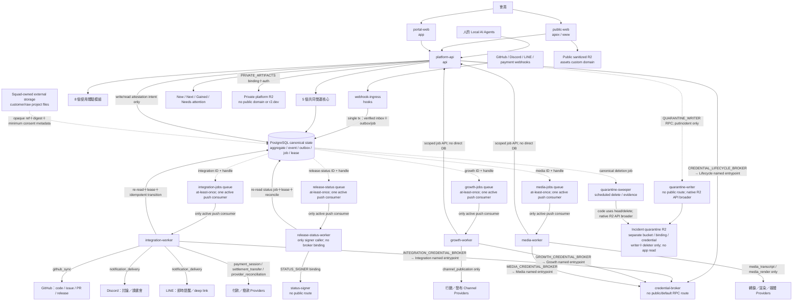

# 系統架構、Workspace 與 Repo 規格

> 狀態：現行 canonical baseline（2026-09-19 低維運互惠修訂）；planning 文件，不代表已部署。

本文所有測試均未跑；帳號、repo、runtime、queue、database、provider connection 與部署拓撲的描述都是目標架構，不代表資源已建立或功能已上線。

## 1. 一張圖看懂平台



平台是接點、database、所有 code base 的協作核心，以及每個人看自己狀態的狀態機。`public-web`、`portal-web`、`platform-api`與`webhook-ingress`是同一模組化產品的獨立deploy entrypoints，不代表拆成四套domain truth；前兩者可共用`packages/ui`，但使用不同route、runtime binding、cache與session邊界。它不取代GitHub、Discord、LINE、Squad-owned storage或金流服務：

- GitHub 保存 code、commit、branch、Issue、PR、review 與 release 的權威事實。
- Discord 保存討論、讀書會、Guild 公開協作與會議現場。
- LINE 保存即時聊天；平台只送提醒、選項與可驗證的操作 deep link。
- 各 Seller 的付款服務與銀行保存金流權威事實；平台不代收、不保管社群款項。
- 客戶機密與raw project files留在客戶／Squad控制的storage；Platform只保存opaque external ref、digest與最低必要consent metadata，中央R2不是客戶資料湖。
- Platform 保存中央身份、職業與組織、任務、版本化商業條件、人的授權／簽名、跨系統狀態、結果、貢獻與財務義務帳本。

## 2. 架構原則

| 原則 | 落地方式 |
| --- | --- |
| 簡單先行 | 一個模組化單體、一個 PostgreSQL cluster、少數 workers；量測後才拆服務 |
| Guild 縱向、Squad 橫向 | Guild 長期培養職業與維護模組；Squad 為一個 Project 暫時交付 |
| 每模組一位 accountable Master | `ModuleStewardship` 指向一個 Guild 與當任 Guild Master；Master 可授權 Strategist／maintainer 做日常 review |
| AI Skill 帶路、人負責 | Agent 可讀取工作、草擬、測試、執行已授權動作；人對明確版本簽名並承擔責任 |
| 開源知識免費、人的專屬時間可收費 | 文件、Skill、公開訓練與社群 review 開放；1:1 陪跑、客製、部署、代管、支援與算力另成服務 |
| 品質是產品承諾，不是入會審查 | 任何人可提交；正式上架前做版本／批次限定的 QC。AI 可 preflight，人的 reviewer 簽結論 |
| 買家一次只面對一個 Seller | 一個 Store 綁一個 `SellerParty` 與一個 buyer-facing biller；同一 checkout 可含多 Supplier，但不可混不同 Seller |
| 平台不碰錢但把自動化接好 | Seller 自有收款連線、Supplier 自有收款目的地；平台以 deterministic API、webhook、mandate 與 reconciliation 自動建立和執行義務 |
| 規則可淺顯異動 | 可調規則放版本化 config；訂單、簽名、QC 與結果引用當時 snapshot，不能事後改寫 |
| 所有有意義工作可追溯 | 外部副作用先建 `ActionIntent`；完成寫 `WorkEvent`／`Provenance`，採用後建立 `ContributionRecord` |

現行採五人核心團隊，建議預設 holder 依 `06 §3.1`：Ted 是 O1 billing owner、platform／infra steward 與三類 A4 簽名者；Hao 是 Freedom 品牌 `ChannelConnection` owner 與 Discord／LINE 營運 admin；Mini、Jason 分別是 Signer B 與 C offline recovery custodian；韋銘負責 dev implementation，並在非作者時作 `official` 的建議預設具名獨立 reviewer。平台自身變更仍由 Grok adversarial review、Claude verification 與自動 checks 形成主要 review evidence；不同自然人的 evidence 只更新相應標籤，不重做架構地基。

成員產品 A4 見 §6.3 與 `01 §8.2`；它們由相應當事人對 exact artifact／digest 簽署，不被平台自身的 Ted A4 範圍取代。

### 2.1 低維運互惠不另建微服務

`participation_terms`及其revision／Claim pins由既有Work owner保存，`BenefitObservation`由既有Result owner寫入；Squad／cohort承載共同目標。容量reservation由Work／Coaching共用交易服務在同一PostgreSQL內檢查，principal跨模組不可double-book。Operations只做read projection與versioned設定，不另造第二個工作帳、資金帳或時間貨幣。

共用Notification做scope／episode去重及有界摘要；共用Result／MemberStatus呈現雙方實益與未知覆蓋率。核心與非核心的維持／協調工時分列。56 packages、9 repos、12 runtimes及既有安全隔離邊界不變；技術建置全形狀不等於所有業務同步對外營運。

## 3. 8 個使用體驗模組與 5 個共同營運核心

「使用體驗模組」是會員看得到的入口，不等於八個獨立服務。後端依資料責任切 bounded contexts。

### 3.1 使用體驗模組

| # | 模組 | 對使用者的結果 | 主要後端 context | Accountable Guild |
| --- | --- | --- | --- | --- |
| 1 | 定位 | 從自我描述、可驗證證據形成 `CareerProfile` 與 `WorkIntent` | `positioning` | Talent & Direction Guild |
| 2 | 貨品上架／分潤 | 提交產品、Supplier、QC、售價建議、供貨條件與版本化分配 | `catalog-quality-commercialization` | Product Quality & Supply Guild |
| 3 | 電商平台 | fork Store、建立 Seller catalog、單一 Seller 結帳、訂單與履約 | `commerce-distribution`、`storefront-control` | Commerce & Sales Guild |
| 4 | 自動行銷 | 從已核准事實產生內容、審閱、排程、發布與成效回饋 | `marketing` | Growth & Marketing Guild |
| 5 | 自動剪輯 | 素材匯入、逐字稿、clip proposal、時間軸、render 與回寫 | `media` | Media Automation Guild |
| 6 | 技能包上架與規範 | GitHub 匯入、分級、討論區、維護者、review、讀書會與商業化入口 | `skills`、`quality-commercialization` | AI Vibe Guild Master；Open AI Product & Skills Product Council consulted |
| 7 | 會員管理 | 身份、組織、職業、裝備 Skill、連線、狀態與個人工作台 | `identity-membership`、`organizations-professions` | Member & Community Operations Guild |
| 8 | 陪跑 | 接續定位，把目標拆成可行動路徑；公開知識免費，專屬人時可付費 | `coaching`、`opportunity-project-work` | Talent & Direction Guild |

### 3.2 共同營運核心

| 核心 | 唯一責任 | 服務哪些模組 |
| --- | --- | --- |
| Organizations & Professions | Division、Guild、Profession、Rank、Office、任期、`ModuleStewardship`、Skill 裝備 | 全部 |
| Opportunity, Project, Squad & Work | Opportunity、Project、Squad、WorkItem、Claim、TaskLease、ServiceEngagement、SOW／Milestone／Allocation、Review、Result | 全部 |
| Agent Control & Provenance | WorkContextBundle、ExecutionGrant、Signature、ActionIntent、AgentRun、WorkEvent | 全部 |
| Quality & Commercialization | Candidate、ReviewProtocol、ReviewSubmission、QualityReview、CommercialEdition、ProductRoleAssignment | 上架、Skills、AI 產品、專業服務 |
| Distribution & Settlement | Seller／Supplier 關係、價格 revision、`DistributionAcceptance`、Order、SettlementInstruction、TransferJob、reversal | 上架、Store、付款、履約 |

跨模組整合另由`integration-control`提供Connection、webhook inbox、outbox、provider job、一般provider reconciliation及credential-broker application port；official release/status intent與decision仍在canonical modules，只有dedicated `release-status-worker`可呼叫signer。這些是技術底座，不是第九個會員模組。Domain context可以同在模組化單體，但runtime不得因此把`webhook-ingress`併回`platform-api`，也不得把`credential-broker`與`status-signer`合成一個deployable。

### 3.3 Open AI Product & Skills Division

同一個 Division 下維持三個不同 Profession Guild；三筆當期 Guild Master `OfficeAssignment` 組成 Product Council，不另外設第四位固定主管。Guild Master 是 office；每個產品的 Vibe／Field／Project 則是三筆 `ProductRoleAssignment`，兩者不可混為同一種 assignment。建議預設 office holder 依 `06 §3.1`；人數不影響架構建置或工作流運作。

| Profession | Runner 的切入工作 | Strategist 的責任 | Master 的責任 | 可獲得的優先機會 |
| --- | --- | --- | --- | --- |
| AI Vibe | 提交、修 code、文件、測試 fixture | 設計解法、拆 work package、review 實作 | 維護工程標準、Master Skills、release direction 與人力訓練 | 客製、商業版與 funded development |
| AI Field（FAE） | 測試、重現、回饋、推廣、部署練習 | 設計 QC／導入方案、review、支援 playbook | 維護 field 標準、reviewer pool、導入與維護能力 | implementation、support、maintenance、funded testing/review |
| AI Project | 整理需求、研究客戶／機會、協作紀錄 | scope、提案、風險、排程、商務協調 | 維護 project 標準、Master Skills、客戶與產品組合方向 | 軟體銷售、專案管理與商務分配 |

`Runner → Strategist → Master` 是能力 rank；`Guild Master`、reviewer、maintainer、Squad Lead 是有範圍與任期的 office。Rank 不自動授予付款、正式 QC 或 production release 權；office 依 `06 §3.1` 的五人核心團隊建議預設持有，任何 holder evidence 缺失都只更新相應標籤，工作照常進行。

Vibe、Field、Project 三筆角色 assignment 分別保存；三個不同自然人的 evidence 只決定 `commercial-ready` 標籤，同一人換角色或換 Agent 不算獨立。標籤為 false 不阻擋工作、candidate、staging、sandbox 或內部 demo。開源貢獻本身不產生永久 ownership 或自動 royalty：Vibe 的貢獻與 Field 的 review／導入熟悉度，形成未來被邀請進付費 Squad 的可查證證據；實際專案費用由該 Squad 的版本化 `EngagementAllocationPlan` 自行談妥並簽名。

## 4. Workspace 與 Repo

起步採四個協作 workspace、五個 first-party product repos。另有 organization `.github`、project template 與 organization Pages 等 governance/support repos；它們不算新的產品部署單元。模組不各開 repo，避免 contracts、migration、身份與交易被切碎；每個 Guild 仍以 directory ownership、CODEOWNERS、Work Feed 與 module release notes 獨立運作。帳戶、Cloudflare runtime、project manifest、fork／template 與 page／release 的完整標準見 `08 §3`、`08 §4`、`08 §5`、`08 §7`、`08 §8`、`08 §9`。

### 4.1 Workspace A：Platform Core

Repo：`freedom-platform`

```text
freedom-platform/
  apps/
    public-web/                  # apex／www；公開官網、project/catalog projection
    portal-web/                  # app；會員工作台、status、組織、營運 UI
    platform-api/                # api；/api/v1、/storefront/v1 BFF、MCP facade
    webhook-ingress/             # hooks；驗簽後單一transaction寫inbox＋outbox/job
    credential-broker/           # 無public route；vault/capability/provider operation
    status-signer/               # 無public route；typed official-status attestation
    release-status-worker/       # canonical status job/release reconcile；signer唯一caller
    quarantine-writer/           # 無public route；只接受窄化putIncident service call
    quarantine-sweeper/          # scheduled；只做deadline delete與evidence
    integration-worker/          # outbox、reconcile、notifications、settlement jobs
    ops-console/                 # 可同 deploy，程式權限邊界分開
  modules/
    identity-membership/
    organizations-professions/
    positioning/
    coaching/
    opportunity-project-work/
    agent-control-provenance/
    skills/
    catalog-quality-commercialization/
    commerce-distribution/
    storefront-control/
    marketing/
    media/
    community-events/
    integration-control/
  packages/
    sdk/ db/ config-catalog/ ui/ observability/ testing/
  contracts/
    openapi.yaml                 # canonical source；CI由此生成/發布 @freedom/contracts
    events/
    manifests/
    state-machines/
  migrations/
  docs/adr/
  docs/runbooks/
  deploy/
```

這個repo是canonical control plane。`public-web`與`portal-web`是兩個可獨立build／deploy／rollback的Cloudflare entrypoints：前者只服務apex／`www`公開內容，後者只服務`app`登入後體驗；兩者可共用`packages/ui`的tokens、components與accessibility primitives，但不共用deploy bundle、route、session cookie或environment bindings。

`webhook-ingress`只綁`hooks.<domain>`。驗provider signature／timestamp後，它用**一個PostgreSQL transaction**以provider delivery key寫canonical inbox並建立對應outbox/job；duplicate只讀回既有receipt。Ingress本身不得直接publish Cloudflare Queue，transaction commit後才由leased dispatcher發布`event_id`／`job_id`並由sweeper補漏，避免DB＋Queue dual-write race。Ingress隨後快速回應，不執行domain command、付款計算、通知或provider action，也沒有Portal session、credential vault或production signer能力。`platform-api`不接provider webhook routes。

`credential-broker`與`status-signer`是兩個不同、都無public route的deployables，只能透過deployment allowlist內的private Service Binding呼叫；它們不得共用binding、DB role、secret namespace或root key。Broker不使用一個讓所有caller共用的RPC surface，而是四個具名`WorkerEntrypoint`：API lifecycle與integration／growth／media executor各自一個，caller deployment只取得指向自己entrypoint的binding，該class只export可用methods並hard-code role。`platform-api`只建立／讀取attestation intent/result，不持`STATUS_SIGNER` binding；`integration-worker`只dispatch ID與處理一般provider整合，也不持該binding。只有`release-status-worker`可從canonical status job與release reconciliation呼叫signer，而且它不持任何Broker binding。細節見§8.4。每個module只透過application port、command或versioned event互動，不可直接寫別的schema。

### 4.2 Workspace B：Agent Participation

Repo：`freedom-agent-kit`

```text
freedom-agent-kit/
  packages/protocol/             # WorkContextBundle、WorkItem、ActionIntent DTO
  packages/client/               # generated API client＋auth/device-flow helper
  adapters/claude-cli/
  adapters/codex-cli/
  adapters/grok-cli/
  mcp/freedom-work-server/        # thin MCP facade；呼叫 Platform，不另存主資料
  templates/skills/              # discover、claim、branch、PR、review、report
  examples/
  tests/contract/
```

Agent kit 只做公開 protocol 與本機／CLI adapter。登入、工作配對、授權、lease、signature、ledger 與 audit 仍由 `freedom-platform` 決定。CLI 不保存平台管理 token；使用 device flow／短效 token，長效 refresh secret 進 OS credential vault。不同模型工具都消費同一 protocol，不為 Claude、Codex、Grok 建三套任務真相。

### 4.3 Workspace C：Commerce & Growth

Repo 1：`freedom-storefront`

```text
freedom-storefront/
  packages/storefront-sdk/
  templates/master-store/        # reference catalog，可完全不賣貨
  templates/single-product/
  templates/catalog-store/
  templates/service-offer/
  deploy/adapters/
  tests/contract/
```

Master Store 是可 fork 的參考實作，不是全社群共同 merchant。每個要販售的 fork 必須在 Platform 建 `Store`，綁一個 `SellerParty`、一個 buyer-facing `seller_collection` connection、allowed origins 與 catalog selection。Browser 只持 public store ID 與短效 purpose token；Seller 的 payment secret、平台管理 token、DB URL 不進 repo 或 bundle。

Repo 2：`freedom-growth-automation`

```text
freedom-growth-automation/
  services/campaign-worker/
  services/publication-worker/
  services/media-worker/
  packages/channel-adapters/
  packages/editing-pipeline/
  packages/provider-ports/
  tests/fixtures/
  deploy/
```

Growth/media 因 provider、FFmpeg／GPU、成本與 queue 特性獨立部署，但只用版本化 contracts 與 canonical API，不直接連 Platform database，也不接收或保存長效 provider secret明文；需要provider能力時只以connection ref經各自唯一的named-entrypoint Broker binding交換job-scoped capability／proxy operation。

### 4.4 Workspace D：Open Assets

Repo：`freedom-skill-registry`

```text
freedom-skill-registry/
  schema/skill-package.schema.json
  registry/packages.yaml         # PR import declarations／public export，不是第二個 DB
  standards/
  validator/
  templates/starter-skill/
  .github/workflows/
```

技能原始碼可在 Freedom organization 或成員自己的公開 GitHub repo。Registry 索引 repo、commit、manifest、license、maintainers、review evidence 與討論接點，不複製成中央巨型 mono-repo。

### 4.5 既有 repo 的角色

| Repo | 現在的定位 | 遷移方式 |
| --- | --- | --- |
| `ai-online` | 可重現的 deterministic 定位評量參考 | 固定 snapshot/golden fixtures；新 evaluator shadow parity 後成 optional assessment |
| `positioning-companion` | AI 引導探索與陪跑 UX 參考；不是付款或權益真相 | 統一 quick/full schema，保留使用者原話、AI 建議、unknowns、first evidence、falsifier、fallback；輸出 draft 由本人確認 |
| `freedom-party-guild-lounge` | 活動 companion app 參考 | 以 strangler adapter 對接 canonical activity/user refs；保留 Discord 現場定位，不搬成站內聊天 |

所有匯入都保存 source archive hash、commit/ref、schema mapping 與 license 判斷。未確認的程式可當行為參考，不直接複製未知權利素材。

### 4.6 Contract ownership

| Artifact | 唯一 source of truth | 消費方式 |
| --- | --- | --- |
| OpenAPI、events、state/config schemas | 現行本目錄 `docs/platform-plan/contracts/` 是 authoring source；`freedom-platform` repo 建立當日把整個目錄搬入 `freedom-platform/contracts/`，搬入後該位置是一份 canonical 真相 | root CI 發布 immutable `ContractBundle` 與 generated clients；其他 repo 只 pin exact release／digest，不保留可手改的第二份 authoring copy |
| Agent protocol | canonical schema 同上 | 機械同步／生成到 `freedom-agent-kit/packages/protocol`；hash test 防漂移 |
| Skill manifest | canonical copy 同上 | 同步到 registry；registry PR 不能另改語意 |
| Store client | generated API client＋`freedom-storefront` helper | 不重定義 Money、Order、Seller 或 auth |
| Provider fixtures | owning adapter repo | 去敏、pin contract version，供 producer/consumer CI 共用 |

Machine-readable contract 變更的 review 是工程完整性，不是社群內容審查。

其他 repo 與 PlanBundle 只 pin exact `ContractBundle` digest；contracts 子樹不可手改。

### 4.7 模組邊界與接點地圖

**鐵律。** 平台是接點、database、code base 協作核心與每個人的狀態機。Money 的權威事實在 Seller 的 provider／bank，code 在 GitHub，chat 在 Discord／LINE，客戶 raw data 在 client／Squad storage；平台只存 ref、digest、fact，不建立第二份外部權威。收款方一律是 `SellerParty`，付款方使用 payer-owned `payer_disbursement`，受款方使用 beneficiary-owned destination；平台不申請、不持有 merchant／live payment account，也不作 merchant of record、escrow、wallet 或代收方。Seller 契約見 `01 §7`，connector 唯一寫入路徑見 `05 §5.8`。

任何模組或外部實例只經 `Connection＋Credential Broker＋Ingress＋Job API` 這個單一 seam 接平台。每類 connector 只有一個 ingress、一個 executor group 與一個 domain write command；L3 product repo／template 不直連 Platform database，也不保存平台或 provider 的長效 secret。

#### 4.7.1 每個模組的四層形狀

| 層 | Canonical 形狀 |
| --- | --- |
| L1 core context | `freedom-platform/modules/<context>`；包含 schema、events、state、commands、ports 與 projections |
| L2 共用 seam | `Connection`、`ResourceBinding`、`WebhookInbox`、`OutboundDelivery`、`ProviderJob`、`ReconciliationRun` 與 Credential Broker named entrypoint；每類唯一 ingress、唯一 executor group、唯一 domain write command |
| L3 product repo／template | 可 fork、可獨立部署的 `freedom-storefront`、`freedom-growth-automation`、`freedom-skill-registry`、`freedom-agent-kit`；不直連 DB、不存長效 secret |
| L4 runtime／queue | integration／growth／media／release-status workers 及各自 Queue／broker entrypoint；growth／media 只走 scoped Job API |

四層在階段 1B 都有 skeleton；階段 1C 依 owner 類別接真實 sandbox 或 deterministic mock。這是技術依賴與交付形狀，不是人員等待點。

#### 4.7.2 外部帳號的四類 owner

| 類別 | Owner 定義 | 包含範圍 |
| --- | --- | --- |
| O1 平台基礎設施 | Ted 以 Platform 身分購買或建立；平台是 owner 或 BillingSource | GitHub org／GHEC／App、Cloudflare 全套含 Workflows、PostgreSQL、KMS／HSM signing planes、密碼管理器、LINE Login＋OA、Discord server／bot、transactional email、監控、e-sign＋A4 evidence archive、R2、平台自用 AI／render quota、vendor billing identity |
| O2 第一個營運實例 | 各營運角色 owner 建立，帳號留在角色名下並透過 seam 連平台；第一個 Seller lane 建議預設為 Ted，Freedom 品牌 lane 建議預設為 Hao | 第一個 Seller 的 `SellerParty`、綠界 ECPay sandbox、Seller 自有 Store origin、Freedom 品牌 X／Meta／YouTube `ChannelConnection` |
| O3 成員／Seller／Squad 自有 | 平台不採購；owner 自持帳號與資料權限，平台只接 contract | 其他 Seller provider、成員 repo、BYOK key、Squad storage、coach 收款與其他 payer／beneficiary connection |
| O4 事實權威系統規則 | 不是一個採購帳號，而是外部事實的權威歸屬 | GitHub＝code；Seller provider／bank＝money；Discord／LINE＝chat；client／Squad storage＝raw data |

#### 4.7.3 逐模組地圖

| 模組 | L1 context＋packages | L3 repo／template | L4 runtime／queue | connection owner 類別 | ingress／executor | 平台只存什麼 | 第一個實例的 owner |
| --- | --- | --- | --- | --- | --- | --- | --- |
| 商店（電商平台） | `commerce-distribution`、`storefront-control`；`STF-01`、`ORD-01`、`PAY-01`…`PAY-04`、`CAT-01`…`CAT-03` | `freedom-storefront` 的 `master-store`、`single-product`、`catalog-store`、`service-offer` templates | `/storefront/v1` BFF；integration-worker／`integration-jobs`／broker | Store 與第一個 Seller collection＝O2；其他 Seller、payer、beneficiary＝O3 | Storefront BFF／payment webhook ingress；store backend＋platform-api／payment adapter＋integration-worker | Store binding、Order、PaymentFact、SettlementInstruction、TransferJob；預設 `record_only` | O2：Ted 以第一個 Seller 身分建 `SellerParty`、使用 Seller 自有綠界 sandbox，fork Store 並部署至 Seller 自有 origin；Freedom account 只放 `reference` mode、無 checkout 的 Master Store |
| 行銷（自動行銷） | `marketing`；`MKT-01`、`MKT-02` | `freedom-growth-automation` campaign／publication workers、channel adapters | growth-worker／`growth-jobs`／`GROWTH_CREDENTIAL_BROKER` | Freedom 品牌＝O2；Seller 自有 channel＝O3 | channel callback ingress；growth／publication worker＋broker | ContentItem、PublicationJob、external post ID、normalized metrics | O2：Hao 以 Freedom 品牌 owner 身分建立 X／Meta／YouTube `ChannelConnection`；Hao 當日不便時，Ted 可用品牌名義先開並同日把 owner／admin 交給 Hao，帳號始終在品牌名下 |
| 影片（自動剪輯） | `media`；`MED-01`、`MED-02` | `freedom-growth-automation` media worker、editing pipeline、provider ports | media-worker／`media-jobs`／`MEDIA_CREDENTIAL_BROKER` | 平台自用 BillingSource＝O1；BYOK＝O3 | provider callback ingress；media-worker＋broker | MediaAsset、RenderJob／Attempt、quota ledger、provider refs | O1：Ted 以 Platform BillingSource 身分建立平台自用 render quota 與 cap |
| 開發軟件陳列（技能／OSS／商業化） | `skills`、`quality-commercialization`；`SKL-01`…`SKL-03`、`QLT-01`／`QLT-02`、`SRV-01`／`SRV-02`；`BLD-01`…`BLD-05`、`PRJ-01`／`PRJ-02` 伴隨 build／factory | `freedom-skill-registry`、`freedom-project-template`、`freedom-project-page`、`<org>.github.io` | integration-worker／`integration-jobs`；release-status-worker／`release-status`＋signing planes；Pages | GitHub org／App／registry／Pages＝O1；成員 repo 與商業化 Seller connection＝O3 | GitHub App webhook ingress→integration-worker；release-status-worker→status-signer | repo index、commit、manifest、license、review evidence、QC signature、CommercialEdition／ServiceEngagement／EngagementAllocationPlan 與 obligation | O1：Ted 以 Platform 身分建立 org／App／registry／Pages；此模組沒有平台收款帳號 |
| 會員管理 | `identity-membership`、`organizations-professions`；`FND-03`、`ORG-01`…`ORG-03`、`STA-01` | 無獨立 product repo，留在 `freedom-platform` | platform-api＋integration-worker／`integration-jobs` | LINE Login／OA＝O1 | Platform API auth callback／webhook ingress；identity adapter／integration-worker | 中央身份、職業、組織、office、entitlement 與外部 identity refs | O1：Ted 以 Platform 身分建立 LINE Login／OA |
| 定位 | `positioning`；`POS-01`、`POS-02` | 無獨立 product repo；`ai-online` 只供 golden fixtures | platform-api；無 provider queue | O4；無外部帳號 | Platform API；core command handler | confirmed profile、建議、unknowns、evidence refs；不存完整不必要的原始私密內容 | O4：由本人資料與平台 command 形成 first instance，沒有額外帳號 owner |
| 陪跑 | `coaching`、`opportunity-project-work`；`COA-01`、`COA-02`，付費人時使用 `WRK-01`／`SRV-01` | 無獨立 product repo，留在 `freedom-platform` | platform-api；付款 job 使用 integration-worker／`integration-jobs` | coach 作 `SellerParty` 的 collection＝O3 | Platform API；收款時使用 payment webhook ingress／integration-worker | booking、ServiceOffer／ServiceEngagement、obligation 與 payment ref | O3：第一位 coach 以自己的 `SellerParty` 與 collection connection 作 owner；Platform 不替其開帳號 |
| 貨品／分潤 | `catalog-quality-commercialization`；`CAT-01`…`CAT-03`、`QLT-01` | Store／registry templates 消費 canonical contracts | platform-api；transfer job 使用 integration-worker／`integration-jobs` | Supplier／Seller、payer／beneficiary＝O3 | Platform API；payout webhook／status query→settlement adapter | DistributionAcceptance、SettlementInstruction、FinancialObligation、TransferFact；預設 `record_only` | O3：第一組 Supplier／Seller／payer／beneficiary 各自持有其角色帳號；Platform 無收款帳號 |
| 社群／活動（LINE／Discord／Lounge） | `community-events`；`INT-01`、`INT-02`、`ACT-01` | Lounge compatibility adapter | webhook-ingress＋integration-worker／`integration-jobs` | LINE OA／Discord bot＝O1；Activity host binding＝O2 或 O3 | LINE／Discord webhook ingress；integration-worker／Lounge adapter | channel binding、SubmissionDraft、`Participation`、`MatchRound`（round／timer）、assignment、encounter facts；不鏡像聊天全文 | O1：Ted 以 Platform 身分建立 OA／bot並持 billing owner；Hao 以獨立登入擔任營運 admin；第一個 role-owned activity binding 依實際 host 歸 O2 或 O3 |
| Agent kit | `agent-control-provenance`；`AGT-04` | `freedom-agent-kit` | platform-api Agent Control API；無 provider queue | human／organization principal 的 CLI／device flow＝O3 | OAuth／device callback；Claude／Codex／Grok adapters | AgentConnection、ExecutionGrant、AgentRun、provenance、短效 token ref | O3：Ted 以 human principal 使用自己的 device flow；Platform 不配發共享長效 secret |
| 五個共同核心 | Organizations & Professions、Opportunity／Project／Squad／Work、Agent Control & Provenance、Quality & Commercialization、Distribution & Settlement；`FND-01`／`FND-02`／`FND-04`…`FND-06`、`WRK-01`／`WRK-02`、`AGT-01`…`AGT-03`／`AGT-05`、`OPP-01`、`ONB-01`、`INTK-01`、`INT-03A`／`INT-03B` | 無獨立 product repo，留在 modular monolith | platform-api／canonical PostgreSQL；外部工作使用相應模組的唯一 worker／Queue | 不另持帳號；沿用相應模組 O1／O2／O3，外部權威遵守 O4 | 只經共用 seam 的 ingress／executor 與唯一 domain write command | canonical identity、work、grant、QC、commercial、obligation／settlement facts；客戶文件／raw data 只存 opaque ref、digest 與最低必要 consent metadata | 沒有額外 owner；核心 stewardship 依 `06 §3.1` 分布於五人，營運 connection 仍歸相應 O1／O2／O3 角色 |

### 4.8 Organization governance/support repos

| Repo | Responsibility |
| --- | --- |
| `.github` | Organization profile、community health、issue/PR forms、workflow templates 與 reusable workflow entrypoints |
| `freedom-project-template` | 新獨立 project 的固定 repo skeleton；template-created repo 不冒充 upstream fork |
| `freedom-project-page` | Manifest validator、GitHub semantic checker、固定 page generator 與 SHA-pinned reusable automation |
| `<org>.github.io` | github.io project directory 與官網入口；不承載 Portal／API／會員或交易 |

每個可獨立維護、fork 或 deploy 的 repo 根目錄都必須有 `freedom.project.yaml`，通過 `project-manifest.schema.json` 及 GitHub API semantic consistency checks。Public-source 介紹頁由 manifest 與 GitHub facts 產生 status-neutral immutable artifact，固定 widget 再以符合 `project-status-attestation.schema.json` 的 Platform signed status 查詢 canonical record；驗證失敗時 `official=false`，不影響 candidate、staging、sandbox 或內部 demo。Private repo 只用 Portal `platform_only` projection 或 `withheld`，不建立沒有 signed projection contract 的 public companion 或手寫第二份 project identity。

## 5. Canonical boundaries

### 5.1 Platform 寫入的事實

- `User`、external identity links、Organization、identity-backed `Party` mapping、Guild、`ProfessionMembership`、Rank、`OfficeAssignment`、ModuleStewardship。
- `CareerProfileVersion`、`WorkIntentVersion`、`GuidedDiscoveryRun`、本人確認紀錄。
- `Opportunity`、`Project`、`Squad`、`WorkItem`、`Claim`、`TaskLease`、`ReviewDecision`、`Result`。
- `ExecutionGrant`、`HumanSignature`、`ActionIntent`、`AgentRun`、`WorkEvent`、`ContributionRecord`。
- Product candidate、QC evidence／decision、SkillPackage refs、CommercialEdition、ServiceEngagement。
- Seller／Supplier／Payer／Beneficiary party roles、Store、SellerListing revision、DistributionAcceptance、Order、SupplyOrder、PaymentFact、SettlementInstruction、TransferJob、LedgerEvent。
- Campaign、publication、media jobs、Status projection 與 provider sync/reconciliation 狀態。

### 5.2 外部權威與 Platform refs

| 外部系統 | 外部權威 | Platform 保存 |
| --- | --- | --- |
| GitHub | repository、git objects、Issue、PR、review、release | stable installation/repo ID、commit SHA、PR refs、checks 摘要、mapping |
| Discord | 訊息、thread、voice/stage、讀書會現場 | guild/channel/thread/event ID、deep link、明確產生的 decision/task draft |
| LINE | 對話、好友關係、送達結果 | provider subject、postback、delivery status、platform deep link |
| Payment／Bank | authorization、charge、refund、transfer 的執行事實 | provider IDs、驗證後 facts、mandate refs、reconciliation state |
| External channels | 已發布內容和 provider metrics | binding、publication ID/URL、指標定義與同步摘要 |
| 客戶／Squad-owned storage | 客戶機密、raw datasets、raw project/source/media files與其ACL／retention | 不含secret且不可直接dereference的opaque object ref、content digest、owner/provider、最低必要type/size與具目的／期限的consent metadata；不存signed URL或access credential |

Discord 討論或 LINE 的「好」不能直接當正式簽名。涉及 A4 動作時，通知導回 Platform，顯示 exact artifact、版本、digest 與後果後再簽。

## 6. Agent-first 工作控制面

### 6.1 Work Context

Agent 登入後只得到 purpose-limited `WorkContextBundle`：

```text
principal user/org
acting ProfessionMembership + rank + current offices
equipped SkillPackage versions
confirmed WorkIntent + availability
matched WorkItems + why matched + expected effort/gain
resource references + allowed tools
active ExecutionGrants + limits + expiry
required reviewers/signatures
```

不把完整定位訪談、私人 Discord/LINE 對話、其他會員 PII 或無關 secrets 放進 prompt。Agent 不是 Member、Master、reviewer 或 payee；每個動作都記 principal、acting role、agent installation/run 與授權來源。

### 6.2 每日工作流

```text
discover feed
→ human selects / standing rule matches
→ Claim belongs to person/Squad
→ AgentRun obtains short TaskLease
→ draft/test/execute authorized steps
→ submit immutable artifact or GitHub PR
→ platform build: Grok review + Claude verification + automated checks
→ member product flow: scoped human signature when its A4 semantics require it
→ exact-version signature/release
→ Result + ContributionRecord + Now/Next/Gained
```

`Claim` 表示誰承擔結果；`TaskLease` 只防同一 Agent work attempt 衝突。WorkItem 可設 `exclusive`、`collaborative` 或 `competitive`，避免把所有任務錯當先搶先贏。

非 code 工作也有 Platform-native PR：listing revision、QC report、campaign、服務提案、分配計畫都以 `Draft → Diff → Review → Apply` 處理。

### 6.3 授權等級

| Level | 可做事項 | 人的介入 |
| --- | --- | --- |
| A0 | 讀、搜尋、解釋、建議 | 登入與資料 scope 已足夠 |
| A1 | 草稿、測試、sandbox、preflight | 可自動；不得造成外部副作用 |
| A2 | bounded reversible work：claim、branch、commit、draft PR、draft listing | 事前 `ExecutionGrant`，有 scope／期限／量上限 |
| A3 | 公開但可控：排程貼文、既定 FAQ 回覆 | channel／時間／數量／內容類型 standing grant；可立即撤銷 |
| A4 | 價格／分配、付款／退款、正式 QC、合約、代表本人對外且有精確承諾後果的具名申請、任何 official／production immutable release | 人對 exact version/digest fresh signature；自助加入Guild、學習、裝備、一般submission、低風險WorkItem與Master welcome明文排除。若是重複付款，先由人 A4 簽 exact bounded mandate，只有 mandate 內 deterministic transfer 不逐筆重簽，越界仍需新簽。純內部／non-production snapshot可用A1／A2，但不得用`v*` tag、public GitHub Release、production／Pages發佈或official標識 |

每個外部副作用先建立 idempotent `ActionIntent`，使用跨 retry 穩定的 operation key。AI 可以推薦與編排，但 payment calculation、limits、webhook verification 和 ledger posting 必須由 deterministic code 執行。

## 7. Store、價格、供貨與付款架構

### 7.1 一個 checkout、一個 biller

```text
Master Store template
  └─ fork → Store → one SellerParty → one buyer-facing seller_collection connection
                         ├─ SellerListing A → Supplier A
                         └─ SellerListing B → Supplier B

BuyerCart (one SellerParty)
  → BuyerOrder (one receipt/biller)
      ├─ SupplyOrder A
      └─ SupplyOrder B
```

同一 BuyerOrder 可有多個 Supplier，但 UI、收款人、發票／收據責任、退款窗口只有該 Seller。不同 Seller 的商品不可混在同一 checkout；UI 必須先按 Seller 分車並說明各自結帳。Seller 也可註冊為 Supplier 自售。

`SellingArrangement` 明示：`mode=reseller|sales_agent`、`seller_of_record`、`payment_collector`、`invoice_issuer`、`refund_owner`、`price_owner`、`fulfillment_party`。建議預設是 reseller：Seller 對買家販售並收款，Supplier 依已接受供貨條件出貨。若採 agent 模式，仍需保持買家看到的責任一致，不能只換欄位名稱。兩種模式下平台都不是 merchant of record、escrow、wallet、代收方或收款帳號 owner。

### 7.2 MSRP 與供貨控制

`SupplierOfferVersion` 可提供 `supplier_net`、`msrp`、`recommended_floor`、建議 margin／split；`msrp` 與 `recommended_floor` 是建議與風險提示，不是平台自動阻擋規則。

Seller 建立顯示 default price 與可選 immutable effective-price schedule 的 `SellerListingRevision`。商品可售前，Supplier 必須對該 revision 建立 `DistributionAcceptance`；其 accepted snapshot 即供貨承諾，綁定價格／schedule digest、Supplier settlement rule、區域、渠道、存量／期限與履約方式。價格、schedule 或關鍵條件一改就產生新 revision、暫停 checkout，直到 Supplier 接受。Supplier 可以拒絕或撤回未來供貨；已存在且未過期的短 reservation 仍履行，也不能只因已接受的 effective price 而拒絕已付款訂單。若 acceptance 不存在或過期，系統在買家付款前停用結帳。

這個模型讓 Supplier 看得到 Seller 真實販售價格並選擇合作，不把「低於建議價自動斷貨」寫死成演算法。相關競爭法、稅與發票責任需由實際營運安排另行確認，但不在前期建立 AI compliance 審查。

### 7.3 收款與自動結算

```text
Seller signs exact SettlementMandate as reseller Payer
→ Ted signs the same exact digest as a payment A4
→ buyer pays Seller-owned seller_collection connection
→ signed webhook / reconciliation creates verified PaymentFact
→ immutable obligation source creates typed SettlementInstructions
→ atomically resolve one mandate bound + reserve calendar-period capacity
→ provider API uses payer_disbursement connection to Supplier beneficiary payout destinations
→ webhook/poll reconcile transfer
→ consume capacity + confirm referenced obligation settlement
→ SupplierPayable only: FulfillmentAuthorization → Supplier ships/delivers
```

Commerce connections 分為 seller collection、payer disbursement 與 beneficiary payout destination；同一 provider account 可具多種 binding，但彼此不推定權限。平台層以 `money_movement_enabled=false` 起步，每個 Seller 預設 `record_only`。`authorized_mandate` 僅在 `money_movement_enabled=true`、Payer 當事人已對 exact `SettlementMandate` digest 簽署成員 A4，且 Ted 已對同一 digest 完成付款類一鍵 A4 時可用；缺任一條件即維持 `record_only`，商店、listing 與對帳照常。其後仍只在 mandate 的 Payer、disbursement connection、beneficiary／destination、obligation action、scope、currency、每筆與 IANA 時區 calendar day／week／month 上限、有效期及 revoke 規則內運作，重疊 bound 無效。符合 active mandate 且原子保留 capacity 的 transfer 可自動發起；越出範圍時建立新的 exact approval intent。Provider 不支援 payout initiation 時進 `manual_required`，產生付款檔／deep link並由 Payer 完成後上傳或同步 evidence；不能把 reminder 假稱自動付款。

Payment/provider credential分兩種，不得用一句「只存opaque ref」掩蓋實際custody：(a) provider-managed、non-exported credential留在provider vault／connected account，Platform DB只保存purpose-tagged opaque connection ref、scope與status；(b) 若參與者明確建立的Platform-proxied connection確實要求Platform持有dynamic OAuth refresh token／API token，則依§8.4以per-record DEK＋AEAD做envelope encryption，只在隔離的PostgreSQL `credential_vault`保存ciphertext／wrapped DEK，絕不plaintext或一般application column。固定broker KEK、payment/provider root、GitHub App key與status-signing key仍只放purpose-scoped Worker secret或核准KMS，不進DB。

每個`TransferJob`有idempotency key、attempts、provider transaction ID、webhook inbox、polling/reconciliation與`result_unknown`流程；provider可能已接受時保留Mandate capacity。SupplierPayable由受益人確認或provider可驗證收款後才授權出貨；Commission／ServicePayable結算不觸發商品履約。退款／chargeback產生reversal obligation，不能建立平台錢包或悄悄改舊帳。

## 8. 資料與整合骨架

### 8.1 Database schemas

```text
identity.*       organization.*  positioning.*  coaching.*
opportunity.*    work.*          agent.*        skill.*
quality.*        commerce.*      settlement.*   storefront.*
marketing.*      media.*         community.*    integration.*
projection.*     ops.*
```

共同規則：opaque sortable ID、UTC timestamptz、mutable aggregate optimistic `version`、金額以 ISO currency＋用途相符的 non-negative／positive／signed int64 minor-unit decimal string 傳輸、不可變 fact 只 append／reverse、每筆帶 `community_id`、policy/version/hash 與 provenance。核心查詢欄位不只藏 JSON。

### 8.2 Event、outbox、job

```text
same DB transaction
  ├─ aggregate state
  ├─ immutable domain/work/ledger event
  ├─ outbox row
  └─ job row（需要非同步工作時）
       ↓ commit
leased dispatcher / sweeper publishes {event_id | job_id + delivery_id + opaque delivery handle}
       ↓ route by canonical job_type
       ├─ integration type ID → integration-jobs queue → integration-worker
       ├─ growth type ID → growth-jobs queue → growth-worker
       ├─ media type ID → media-jobs queue → media-worker
       └─ release-status type ID → release-status queue → release-status-worker
          （each Queue: at-least-once transport; exactly one matching active push consumer）
       ↓ duplicate / delayed / out-of-order delivery is allowed
consumer re-reads canonical job → PostgreSQL lease + fencing
       ↓
idempotent transition / ActionIntent / provider call
       ↓ signed webhook inbox / poll / reconciliation
PostgreSQL result + projection; then Queue ack
```

- PostgreSQL的aggregate、event、outbox、job、attempt、lease/fencing、inbox/delivery與reconciliation rows是**唯一canonical state**。Queue message、visibility timeout、retry count、ack與Workflow checkpoint都不是business/job truth；不得讓「PG pending」和「Queue pending」形成兩份待辦清單。
- 每次accepted mutation寫內部transition journal並遞增aggregate version；只有跨模組需要的fact才進outbox。需要工作的transaction同時建立stable `job_id`；dispatcher只在commit後發布ID、delivery ID、最小routing hint與高熵opaque`queue_delivery_handle`，不把只有Queue內才存在的完整business payload當權威。PostgreSQL的canonical delivery row只存handle hash並綁exact job/delivery、Queue、executor group、registry digest、OAuth audience、lifecycle與不晚於Queue retention的expiry；raw handle必須從log/trace/error redact。它只在server由OAuth client／受保護deployment binding解析出的matching executor principal下原子exchange成一個lease，request自報identity不算，不是第二份job state、provider credential，也不引入另一把簽章key。
- Webhook同樣遵守transactional inbox/outbox：`webhook-ingress`在驗簽後只用單一DB transaction insert-or-read inbox receipt並建立outbox/job，**不直接呼叫Queue**；leased dispatcher及sweeper是唯一Queue producers。這消除「DB成功、publish失敗」與「publish成功、DB rollback」兩種dual-write結果。
- Cloudflare Queue只負責at-least-once wake-up／transport，可能重複或不按順序送達。Consumer以`event_id`／`job_id`做dedupe，先從PostgreSQL重讀current state並取得lease＋遞增fencing token，再執行transition；所有外部API沿用跨retry穩定的operation key。Queue redelivery不得產生第二個business effect。參考Cloudflare [Queues delivery guarantees](https://developers.cloudflare.com/queues/reference/delivery-guarantees/) 與 [How Queues works](https://developers.cloudflare.com/queues/reference/how-queues-works/)。
- Cloudflare每個Queue只能有一個active consumer；現行immutable job registry把closed `GeneralProviderJobType`映射到唯一executor group：`payment_session/settlement_transfer/notification_delivery/github_sync/provider_reconciliation`→`integration-jobs queue`→`integration-worker`、`channel_publication`→`growth-jobs queue`→`growth-worker`、`media_transcript/media_render`→`media-jobs queue`→`media-worker`。release/status types只進獨立`release-status queue`→`release-status-worker`。禁止用同一Queue掛多個push consumers做fan-out，也禁止integration worker claim growth/media type；新增type、consumer class或mapping必須發布新registry version與明確Queue。IaC與architecture test要驗證每個Queue恰有一個matching active consumer。參考Cloudflare [How Queues works](https://developers.cloudflare.com/queues/reference/how-queues-works/) 與 [Queues getting started](https://developers.cloudflare.com/queues/get-started/)。
- `freedom-platform`內的worker可透過scoped repository/DB role實作canonical job port；`growth-worker`、`media-worker`或未來外部compute只透過authenticated Platform job API／Service Binding claim、heartbeat、complete，不直接連Platform PostgreSQL。Claim必帶Queue收到的exact`requested_job_id + queue_delivery_id + queue_delivery_handle`；server以handle hash綁定、OAuth client、active registry及canonical row的交集驗證，並在同transaction把current handle消耗到該lease，只lease該row，不做group-wide scan或悄悄換job。兩條路最後都在同一DB transaction驗lease/fencing並更新同一job row。
- Queue ack只表示這次transport delivery處理完，不表示job成功；job terminal state、attempt與result寫入PostgreSQL才算完成。Exact claim的`200`原子消耗current handle、回lease並在canonical transition/retry state commit後ack；已消耗handle的redelivery只查同一delivery/job，該exact row已terminal／superseded時`204`可ack，registry／current lease／expired delivery conflict的`409`必須retry或由sweeper產生新delivery＋handle，不能假裝no-work。Schema-invalid type/group/Queue回`400`；valid-shaped但random/mismatched handle、client、canonical binding或cross-family job回`403`，兩者都不得改job，只把不含raw handle的delivery metadata送security quarantine／alert後依DLQ policy結束毒訊息。DB commit成功但ack失敗可安全redeliver；raw handle不寫log，retry handle到期不晚於Queue retention。
- Sweeper定期掃描未發布／逾期outbox、due job、expired lease與`result_unknown`，重新發布wake-up；reconciliation以provider webhook／poll及operation key補回「DB已commit但通知未送達」或「provider已接受但結果未知」。因此遺失、延遲或重複通知都不會遺失canonical work，也不靠Queue retention救資料。
- Consumer依同aggregate的公開`eventsequence`處理；gap在PostgreSQL durable buffer/replay state中等待或補抓。`aggregateversion`是canonical state version，公開event間可跳號，不能拿來等待未發送的事件。
- 外部 create/publish/pay 動作在 provider 可能接受前先持久化 `ActionIntent` 與 operation key。
- Job 使用 lease＋遞增 fencing token；舊 lease 的 late completion 回 `409 stale_job_lease`。
- 已可能產生外部副作用的 timeout 進 `result_unknown/reconciling`，不得直接重做。
- Cloudflare Workflow只用於registry／ADR明列的durable orchestration：`provider-reconciliation`的durable retry/wait、`scheduled-publication`／deadline reminder的sleep-until，以及`media-export`等多步驟外部協調；一般event fan-out、單步job與outbox dispatch不用Workflow。每個instance以stable `job_id + workflow_instance_id`映射PostgreSQL，step開始／結果／等待原因都回寫canonical job state，side effect仍用相同operation key；Workflow內部checkpoint只供resume，不能成為第二套狀態機。新增workflow type要先寫明owner、timeout/cancel/reconcile semantics。參考 [Cloudflare Workflows](https://developers.cloudflare.com/workflows/)。
- Transport依workload partition、priority lane與provider quota擴展；Cloudflare上每個新增partition／lane仍使用自己的Queue與唯一active consumer。若日後換Kafka／其他queue，PostgreSQL canonical outbox/job/lease與consumer idempotency contract不變。

### 8.3 Runtime topology

| Deployable | 責任 | Scaling unit |
| --- | --- | --- |
| `public-web` | apex／`www`公開網站、project/catalog projection；獨立deploy entrypoint | static assets／stateless Worker/CDN |
| `portal-web` | `app`會員工作台、模組UI、簽名／review；獨立deploy entrypoint | stateless Worker/CDN |
| `platform-api` | `api` canonical commands/queries、BFF、MCP facade；寫／讀attestation intent/result，**不接webhooks、不持signer binding** | stateless replicas |
| `webhook-ingress` | `hooks.<domain>`驗簽／replay check；受限DB role只可呼叫transactional inbox＋outbox/job procedure，**不直接publish Queue** | provider／route partition |
| `credential-broker` | provider-token unwrap、scoped capability或單一provider operation；無public route | provider/purpose partition；vault-only DB role＋broker KEK |
| `status-signer` | 驗證exact official-status facts並簽typed attestation；無public route，只接受`release-status-worker` | issuer/key-version partition；status-only DB role＋signing key |
| `integration-jobs queue` | 只承載registry group=`integration`的`event_id`／`job_id` wake-up，不保存business state | **唯一active push consumer：`integration-worker`** |
| `growth-jobs queue` | 只承載registry group=`growth`的`job_id` wake-up，不保存business state | **唯一active push consumer：`growth-worker`** |
| `media-jobs queue` | 只承載registry group=`media`的`job_id` wake-up，不保存business state | **唯一active push consumer：`media-worker`** |
| `release-status queue` | 只承載release/status `job_id` wake-up，不保存release或attestation state | **唯一active push consumer：`release-status-worker`** |
| `release-status-worker` | 由`release-status queue`喚醒後重讀／lease canonical PG status job並做release reconciliation，為`STATUS_SIGNER`唯一caller；**無broker binding** | status job partition；PG lease/fencing |
| `quarantine-writer` | 對caller的`QUARANTINE_WRITER` private Service Binding只export typed `putIncident`且無public route；內部native R2 bucket binding實際能力較廣，不假稱method-scoped IAM | isolated upload stream；`INCIDENT_QUARANTINE_BUCKET` binding＋補償控制 |
| `quarantine-sweeper` | application code只做canonical deletion job驅動的head/delete與evidence且無public route；native R2 binding同樣不是action-scoped | retention/deletion partition；獨立deploy credential＋補償控制 |
| `integration-worker` | outbox ID dispatch、sync、notifications、settlement、一般provider sweeper/reconciliation；**無signer binding** | Queue partition；PG lease/fencing |
| `durable-workflows` | 僅§8.2 allowlisted durable wait/retry/multi-step orchestration | workflow type；canonical job仍在PG |
| `growth-worker` | generation/publication | provider/channel partition |
| `media-worker` | transcript/render/export | CPU/GPU/job type |
| PostgreSQL | canonical data、outbox、leases | managed HA；讀取可 replica |
| Public sanitized R2 | 僅已核准公開assets，經`assets.<domain>`custom domain讀取；production停用`r2.dev` | public bucket/cache policy |
| Private platform R2 | 獲准的非機密private artifacts/evidence；`PRIVATE_ARTIFACTS_BUCKET`，無public custom domain／`r2.dev` | auth Worker或短效S3 access；獨立storage/deploy credential |
| Incident quarantine R2 | 僅錯誤收件；獨立`INCIDENT_QUARANTINE_BUCKET`與credential，無public custom domain／`r2.dev`；一般app無read/list/bucket binding | `quarantine-writer`窄化write facade＋`quarantine-sweeper` delete/evidence |
| Squad-owned external storage | 客戶／Squad raw files及其ACL／retention的權威位置 | Platform只持opaque ref/digest/最低consent metadata |

10,000+ 會員的負載主要靠無狀態 API、索引、projection、queue partition、backpressure 與 provider quotas 擴展，而不是先拆成數十個服務。每個 workload 都要有 concurrency／cost caps，避免一個 render 或大量 Agent runs 拖垮訂單與 status。

建議預設的 launch topology 是 Cloudflare Workers／Queues／Workflows／R2，加上 Hyperdrive 連 managed PostgreSQL；working database provider 是 Cloudflare 帳單整合的 PlanetScale-hosted Postgres。Routes 固定分開：apex／`www`→`public-web`、`app`→`portal-web`、`api`→`platform-api`、`hooks`→`webhook-ingress`；`credential-broker`只有四個 private named-entrypoint bindings，`status-signer`使用另一個 private binding，兩者都沒有 public hostname。Dispatcher 按 immutable registry 的 canonical `job_type→executor_group` mapping 把 ID 分送到`integration-jobs`、`growth-jobs`、`media-jobs`或`release-status` Queue，各 Queue 恰有一個 matching active consumer；`release-status-worker`是 signer 唯一 binding holder且無 broker binding，API／integration、growth、media workers 都沒有 signer binding。採購時查驗 region、HA、PITR、restore、cost 與 provider compatibility；結果不改變本節的 domain／transaction boundary，也不代表 Cloudflare 自己提供原生 PostgreSQL。完整資料邊界見 `08 §5`。

### 8.4 Credential broker 與 status signer 必須分離

兩者都是無public route的private Worker，且不得合併成單一deployable：

| Deployable | 唯一入口／caller | DB role | Root key | 明確禁止 |
| --- | --- | --- | --- | --- |
| `credential-broker` | 四個deploy-time binding各指向一個具名entrypoint：`CREDENTIAL_LIFECYCLE_BROKER → CredentialLifecycleEntrypoint`只給`platform-api`且只export `storeOAuthCallbackCredential/rotateConnectionCredential/revokeConnectionCredential`；`INTEGRATION_CREDENTIAL_BROKER`、`GROWTH_CREDENTIAL_BROKER`、`MEDIA_CREDENTIAL_BROKER`各只給同名worker、指向hard-code該executor group的entrypoint並只export `issueJobCapability/proxyProviderOperation` | `credential_vault_broker`：vault ciphertext/wrapped DEK＋驗job/lease/grant所需最小read | broker unwrap KEK／KMS key | default/public RPC或HTTP entrypoint；`release-status-worker`、`status-signer`、public/portal web、webhook ingress、Agents或其他caller持有任一Broker binding；讀status-signing key、簽official status、任意查business schemas |
| `status-signer` | 獨立`STATUS_SIGNER` Service Binding；caller allowlist只有`release-status-worker`的typed method | `official_status_signer`：只讀exact release／QC／A4 approval／revocation facts，寫attestation receipt | 獨立status-signing private key／KMS key | 接受API／integration-worker直呼、讀credential vault/provider token、unwrap DEK、代理provider call、簽任意payload、public route |

四個Broker bindings使用不同名稱、具名entrypoint、rate limit與request schema；權限來自受保護的caller deployment是否持有指向exact entrypoint的binding，以及該entrypoint實際export的窄方法集合，**不是**假設一般RPC會自動附帶calling Worker identity，也不接受request body／header／RPC argument自報role。各executor entrypoint在code中hard-code自己的group，並在secret lookup／unwrap前以canonical DB重驗exact job type、current running lease/fence、Connection、community及active registry mapping。`platform-api`只處理OAuth callback後的credential store/rotate/revoke，不能取得job capability；三個provider workers只能對各自executor group的current running job取得capability，不能做connection lifecycle。Cloudflare明確支援把Service Binding指向具名`WorkerEntrypoint`，並以不同entrypoint提供permission-role-specific RPC methods，見[Service bindings：Named entrypoints](https://developers.cloudflare.com/workers/runtime-apis/bindings/service-bindings/rpc/#named-entrypoints)。

Broker與signer不得互相呼叫，也不得共享DB credential、secret namespace、root/recovery material或deployment token。`platform-api`建立／查詢canonical attestation intent/result；`release-status-worker`以自己的`release_status_worker` DB role取得status job lease、核對immutable GitHub release／reconciliation facts，再以`STATUS_SIGNER` binding傳入candidate/intent ID。它是唯一signer binding holder且沒有任何Broker binding；`integration-worker`、`growth-worker`與`media-worker`都沒有`STATUS_SIGNER` binding。GitHub App private key若需要，仍是第三把purpose-specific key，不與broker KEK或status key共用。Compromise其中一個不得取得另一個的authority。

Worker傳給broker的payload只含`connection_ref`、job/lease/fencing token與受簽object refs。Broker驗principal、community、job type、current lease、provider scope與grant後，簽一次任務用短效credential；若provider無法縮scope，broker代理單一operation，不把長效secret交給worker／Agent。Dynamic provider token以per-record DEK做AEAD後存專用PostgreSQL vault schema，wrapped DEK綁tenant／connection／provider／purpose／principal／key version；只有broker role與unwrap key可用。

Status signer只接受`release-status-worker`送來的typed `ProjectStatusAttestation` intent ID，並以自己的DB role重新讀取canonical repo/release、immutable tag＋asset digests、QC／official decision、A4 signature、issuer key version與revocation currentness；任何缺失或不一致即拒簽。它不接受API／一般worker直呼，也不接受caller提供任意bytes、`trust_label`或已算好的「official=true」直接簽名。

所有 log、trace、event、prompt 與 error 結構化脫敏。Root keys 分開放 per-environment secret 或 non-exportable KMS／HSM，不進 DB。任何 provider secret store 只可承載少量 purpose-scoped root secret，不把每位會員 token 各存成一個 account-level secret；account-level secret 數量上限是採購時查驗項，其目標值屬建議預設，實際服務能力與配額也在採購時查驗。Backup 只含 ciphertext／public key／key version，兩套 root recovery material 分別作技術面的 2-of-N custody；custodian 尚未由不同自然人持有時 `production-signed=false`，不阻擋 signing planes、staging 或測試建立。Rotation、provider revoke、status-key revoke、restore、「只有 DB backup 無法解密 vault」與「broker compromise 不能簽 status」都要實測，目前未跑。完整設計見 `08 §5.4`。

### 8.5 Central R2 與客戶／Squad 檔案邊界

Central R2至少物理分成public sanitized、private platform與incident quarantine三個buckets，不能只靠object prefix假裝隔離；三者使用不同binding name與storage/deployment credential：

- Public sanitized bucket使用`PUBLIC_ASSETS_BUCKET`，只保存已明確核准公開、且通過type/size/malware/active-content檢查的網站與project assets；只經`https://assets.<domain>`公開custom domain服務。Production關閉該bucket的`r2.dev`，避免繞過custom-domain上的WAF/cache/access policy；bucket不得放private object或用「猜不到key」當授權。
- Private platform bucket使用`PRIVATE_ARTIFACTS_BUCKET`及獨立credential，只保存Platform自己產生、明確核准且有retention policy的**非客戶機密**private artifact/evidence/export。它不連public custom domain且`r2.dev`保持disabled；browser access經authenticated Worker做authorization後stream，或取得綁method/object/短expiry的S3 API presigned URL。Machine access只走該bucket的R2 binding或`<account>.r2.cloudflarestorage.com` S3 endpoint與bucket-scoped credential。Presigned URL是bearer capability，不進DB、event、log或prompt。
- Incident quarantine 使用獨立`INCIDENT_QUARANTINE_BUCKET`、R2 binding、storage credential 與 deploy token。一般`public-web`／`portal-web`／`platform-api`／workers／Agents 都沒有它的 bucket binding、S3 credential 或 read/list path；接收端只能呼叫無 public route 的`QUARANTINE_WRITER` Service Binding，其對外 typed surface 只有`putIncident`。但 Cloudflare native R2 bucket binding 的 runtime 能力較 application contract 廣，R2 API token 也不是 action-level put-only IAM；因此「put-only」只描述 RPC/application contract，**不是**bucket security boundary。現行設計以單用途 Worker＋單獨 bucket/account binding、無 route、不同 deploy credential、critical CODEOWNERS／central CI、禁止非 put call 的 static/runtime assertion、object-count／非預期 operation 告警、最長 24 小時 retention 與獨立 sweeper 作補償，並把「writer runtime compromise 可讀／刪 quarantine object」列為 accepted residual risk。Scheduled `quarantine-sweeper` 的 code 只做 head/delete/evidence，但其 native binding 同樣較廣，採相同隔離與 review。若部署要求 provider 強制的 write-only／delete-only 硬邊界，就選用具有 action-scoped IAM 的 storage；其他架構工作不因此停下。Quarantine 不得 index、轉碼、version 或進 backup path。參考 [R2 Workers API](https://developers.cloudflare.com/r2/api/workers/workers-api-reference/) 與 [R2 API tokens](https://developers.cloudflare.com/r2/api/tokens/)。

Cloudflare說明`r2.dev`一啟用即公開，且使用custom-domain access control時應關閉它；presigned URL只在S3 API domain運作、不能使用custom domain。參考[R2 public buckets](https://developers.cloudflare.com/r2/buckets/public-buckets/)與[R2 presigned URLs](https://developers.cloudflare.com/r2/api/s3/presigned-urls/)。

上述所有Central R2 buckets都**禁止作為正常路徑**保存客戶機密、raw dataset／SQL dump、raw project/source/document/media files、private repo artifact、客戶backup或含credential的payload，也不能被當成各Squad的共用data lake／備份站；quarantine只處理錯誤收件且必須短期清除，不構成允許儲存。

這類raw/confidential資產留在客戶或Squad-owned storage及其ACL／retention boundary。Platform PostgreSQL只存不可直接取檔的opaque `external_object_ref`、content digest、owner/provider、最低必要type/size，以及明確purpose、scope、consent source與expiry；不保存bucket credential、signed URL、可重播download token或原始filename中的敏感內容。Agent／worker每次存取都要有current ExecutionGrant，向owner-controlled adapter取得最短效capability，不能因知道ref就能讀檔。

Upload endpoint先依project data classification、declared owner、consent、type與size fail closed：不允許進Central R2的內容直接reject。若bytes已在驗證完成前落地或事後判定錯誤，只能進上述quarantine；立即建立canonical deletion job，政策deadline為24小時並由sweeper確認實際刪除，R2 lifecycle rule只作backstop。Audit依retention policy只留event ID、digest、size/type、principal、reason、received/deleted timestamp與deletion evidence，不留內容本身、raw filename或presigned URL。參考Cloudflare [R2 object lifecycles](https://developers.cloudflare.com/r2/buckets/object-lifecycles/) 與 [deleting objects](https://developers.cloudflare.com/r2/objects/delete-objects/)。

## 9. 開發邊界與 ownership

每個 module 目錄至少有：

```text
domain/       entities, invariants, transitions
application/  commands, queries, ports, transaction boundaries
adapters/     HTTP, repository, provider mappings
contracts/    public DTO/event references
tests/        unit, property, contract, integration
```

以下 owner 全部是建議預設，五人共同閱讀時確認；它們用於 `ModuleStewardship` 與 CODEOWNERS routing，不是多人核准流程。Grok 是 reviewer、Claude 是 verifier，自動 checks 提供可重跑 evidence。

| 變更 | 建議預設 owner（五人共同閱讀時確認） | Review／evidence path |
| --- | --- | --- |
| module domain／journey | Ted＝platform core；Mini＝commerce／QC；Hao＝marketing／media／community；Jason＝opportunity／work | Grok adversarial review＋Claude verification＋自動 architecture tests；`ModuleStewardship` 記 accountable office |
| shared contract／ID／event | Ted | 同一 contract digest 的 compatibility／consumer checks＋Contract Steward scope evidence |
| money／settlement invariant | Ted＝settlement／ledger；Mini＝commerce／Storefront | deterministic ledger／mandate／reconciliation tests＋Commerce/Settlement stewardship evidence |
| identity／agent grant／signature | Ted＝Agent Control；Hao＝member／community operations | negative authorization tests＋Membership/Agent Control stewardship evidence |
| Skill／software `official` | Ted＝Skills／OSS stewardship；韋銘＝非作者時的獨立 implementation reviewer | exact artifact 的 QC evidence；獨立自然人 reviewer 決定 `official` 標籤，false 不阻擋 candidate 或非正式環境 |
| routine docs/template/config | 各 track owner；韋銘配對 implementation | Grok review＋Claude verification＋自動 checks，可直接形成 candidate change |
| 對外正式 release | Ted | AI 組裝 exact version／digest、claims、rollback 與 checks；平台自身由 Ted 對 exact digest 執行發布類 A4，成員 `ProjectRelease` 依 `01 §8.2` 由相應當事人簽署 |

CODEOWNERS 的建議預設路由是：platform core／infra／contracts／Agent Control／settlement 給 Ted，commerce／QC 給 Mini，marketing／media／community 給 Hao，opportunity／project／Squad／work 給 Jason，implementation track 與非作者時的獨立 `official` QC 給韋銘；全部在五人共同閱讀時確認。Master 不必親自 code 或 review 每個 PR；其 office 維護方向、人力、訓練、Master Skills、delegation 與升級路徑，AI review 與 checks 處理建置流量。

禁止跨界直寫：Marketing 不改 Order；Discord bot 不發付款；Positioning draft 不發 privileged capability；Storefront 不信任 browser 傳來的 price/split；Agent 不用「使用者說過可以」取代 ExecutionGrant；registry YAML 不與 PostgreSQL 雙主。

## 10. 安全、可靠性與可變規則

前期不做自動KYC／資格／人格／內容compliance approval；但以下是系統完整性，不能延後：OAuth state/PKCE、CSRF、獨立webhook ingress的驗簽／replay protection／inbox dedupe、object data-classification／consent／type／size／scan與quarantine deletion evidence、secret management、least-scope tokens、以event/job ID做idempotency、outbox/job sweeper與reconciliation、ledger invariants、backup/restore、audit、rate/cost limit及跨user/community access tests。

可快速改的 config：CareerTrack mapping、rank evidence guidance、Work Feed routing、Discord/LINE routes、QC protocol templates、商品分類、MSRP 提示、default margin 建議、notification cadence、campaign templates、quota／budget。不可資料化繞過的不變量：一個 checkout 一個 Seller、未接受 listing 不可付款、Order snapshot 不追溯改、ledger 只 append/reverse、人簽 exact digest、Agent 不可自簽、外部 webhook 必須驗證。

## 11. 何時拆 repo／服務

只有出現下列證據才拆：不同 CPU/GPU runtime、獨立 secrets／客戶資料邊界、某 workload 持續拖累整體、團隊確實需要獨立 release 且 contract 已穩定、或法律／客戶隔離要求。拆分保持 canonical ID、OpenAPI/event、inbox/outbox 與 ownership，不另發明 User、Order 或 WorkItem。

## 12. Architecture Definition of Done

1. 五個 product repos 能 pin 同一 contract version，generated artifacts 與 mirror hashes 無漂移；governance/support repos 不另定義 domain contracts。
2. 本機一個命令可啟動`public-web`、`portal-web`、`platform-api`、`webhook-ingress`、分離的broker/signer、`release-status-worker`、quarantine writer/sweeper、其他workers、PostgreSQL、三類R2與Squad-owned storage/provider mocks。
3. Architecture tests阻止module forbidden imports／cross-schema writes，並阻止`platform-api`註冊hooks route、public route連到broker/signer、broker/signer共用binding／DB role／root key、非`release-status-worker`取得`STATUS_SIGNER` binding、release worker取得broker binding，或一般app取得incident-quarantine bucket binding／credential；另驗writer/sweeper source與runtime telemetry未使用其native R2 binding中超出各自logical contract的方法，但不把此code check誤稱為provider IAM。
4. Claude、Codex、Grok adapter 都能取得同一 WorkContext、claim、建立 branch/PR、提交 Result；無平台管理 secret。
5. GitHub／Discord／LINE／payment duplicate、亂序、timeout與replay都以stable event/job ID及operation key去重，不產生第二個business effect。
6. 非 code revision 與 GitHub PR 都能追到人、Agent、SkillVersion、grant、review、signature 與結果。
7. Store fork 不含 private secrets；一個 checkout 只有一個 Seller/biller，多 Supplier 會拆 SupplyOrder。
8. SellerListing 價格 revision 未獲 Supplier 接受時無法付款；既有已付款承諾不被未來撤回改寫。
9. 付款進 Seller account；平台以 `money_movement_enabled=false`、Seller `record_only` 起步。`authorized_mandate` 僅在 `money_movement_enabled=true`、Payer 當事人已對 exact `SettlementMandate` digest 簽署成員 A4，且 Ted 已對同一 digest 完成付款類一鍵 A4 時可用；缺任一條件即維持 `record_only`，商店、listing 與對帳照常。Mandate 範圍內的 settlement 可透過 API 自動發起並對帳；平台不形成 custody balance。
10. 清空projection可由PostgreSQL canonical events重建Now/Next/Gained、QC、order、settlement與contribution狀態；清空Cloudflare Queue或Workflow execution history不會遺失canonical outbox/job/lease。
11. Master delegation、A0–A4 與 exact-version signature 有可執行測試；獨立自然人 reviewer 只改變 `official`，Signer A／B custodian 是否為不同自然人只改變 `production-signed`，兩者都不阻擋非正式環境工作。
12. 規則可發布新版本／rollback，且歷史訂單、QC、簽名與結果仍引用原 snapshot。
13. 每個可獨立 deploy/fork 的 project 都有 schema-valid manifest；public-source GitHub Pages部署exact immutable release內的status-neutral artifact、以live widget查可驗status attestation並連回canonical Portal record，private repo 在 launch 時不直接發布Pages，fork不繼承official status。
14. `public-web`與`portal-web`可從同一commit共享`packages/ui`卻獨立deploy／rollback，apex／`www`、`app`、`api`與`hooks`的route及session/binding boundary有negative tests。
15. `webhook-ingress`只驗簽並以單一DB transaction寫canonical inbox＋outbox/job；它不能直接publish Queue，也沒有domain action、Portal session、vault或signer能力。Dispatcher可從commit後outbox可靠publish ID，`platform-api`不接webhook。
16. `credential-broker`與`status-signer`以不同Service Bindings、DB roles、deploy credentials及root keys運作；Broker以四個named entrypoints形成exact capability surface：API lifecycle entrypoint只export三個lifecycle methods，integration／growth／media entrypoints各hard-code自己的group且只export兩個running-job methods，default entrypoint無RPC/HTTP surface，其他deployable不持任何Broker binding。`release-status-worker`是signer唯一binding holder且沒有broker binding，API只寫／讀intent/result，三個provider workers不持signer。IaC與RPC reflection/type tests對binding→entrypoint→caller deployment做exact-set assertion；cross-binding、cross-method、body偽造role、cross-executor-group、cross-schema、非唯一binding holder與「broker key簽status」全部fail closed。
17. PostgreSQL outbox/job/lease/inbox是唯一queue truth；Queue只傳event/job ID並可任意redeliver，consumer idempotent，sweeper/reconciliation可補DB commit後遺失的wake-up；dispatcher依signed/immutable registry的canonical `job_type→executor_group`路由到`integration-jobs`、`growth-jobs`、`media-jobs`或隔離的`release-status` Queue，每個Queue恰有一個matching active consumer。IaC／architecture tests必須拒絕第二個consumer、unknown type、type/group/Queue不一致、integration worker claim growth/media、一般worker claim status或status worker claim一般job；Workflow只存在allowlisted orchestration且可對回canonical job。
18. 客戶機密/raw project files上傳任何Central R2 normal bucket會被reject；誤收內容只能進隔離quarantine並在24小時政策deadline內有delete evidence，audit只留digest與最低metadata。Public sanitized、private platform與incident quarantine使用三個buckets／bindings／credentials；public只走`assets.<domain>`且production關閉`r2.dev`，private/quarantine無public custom domain及`r2.dev`旁路，且一般app無quarantine read/list。正常流程只保存Squad-owned external opaque ref，沒有credential或signed URL。
