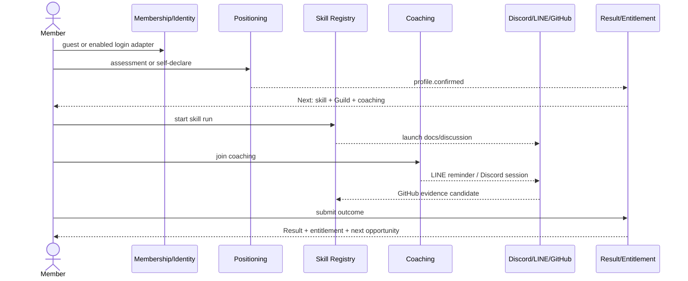

# 八個使用者模組與五個共通營運核心規格

> 狀態：現行 canonical baseline（2026-09-19 低維運互惠修訂）；planning 文件，不代表已部署。
>
> 2026-09-24 對照：base `8338a42` 的公開會員 beta 只實作本文局部子集（email 會員與 session、封閉定位、公會與技能書、會員隱私、小隊名單、供貨／商店草稿與 client read、開源／行銷紀錄、作品共創、單人 WorkItem claim、本人實益回報、商機合作與雙方收款回報、公會開發 grant）。現況與缺口以 [2026-09-23 落差對照](../development/plan-drift-2026-09-23.md) 為準；本文 API 表是 target contract，除非該處另註，不代表路徑已存在。

日期：2026-09-17

## 1. 共通規格與完成定義

八個使用者模組維持簡單入口；Guild／Profession、Opportunity／Project／Task、Agent Control、QC／Commercialization、Distribution／Settlement 是共用核心，不再複製成五個面向會員的新產品。本文寫到可建立 epic、API contract、migration 與驗收測試；canonical 欄位、事件、簽名與狀態轉移以 `03 §3–§7` 為準，packages、階段與驗收證據見 `06 §4`、`06 §6`、`06 §9`。

每個模組都必須遵守下列共通規則：

1. 首頁先顯示「得到什麼」與「下一步」，不先顯示制度或長表單。
2. 一個 command 只由一個 domain module 寫入；跨模組用 event/outbox，不直接改別人的表。
3. 可重送的外部請求必須有 `Idempotency-Key`；mutable aggregate 必須檢查 version。
4. Agent 可依 A0–A3 ExecutionGrant 主動讀取、擬稿、測試及執行 bounded work；A4 的價格／分配、Supplier acceptance、SettlementMandate或超scope付款／退款、正式QC、合約與任何 official／production immutable release必須由有權人對exact version/digest簽名。已簽Mandate範圍內的per-order transfer可自動執行。純內部／non-production snapshot可用A1／A2，但不得使用`v*` tag、public GitHub Release、production／Pages發佈或official標識。不得因AI評分或模糊品質判斷自動封鎖一般參與。
5. `failed/rejected/dead_letter` 可描述 request、provider delivery、render、payment attempt 或 integration job；不得成為 CareerProfile、Coaching member progress 或「人的價值」狀態。滿額回 `waitlisted`＋替代選項，低分／stuck／漏 check-in 不得觸發全人封鎖。
6. 金流簽章、權限、配額、rate limit、檔案安全與資料完整性屬技術控制，可以拒絕不合法請求，但要回傳可理解的修正方式。
7. 每個成功動作至少產生一個明確 UI feedback；重要事實產生 domain event，並更新會員 `Now / Next / Gained` 投影。
8. 每個外部整合都必須支援重送、去重、reconciliation 與人工補記，不把外部服務短暫失效變成會員資格失效。
9. 所有公開規則、模板、路線與文案帶版本；已成立的訂單、分潤、結果與技能版本不被後續改版倒改。
10. 一切正式 action 都能回答 `principal 是誰、acting role 是什麼、用了哪個 skill/grant、改了哪個 artifact、有哪些 AI review／QC／簽名 evidence`；不保存模型 chain-of-thought。

平台自身建置採 Grok adversarial review、Claude verification 與自動 checks；Ted 只對付款、法律文件、對外正式發布三類 exact artifact 一鍵 A4。成員對 Seller listing revision、Supplier `DistributionAcceptance`、Squad `EngagementAllocationPlan`、`SettlementMandate`、ProjectRelease approval 等 exact digest 的 A4 仍是產品語意。不同自然人的條件只控制 `official`、`production-signed`、`commercial-ready` 三個標籤；任何標籤為 false 時，candidate、staging、sandbox、內部 demo 與其他工作照常進行。

共通角色是特定作品、Offer、Opportunity 或 Program 中的責任身分，不是 API capability；具體操作一律由 scoped Entitlement 或該 aggregate 的明確 assignment 授權：

| 角色 | 典型能力 | 不代表 |
| --- | --- | --- |
| Member | 定位、學習、參與、保存成果 | 已取得商業或維護權限 |
| Supplier | 建立 Product、提供交付資訊 | 一定是付款收款方 |
| Seller | 建立 Offer、連接自己的付款帳號、負責買家 | Product 原作者 |
| Promoter | 領取推廣連結、查看自己的歸因與應收 | 可修改 Offer 或訂單 |
| AI Vibe | 設計／寫 code／文件／build；可為 Runner/Strategist/Master | 因 PR 自動擁有產品、收益或 release authority |
| AI Field（FAE） | 測試、review、推廣、feedback、部署、support/implementation | 自己的self-review不會成為獨立review；community software／Skill QC不會自動產生報酬 |
| AI Project | 帶入商機、PM/scope、銷售、協調 Vibe 與 Field | 可替 Squad 單方面定價或分錢 |
| Maintainer | 維護特定 SkillPackage／版本 | 平台管理員或自動是 Guild Master |
| Coach | 執行特定 coaching program／cohort | 可以看到會員所有資料 |
| Guild Master office | 對一條縱向 profession 的方向、人才、training、master skills 與模組 stewardship 負責 | 必須親自 coding／review 每張 PR，或因 office 自動取得其他 Profession rank |
| Squad member | 為一個 Project 跨 Guild 橫向交付，帶本案 acting role | 形成永久上下級或 Guild rank |
| Agent | 代表 user/org principal 依 WorkContextBundle 與 ExecutionGrant 做事 | 會員、獨立 reviewer、Master、簽名人或 payee |
| Platform Operator | 處理整合、人工例外與設定發布 | 擁有社群作品或收益 |

共通 UX 元件：

- `GainCard`：剛得到的知識、資格、工具、機會、人脈或金錢結果。
- `NextActionCard`：一個動詞、一個預估時間、一個明確產出、一個入口。
- `EvidenceChip`：self-declared、external、peer-confirmed、system-verified 等證據程度；只說明來源，不做人格分數。
- `ExternalLaunch`：帶 context 前往 Discord、LINE、GitHub 或商店，回站後仍能找到原任務。
- `StateTimeline`：顯示事實與時間，不把不同類型事實加總成總分。
- `ManualResolve`：外部事件遺漏、身份連結錯誤或付款待確認時，提供補件／補記入口，不讓人卡在無出口的錯誤頁。
- `WorkFeedCard`：為何適合我、acting profession、預估時間、輸出、gain、authority、review path 與「讓 Agent 做／自己做／略過」。
- `SignaturePanel`：顯示 exact diff/revision/digest、責任語意與 signer authority；一般 approve checkbox 不能冒充正式簽名。

每個模組的 Definition of Done：

本文列出的模組驗收目前均為「未跑」；以下各項是目標 evidence，不代表已通過、已部署或已上線。公開 beta 局部子集的 `tests/runtime/` 只證明該子集，不填作本文驗收。

- 主路徑、重送路徑、外部服務失敗路徑與人工修復路徑都有測試。
- API、event、DB migration、status projection、audit metadata 和操作畫面同一個 release 完成。
- 操作成功後能在個人狀態頁看到結果或下一步；無狀態的「黑洞功能」不算完成。
- 所有可變規則能指出 `ruleset/version/hash`；所有金額使用 minor unit。
- 權限測試證明使用者只能看到與操作其 scope 的資料。
- 無障礙鍵盤操作、手機版、zh-TW 文案、時區與幣別顯示通過基礎驗收。

下列「主要事件」只列需要跨模組消費的 canonical published events，使用 `freedom.<domain>.<fact>.v1` 全名；job 內部進度可保存但不必把每次轉移都發布到全平台。完整第一版 catalog 以 `03 §5` 為準。

### 1.1 低維運互惠：全模組共通要求

新增需求 RQ-066–RQ-071，見 [12](./12-low-ops-mutual-benefit.md)。Portal首頁在既有Now／Next／Gained內提供「我需要幫助／我能提供協助／我們一起做」；所有模組重用WorkItem／Squad／Result，不另建互助後台或新組織。

普通使用者只確認問題、雙方實益、投入上限、結束条件及使用權；其他欄位從既有context與範本預填。真人回饋只在本人接受且原子保留容量後承諾。無人時自助／候補／縮小範圍／未認領到期，核心不隱性補位。已簽履約、金流、安全與正式權益責任不套用此到期規則。

完成頁提供可略過的實益與粗估工時回報，缺值是未知，不強迫週報；回報不影響貢獻、應得報酬與會員資格。配對說明理由、可略過、同條件輪替；不由XP決定求助權。

## 2. 模組一：定位模組

> 2026-09-23 Ted 明示新註冊會員必須完成原創定位並自行確認公會；以下 B「不想做測驗」、§2.7「跳過測驗仍可進入」及 legacy parity 敘述不再適用新會員入口。既有會員存取與重新定位相容規則以 [會員入口修訂](../development/member-onboarding-release.md) 為準，不新增能力及格或職業資格判定。

### 2.1 目的與非目標

目的不是替人貼一個永久標籤，而是在三分鐘內給出一張可修改的方向草圖，接到真實的技能包、Guild、陪跑與第一個結果。

本模組負責：

- 收集最少必要背景、偏好、目標與限制。
- 執行版本化的 deterministic assessment，或建立 self-declared／coach-assisted profile。
- 分開保存現實職業、方向原型與會員選定路線。
- 解釋「為何推薦」、允許本人修改，並產生三個以內的下一步。
- 把已確認 profile 發給陪跑、技能、機會與會員狀態投影。

本模組不負責：

- 宣稱人格診斷、能力認證、就業保證或 AI 真理。
- 直接授予高價值商業權益。
- 以定位分數排名會員、篩掉會員或隱藏公開機會。
- 取代履歷、作品集、技能成果或陪跑員判斷。

### 2.2 使用者旅程

#### A. 快速定位

1. 會員先用 server-set、purpose-limited 的可回復 guest session，或首個已啟用的登入 adapter（建議 LINE）開始；guest session ID 與 CSRF scope create idempotency，不用 IP／fingerprint 識別人。
2. 頁面說明預計時間、會得到的結果與資料用途。
3. 逐題作答；每題立即本地保存，server 保存 draft。
4. 建立 AssessmentRun 時由 server 固定 definition、ruleset 與 content refs；提交時 client 只送 raw answers 與 run revision。
5. server 重新計算並固定 evaluator ref 與 recommendation-policy ref，保存 result snapshot；client 不可選擇或覆寫 derived versions。
6. 結果頁呈現前幾個方向、理由、限制提醒與「這不是能力判定」。
7. 會員確認或修改現實職業、目標與想走的 CareerTrack。
8. 產生 `CareerProfile` revision，顯示三個下一步：一個技能包、一個 Discord/Guild 接點、一個陪跑或可完成任務。

#### B. 不想做測驗

1. 選擇「直接說我想做什麼」。
2. 填一個目標、目前狀況與每週可投入時間。
3. 從 CareerTrack 搜尋／瀏覽並選擇最多三條。
4. 建立 `source=self_declared` 的 profile，得到同等基礎入口，不因跳過測驗降權。

#### C. AI 對話式定位／陪伴探索

1. 會員可啟動 `positioning-companion` GuidedDiscovery Skill，由 AI 追問目標、現況、限制與第一個可驗證小步。
2. 每輪顯示並可改 `user_words`、`ai_suggestions`、`unknowns`；完成卡另含 `first_evidence`、`falsifier`、`fallback`。
3. quick/full共用`positioning-card/v2`；差別只是填寫深度，不能產生互不相容schema。導航欄位為advisory `evidence_state`；`content/workflow/business_amplifier/pause`是strategy mode，不是ai-online第九種DirectionArchetype。
4. AI 產生的是 CareerProfile／WorkIntent draft。會員逐欄確認後才啟用；不得自動加入付費陪跑、授權 Agent、發 Profession rank 或認領工作。

#### D. 重做與修正

- 會員可隨時重新作答或由 coach 協助修訂。
- 新 revision `supersedes` 舊 revision；舊 profile 留在時間線。
- 已完成結果與已得 entitlement 不因 profile 改變而消失。
- 建議清單依新版 profile 重算，但已加入的 Guild／program 不被自動退出。

### 2.3 功能規格

| 能力 | 規格 |
| --- | --- |
| Assessment definitions | 題目、選項、factor、scoring、結果文案與 track mapping 分離；definition immutable，修改發新版本 |
| Draft answers | 每位 user／guest、AssessmentRun 一份 active draft；支援斷線續填、run-scoped guest credential 與明確清除 |
| Server evaluation | client 可預覽但 server 必須由 raw answers 重算；result 固定 `ruleset_ref{id,version,hash}`、`content_ref{id,locale,version,hash}`、`evaluator_ref{name,version,build_sha}`、`recommendation_policy_ref{id,version,hash}` 與 raw-answer hash |
| Explanation | 回傳 factor contribution 與人類文案，不只回傳代碼或總分 |
| Profile confirmation | assessment result 只是建議；本人確認後才成為 active career profile |
| Track catalog | 路線帶目的、典型成果、入門包、Guild/Discord、陪跑方案與目前公開機會 |
| Recommendations | 規則先行：profile、限制、已完成結果、可用時間；推薦可被 dismissed/saved，不是授權判斷 |
| Privacy | 首頁不公開個人答案；分享卡由會員選欄位並產生短效 token 或靜態圖 |
| Analytics | 只記 question/option IDs 與 funnel；自由文字不得直接進通用 analytics payload |
| Guided discovery | pin prompt/model/skill version；保存必要摘要與 `user_words/ai_suggestions/unknowns/first_evidence/falsifier/fallback`，不把建議冒充本人承諾 |

### 2.4 主要畫面

1. `/start`：一句價值、預估時間、直接選路線／開始測驗。
2. `/positioning/assessment/:definition`：逐題、進度、回上題、保存狀態。
3. `/positioning/result/:resultId`：方向圖、理由、限制、可修改欄位。
4. `/positioning/profile/edit`：職業、tracks、目標、限制與公開範圍。
5. `/tracks/:trackKey`：路線、技能包、Guild、陪跑、公開機會與近期成果。
6. Status View widget：`你目前選了 X；本週最短可完成 Y；完成後得到 Z`。

### 2.5 API 與事件

| Method/Path | 用途 | 關鍵規則 |
| --- | --- | --- |
| `GET /api/v1/assessment-definitions/current` | 取得適用版本 | locale、audience 可選；回傳 immutable version/hash |
| `POST /api/v1/assessment-runs` | 建立 run | 可帶 guest session；冪等 |
| `GET /api/v1/assessment-runs/{id}` | 續填／查 run 狀態 | user session 或 run-scoped guest credential |
| `PATCH /api/v1/assessment-runs/{id}/answers` | 保存 draft | `If-Match` version；不計為完成 |
| `POST /api/v1/assessment-runs/{id}:abandon` | 本人清除／放棄未完成 draft | 轉 abandoned；不封鎖重做或其他模組 |
| `POST /api/v1/assessment-runs/{id}:submit` | server 重算與完成 | 驗證題目 cardinality；回傳 explanation |
| `POST /api/v1/assessment-runs/{id}:claim` | 新平台 guest run 綁到已登入會員 | high-entropy one-time secret；重送冪等、他人已 claim 回 409、過期回 410 |
| `GET /api/v1/positioning-results/{resultId}` | 依原 provenance 呈現 immutable result | 不以 run ID 猜 active result |
| `POST /api/v1/positioning-results/{resultId}/feedback` | 清晰度／有用性回饋 | 自由文字與通用 analytics 分離 |
| `POST /api/v1/career-profiles` | 自選或由結果建立 revision | `source` 與 source ref 必填 |
| `POST /api/v1/guided-discovery-runs`、`POST /api/v1/guided-discovery-runs/{runId}:create-draft` | AI 對話探索與 draft | 只建 suggested draft；不建立 entitlement/enrollment |
| `POST /api/v1/positioning-drafts/{draftId}:confirm` | 本人逐欄確認定位 draft | 可建立 CareerProfile 與／或 WorkIntent revision；不推定付費權益 |
| `POST /api/v1/me/work-intents` | 不經測驗也可由本人直接確認新的 profession/work/capacity revision | Agent feed 只使用本人 confirmed revision；新 revision 不回寫舊工作事實 |
| `PATCH /api/v1/career-profiles/{id}` | 修正未確認 draft | confirmed revision 不原地改 |
| `POST /api/v1/career-profiles/{id}:confirm` | 確認 active revision | 產生推薦與 status rebuild |
| `POST /api/v1/career-profiles/{id}:dismiss` | 略過 suggested revision | 保留 audit；不改既有 confirmed profile |
| `GET /api/v1/career-tracks` | 瀏覽／搜尋路線 | 公開 query，不要求測驗 |
| `GET /api/v1/me/recommendations` | 取得可解釋下一步 | 每項帶 reason、gain、duration、dismiss key |

主要事件：`freedom.positioning.assessment.started.v1`、`freedom.positioning.assessment.completed.v1`、`freedom.positioning.assessment.claimed.v1`、`freedom.positioning.guided_discovery.started.v1`、`freedom.positioning.guided_discovery.draft_created.v1`、`freedom.positioning.profile.confirmed.v1`、`freedom.positioning.profile.superseded.v1`、`freedom.positioning.profile.dismissed.v1`、`freedom.organization.work_intent.confirmed.v1`、`freedom.journey.next_action.created.v1`、`freedom.journey.next_action.completed.v1`。

### 2.6 ai-online 遷移規格

既有 ai-online 是固定規則的偏好定位器，不是 LLM、技能認證或商業媒合器。遷移時：

- `legacy-v1`、`legacy-v2` 分開，分數不互比或混排；抽出 v2 的 15 題、56 個選項、8 個原型、Q14 多選 factor `0.7` 與既有結果文案，建立 immutable stable-ID crosswalk，發布後不重新編號。
- 用既有 golden fixtures 驗證新 engine 的 score 與排序；保留各原型可得分上限不同的歷史行為，不暗中 normalize。
- industry 與「不想做的事」保存為 profile context；除非新規則版本明訂，不回頭改 `legacy-v2` score。
- 舊 HTML/GAS 不再當真相來源。新 API 要解決 `no-cors` 樂觀成功、缺 auth/idempotency/server recompute、事件 envelope 不一致與 free-text analytics 問題。
- 每個 import row 保存 source sheet/ref、raw row hash、parse status、warnings、import batch、ZIP/Manifest/source hashes；缺失欄位不補造，空白 TopGap 保存 null/unknown。
- 有 raw answers 才 shadow recompute；只有舊結果時保存 opaque legacy snapshot，不反推答案。`legacy-v2` 也建立四重 provenance refs。
- 新平台建立的 guest run 可用建立當時簽發的一次性 claim secret 綁會員。歷史 ai-online 匿名 row 從未取得此 secret：有 contemporaneous verified identity evidence 者標 `legacy_resolution_required`，經人工核對並留完整 audit 才可連結；其餘標為 terminal `legacy_unclaimable` 並提供重新測驗。Audit 不是證據替代品；不能用姓名、email、session substring、LINE/GitHub 或事後新 token 猜所有權。

`positioning-companion` 另以 SkillPackage adapter 匯入，不塞進 ai-online scoring engine。先統一 quick/full card schema、修正 guardrails 與建立 model eval fixtures；在此之前 UI 明示 AI suggestion，不把其輸出當 deterministic assessment。

### 2.7 自動化邊界與驗收

- 可以自動推薦；不可自動封鎖其他路線。
- 可以標示答案不完整；不可因答案「不像某職業」拒絕 profile。
- 同一 canonical raw-answer hash＋ruleset ref＋evaluator ref 必須得到相同 core score；四重 refs 可重現當時內容與初始推薦。
- 斷線、重送 submit 不可建立兩個 completed run。
- guest claim 的 replay、過期、被他人搶先、同 user 重送與 legacy-unclaimable 都有 fixtures；claim 不重寫原匿名 completion event，只以 claimed event 歸戶投影。
- 使用者跳過測驗仍可進入技能、Guild 與基礎陪跑。
- profile 確認後 5 秒內 Status View 出現可執行下一步，且每項都能回答「做完得到什麼」。

依賴：會員／Identity、Skill Registry、Coaching、CareerTrack catalog、Status projection。先於自動行銷的 audience recommendation，但不阻塞商品或公開機會瀏覽。

## 3. 模組二：貨品上架／分潤模組

### 3.1 目的與交易邊界

此模組讓任何人提交候選商品，由 AI review 與對應 ReviewerAppointment evidence 記錄版本化 QC；Supplier 決定供貨條件，Seller 以自己的店面、收款接點與 buyer-facing 責任統一販售，Promoter 選品推廣。平台把歸因、應付、付款、退款與 supplier settlement 留帳；是否代 Seller 發出資金指令由下列 mode flag 明示決定。

Launch default 是 `reseller`：一個 checkout／BuyerOrder 只有一個 `SellerParty`／biller，買家付到 Seller-owned `seller_collection` connection；同一 Seller 可販售多個 Supplier 商品，平台在一張 buyer order 下建立多張 SupplyOrders。`authorized_mandate` 定義為 Payer 當事人對 exact `SettlementMandate` digest 的成員 A4，加上 Ted 對同一 digest 的付款類一鍵 A4；平台預設 `money_movement_enabled=false`，缺少任一簽名即維持 `record_only`。兩個簽名與平台 flag 均成立時，系統使用 bounded `SettlementMandate`，透過另行驗證的 payer-owned `payer_disbursement` connection 支付 SupplierPayable，並只在有明示 signed referral rule 時支付 Promoter CommissionObligation。Supplier或其他受益人另綁自己的 `beneficiary_payout_destination`；三種權限不可互相推定。平台不接觸或保管款項、不做 merchant of record；provider 不支援 payout initiation 時才降級為付款檔／人工 evidence。各市場稅務、憑證與對外責任文案的專業確認作用於 arrangement／listing／release evidence，不阻擋建置或會員工作。

Settlement execution 預設為 `record_only`：永遠可用，只產生應付／人工處理明細、接受驗證後的付款事實，介面一律顯示「已記錄」。`money_movement_enabled=false`；`authorized_mandate` 使用 Payer 當事人與 Ted 在同一 exact `SettlementMandate` digest 上的兩個 A4，且該 Seller／Payer 的 mandate 為 active。缺少任一簽名或平台 flag 時維持 `record_only`。每次 TransferJob 仍須符合 payer、connection、beneficiary、destination、action、scope、currency、period、timezone、cap、expiry、idempotency 與 reconciliation invariants；不成立時只拒絕該次資金副作用。人工明細不得顯示「平台已付」或「平台已結算」。

Promoter不直接向Buyer收款；若某推廣者要統一結帳與收款，他先註冊為SellerParty、開Seller Store並接受完整buyer-facing責任，該交易就是reseller交易。Seller保留價差是margin；不能因同一人另有Promoter身分就自動重複拿CommissionObligation。

只允許該訂單中明確 Supplier／Promoter／fulfillment obligation；不因「誰邀請誰」形成下線抽成。軟體貢獻／一般 QC 不形成自動 royalty；有客戶資助的 testing/review/development 由該 Squad 自談 `EngagementAllocationPlan`。

### 3.2 物件分工

下表所有 `*Party` 都使用 `03 §3.1` 定義的同一 `PartyId`（映射一個 User 或 Organization）；Seller／Supplier／Payer／Beneficiary 是可並存的交易角色，不是重複會員帳號。guest buyer 使用最小 order snapshot，claim 後才另連 User Party。

| 物件 | 回答的問題 | 誰可改 |
| --- | --- | --- |
| Product | 這是什麼貨品／服務／軟體 | owner/supplier |
| CommercialEdition | 哪個開源 commit/license 被包成何種 hosted/custom/implementation/managed/support 交付 | Vibe/Field/Project Squad＋edition steward |
| QualityReview | 哪個 exact version/batch 經哪套 protocol、由哪位獨立 reviewer 實測並簽名 | scoped reviewer；Agent 只可 preflight/draft |
| SupplierOfferVersion | Supplier 對 Product 提出哪版 net、availability、交付／退貨與 advisory price guidance | supplier；immutable 單方提案，不等於 Seller 已取得供貨權 |
| DistributionAgreement | Supplier/Seller 對哪版 SupplierOfferVersion／overrides、reseller 或 sales-agent 責任、供貨與 payout/return 達成合意 | 雙方簽 exact revision |
| Offer | Seller 以什麼承諾與交付方案賣 | seller；須引用 agreement/QC |
| SellerListingRevision | 在哪個 Store 以多少「實際售價」展示 | seller；每次改價發新版 |
| DistributionAcceptance | Supplier 接受／拒絕哪一版實際售價與供貨承諾 | supplier human signer |
| AttributionLink | 哪位 promoter、哪個 campaign 帶來流量 | promoter/system |
| Cart | 可捨棄的選購意圖；checkout 前由 server 重算 | buyer/storefront；不產生帳本 |
| BuyerOrder | 買家向一個 Seller/biller 買了什麼 | Commerce；一 Seller、一付款 |
| SupplyOrder | Seller 對每個 Supplier 應付與要求履約什麼 | Commerce 由 BuyerOrder snapshot 拆出 |
| PaymentEvidence | seller／buyer 提交的未確認材料 | submitter 可報告；不可直接標 paid／accrual |
| PaymentFact | 經 provider、相對方／reconciliation 或 operator resolution 成立的 immutable 事實 | Commerce owner only |
| SupplierPayable | reseller 已付款 Order line 依哪版 DistributionAcceptance 應付 Supplier 多少 | Ledger依verified paid＋signed acceptance建立；不可直接覆寫 |
| CommissionObligation | 哪個明示 sales-agent／referral signed rule 應付具名受益人多少 | Ledger policy evaluator；沒有signed rule就不存在 |
| ServicePayable | 哪個accepted milestone依其pinned signed AllocationPlan/payment trigger應付誰多少 | `opportunities-results`只在exact milestone accepted後建立；不由商品單或PR推導 |
| FinancialObligationReversal | 哪筆 refund／chargeback 沖回哪筆原應付多少 | ledger service append-only；不可改原 accrual |
| SettlementMandate | Payer 事先允許哪個 disbursement connection、beneficiary/destination、obligation action、scope、currency、日週月額度與期限 | payer human signer；reseller通常為Seller |
| SettlementMandateUsageReservation | 哪筆 instruction 原子占用哪個 bound／calendar bucket 多少 capacity | settlement engine；confirmed 才consume、證明無外部效果才release |
| SettlementInstruction/TransferJob | 每筆應付與實際 connector 執行／對帳 | ledger/settlement worker；provider fact確認 |
| RefundRequest/Return | 買家提出什麼、賣家如何處理、是否需退貨 | buyer/seller/fulfiller 各自 scoped command |
| LedgerEvent | 金額的 immutable movement | ledger service only |

`DistributionAcceptance`是唯一的Supplier價格／供貨接受aggregate；文件中的「Supplier acceptance／供貨承諾」都只是它的decision或accepted revision snapshot，不另建平行aggregate。

### 3.3 主要旅程

#### A. 供應者與賣家上架

1. 任何人以 repo/commit、batch 或 service definition 提交 candidate；結構有效且本人確認即公開成「候選／待 QC」，可討論與測試（code/Skill 亦可 fork）。software／Skill／code submission 保存來源、固定版本與起始 evidence；實體貨品、行銷、供應或 service 形成其 acting／corresponding Profession candidate evidence。投稿不自動入會，公會由本人另行選擇並確認；受保護的開發操作另查適用公會資格。這些 evidence 不代表 accepted、QC 通過或 official。
2. 系統依 product type 指派公開的 `ReviewProtocolVersion`；AI／CI 執行 preflight 與 review evidence 準備。持該 exact scope 有效 `ReviewerAppointment`、且與 submitter 為不同自然人的 reviewer 檢視 evidence 並簽 exact digest 時，`official=true`；缺少此 evidence 時 `official=false`，candidate、修正、sandbox、staging 與內部 demo 仍照常進行。XP、rank 或 Master 身分不會自動任命 reviewer。
3. Software／Skill community QC 永遠零費，累積 Field/Vibe 熟悉度與未來 FAE／support／implementation 優先；客戶出資的 testing/review/development 必須另建 customer-sponsored Project／ServiceEngagement，由 Squad 談 SOW／milestone／AllocationPlan，不把免費 QC 改成付費。實體／第三方商品的專門檢驗可另有 QC service Offer。
4. Supplier 先發布 immutable SupplierOfferVersion：supplier net、availability、交付／退貨、`msrp`、`recommended_floor` 等；它只是可被 Seller 採用／協商的單方提案。Supplier 與 Seller 再對 exact version／overrides 建 DistributionAgreement，簽下 `reseller|sales_agent`、六個交易責任、供貨、payout/return 與 promotion split。MSRP/floor 是建議資訊，不是平台自動拒售規則。
   同一person／organization可同時登記Supplier與Seller來自售，但仍建立exact arrangement/listing/acceptance snapshot、使用唯一Seller collection並接受獨立QC，不因角色重合略過責任與帳本。
5. Seller 綁自己的 collection 與 disbursement connections；每個受益人綁自己的 payout destination。Seller對reseller obligations簽 SettlementMandate；建立 Offer 與 actual-price SellerListingRevision。
6. Supplier看exact實際售價、Seller coupon/discount後的effective item price schedule與完整供應條件，選accepted／changes_requested／declined；accepted須簽exact digest。任何改變有效單價的Seller折扣必須已在接受schedule內，否則發新revision重簽；checkout不可藏臨時折扣。Shipping/tax另列。Supplier可停止未來供貨，但不得只因已接受價格而拒絕已付款的SupplyOrder。
7. 只有 `QC + active且仍在有效期內的accepted revision + active collection + settlement/fulfillment path` 齊全才變 `sellable`；acceptance revoked／expired／superseded時立即pause未來checkout，但不倒改既有reservation／Order。缺項仍保留 candidate/inquiry，不封鎖人或 repo。

#### B. 推廣者選品

1. 搜尋公開 Offer，看價格、分潤、交付者、素材、退款說明與近期結果。
2. 選擇「我要推廣」，立即得到 canonical short link、QR 與 campaign context。
3. 平台顯示 clicks/leads/paid orders/earned/settled/reversed，不把 click 當收益。
4. 分享方式自由；平台可提供行銷/剪輯模組入口。

#### C. 成交與結算

1. Storefront只允許同一SellerParty的cart segment；建立checkout intent時先以短效`SupplyReservation`原子固定每line的DistributionAcceptance、effective price與quantity。Supplier revoke阻止新reservation，但TTL內既有reservation仍可付；過期先關閉checkout，不收款。
2. Reservation有效才接受BuyerOrder；同一 transaction 保存actual SellerListing、QC、DistributionAcceptance／reservation、effective item price、責任、分配與refund snapshot，並按Supplier建立`awaiting_buyer_payment` SupplyOrders。
3. 賣家金流signed webhook可建立`PaymentFact(verification=provider_verified)`；用provider occurred time驗付款在reservation期限內。`authorized`與`paid`分開，只有verified `paid`可形成financial obligation。人工提交先建reported evidence。
4. paid fact先依provider `occurred_at <= reservation.expires_at`原子consume SupplyReservations；即使scheduler已標expired，晚到但發生在TTL內的verified webhook仍走同一consume，TTL後發生的charge則不成立可履約付款。reseller line依其signed DistributionAcceptance建立`SupplierPayable`，明示sales-agent/referral line才依signed rule建立`CommissionObligation`。Seller保留價差是margin，不是commission。再由各obligation建立SettlementInstructions；既有SupplyOrders只從`awaiting_buyer_payment`前進，不在付款後重建。`record_only` 到此只投影人工明細；只有 `money_movement_enabled=true` 且 Seller mode=`authorized_mandate` 時，worker才可找到恰好一個active Mandate bound，對該IANA時區的calendar day/week/month bucket原子計入`reserved + consumed`並建立UsageReservation，再以穩定operation key呼叫payer-owned disbursement connector；Mandate範圍內不逐筆重簽，越界才要求新A4。
5. Transfer timeout先reconcile；provider webhook/query或recipient confirmation成立TransferFact。Supplier transfer confirmed後自動授權相應SupplyOrder fulfillment；若agreement有已簽credit terms才可先履約。
6. provider明示不支援initiation時，才由工作箱匯出付款檔並收evidence，清楚標`manual_required`；超出mandate則進`authorization_required`，要求新的exact A4 authorization或Mandate revision，不混成provider fallback，也不只發訊息卻宣稱自動化。
7. 退款/chargeback對受影響的SupplierPayable／CommissionObligation追加generic obligation reversal，可退款或依已簽規則抵扣未來應付；不刪舊事件、不經平台wallet。
8. 歸因或交付爭議開case；只有該obligation可pause，不自動封Seller/Member。

#### D. 線下／LINE 成交

- promoter 可建立 attribution claim，附 buyer hint、Offer、時間與證據。
- seller 接受／拒絕；接受後仍需 canonical Order、verified付款事實與該line的明示signed referral rule才建立CommissionObligation。
- 不允許直接輸入一個金額就製造應收；每個 CommissionObligation 必須指向 exact order line、payment、beneficiary與signed rule version。

#### E. 退款／退貨

1. 買家從 Order detail 依 line/amount 提出 RefundRequest，看到該單 snapshot 的期限、退貨需求與處理者；request 不等於已退款。
2. 賣家接受、拒絕或要求 physical return，必須留下可理解理由與下一步；不同意可進同一 Dispute workspace。
3. 實體退貨記 authorization、寄出、收到、檢查；數位／服務按承諾走取消、補交、部分或全額退款，不套用假物流。
4. seller/payment adapter 執行退款；return page 或 seller 按鈕都不能自行標 refunded。verified provider fact、雙方確認或 operator resolution 才成立退款事實。
5. Commerce 在同一 transaction 追加一筆帶本次 amount 的 `freedom.commerce.payment.refund.confirmed.v1` PaymentFact event，並按 Order snapshot 對每筆受影響原 obligation 追加 `freedom.ledger.obligation.reversed.v1`；可多次部分退款，累計不可超過可退實收或原obligation未反轉餘額。只有累計已退達該 Order 的全部可退實收時，Order 才轉為 refunded 並發 `freedom.commerce.order.refunded.v1`；部分退款不得冒充整單退款。
6. UI 同時保留原付款、原 SupplierPayable／明示CommissionObligation、退款與 reversal，並分開顯示 `requested/accepted/executing/refunded/rejected/disputed`。

### 3.4 功能、畫面與報表

主要畫面：

1. Seller Studio：Products、QC、Agreements、Actual-price Listings、Buyer/Supply Orders、Settlement Automation、Connections。
2. Product/Offer wizard：candidate、QC evidence、責任矩陣、MSRP/advisory floor、實際價、即時拆分預覽與 sellability checklist。
3. Opportunity Catalog：可推廣方案與篩選。
4. Promoter Wallet View：這不是託管錢包，而是 pending/earned/due/settled/reversed 應收視圖。
5. Order detail：單一 buyer-facing Seller/biller、offer/listing/QC/acceptance snapshot、per-Supplier orders、payment、SupplierPayable、明示CommissionObligation、Seller margin projection、transfers、fulfillment與reversals。
6. Reconciliation Inbox：未知 webhook、金額不合、重複 provider ID、缺回傳、reported PaymentEvidence 與人工 resolve。
7. Dispute workspace：issue、雙方說法、evidence refs、人工結論與 reversal。
8. Refund/Return workbench：待回覆、待寄回、待收貨、待執行退款、provider result unknown 與逾時提醒。

必備報表：Seller/Supplier 應收付帳齡、Seller retained margin、mandate usage/cap、Promoter明示佣金應收、Offer conversion/refund、未配對 payment/transfer、SupplyOrder fulfillment、QC/product familiarity。報表不可把預估 obligation、margin 或未確認 transfer 顯示成已收現金。

### 3.5 API 與事件

| Method/Path | 用途 |
| --- | --- |
| `POST /api/v1/products`、`PATCH /api/v1/products/{id}` | 建立／修改 Product draft |
| `POST /api/v1/review-submissions`、`POST /api/v1/review-submissions/{submissionId}:claim`、`:decide` | 任何人可提交；AI preflight／evidence review 照常執行，獨立自然人的 exact QC 簽名只控制 `official` 標籤 |
| `POST /api/v1/guilds/{guild_id}/reviewer-appointments`、`POST /api/v1/reviewer-appointments/{id}/revoke`、`GET /api/v1/me/reviewer-appointments` | appointment authority 由 Guild Master office 持有；現行建議預設依 `06 §3.1`（Ted、Hao、Mini、Jason、韋銘各自的 Guild），`official` 的獨立 reviewer 為五人中非作者者（建議預設韋銘；韋銘為作者時 Mini 或 Jason）；有效 appointment 是`qc.review:<scope>`唯一來源 |
| `POST /api/v1/quality-reviews/{reviewId}:retract` | AI checks 與有效 exact-scope appointment 照常驗證；原 reviewer 以自己的有效 appointment 對 exact retraction digest 簽 A4。非原 reviewer 發動時，request 另含第二位不同自然人的有效 appointment 與對同一 exact retraction digest 的 A4 同意；單一非原 reviewer 不追加 retraction。獨立自然人 evidence 缺失只使 `official=false`，candidate、sandbox、staging 與內部 demo 照常；舊receipt回`receipt_superseded_by_retraction` |
| `POST /api/v1/commercial-editions` | 將商業交付模式綁定 exact OSS/Skill version、license evidence 與 QC；不創造原始碼 ownership |
| `POST /api/v1/supplier-offer-versions` | Supplier 發布 immutable net／availability／交付與 advisory guidance；不直接授予 Seller 供貨權 |
| `POST /api/v1/distribution-agreements`、`POST /api/v1/distribution-agreements/{id}:sign` | Supplier/Seller 對 exact SupplierOfferVersion／overrides、交易責任與供應條款簽署版本 |
| `POST /api/v1/offers`、`POST /api/v1/offers/{offerId}:publish` | 建立與發布 Offer/version；不得略過 QC/agreement |
| `POST /api/v1/seller-listings`、`POST /api/v1/seller-listings/{listingRevisionId}:request-supply` | 建 actual-price revision，並把 exact effective item-price schedule 送 Supplier 決定 |
| `POST /api/v1/distribution-acceptances/{acceptanceId}:accept`、`POST /api/v1/distribution-acceptances/{acceptanceId}:request-change`、`POST /api/v1/distribution-acceptances/{acceptanceId}:decline`、`POST /api/v1/distribution-acceptances/{acceptanceId}:revoke-future` | Supplier 對 exact revision 作決定；只有accept要簽actual/effective price schedule；future revoke擋新reservation，較早reservation只保留到TTL且不追溯已付單 |
| `GET /api/v1/catalog/offers` | 公開可搜尋 Offer catalog |
| `POST /api/v1/offers/{id}/attribution-links` | 取得 promoter canonical link |
| `POST /api/v1/attribution-claims` | 線下／私訊成交 claim |
| `POST /api/v1/orders` | trusted storefront 建 canonical order |
| `GET /api/v1/buyer-orders/{id}/supply-orders` | Seller/buyer scoped 子單與 fulfillment 狀態 |
| `POST /api/v1/orders/{id}:cancel` | 依目前狀態取消；不刪資料 |
| `POST /api/v1/orders/{id}/refund-requests` | buyer 建退款／部分退款請求；不直接改 Payment |
| `POST /api/v1/refund-requests/{id}:accept`、`:reject`、`:withdraw` | seller/buyer 各自合法 transition＋理由 |
| `POST /api/v1/refund-requests/{id}:execute` | seller 要求 provider 執行；回 operation/result-unknown，不先宣稱成功 |
| `POST /api/v1/returns/{id}:ship`、`:receive`、`:inspect` | physical return scoped transitions |
| `POST /api/v1/orders/{id}/payment-evidence` | seller／buyer 提交 reported evidence；不直接標 paid |
| `POST /api/v1/payment-evidence/{id}:confirm` | 相對方確認或授權者依證據 resolve，建立帶 verification level 的 PaymentFact |
| `POST /api/v1/payment-evidence/{id}:reject` | 相對方拒絕並可開 dispute |
| `POST /api/v1/settlement-mandates`、`POST /api/v1/settlement-mandates/{mandateId}:revoke` | Payer以exact signature建立／撤銷bounded standing disbursement authorization；reseller通常由Seller簽 |
| `GET /api/v1/settlement-instructions/{instructionId}` | 查 obligation、automated transfer 與 reconciliation；worker只依已簽 Mandate 執行 |
| `POST /api/v1/settlement-instructions/{instructionId}:submit-manual-evidence` | provider 無 initiation 時才允許人工付款證據路徑；提交不等於確認 |
| `POST /api/v1/transfers/{id}:confirm-evidence` | recipient/provider evidence resolve，不可直接改 ledger |
| `POST /api/v1/disputes`、`POST /api/v1/disputes/{id}:resolve` | 開案／授權者人工處理 |
| `GET /api/v1/me/earnings` | 本人的SupplierPayable／明示CommissionObligation／ServicePayable、transfer與reversal投影；不回他人資料、不宣稱平台保管餘額 |

主要新增事件：`freedom.quality.submission.created.v1`、`freedom.quality.review.claimed.v1`、`freedom.quality.review.submitted.v1`、`freedom.quality.review.retracted.v1`、`freedom.quality.reviewer_appointment.granted.v1`、`freedom.quality.reviewer_appointment.revoked.v1`、`freedom.quality.reviewer_appointment.expired.v1`、`freedom.quality.version.accepted.v1`、`freedom.quality.version.changes_requested.v1`、`freedom.commerce.seller_listing.created.v1`、`freedom.commerce.seller_listing.revised.v1`、`freedom.commerce.distribution_acceptance.requested.v1`、`freedom.commerce.distribution_acceptance.accepted.v1`、`freedom.commerce.distribution_acceptance.change_requested.v1`、`freedom.commerce.distribution_acceptance.declined.v1`、`freedom.commerce.distribution_acceptance.revoked.v1`、`freedom.commerce.supply_reservation.created.v1`、`freedom.commerce.supply_reservation.consumed.v1`、`freedom.commerce.supply_reservation.expired.v1`、`freedom.commerce.supply_order.created.v1`、`freedom.ledger.supplier_payable.accrued.v1`、`freedom.ledger.commission_obligation.accrued.v1`、`freedom.ledger.obligation.reversed.v1`、`freedom.commerce.settlement_instruction.created.v1`、`freedom.commerce.settlement_instruction.manual_evidence_confirmed.v1`、`freedom.commerce.transfer.provider_accepted.v1`、`freedom.commerce.transfer.confirmed.v1`、`freedom.commerce.fulfillment.authorized.v1`；其餘product/offer/attribution/payment/refund events依`03 §5`。

### 3.6 Financial obligation 與金額計算規格

- `selling_arrangement` 必須指定 `seller_of_record/payment_collector/invoice_issuer/refund_owner/price_owner/fulfillment_party`；Launch reseller default 不代表未來只支援一種法務安排。
- `msrp` 與 `recommended_floor` 只提供建議、diff 與人工 Supplier decision；不得用自動低價 cutoff。Sellability 取決於 Supplier 對 actual-price revision 的 explicit acceptance。
- DistributionAcceptance涵蓋buyer-facing effective item price schedule；coupon/discount若會改有效單價，必須預先落在schedule或建新revision。Shipping與tax獨立itemize，不計成假折扣／加價。
- BuyerOrder建立時先保存 signed source snapshots與候選金額；verified paid後，reseller line才由DistributionAcceptance建立`SupplierPayable`，sales-agent／referral line才由明示signed rule建立`CommissionObligation`。Seller retained margin只是`buyer-facing paid - supplier payable - explicit other obligations/tax/cost`的projection，不是commission obligation。
- 三種 payable 的共同欄位為 `source_type/source_version/beneficiary/amount/currency/due/idempotency/reversal refs`，再使用互斥 typed context：SupplierPayable 綁 `buyer_order/supply_order/order_line/order_split_snapshot`；CommissionObligation 綁 `buyer_order/order_line/commission rule`；ServicePayable 綁 `service_engagement/service_milestone/engagement_allocation_plan`。ServicePayable 不建立 nullable retail `order_line`，也不假裝有 original buyer payment。
- `commission_base`只用於明示CommissionObligation，須定義為商品小計、折後小計或實收；是否不含運費／稅要明示，不能拿它計Supplier貨款或Seller margin。
- percentage 用 basis points；fixed 用 Money；同一 recipient 同一 policy line 不能同時計兩次。
- rounding mode 與餘數歸屬寫進 policy/version，預設半入到 minor unit、餘數留 seller。
- Order 下單時保存 supplier net來源、eligible referral recipients、rate、base、window、attribution method、currency與各signed policy hash。
- 第一版預設 30 天、同 Offer last eligible click；seller 可用公開 policy version 改設定，但不改舊 Order。
- self-referral、coupon 與 click 沒有自動封鎖；若社群要限制，以明白規則與人工處理，不用隱藏風控分數。
- overpayment、partial refund、full refund、chargeback 都以增量／反向 LedgerEvents 表示。
- 客戶出資的 testing/review/development 是獨立 ServiceEngagement，不是付費 community QC，也不使用上述 retail formula；只有accepted milestone pinned到Squad逐人簽署的exact EngagementAllocationPlan及其中明示payment trigger時，才可建立ServicePayable。

### 3.7 驗收

- 同一 webhook 重送 100 次仍只有一個 PaymentFact effect，以及每個source/order-line/beneficiary各一筆相同financial obligation。
- 未有 QC 或 Supplier acceptance 的 revision 在付款前被拒，並顯示缺項；candidate 仍可討論／fork。
- Seller 改實際售價後舊 acceptance 失效；MSRP/floor 差異只提示，不自行接受或拒絕。
- Supplier 撤回只停止新 checkout；已付款且引用其 acceptance 的 SupplyOrder仍進 settlement/fulfillment或明示退款解決。
- Supplier revoke與checkout同時發生時，DB test證明revoke後無新SupplyReservation；已存在reservation只在TTL內有效，provider session期限不超過TTL。TTL後不能charge；late provider violation自動void/refund且不出貨。
- 一張BuyerOrder即使含三個Supplier，買家仍只有一個Seller/biller與一次付款；Order acceptance同transaction先產生三個`awaiting_buyer_payment` SupplyOrders，verified paid後才依其locked snapshots建立SettlementInstructions。
- 有 active Mandate 且原子保留到cap capacity的happy path不需Payer逐單按鈕即可完成provider payout；超cap／新recipient停在`authorization_required`。provider無initiation時清楚進`manual_required`。
- 規則發布後更改 percentage，舊訂單重算結果保持不變。
- 全額退款後原 accrual 可見，並有等額 reversal；歷史不消失。
- 兩個併發部分退款不會超退；accepted request 尚未出現 verified refund fact 時只顯示「處理中」。
- 同一付款可依次發生多筆部分退款；每筆有獨立 PaymentFact／reversal，累計投影正確，最後一筆才轉 fully refunded。Chargeback 也有獨立事實並只沖尚未反轉的餘額。
- 實體退貨可追到收貨／檢查，數位與服務退款不被要求填無意義 tracking number。
- promoter 能從 click 一路追到 settled，且每個數字有定義與來源。
- 人工付款截圖只顯示 `reported`；在確認／resolve 前不得顯示 paid、不得accrue任何financial obligation。
- seller 沒接金流時仍能先建 Product/Offer draft；只有執行 checkout 時被明確提示缺哪個技術接點。
- 逾期只提醒與列入工作箱；不因自動逾期判斷封整個會員帳號。需要暫停特定新推廣權益時由授權者人工決定並留下理由。

依賴：會員、Organization、Entitlement、Storefront、Integration、Ledger、Notification。自動行銷與剪輯消費 Offer snapshot，不可自行定價。

## 4. 模組三：電商平台模組

### 4.1 目的與邊界

電商模組提供「能快速開店、可 fork 改版、但不分叉核心交易真相」的店面能力。視覺與部署自由，catalog、Offer version、Order、付款事實與歸因契約一致。

`Master Store` 是 reference catalog、theme 與 contract test 的可 fork 模板，不必也不預設販售；只有 fork／新 Store 明確綁定一個 SellerParty、Seller collection connection 與責任矩陣後才可 checkout。現行 scope 不做統一金流代收、倉儲或全通路 ERP；最低共同面是 BuyerOrder、per-Supplier SupplyOrder、Settlement 與 Fulfillment evidence。

### 4.2 店面建立旅程

1. Seller 從不販售的 Master Store/reference template fork `freedom-storefront`，或直接用 hosted template。
2. 在平台建立 `store_mode=seller_store` 的 Store，綁唯一 SellerParty；取得 public store ID，private deploy token 只顯示一次。
3. 綁定 domain/origin、環境、Seller-owned collection connection、SettlementMandate 與 support/refund contact。
4. 從已 QC 且 Supplier 接受 exact price 的 SellerListingRevisions 選入 catalog；Store editor 不能另改售價。
5. SDK 執行 signed handshake，回報 contract version 與 deploy commit。
6. preview 使用 sandbox order/payment；通過 connection test 後 activate。
7. 店面可獨立部署，runtime 只能用 scoped token 呼叫 Storefront API，不能連 DB。

### 4.3 買家旅程

1. 開啟 Listing；attribution token 在第一方 cookie／signed query 保存，不暴露 promoter 個資。
2. 選 variant、數量或服務時段，server 重新抓 SellerListing revision、QC、Supplier acceptance 與 availability。同一 seller store 的 Cart 可收多個 Supplier 商品。
3. checkout先建立短效SupplyReservations，再顯示唯一Seller/biller與總額並建立一張BuyerOrder；後台按Supplier拆SupplyOrders，買家不分頭付款。跨Seller的Master Catalog／deep link只能建立分段cart，先選一個Seller segment付款，不能合成一筆checkout。
4. redirect／embedded 前往 seller-owned payment provider。
5. return URL 只顯示「正在確認」；必須等 signed webhook/reconciliation 才顯示 paid。
6. paid 後平台執行 Seller-owned supplier settlement；各 SupplyOrder取得 fulfillment authorization 後，再按 type 顯示物流、下載、部署、預約或 coaching 入口。
7. 買家可用 magic link 或會員身份查單；guest order 之後可主動 claim。

### 4.4 功能規格

| 能力 | 規格 |
| --- | --- |
| Store theme | design token、sections、locale；不允許 theme 取得 admin credential |
| Catalog read | CDN/cacheable public API；價格顯示帶 Offer version/ETag |
| Checkout | server-to-server 建 order；client-supplied price／SupplierPayable／commission一律忽略，完全由signed snapshots重算 |
| Cart／Seller boundary | Seller Store cart 固定一 Seller、可多 Supplier；Master Catalog 若跨 Seller只保留分段 intent，checkout 一次處理一個 segment |
| Inventory/availability | 第一版支援 finite/unlimited/manual-confirmation；超賣策略由 Offer snapshot 說明 |
| Promotion | coupon 可影響 price base；attribution 與 coupon 是不同物件 |
| Buyer identity | 支援 guest；最少收集交付必要資訊，後續可 claim |
| Fulfillment | common lifecycle＋type-specific metadata；履約方能更新自己的 scope |
| Domain/deploy health | handshake、origin allowlist、contract compatibility、last_seen；不因短暫離線收回會員權益 |
| Preview/sandbox | 測試訂單與正式 ledger 分區，UI 明顯標示 |

### 4.5 主要畫面

1. Store Setup／Deploy Health：模板或 fork、domain/origin、sandbox/live、contract version、last-seen 與修復指引。
2. Store Assortment Editor：把 exact、可售的 SellerListingRevision 選入 Store，管理素材／Campaign binding、預覽與 visibility；不能在此建立另一份 Listing 或偷偷改 price/split。
3. Store Catalog／Search：分類、篩選、可用性、seller 與交付／退款摘要。
4. Product／Offer Detail：variant、承諾、evidence/results、推廣歸因 disclosure 與立即購買。
5. Cart／Responsibility Review：顯示唯一 Seller/biller、各商品 Supplier／fulfillment 摘要與一筆 buyer total；供應拆單留在 order detail。
6. Checkout／Payment Pending：最後server-priced actual/effective item price、coupon、shipping、tax分項、唯一Seller收款方與redirect；return先顯「確認中」。
7. Buyer Orders：一張 buyer order 下展開 SupplyOrders的付款後處理、履約、下載／物流／預約、退款／退貨與 guest claim。
8. Seller Settlement & Fulfillment Inbox：transfer 自動執行／例外、Supplier authorization 與 dispatch/deliver；不顯示非必要買家資料。
9. Refund/Return Detail：request、seller decision、實體退貨（若適用）、provider result、reversal 與 dispute timeline。

### 4.6 API、SDK 與事件

| Contract | 用途 |
| --- | --- |
| `POST /api/v1/stores`、`PATCH /api/v1/stores/{id}` | 管理 Store |
| `POST /api/v1/stores/{id}/bindings` | 綁定 domain/deployment |
| `POST /api/v1/store-bindings/{id}:handshake` | signed contract/deploy 健康檢查 |
| `POST /api/v1/stores/{id}/assortment-items`、`DELETE /api/v1/stores/{id}/assortment-items/{itemId}` | 加入／移除 exact SellerListingRevision；這是 Storefront binding，不建立或修改 SellerListing，canonical revision 只走 Commerce 的 `/api/v1/seller-listings` writer |
| `GET /storefront/v1/stores/{publicId}/catalog` | public catalog BFF |
| `POST /storefront/v1/order-intents` | 建立 server-priced order intent |
| `POST /storefront/v1/order-intents/{id}:checkout` | 建 provider session／redirect |
| `GET /storefront/v1/orders/{publicNumber}` | buyer-scoped order status |
| `GET /storefront/v1/orders/{publicNumber}/supply-status` | 以 buyer-safe 摘要查各供應交付，不暴露 Supplier payout details |
| `POST /api/v1/fulfillments/{id}:dispatch` | 履約者出貨／開始交付 |
| `POST /api/v1/fulfillments/{id}:deliver` | 完成交付＋evidence |
| `POST /api/v1/orders/{id}:claim` | guest 主動綁會員 |

SDK 至少提供 TypeScript client、signature verifier、attribution helper、checkout UI adapter、webhook test fixtures 與 contract compatibility matrix。

主要事件：`freedom.storefront.binding.activated.v1`、`freedom.storefront.deployment.reported.v1`、`freedom.commerce.offer.listed.v1`、`freedom.commerce.order.created.v1`、`freedom.commerce.order.fulfilled.v1`。

### 4.7 驗收

- 官方公版與一個 fork 範例都通過同一套 contract tests。
- 篡改 client price、seller、SupplierPayable、commission rule或 Offer version 會被拒絕，回傳重新整理指引。
- payment return 先到、webhook 後到時不會誤顯 paid，也不會重複建單。
- 同一 Seller 的三個 Supplier 商品一次付款、只顯示一個 biller；後台建立三個 SupplyOrders。跨 Seller intent 必須先分段，不會出現多 biller 的單一 checkout。
- Master Store 未綁 SellerParty 時只能瀏覽／fork；任何 checkout endpoint 都拒絕並引導建立 Seller Store。
- Supplier acceptance或QC在checkout前失效，或coupon產生未被接受的effective item price時，停止該line並顯示變更；不先收款再賭Supplier出貨。
- Storefront 不持有平台 DB credential 或全域 API key。
- 一個店面故障不影響 Portal、其他 Store 或已成立 Order 查詢。
- 實體、數位、軟體、服務、陪跑五種 fulfillment 至少各有一個 end-to-end fixture。

依賴：商品／分潤、會員、外部付款、物件儲存、通知。可在定位模組尚未完成時獨立開發，但最後必須把商業成果投影回 Member Status。

## 5. 模組四：自動行銷模組

### 5.1 目的與非目標

讓會員從一個已存在的 Product、Offer、SkillPackage、活動或成果，快速得到可用的行銷 brief、內容變體、追蹤連結、排程與結果回饋。AI 是草稿與加速器，不是品牌所有者、事實來源或會員／內容資格判定者。

第一版不打造完整 CRM、廣告競價平台或跨平台私訊機器人；先把「來源真相 → 內容 → 人確認／授權的自動發布 → 歸因 → 學習」跑順。

### 5.2 建立 Campaign 的旅程

1. 選來源：Offer、Product、SkillVersion、Activity、ResultEvent 或自訂 brief。
2. 系統建立 source snapshot，預填目標、受眾、承諾、限制、CTA 與 attribution link。
3. 使用者選渠道、語氣、語言、產出數量與排程；可載入 Guild 範本。
4. AI 產生 draft，引用的價格、佣金、版本、日期等結構化事實由 renderer 注入，不由模型自由編造。
5. 使用者編輯、鎖定重要句、要求變體；保存 prompt/model/template/source 版本與成本。
6. 發布權限可設每次 A4 簽名，或對特定 channel/template/time/count 簽 A3 bounded autopublish grant；Agent 每日可提「今天發哪幾篇」並在授權內排程。新 connection 先做 preview/test post。
7. channel adapter 回傳 external post ID；click/order/result 進 analytics projection。
8. 系統提出下一輪建議，但不因表現差自動取消會員資格或刪文。

### 5.3 功能規格

| 能力 | 規格 |
| --- | --- |
| Source resolver | 從 canonical entity 取 immutable snapshot；無權內容不可用 |
| Brief | goal、audience、promise、proof、CTA、must_include、must_avoid、channels、locale |
| Templates | 社群／Guild／個人 scope；versioned；fork 保留 lineage |
| Generation | async job；可重試；回傳 variants、structured citations/source fields、estimated/actual quota |
| Review | draft diff、fact chips、locked fields、owner signature／A3 policy；approval 只控制該內容發布，不控制加入社群 |
| Contribution/lineage | 每版保存 contributors、human edit/review/publish/adoption evidence、derived-from refs 與 reuse-consent snapshot |
| Scheduler | timezone aware、retry/backoff、quiet hours、cancel future jobs |
| Channels | adapter capability discovery：text/image/video/link/schedule/analytics；不假設每平台相同 |
| Attribution | 每個 publication 綁 campaign/content/link；渠道數據與 Order 歸因分開 |
| Learning | 顯示 reach/click/conversion/result，讓人複製成功 variant；不製造單一「行銷人格分」 |
| Import into Store | 把 approved asset/section 綁 Store assortment item，不把生成內容直接改 SellerListingRevision、Offer 價格或承諾 |

### 5.4 畫面

1. Campaign Builder：來源、目標、渠道、模板、預計得到的資產。
2. Content Workbench：多版本、fact chips、編輯／鎖定、圖媒體與追蹤連結。
3. Calendar/Queue：draft、awaiting-owner、scheduled、publishing、published、failed。
4. Channel Connections：scope、token health、last test、disconnect。
5. Results：publication metrics、click、order、明示referral commission、skill adoption；清楚標來源與延遲。
6. Template Library：社群模板與 fork lineage。
7. Contribution & Reuse：誰提供來源／編輯／審核、目前可再利用範圍，以及一鍵撤回未來再製授權。

### 5.5 API 與事件

| Method/Path | 用途 |
| --- | --- |
| `POST /api/v1/campaigns` | 從 source refs 建 Campaign |
| `POST /api/v1/campaigns/{id}/briefs` | 建／改 versioned brief |
| `POST /api/v1/campaigns/{id}/content-jobs` | 產生內容草稿 |
| `PATCH /api/v1/content-items/{id}` | 編輯 draft、locked fields |
| `POST /api/v1/content-items/{id}:approve` | owner 核准可發布版本 |
| `POST /api/v1/publication-jobs` | 排程一個 approved item |
| `POST /api/v1/publication-jobs/{id}:cancel` | 尚未發布前取消 |
| `POST /api/v1/channel-connections/{id}:test` | test post／capability check |
| `GET /api/v1/campaigns/{id}/results` | 聚合但帶來源的成效 |
| `POST /api/v1/stores/{storeId}/assortment-items/{itemId}/content-bindings` | 把 approved content 綁到商店 assortment item；不可修改其 pinned SellerListingRevision |
| `POST /api/v1/content-items/{id}/contributions` | 登記可驗證的人類 contribution candidate |
| `PATCH /api/v1/content-items/{id}/reuse-consent` | owner/contributor 依 scope 調整未來再製授權 |

主要事件：`freedom.marketing.campaign.created.v1`、`freedom.marketing.content.generated.v1`、`freedom.marketing.publication.succeeded.v1`、`freedom.marketing.publication.failed.v1`、`freedom.quota.reserved.v1`、`freedom.quota.consumed.v1`、`freedom.quota.exhausted.v1`。Campaign conversion 由 canonical attribution/order/result events 投影，不另造一筆模糊 conversion 真相。

### 5.6 自動化與驗收

- 任何 AI output 都先是 draft；只有 owner 明確設定的排程才能自動發布。
- 每個 PublicationJob 先有 ActionIntent，引用 human／organization principal、AgentRun provenance、acting marketing role、A3 grant、content digest與 channel policy；取消／重試冪等。
- 渠道 token 失效時 pause 該 connection 的 future jobs、通知並保留草稿；不 pause 會員或 Campaign 本體。
- quota 不足時顯示成本與補充方式，保留 job；不丟資料。
- 價格、明示commission rule、版本與 CTA link 必須從 source snapshot 渲染，contract test 故意餵錯模型文字仍不得覆寫。
- publication 重試不建立重複貼文；若 provider 不支援 idempotency，要以 external lookup/reconciliation 降低重複並標記人工檢查。
- 使用者可從一個 Offer 在十分鐘內得到三個可編輯內容、一個追蹤連結與一個商店區塊。
- AI 生成工作本身不算人的成果；人的實質編輯、審核、發布或被採用可提交給 Result core，各 contributor 的證據與結果分開。
- 沒有相應 reuse consent 的素材不會被自動帶入新 Campaign；撤回後停止未來衍生 job，但保留既成 publication／交易需要的歷史引用。

依賴：商品／技能／活動 source、Attribution、Quota、Media、Channel integrations、Status projection。

## 6. 模組五：自動剪輯模組

### 6.1 目的與邊界

自動剪輯是行銷模組的可選擴充，負責把長影片、錄音、直播或現有素材轉成多尺寸短內容、字幕、封面與片段建議。它是重運算 worker，不應拖慢核心 API，也不直接擁有 Campaign 或 publication。

第一版不自建完整非線性剪輯器；提供 timeline recipe、預覽、片段調整、render 與匯出。真人選擇、來源授權與最後發布責任保持可見。

### 6.2 旅程

1. 從 Campaign、Activity recording 或上傳建立 EditProject。
2. 建立 MediaAsset，掃描檔案安全、取得 metadata/hash；使用者聲明來源與可用範圍。
3. 非同步轉錄、speaker/scene/beat detection，產生可搜尋 transcript。
4. 依渠道與目標提出 clip candidates，說明選段理由與起訖時間。
5. 使用者選擇片段、調字幕、safe area、logo、CTA 與版型。
6. 低解析 preview；確認後建立各 rendition RenderJobs。
7. 完成的 MediaAssets 回到 Content Workbench，再由行銷模組發布。
8. render 失敗可從 checkpoint retry；原始檔與已成功 rendition 不重做。

### 6.3 功能規格

| 能力 | 規格 |
| --- | --- |
| Ingest | direct upload、signed URL、approved external import；hash 去重，metadata 不信任副檔名 |
| File safety | MIME sniff、size/duration limit、malware/active content isolation；這是基礎設施安全，不是內容審查 |
| Transcript | language、word timestamps、speaker labels、confidence；人可修正並版本化 |
| Clip proposal | target duration/aspect、hook/CTA goal、source timecodes、reason；不直接覆蓋 timeline |
| Timeline recipe | JSON/EDL-like immutable revision，參照 source asset、time range、captions、overlays、audio |
| Brand kit | organization/user scope；fonts/logo/colors/CTA；無 kit 也能用公版 |
| Render | provider-neutral job，preset、output spec、cost estimate、progress、attempt、provider ref |
| Storage | raw/working/output 分 prefix 與 retention；signed download；不得使用任意 user-supplied object key |
| Accessibility | 字幕預設產生，可匯出 SRT/VTT；字幕可關但不阻塞 render |
| Lineage | output 指回 source assets、transcript/timeline/template/model versions |
| Contribution/reuse | timeline revision、字幕修正、片段採用與發布分別記人類 contributor/evidence；每個 output pin reuse-consent snapshot |

### 6.4 畫面

1. Asset Inbox：上傳、匯入、處理進度與失敗修復。
2. Transcript/Clip Review：文字搜尋、波形、選段建議、理由。
3. Lightweight Editor：9∶16／1∶1／16∶9、字幕 safe zones、overlay、封面。
4. Render Queue：estimated/actual quota、進度、retry/cancel。
5. Output Gallery：版本、下載、加入 Campaign、來源 lineage。

### 6.5 API 與事件

| Method/Path | 用途 |
| --- | --- |
| `POST /api/v1/media-assets:begin-upload` | 建 signed upload session |
| `POST /api/v1/media-assets/{id}:complete-upload` | 驗 hash/metadata 後入列 |
| `POST /api/v1/edit-projects` | 建專案與 source refs |
| `POST /api/v1/edit-projects/{id}/transcription-jobs` | 轉錄 |
| `POST /api/v1/edit-projects/{id}/clip-proposal-jobs` | 產候選片段 |
| `POST /api/v1/edit-projects/{id}/timeline-revisions` | 保存人的編輯版本 |
| `POST /api/v1/edit-projects/{id}/render-jobs` | 依 preset 建 renders |
| `POST /api/v1/render-jobs/{id}:cancel`、`POST /api/v1/render-jobs/{id}:retry` | 明確取消／重試 |
| `POST /api/v1/content-items/{id}/media-bindings` | 將 output 回接 Campaign |
| `POST /api/v1/media-assets/{id}/contributions` | 提交 edit/review/adoption evidence candidate |
| `PATCH /api/v1/media-assets/{id}/reuse-consent` | 調整後續 Campaign／教材／商店再製 scope |

主要事件：`freedom.media.edit.requested.v1`、`freedom.media.render.completed.v1`、`freedom.media.render.failed.v1`、`freedom.quota.reserved.v1`、`freedom.quota.consumed.v1`、`freedom.quota.exhausted.v1`。Upload、transcript、clip proposal 與 progress 是 Media module 的 job state；只有確有跨模組 consumer 時才新增 versioned event。

### 6.6 驗收

- 1GB 上傳斷線續傳不重建 asset；同 hash 可提示復用但不跨租戶洩漏存在性。
- worker crash 後 job 從 checkpoint 恢復；同 job 不重複扣 quota。
- 取消只停止未完成工作，已產出的合法 asset 仍可取用。
- 所有 output 可追回來源 timecode、timeline revision 與 template/model。
- render provider 全掛時核心 Portal、商店與訂單仍可用。
- 使用者從一支活動錄影可得到至少三個可調短片、字幕與三種常用比例，且沒有被自動發布。
- 每一個被確認的剪輯貢獻由 Result core 建立獨立 ResultEvent；共同成品不會只把成果算給 job owner 或模型。

依賴：Marketing Content、Object Storage、Quota/Billing、async worker、provider adapters。這是最可能優先拆成獨立服務的模組。

## 7. 模組六：技能包上架模組與規範

### 7.1 目的與核心原則

技能包不是一篇介紹文，也不是平台鎖住的課程。它是一個可被找到、理解、執行、fork、驗證、討論與維護的版本化能力單位；GitHub 保存程式／版本真相，平台保存索引、關係、學習與成果狀態，Discord 保存討論現場。

Repo 可先以最小資料立即建立公開 `candidate/metadata-only` 記錄，任何人都能討論、測試、fork、提 PR；這不等於官方推薦或可販售。完整 machine-readable validator 控制技術 readiness，獨立自然人 QC evidence 控制 `official` 標籤，Vibe／Field／Project 三個不同自然人的 assignment evidence 控制 `commercial-ready` 標籤。缺欄位、QC changes requested 或標籤為 false 都建立可認領 WorkItem，不把作者、候選作品、sandbox、staging 或內部 demo 擋在社群外。

Open Skills/Maintainers 與 AI Product Forge/Implementation 是同一個 `Open AI Product & Skills Division`，其三個分開 Guild 對每個產品形成盈利三角：

| Profession | 貢獻 | 主要能力 | 可得到的優先機會 |
| --- | --- | --- | --- |
| AI Vibe | 寫系統、文件、build、PR | AI vibe coding | 商業版客製／開發 Squad |
| AI Field（FAE） | test/review、推廣、feedback、部署、support | 熟悉系統、修改與導入 | FAE、implementation、維護／support Squad |
| AI Project | 客戶／商機、PM/scope、銷售、協調交付 | 傳統 PM＋軟體商業化 | product sales／project allocation |

每線都有 Runner→Strategist→Master；Officer 是 Master 可擔任、可交接的 office，不是 rank 名稱。Vibe、Field、Project 由三個不同自然人承擔時 `commercial-ready=true`；不足時維持 false，同人換 Agent 不算補齊，但工作、candidate、sandbox、staging、內部 demo 與發布準備照常進行。三個 Guild 的當期 Guild Master OfficeAssignment 持有人共組 Division Product Council，不加第四個長期瓶頸。

### 7.2 最小公開登錄與現行 automation-ready manifest

立即公開 candidate 只需：GitHub stable repository ID、immutable commit SHA、名稱，以及提交者可證明的 repo relationship。License 缺失顯示 `NOASSERTION` 警告並建補資料 WorkItem；不隱藏 Package，但不能標 official/commercial-ready。要啟用自動安裝、依賴解析、版本同步、責任提示與申請商業 QC，需下列完整 manifest：

```yaml
schema_version: freedom.skill/v1
id: skill:namespace/slug
name: Human readable name
version: 1.2.0
source:
  repository: https://github.com/org/repo
  repository_id: "123456789"
  repository_is_fork: false
  commit: aaaaaaaaaaaaaaaaaaaaaaaaaaaaaaaaaaaaaaaa
  manifest_path: freedom-skill.yaml
summary: 解決什麼問題
requested_capabilities:
  - documentation
  - installation
  - execution
  - dependency_resolution
  - version_sync
  - commercial_binding
license: Apache-2.0
targets:
  tracks: [track-key]
  level: starter
requirements:
  time_minutes: 60
  cost_hint: free
  platforms: [web]
  dependencies: []
entrypoints:
  learn: references/README.md
  install: scripts/install
  run: scripts/run
demo_url: https://example.invalid/demo
discussion_bindings:
  - purpose: general
    audience_level: all
    binding_key: skills-namespace-slug
  - purpose: beginner_help
    audience_level: starter
    binding_key: skills-namespace-slug-beginner
  - purpose: maintainer
    audience_level: maintainer
    binding_key: skills-namespace-slug-maintainers
  - purpose: study_group
    audience_level: starter
    binding_key: study-namespace-slug
maintainers:
  - github: maintainer-handle
limitations:
  - 人工確認的已知限制
data_and_runtime:
  sends_data_to: []
  secrets_required: []
human_control:
  principal_required: true
  independent_review_same_agent_is_insufficient: true
  a4_exact_digest_signature: true
  never_store_chain_of_thought: true
review_policy:
  community_review_fee: "0"
  independent_human_review: true
  version_scoped: true
  funded_review_requires_project_terms: true
commercialization:
  modes: [packaged, implementation, support]
  license_evidence_ref: evidence:license-scan-and-human-review
  obligations:
    - 保留 Apache-2.0 notice 與 attribution；實際 source license 仍為權威
```

Manifest 可增加欄位但不能偷換 capability readiness 的最低語意。`requested_capabilities` 是「請 validator 檢查並啟用哪些技術前提」，不是作者自封已通過；每項獨立回 `ready/not_ready/not_requested`。`commercial_binding` 的 validator 只表示 license、maintainers、limitations、runtime、零費community review policy及commercial modes/obligations disclosure 齊全；exact commit 的 independent human QC signature 更新 `official`，product triangle assignment 更新 `commercial-ready`。任一失敗不關掉其他能力，也不隱藏 candidate。

平台 registry 指向 commit SHA，不只指 branch 或 mutable release URL。Discussion bindings 只是 routing metadata；`audience_level=maintainer` 不會自動授予 Discord 或平台權力。

### 7.3 分級不是單一品質分

分級分成可獨立查看的 axes：

| Axis | 值例 | 來源 |
| --- | --- | --- |
| Entry level | starter/intermediate/advanced | maintainer 宣告＋使用者回饋 |
| Execution evidence | untried/community-run/field-used | ResultEvent/evidence |
| Automation | manual/assisted/automated | manifest 宣告＋recipe |
| Maintenance health | active/deprecated/unmaintained/withdrawn | GitHub sync＋maintainer action |
| Documentation | minimum/complete/example-rich | validator 可計算的可見事實 |
| Responsibility context | low/medium/high consequence | 使用情境說明，不作自動發布條件 |
| QC status | unrequested/in_review/changes_requested/accepted | exact commit＋protocol＋獨立 human signature |
| Product familiarity | observed/tested/reviewed/deployed/supported | ContributionRecord，不等於 ownership 或自動 pay |

平台不把 axes 加總為一個「80 分技能包」，也不把 star 數當品質真相。

### 7.4 上架、學習、fork 與維護旅程

#### A. 上架

1. 任何提交者連結 GitHub，選 software／Skill／code repository、tag／commit；最小 repository/commit/name/source relationship 結構驗證且本人確認後，建立公開 candidate 並保存來源、固定版本與起始 evidence。投稿不自動啟用 AI Vibe 或其他公會的 ProfessionMembership；本人另行選擇並確認入會，受保護的開發操作另查適用公會資格。submitted、accepted、QC 與 official 仍各自判定。
2. GitHub App 讀完整 manifest，或提供建立 PR 的 scaffold。
3. CI/schema validator 逐 capability 回報 path、欄位與修法；PackageVersion 保存 `capability_readiness{capability,state,validated_at,validator_version,report_ref}`，不再用一個全有或全無的 `integration_ready` 遮蔽差異。
4. ReviewProtocol 產生 test/review WorkItems；AI/CI preflight 與 evidence review 不等真人排程。另一自然人 Field/authorized reviewer 提交 evidence，且有 authority 的人簽 exact commit decision 時 `official=true`；evidence 不足時維持 false，其他工作照常。Community software／Skill QC 永遠零費；funded testing/review另屬customer-sponsored Project／ServiceEngagement。
5. accepted且registry以stable repository ID重查GitHub API為`is_fork=false`時可標official；source是fork時永久留在community candidate。CommercialEdition 另保存non-fork guard、license obligations、Vibe/Field/Project assignments、support/implementation boundary 與 commercial-scope QC；三個不同自然人的 assignments 成立時 `commercial-ready=true`，否則維持 false 而不阻擋候選與工作。
6. 作者可建立 Discord bindings，分一般、入門求助、維護者協作與讀書會；validator/QC 未完成時仍可被找到、討論、fork、修正。

#### B. 使用與成果

1. 會員從路線或搜尋頁加入 skill run。
2. 前往 GitHub/docs/demo；`demo_url`須通過canonical HTTPS、field-specific approved origin及redirect/SSRF檢查，介面明列external hostname，且不攜ambient credential；平台只記進度 checkpoint，不鏡像全部內容。
3. 完成時提交 output URL、demo、PR、截圖或自我聲明。
4. 依 package recipe 可由 GitHub check、peer 或 maintainer 確認 ResultEvent；證據程度清楚標示。
5. 結果成為evidence，`Next`可建議下一個package、maintainer invitation、opportunity或promotion取得路徑；完成不是瀏覽或學習下一項的鑰匙。
6. PR、test、review、deployment 的 accepted result 建立各人的 ContributionRecord／product familiarity；不建立自動 royalty。未來有客製、FAE、support或導入案時，AI Project/Sales 可依 evidence 優先邀請熟悉者組 Squad。

#### C. Fork／衍生

1. 會員由平台開 GitHub fork／template。
2. 新 manifest 宣告 parent package/version 與 relationship。
3. Registry 保存 lineage；原作者 attribution 保留。
4. fork 不自動分享未來商業收益；fork lineage可參與客戶的`ServiceEngagement`，Squad為該客戶案另簽`AllocationPlan`。但`CommercialEdition`必須先promotion到保留source/license lineage的新non-fork canonical repo，並重走QC/release；`AllocationPlan`只決定案件內分配，不能代替commercial eligibility或讓fork變official。Copyright/license 仍由 repo與授權條款決定。

#### D. 維護者交接

- Maintainer 以 GitHub account＋平台 user 明確接受 scope。
- 可邀請 co-maintainer、結束任期、標 deprecated 或指定 successor。
- 90 天無 release 不自動判 dead；只顯示 last activity。只有 maintainer/manual operator 可切換 unmaintained，或以明示 ruleset 產生「needs attention」提示。

### 7.5 畫面

1. Skill Registry：清楚分 candidate／official／commercial-ready，並依 tracks、evidence、QC、maintenance、platform、license 篩選。
2. Package page：獲得什麼、時間成本、run/install、版本/commit、QC scope/reviewer evidence、三職業覆蓋、維護者、Discord、lineage、相關機會／商品。
3. Submit wizard：GitHub picker、立即公開 candidate、manifest diff、readiness/QC work items 與補資料入口。
4. Maintainer／Product Console：versions、issues/PR、QC queue、Vibe/Field/Project coverage、discussion、contributors、automation readiness、commercial editions、health/handoff。
5. My Skill Runs：進度、下一 checkpoint、已得結果、可回饋／可維護入口。
6. Guild route editor：排序 package prerequisites 與推薦理由，不複製 package metadata。

### 7.6 API、Webhook 與事件

| Method/Path | 用途 |
| --- | --- |
| `POST /api/v1/skill-packages:register` | 以最小 repo/commit/name/submitter relationship 建公開 metadata-only 記錄 |
| `POST /api/v1/skill-packages:import-github` | GitHub convenience flow；最小驗證後即公開，完整 manifest 可稍後補 |
| `POST /api/v1/skill-package-versions:validate` | 完整 schema／references／capability readiness report；不控制公開 visibility |
| `POST /api/v1/skill-package-versions/{id}:publish-candidate` | 發布 immutable commit candidate；只做最小 identity/integrity validation |
| `POST /api/v1/skill-package-versions/{id}:mark-official` | 驗 applicable QC signature並以stable repository ID向GitHub API確認source `is_fork=false`後才標official；fork／repo無法查驗／self-declared false一律fail closed，不重寫commit |
| `POST /api/v1/skill-package-versions/{id}:mark-automation-ready` | 接受技術 capability report；不可代替 QC official decision |
| `POST /api/v1/review-submissions`、`POST /api/v1/review-submissions/{submissionId}:claim` | 對 exact commit 建 protocol-scoped submission／WorkItems；AI review 不等待真人，另一自然人的 claim 只補 `official` evidence |
| `POST /api/v1/review-submissions/{submissionId}:decide` | 獨立自然人 reviewer／release authority簽 exact digest時更新 `official`；community software／Skill QC 金額固定為零 |
| `POST /api/v1/commercial-editions` | 綁 PackageVersion、license、QC、Vibe/Field/Project assignments與交付模式 |
| `POST /api/v1/commercial-editions/{editionId}/role-assignments` | 提出具名 Vibe／Field／Project `ProductRoleAssignment`；不以 Agent 或 profession label 代替自然人 |
| `POST /api/v1/commercial-editions/{editionId}/role-assignments/{assignmentId}:accept`、`:end` | 被指派者本人接受或任一有權方結束 assignment；重算未來 readiness，不產生 ownership／royalty／專案分配 |
| `GET /api/v1/skills`、`GET /api/v1/skills/{namespace}/{slug}` | 公開 registry query |
| `POST /api/v1/skills/{id}/runs` | 加入一次學習／使用 run |
| `POST /api/v1/skill-runs/{id}/checkpoints` | 記錄進度／evidence |
| `POST /api/v1/skill-runs/{id}:complete` | 提交 completion result |
| `POST /api/v1/skills/{id}/lineage` | 宣告 fork/derived relationship |
| `POST /api/v1/skills/{id}/maintainer-invitations` | 邀請 scoped maintainer |
| `POST /api/v1/maintainer-invitations/{id}:accept` | 本人接受 |
| `POST /api/v1/skills/{id}/maintainers/{assignmentId}:end` | 本人／有權 owner 結束指定維護 scope |
| `POST /api/v1/skills/{id}:transfer-maintenance` | 邀請、接受後原子移交 current responsibility；保留歷史 |
| `POST /api/v1/skills/{id}/discussion-bindings` | 綁定 Discord channel/thread |

GitHub webhooks：installation/repository/installation_repositories、push/tag/release、repository transferred/archived、pull_request merged、check_run。Webhook 只更新同步與 evidence candidate；不把每個 commit 自動算成重大貢獻。

主要事件：既有skill/GitHub events之外，QC使用`freedom.quality.submission.created.v1`、`freedom.quality.review.claimed.v1`、`freedom.quality.review.submitted.v1`、`freedom.quality.version.accepted.v1`、`freedom.quality.version.changes_requested.v1`；CommercialEdition使用`freedom.product.commercial_edition.created.v1`、`freedom.product.commercial_edition.ready.v1`、`freedom.product.commercial_edition.retired.v1`；accepted work另發布`freedom.contribution.recorded.v1`。只有Result core發result events。

### 7.7 驗收

- 同 version label、不同 commit/hash 被拒絕原地覆寫，提示發新版本。
- GitHub webhook 亂序／重送不倒退 current recommended version。
- GitHub 暫時斷線時已發布 package 仍可查，頁面標 last sync。
- 公開 Skill Registry、Package detail、文件與 GitHub fork 未登入也可使用；登入只用於保存 run、成果、維護與個人化 Next。
- 新作者可在數分鐘內建立公開 metadata-only 記錄；用 scaffold 在 15 分鐘內逐步完成 automation-ready manifest 與分級 Discord 接點。
- validator/QC changes requested 不會隱藏 candidate；UI 只禁用對應自動能力／official/commercial標示並顯示修法／WorkItem。
- manifest 只要求 documentation 時，不會因缺 install/run/commercial 欄位失敗；要求 execution 時若缺 runtime disclosure，只該 capability 是 `not_ready`，公開與 documentation readiness 不受影響。
- 完成 skill run 後會員立刻看到一個可理解結果、可回饋入口與下一步。
- nickname、repo display name 或頭像不得用來合併作者身份。
- Submitter 與 official reviewer 為不同自然人時可形成 `official=true` 的獨立性 evidence；相同人用兩個 GitHub account、Profession 或 Agent 時 `official=false`，但不阻擋 candidate、sandbox、staging 或內部 demo。
- 同一 commit 可重現 QC protocol/evidence/signature；commit 改變即須新 review。Community software／Skill QC永遠零費，financial ledger不建立應付，ContributionRecord仍可見。
- CommercialEdition已有exact product/QC/license但尚未同時有三個不同自然人的active、本人接受Vibe/Field/Project assignments時保持`product_ready`且`commercial-ready=false`；開源使用、candidate、sandbox、staging、內部 demo 與發布準備照常。三人 evidence 成立時標籤轉 true；required assignment離任時標籤轉 false，不倒改既有Order。

依賴：會員/GitHub identity、Result、CareerTrack/Guild、Discord、Opportunity、Product link。Registry repo 與平台 DB 透過 contract test 保持一致。

## 8. 模組七：會員管理模組

### 8.1 目的

會員模組是全平台的入口、身份圖、Profession/Guild、權益、WorkIntent、Agent authorization 與個人狀態機。它不取代 Discord 社交圖或 LINE 對話，而是回答：這個人是誰、能以哪些專業身分投入、Agent 今天可幫什麼、做成什麼、得到什麼與下一步是什麼。

### 8.2 登入與身份連結

> 2026-09-24 現況：公開 beta 以 email／密碼＋server session 登入，註冊即收登入 email（取代下文對 email 的 progressive collection）。GitHub 只是可選 OAuth 連結（驗 GitHub user ID，用於 Star 與公會開發資格），不是登入 adapter；同一 GitHub user ID 全平台只能連一位會員，衝突回 409 且不洩漏原會員（[GitHub 身分唯一性](../development/github-identity-uniqueness.md)）。LINE Login、Discord 連結、identity merge、帳號恢復與一般 email 驗證仍待做；下文為目標規格。

- 身份核心對 provider neutral；可回復 guest session 不依賴外部服務。現行 working default 以 LINE Login 作首個 adapter；LINE OA 與渠道的採購、帳號及環境細節只依 `08 §13`。OIDC/OAuth callback 只交換平台 session，不把 LINE access token 發給前端長期保存。Ted 可依轉換率 evidence 改換 provider，而不改 domain identity。
- Discord/GitHub 是可選連結。未連結仍能定位與瀏覽；需要在相應外部系統執行動作時才提示連結。
- email／手機只在通知、買家交付或賣家付款需要時 progressive collection。
- 同一 external identity 不能同時連兩個 active user；衝突進 Identity Resolution 工作箱。
- 合併帳號必須由兩邊身份重新驗證或人工核實；採 transaction，保留 merge audit 與 alias，不用姓名／頭像模糊比對。
- guest assessment/order 可用一次性 claim token 主動綁定。

### 8.3 個人狀態頁

Status View 固定先呈現：

1. `Now`：active tracks、正在做的 skill/coaching/opportunity/order/settlement。
2. `Next`：最多三個可做動作，含時間、門檻、入口與完成後 gain。
3. `Gained`：最近取得的 Result、Entitlement、人脈接點與已確認收益。
4. `Needs attention`：外部連結失效、待確認交付、待收／待付、即將到期；不得把提醒偽裝成懲罰。
5. `Daily Work Feed`：person principal依本人confirmed WorkIntent，organization principal依版本化organization work policy＋具名operator及其acting ProfessionMembership，再結合equipped Skills、Squad/Claim與active grants，列可賣商品／貼文、客服、Supplier onboarding、PR/QC、開發、FAE/導入與商機；每項顯示理由、角色、時間、gain、review/signature，讓人選擇自己做、Agent做或略過。Organization Agent不得借用隱藏個人定位／WorkIntent。

可展開時間線，但預設不做總分、段位排行榜或全站活躍壓力。每項卡片可控制公開範圍。

XP 是獨立的 People read model：`GET /me/xp` 只按 `profession × training|maintenance|real_delivery` 顯示 `MemberProfessionXpProjection`，每列附 `policy_version` 與 `rebuilt_from_event_seq`；`GET /professions/{profession_key}/xp-policy` 顯示該職業目前的可讀公式。投影只由 append-only `ContributionRecord` 與 accepted／retracted review outcome 重建，可整表刪除重算。畫面不提供跨 profession total，XP 不進 EntitlementSnapshot、rank review、ReviewerAppointment、matching authorization 或 A4。

### 8.4 Entitlement 與 Opportunity

- `EntitlementDefinition` 定義 capability、scope、gain、取得方式與人工收回方式。
- `available` 表示可一鍵取得或完成明確動作即可取得；`active` 才授權 API。
- Result-driven grant 由 event consumer 依 versioned ruleset 建立；失敗可重放。
- entitlement pause/revoke 必須指定 scope、reason、actor、effective time；提供申訴／聯絡入口。
- Opportunity 預設公開可瀏覽；高成本／高責任案可列出 `required_entitlements/results`，會員可看到差距與如何補上。
- Claim 的角色與責任明確；沒被選上仍保留可學下一步，不產生隱藏負分。
- 大型 lead/fund/investor/sponsor 可先建立 private `OpportunityStub`；敏感內容留在原系統。只有要啟用 platform agent/task/ledger時才補最小 stub，不強迫所有商機進平台。
- Opportunity 接受後成立 Project與橫向 Squad；Guild 是長期縱向人才／training線，兩者 membership、authority與生命週期分開。
- Claim 屬人／Squad；Agent TaskLease 只是短效 executor lease，失效不可釋放人的承諾。

### 8.5 組織、Guild、活動與人脈

- Organization membership、Guild membership、Activity participation 分表，不互相繼承 admin。
- 一人可有多個 ProfessionMembership（例如 AI Developer Master＋Marketing Runner），每次WorkItem/AgentRun只選一個acting role並equip相應SkillPackages。
- `Runner → Strategist → Master` 是 rank；Master office 是有任期可交接的 Chief Officer 職務。每個模組都有一個 ModuleStewardship，對應 accountable Guild/Master與 routine delegates。
- Guild Master維持方向、人才、training、master skills repo與重大爭議；日常 PR/QC由符合 protocol 的 Strategist／skill owner處理，避免單點排隊。
- Guild Lounge 類現場活動是 `community.activity` 子模組：報到角色是該場自選 context，不改 CareerProfile 或 Entitlement。
- 成員可明確交換 contact card／connect request；平台保存雙方同意的 `MemberConnection` ref，不抓 Discord 私訊或 LINE 全部聊天。它是人際關係 aggregate，與外部帳號／app 的 integration `Connection` 完全不同。
- 讀書會出席是 attendance；只有完成輸出／分享／實作才另建 ResultEvent。

#### 8.5.1 第一天 bundle、starter track 與歡迎 automation

> 2026-09-23 起新註冊會員須先完成封閉定位並自行確認公會才開放平台（Ted 明示 override，見 §2 註）；下文「可跳過定位」不再適用新註冊會員，「任何step都不鎖…」只適用定位以外的 step。

Portal在建檔後顯示可重建的`MemberOnboardingJourney`：建檔 → 可跳過定位 → 接受建議或self-declare profession → 自助成Runner → 選coaching或starter package → equip → member-scoped install/verify → 歡迎儀式 → 第一張30–90分鐘WorkItem。每個step與overall readiness都是含`enforcement=navigation`的object，不顯示完成率／總分；任何step都不鎖registration、discussion、learning、browse、join、equip、submission或low-risk claim。

本人使用`POST /api/v1/me/onboarding-bundles`一次確認stable `profession_key`、可選stable `starter_package_key`、route、availability與desired work types。Server在單一idempotent transaction解析current Guild／pinned starter version，建立或回傳Runner ProfessionMembership、active WorkIntent revision、equipped set與journey／starter projection；response直接給後續所需opaque refs。UI只能讓人從typed recommendation/catalog選，不提供貼ID文字框。相同Idempotency-Key＋payload回原結果；不同payload為conflict；任一expected version不符則全部不寫入。

`freedom.organization.profession.confirmed.v1`觸發`WelcomeRitualRun`：

| 步驟 | 執行層 | 人類輸入 | 失敗／略過 |
| --- | --- | --- | --- |
| resolve pinned starter track、建立journey與歡迎卡 | system／無人 | 無 | 留`unavailable|stuck`導航狀態，仍可做其他事 |
| 整理starter track、說明建議package與替代路 | A0 | 無 | 顯示Portal fallback |
| 產生Guild public route及可用channel deep link | system／無人 | 無；不要求先連Discord／LINE／GitHub | connector缺失顯示Portal route並可建setup WorkItem |
| 問「你先想完成什麼？」 | member optional | 最多一句，可skip | 零懲罰 |
| 對已選package做本機preflight | A1且需active grant | 無逐步回覆 | failure轉Next／替代路／可選求助WorkItem |
| 推薦第一張bounded WorkItem | A0 | 無；claim可在A2 grant內 | 沒有合適項時建供給缺口WorkItem |

Strategist／delegate pool的Feed收到typed `new_runner_joined`、`starter_installation_verified`、`member_stuck`、`member_requested_help`卡；包含membership、journey/item、latest receipt、reason、建議動作、`enforcement=navigation`與dismissal effect=`none_for_member`。Routine welcoming、route修補、install協助與第一張task供給由該pool處理。Master只收重大版本、規則、爭議、succession或聚合capacity摘要；Master略過或不處理零後果。不存在Master簽名、approval state或welcome完成後才讓新人繼續的路徑。

上述四種卡的唯一 domain truth 是 Portal Feed projection；LINE／Discord 只送帶短效 deep link 的可丟失提醒。Dismissal 只更新 Portal projection、不寫入聊天紀錄，任何通知／回覆永遠不是 A4 artifact 或 signature；connector outage 時不鏡像、不以聊天補帳，只保留 Portal Feed 卡。Provider message／delivery state 不得反向成為 membership、journey、readiness、entitlement 或 rank 事實。

「卡住」只有三個deterministic trigger：starter item `due_at`已過且無progress receipt；install verification最新receipt=`fail|degraded`；WorkClaim `expected_update_at`已過且無checkpoint／submission。系統只做四件事：插入可解釋Next、建議替代路、提供可選求助、依stable item ID冪等materialize WorkItem／投影delegate卡。`skip|stuck|missing_connector|unavailable`不改entitlement、rank或未來可發現性，也不自動revoke。

#### 8.5.2 Profession starter 與 member installation

每個Profession Runner入口pin一份`ProfessionStarterTrackVersion`；每項含stable ID、action、evidence resolver、gain、fallback、WorkItem template與`enforcement=navigation`。`MemberStarterTrackProgress`逐membership保存`satisfied|skipped|stuck|alternative_evidence`；可跳、可替代、可重排、可轉WorkItem，永不形成admission score或升階前置。

`MemberSkillInstallation`固定scope為member＋AgentConnection＋PackageVersion，保存`recommended|equipped|installing|verified|failed|degraded|outdated|removed`狀態、A1 receipt、health與remediation WorkItem。它和package的`capability_readiness`、equipped selection、單次AgentRun provenance是四個不同物件。Receipt綁exact package digest、client instance、validator、platform profile、time與result digest；失敗／過期只導航，不阻擋Runner、學習、submission、low-risk WorkItem或未來matching。

#### 8.5.3 Guild lifecycle 與共用 playbook

Guild lifecycle是`draft→active↔degraded→archived`。`POST/PATCH /guilds`是Board／delegated Community Ops管理command；現行一般會員不能直接建立Guild，目錄明示「申請新職業線＝建立Board WorkItem」。加入既有Guild仍走self-service Runner endpoint，沒有Master admission。

`EntityPlaybookVersion`與`EntityReadinessProjection`第一批涵蓋Guild、Profession starter、CoachingProgram、Seller Store、SkillPackage。每個item、status與readiness都帶`enforcement`；navigation缺項可一鍵materialize WorkItem。Guild private Discord是optional completeness slot，owner pool=Community Ops／Guild delegates；缺少時可標degraded但不擋active或join，現行`public_community`範例不改。

### 8.6 主要畫面

1. `/me`：Now/Next/Gained/Needs attention。
2. `/me/profile`：顯示名稱、bio、公開成果、tracks 與 visibility。
3. `/me/integrations`：LINE/Discord/GitHub/payment/channel integration Connections 與權限範圍；`/me/network` 另列雙方接受的 MemberConnections。
4. `/me/professions`：多重 Profession/rank/evidence、Guild、office、WorkIntent、equipped skills與晉級下一步。
5. `/me/agents`：linked Agent clients、A0–A3 bounded grants、A4 exact-signature requests、最近 ActionIntent/provenance、revoke。
6. `/me/work`：Daily Work Feed、Claims、AgentRuns、waiting review/signature與 ContributionRecords。
7. `/me/entitlements`：active/available/history，以及每項「能做什麼／怎麼得到」。
8. `/opportunities`：公開任務、角色、預期成果、收益／非金錢 gain、缺口。
9. `/results`：分種類時間線與 evidence；不做總分。
10. `/organizations/:id`、`/guilds/:id`、`/squads/:id`：分開顯示長期專業與本案交付。
11. `/me/notifications-and-consent`：依類別／渠道／quiet hours 設通知；查看與撤回明確的資料分享／內容再製 consent。
12. Operator Workbench：identity conflicts、failed events、manual grants/revokes、external sync，不提供無痕直接改 DB。

### 8.6.1 Export、停用與保存週期

- 每個 data class（identity、assessment、chat reference、media、webhook receipt/raw policy、Result、Order／Ledger）由versioned retention catalog指定purpose、期限、archive/delete/tombstone動作、例外與policy owner；不能用一個全站天數模糊處理。Webhook raw的policy可且對payment/client-confidential類型必須是`do_not_persist`／digest-only，不能因列入catalog就取得中央R2保存權。
- 本人可建立非同步 machine-readable export；export job pin request time 與 policy version，產出 manifest、records、provenance／schema version，短效 signed URL 不進 event、log 或通知正文。
- `deactivate` 是可冪等的會員命令：立即撤銷 session 與 user-owned active grants，停止新個人通知，排程撤銷 user-owned external Connections；不原地刪除已發生的 Order、Ledger、Result 或 audit facts。
- shared Connection 不隨某位建立者停用而消失。系統必須先確認新的 active owner、scope 與接受紀錄；否則回 `handoff_required` 並交給明確的 Ops workbench，而不是靜默破壞全社群接點。
- hard-delete／法定保存期限不控制一般會員資格；未完成專業判定前使用 purpose restriction、去識別化／tombstone 與 access removal，且保留可稽核的 policy reference。

### 8.7 API 與事件

| Method/Path | 用途 |
| --- | --- |
| `POST /api/v1/auth/line/start`、`GET /api/v1/auth/line/callback` | LINE login flow |
| `POST /api/v1/me/identity-links/{provider}:start` | 可選身份連結 |
| `DELETE /api/v1/me/identity-links/{id}` | 撤回連結，不刪 user facts |
| `GET /api/v1/me`、`PATCH /api/v1/me` | 個人設定與 visibility |
| `GET /api/v1/me/status` | Now/Next/Gained projection |
| `GET /api/v1/me/xp`、`GET /api/v1/professions/{profession_key}/xp-policy` | 分profession／track的可重建XP及其可讀policy；無跨profession total，且不授權 |
| `GET /api/v1/me/work-feed` | purpose-limited Daily Work Feed；帶 reason/acting role/gain/authority/review path |
| `POST /api/v1/me/onboarding-bundles` | 第一天canonical command；stable profession/package key在單一idempotent transaction建立／回傳Runner membership、WorkIntent、equipped set與journey，解掉opaque-ID chicken-and-egg |
| `POST /api/v1/me/profession-memberships`、`POST /api/v1/me/work-intents`、`PUT /api/v1/me/equipped-skills` | 後續獨立typed mutation；都有request/response、idempotency、expected version與409/412/422；定位不是前置條件，UI不讓人手貼opaque ID |
| `GET /api/v1/me/onboarding-journeys/current`、`POST /api/v1/me/onboarding-journeys/{id}:answer-welcome` | 重建第一天navigation journey；一句goal可回答或skip |
| `GET /api/v1/me/profession-memberships/{id}/starter-track`、`POST .../items/{itemId}:report` | pinned starter track與per-membership進度；skip/stuck/替代evidence皆零懲罰 |
| `POST /api/v1/me/member-skill-installations`、`POST /api/v1/me/member-skill-installations/{id}:verify` | member＋AgentConnection＋PackageVersion實裝與A1 receipt；失敗只導航 |
| `POST /api/v1/me/day-one-execution-grants` | 具名固定A0–A2、≤72h、單profession／starter／first-work scope模板；不是A4簽名 |
| `GET/POST /api/v1/guilds`、`PATCH /api/v1/guilds/{id}`、`POST /api/v1/guilds/{id}:change-state` | 公開目錄；Board／delegated Ops建立更新Guild；一般會員新職業線走Board WorkItem，自助加入仍直接Runner |
| `GET /api/v1/entity-playbooks/{kind}/{key}`、`GET /api/v1/entity-readiness/{kind}/{id}`、`POST .../items/{itemId}:materialize-work-item` | 共用versioned說明書、per-instance readiness與缺項冪等WorkItem |
| `GET /api/v1/me/work-context` | 取得purpose-minimized WorkContextBundle；明示person WorkIntent或organization policy＋named operator的`work_direction_basis`，不含私聊、金流secret或完整定位逐字稿 |
| `POST /api/v1/agent-connections/device-authorizations`、`POST /api/v1/agent-connections/device-authorizations/{userCode}:approve`、`POST /api/v1/agent-connections/device-token`、`POST /api/v1/agent-connections/refresh-token` | CLI開始device/browser flow；人看清client/principal後核准。Connection refresh需client-instance proof並原子rotation；不建立grant，亦不是worker job credential refresh |
| `POST /api/v1/agent-connections/{agentConnectionId}:revoke` | Principal撤銷connection token與新AgentRun；未知外部結果仍reconcile |
| `POST /api/v1/work-items/{workItemId}:claim` | 人／Team／Squad claim；與 AgentRun 的 TaskLease 分開 |
| `POST /api/v1/agent-runs` | 以 human-owned Claim＋active grant 建 AgentRun 與短效 TaskLease；不接受 agent自稱 principal |
| `POST /api/v1/execution-grants`、`POST /api/v1/execution-grants/{grantId}:mint-token`、`POST /api/v1/execution-grants/{grantId}:revoke` | 人類建立bounded A0–A3 grant；connection token依同一Connection/grant換短效execution token。A4永不成為standing grant |
| `POST /api/v1/action-intents`、`POST /api/v1/action-intents/{actionIntentId}:sign`、`POST /api/v1/action-intents/{actionIntentId}:execute` | external effect先建冪等typed intent；execute重驗grant/lease/fence，A4綁exact artifact與consequence digest及human authority |
| `POST /api/v1/draft-artifacts`、`GET /api/v1/draft-artifacts/{draftArtifactId}`、`POST /api/v1/draft-artifacts/{draftArtifactId}/revisions` | 建立／讀取／修訂非code platform-native PR；每個ID是一個immutable revision aggregate，以lineage_id串successors。修訂原子supersede path所指舊版並建立新ID，draft不直接套用 |
| `GET /api/v1/me/notification-preferences`、`PATCH /api/v1/me/notification-preferences` | 依 category/destination 控制通知與 quiet hours |
| `GET /api/v1/me/data-sharing-consents`、`PATCH /api/v1/me/data-sharing-consents` | 明確 purpose/scope 的授權與撤回；保留 audit |
| `POST /api/v1/me/data-exports`、`GET /api/v1/me/data-exports/{id}` | 建立／取得本人 machine-readable export；短效單次下載，不同步打包大檔 |
| `POST /api/v1/me:deactivate` | 冪等停用本人帳號、撤 session／user-owned grants，排程 owned Connection cleanup |
| `POST /api/v1/internal/connections/{id}:handoff-owner` | audited shared Connection handoff；需 current/new owner evidence 與 scoped service/operator capability |
| `GET /api/v1/me/entitlements` | 本人權益與取得路徑 |
| `POST /api/v1/entitlements/{id}:activate` | self-service activation |
| `POST /api/v1/admin/entitlements/{id}:pause`、`POST /api/v1/admin/entitlements/{id}:revoke` | scoped manual action＋reason |
| `GET /api/v1/opportunities`、`POST /api/v1/opportunities/{id}/claims` | 公開機會與認領 |
| `POST /api/v1/opportunity-claims/{id}:accept` | owner 選擇角色 |
| `POST /api/v1/results`、`POST /api/v1/results/{id}:confirm` | 提交／確認成果 |
| `POST /api/v1/member-connections`、`POST /api/v1/member-connections/{id}:accept`、`:decline`、`:cancel`、`:end` | request／accept／拒絕／取消／結束雙方同意的人際接點；不建立或修改 integration Connection |
| `POST /api/v1/activities`、`POST /api/v1/activities/{id}:publish` | 建立／發布 activity；只驗功能欄位與 scoped capability |
| `POST /api/v1/activities/{id}/check-ins` | event-scoped 報到 |
| `POST /api/v1/activities/{id}/exchange-codes`、`POST /api/v1/activity-sessions:exchange` | Portal 產一次性 code，由 Lounge backend backchannel 換 activity session；token 不進 URL/QR |
| `POST /api/v1/activities/{id}/match-rounds`、`POST /api/v1/match-rounds/{id}:complete` | server 建立／準時完成 round；大屏不是 timer owner |
| `POST /api/v1/encounter-reports` | 參與者另行回報實際 encounter；directed assignment 不自動算見面 |
| `POST /api/v1/internal/activities/{id}/encounter-reports` | Lounge 以 service OAuth＋activity-session proof 代送本人 encounter／decline；actor 不由 body 指定 |

主要事件：既有membership/identity/consent/entitlement/opportunity/result/activity events之外，包含`freedom.organization.profession.confirmed.v1`、`freedom.organization.profession_membership.updated.v1`、`freedom.organization.work_intent.confirmed.v1`、`freedom.organization.equipped_skills.replaced.v1`、`freedom.organization.guild.*`、`freedom.organization.profession_starter.progressed.v1`、`freedom.organization.welcome.*`、`freedom.skill.member_installation.*`、`freedom.people.xp_projection.rebuilt.v1`及既有office/stewardship/agent/work/contribution events。完整名稱以`03 §5`為準；XP只在完整projection rebuild後發這一個摘要事件，不發逐筆增量事件；其他Status/Feed/readiness projection不發布會循環觸發自己的domain event。模糊的adoption event不使用，由equip與member installation事件精確表達。

### 8.8 Guild Lounge 復用與修正

可復用既有活動世界觀、報到 UX、名牌 Canvas renderer、big-screen 模式與方向配對策略；需要重構：

- 中央 `user_id` 與 event-scoped `participant_id` 分開；匿名來賓也有該場 opaque ID。
- 自選 `door/role/social energy` 只存在該場 participation context。
- 照片改 signed upload/download、MIME sniff 與安全轉碼，不接受任意 object key 或 active SVG。
- 報到 ID 由 DB unique constraint／transaction 解決，不用先查後寫的 TOCTOU。
- host capability 分成 check-in、screen、countdown、reset 等 scope；不再一個全能 token。
- countdown source of truth 在 server/event state，不依賴大屏頁面一直開著。
- 現行為 archive/close event；不清空全域會員與歷史。
- 舊參與者只匯入明示的 legacy event；絕不依 nickname/photo 自動對應中央會員。

### 8.9 驗收

- LINE 新會員三分鐘內可看到第一個 gain/next action；Discord/GitHub 未連結不擋入口。
- entitlement 收回後，歷史 Result、作品、Ledger 與外部身份不被刪。
- projection 可由 domain events 全量重建，抽樣結果與線上 projection 一致。
- 任一 operator 操作都有 actor/reason/audit；operator 不能越過 scope 讀取付款密鑰或私密答案。
- 會員能清楚區分測驗原型、現實職業、Guild、活動角色、work role 與正式權益。
- 關閉某類 LINE 通知後，不再排新 delivery，Portal Next 仍可用；撤回內容再製 consent 不會停用會員或刪除無關 Result。
- export 不跨會員／community，且能指出每筆資料的 schema/policy provenance；deactivation 後舊 session 立即失效，shared Connection 未完成 handoff 前不會被錯撤，immutable financial/result facts 不被原地改寫。
- 新會員可用一個stable-key onboarding bundle取得membership／WorkIntent／equip全部typed refs；任何子寫入version conflict時零partial commit，重送同key回同結果。
- Profession confirmed後歡迎A0/A1/system步驟自動啟動；成員不回答、connector缺失、Master/Strategist略過時仍可學習、submission與claim。
- starter idle、install fail/degraded、claim無progress三種fixture各產生Next／alternative／optional help與delegate card；不改entitlement、rank或discoverability。
- 每個Guild／starter／CoachingProgram／Seller Store／SkillPackage可讀exact playbook與per-instance readiness；missing navigation item只能冪等建立一張WorkItem。Private Discord缺失的Guild仍可active並讓會員直接Runner。

依賴：所有模組的 events；本模組與 Event Spine 在階段 1B 建立全形狀 skeleton，階段 1C 接真實 sandbox。

## 9. 模組八：陪跑模組

### 9.1 目的與邊界

陪跑接在定位之後，把「我知道方向」變成「我做出第一個可確認成果」。Talent & Direction Guild 像家教入口，但真正專業教學由各縱向 Guild 維持。Skill、文件、讀書會與共同知識保持公開免費；可收費的是針對一人的預約時間、持續 accountability、客製協助、專用算力、導入／代管或 SLA。主要即時互動在 LINE，讀書會／群體討論在 Discord；平台只存必要狀態與 evidence。

陪跑不是醫療／心理治療、僱傭保證、永久上下級或黑箱派單。Coach 只看到執行該 program 所需的最小 profile、目標與進度。

### 9.2 Program 與 cohort

`CoachingProgram` 是 stable identity；每次發布建立 immutable `CoachingProgramVersion`，Enrollment pin 該版本。ProgramVersion 定義：

- 對應 tracks、目標成果與預期週期。
- 入門條件；基礎 program 預設只需本人選擇方向。
- checkpoint template：每一步的 action、evidence、gain 與 fallback。
- 1:1、cohort、office hour 或 peer buddy 模式。
- coach capacity、時區／語言、`knowledge_access=free`、`service_capacity=volunteer|paid_human_time`、取消與轉換說明。付費不可把公開知識本身鎖成資格門。
- LINE room／官方帳號 route 與 Discord group binding。
- escalation contact；是人工支援入口，不是自動阻擋條件。

`CoachingSuggestion` 只是 Positioning/Journey 顯示的 offered next action，可接受、略過或過期；它不是 Enrollment、不是付款，也不替會員佔 cohort 名額。

### 9.3 主要旅程

#### A. 定位後加入

1. CareerProfile confirmed 後出現至多兩個相符 program，先列免費 Skill/Guild/讀書會，再列可選的專屬人力方案，清楚說明「付的是誰的時間／容量／SLA」。
2. 會員可立即加入有容量的基礎 cohort，或選時段／候補；不要求冗長申請。
3. 本人 request 建立 `CoachingEnrollment` 並 pin program version；顯示第一 checkpoint 與可選 LINE／Discord deep link。外部帳號尚未連結時仍可由 Portal 開始，connector 不是開始條件。
4. LINE bot 只發歡迎、提醒、快捷回報與連回平台；真人對話留在 LINE。

#### B. 每週執行

1. 會員在平台或 LINE quick action 回報 done/stuck/skip、短註記與 evidence ref。
2. 系統更新 checkpoint，立即顯示小 gain 與下一步。
3. stuck 可自動推薦 skill/FAQ、通知 coach；不可因多次 stuck 自動退出。
4. Coach 在 workbench 看 cohort needs-attention，不讀無關私聊。
5. group session 在 Discord；attendance 與 output 分開記錄。

#### C. 完成與延續

1. 會員提交 program target output。
2. 依 template 可 self-complete、coach confirm 或外部 evidence confirm。
3. Coaching 向 Result core 提交 learner outcome candidate；Result core 建立／發布學員的 target ResultEvent，Entitlement 與 Journey consumers 再按版本化規則授予權益／建立 opportunity candidate，顯示回顧與下一條路。
4. 可轉為 peer buddy、助教、coach shadow 或 maintainer；每個都是明確 scoped entitlement，不因「畢業」自動成管理員。
5. Coach 若完成可確認的支援責任，Coaching 向 Result core 提交 `result candidate(type=coaching.coach.support_delivered)`；只有 Result core 建立 ResultEvent。Coach candidate 不與 learner outcome 共用 subject、證據、確認者或 reward。

### 9.4 配對與容量

- 第一版以可解釋 filter＋member choice：track、program、語言、時區、format、可用時段、capacity。
- 不用人格分數做黑箱配對；顯示推薦理由並允許看全部可加入選項。
- coach capacity 是 scheduling/quota，不是會員價值分數。
- 若滿額，顯示候補順位規則、其他 cohort、peer group 或可先做技能包；不可只顯示「不符合」。
- 可由 operator 人工換 coach/cohort，保留原 session/history 與 reason。

容量承諾補充：Coaching的志願與付費名額均須本人已接受、具時窗的容量；跨Guild／Squad／Program共用principal容量，不能重複出售同一時段。無名額仍能看公開資源及發出不保證回覆的求助。行政提醒與排程自動化，真人時間保留給解題；`shared_goal_ref`可連既有Squad，續組與共同目標由參與者自願決定，不強迫打卡或報告會。

### 9.5 畫面

1. Program Catalog：成果、時間、形式、coach/capacity、免費或 Offer。
2. Enrollment onboarding：確認目標、時段、LINE/Discord 接點、第一 checkpoint。
3. My Run：本週一步、done/stuck、evidence、連 LINE、session schedule。
4. Coach Workbench：cohort roster、只顯示必要 profile、needs attention、feedback templates。
5. Session page：agenda、attendance、共享資源、follow-up；不鏡像聊天全文。
6. Completion/Retrospective：做成什麼、得到什麼、感謝哪些人、下一步。

### 9.6 API 與事件

| Method/Path | 用途 |
| --- | --- |
| `GET /api/v1/coaching-programs` | 公開 catalog／適配理由 |
| `POST /api/v1/coaching-suggestions/{id}:accept`、`:dismiss` | 本人處理建議；接受才進 Enrollment command |
| `POST /api/v1/coaching-programs/{id}/enrollments` | 本人送 `program_version_id`＋所見 ETag；server 驗該版仍可加入後 pin，條款已換則回 412／新版 diff，不靜默換版 |
| `POST /api/v1/coaching-enrollments/{id}:activate` | 名額／配對完成後開始；LINE/Discord link 可稍後補 |
| `POST /api/v1/coaching-checkpoints/{id}:report` | done/stuck/skip/reschedule/help_resolved＋evidence；`stuck` 更新 attention，不是負面 lifecycle |
| `POST /api/v1/coaching-checkpoints/{id}:confirm` | 依 pinned template 由 self/coach/system 的 scoped actor 確認 submitted checkpoint；不直接完成整個 program Result |
| `POST /api/v1/internal/coaching-checkpoints/{id}:report`、`:confirm` | LINE/system adapter 專用 service command；由 action-token/identity binding解 actor，不接受可任意指定的 user_id |
| `POST /api/v1/coaching-sessions` | coach 安排 session |
| `POST /api/v1/coaching-sessions/{id}/attendance` | Coaching facade 驗 enrollment scope後呼叫 Community Events `RecordAttendance`；出席不等於成果 |
| `POST /api/v1/internal/community-attendance` | Discord/LINE adapter 的 scoped service command；Community Events 是唯一 writer |
| `POST /api/v1/coaching-enrollments/{id}:submit-outcome` | 提交 target output |
| `GET /api/v1/coaching-enrollments/{id}` | 查 pinned ProgramVersion、checkpoint、support 與 Result refs；完成狀態由 Result core confirmation 驅動 |
| `POST /api/v1/coaching-enrollments/{id}:transfer` | 人工換 cohort/coach |
| `POST /api/v1/coaching-enrollments/{id}:pause`、`POST /api/v1/coaching-enrollments/{id}:resume`、`POST /api/v1/coaching-enrollments/{id}:withdraw` | 本人可控制參與 |

主要事件：`freedom.coaching.suggestion.offered.v1`、`freedom.coaching.suggestion.accepted.v1`、`freedom.coaching.suggestion.dismissed.v1`、`freedom.coaching.suggestion.expired.v1`、`freedom.coaching.enrollment.requested.v1`、`freedom.coaching.enrollment.waitlisted.v1`、`freedom.coaching.enrollment.matched.v1`、`freedom.coaching.enrollment.activated.v1`、`freedom.coaching.enrollment.paused.v1`、`freedom.coaching.enrollment.resumed.v1`、`freedom.coaching.enrollment.withdrawn.v1`、`freedom.coaching.enrollment.transferred.v1`、`freedom.coaching.outcome.submitted.v1`、`freedom.coaching.enrollment.completed.v1`、`freedom.coaching.checkpoint.help_requested.v1`、`freedom.coaching.checkpoint.completed.v1`、`freedom.community.attendance.recorded.v1`。Suggestion與enrollment事件由Coaching發布；成果事件只有Result core發布`freedom.result.recorded.v1`／`freedom.result.confirmed.v1`；overdue是projection signal，不發布對人的失敗事件。

### 9.7 收費與回饋

- 開放知識、SkillPackage、Guild training route與一般 community session一律免費可讀；不得因不買陪跑而失去公開職業知識或公開機會。
- 付費 program 只能把 dedicated human time、排程容量、個人化 accountability/custom work、hosting/compute/support等明示成 Product＋Offer；Coaching只引用 `order_id/fulfillment_id`，不另造付款帳。
- coach 收益若來自該訂單，建立 order responsibility/split snapshot；志願陪跑則以 ResultEvent、感謝與 entitlement 表示，不假裝是現金。
- 會員回饋分開記 program experience、coach feedback 與自我成果，不將匿名滿意度直接用於自動撤回 coach 權益。
- 嚴重安全／社群事件可用人工回報與 scoped pause；不建自動文字監控或全人封鎖機制。

### 9.8 驗收

- profile confirmed 後 5 秒內可看 program 與第一成果；選擇不參加不影響其他模組。
- LINE webhook 重送不重複完成 checkpoint；LINE 失效仍可從 Portal 更新。
- coach 只能看其 active enrollment 的最少資料，退出後失去該 scope。
- stuck 三次仍保留 enrollment，系統提供人、資源或較小一步而不是自動淘汰。
- program 完成只為 learner 建立一次 target Result；coach support 若有證據則是另一筆 Result，兩者各自正確觸發 entitlement/status。
- LINE／Discord 未連結或 outage 時仍可在 Portal request、activate、report checkpoint、withdraw；只失去外部提醒／現場捷徑。

依賴：定位、會員、LINE、Discord、Skill、Result/Entitlement、Calendar/Notification；付費 program 另依賴 Commerce。

## 10. 五個共通營運核心

### 10.1 Organizations & Professions

- Guild 是縱向、長期的 profession/training/quality line；Squad 是橫向、為 Project 組成且結案即關閉。兩者在 UI、資料與權限完全分開。
- Profession rank 固定 `Runner → Strategist → Master`；Officer 是 `GuildMasterOffice` 等可交接 office。每個模組只有一個 accountable `ModuleStewardship`，可列 routine delegates與 major-decision scope。
- `Open AI Product & Skills Division` 下的 AI Vibe／AI Field／AI Project 是三個 Guild；三個 Guild 的當期 Guild Master OfficeAssignment 持有人組成 Division Product Council。一人可有多 Profession，但商業產品三角與獨立 QC按自然人去重。
- Product Quality & Supply、Commerce & Sales、Growth & Marketing是分開的縱向Guild：前者維護供應/QC，中者維護Seller、buyer journey與產品販售，後者維護流量／內容。單一Project再以Squad橫向調人，不把三條profession揉成一個職位。
- Guild Master對方向、training、人才容量、master skills repo、重大版本／爭議負責；產品與成員工作中的routine PR/QC由 Strategist／skill owner依 protocol流動，平台自身建置則由 Grok adversarial review、Claude verification 與自動 checks處理。

### 10.2 Opportunity、Project、Squad & Work

> 2026-09-23 實作範圍：code 共創以 GitHub Issues／PR 為任務及 review 真相，平台只保存協調紀錄、引用與有界唯讀摘要；下文的雙向同步／Agent intake 仍是後續目標。一般非 code WorkItem 留在平台；本人實益回報的本輪子集见 [實益 API](../development/benefit-observations.md)，完整 Squad／capacity／service contracts 並未一起完成。

```text
Portal / LINE / Discord / local Agent document ref
→ owner-private SubmissionDraft → owner confirms one typed target
→ draft WorkItem or private OpportunityStub
→ Opportunity/OpportunityStub → Project → form horizontal Squad
→ decompose WorkItems → person/Squad Claim
→ Agent TaskLease or human execution → Submission
→ review → accepted ContributionRecord/Result → close
```

- `SubmissionDraft`是唯一cross-channel intake邊界，和完成Claim後的`Submission`、非code PR的`DraftArtifact`分開。LINE／Discord／document adapter只可建立private draft；只有owner或具明示organization權限的operator可回Portal以CSRF＋`If-Match` confirm／reject。
- 每次confirm必須由owner逐欄acknowledge draft已保存的exact source ref/revision/digest，再原子建立恰好一個typed target：仍為`draft`的WorkItem或仍為`private`的OpportunityStub，並保存target ref；不順帶open、publish、claim、grant、sign、QC、付款、合約或release。對external document，confirm不fetch source、不驗當下bytes，也不把endpoint可達性當成功條件；只有Platform已知的access-policy明示撤銷會阻擋。外部訊息、emoji、postback與bot interaction永遠不是A4。
- Platform只保存source的trusted delivery/document ref、revision、digest、media metadata、分類與必要redacted summary。Discord／LINE全文與external-client-owned文件原文留在provider或owner／Squad端點；document ref不得是可重用credential。Document WorkItem綁exact source requirement；OpportunityStub可維持metadata-only且confirm不授予Agent access，日後Project／WorkItem需要文件時必須明示複製同一immutable requirement。文件target真正開始執行時，bound local Agent才在owner端取得exact ref/revision並本機重算digest；成功receipt只是authenticated／lease-fenced Agent assertion與provenance，不是Platform獨立attest remote bytes，也不替代review／signature／A4。它是後續output／ActionIntent前置條件；unavailable／denied／missing revision／digest mismatch只記failure provenance、令run失敗且零 consequential effects。
- Opportunity Guild帶入大 lead/fund/investor/sponsor；`OpportunityStub`容許敏感商機留外部，只放 platform automation必要 metadata。
- WorkItem列 acting profession、equipped skill、expected output/evidence、時間、gain、execution mode與 review/signature path，並以versioned `participation_terms`明列雙方當次實益、最大投入、真人承諾容量、完成／結束及reuse。Platform本身亦用同一流程把 spec拆 task、同步 GitHub issue、fork/PR/review/release，先 dogfood。
- WorkItem若`review_required=true`，publish/open時記錄該scope的`ReviewerAppointment` capacity。沒有有效 appointment 時仍維持 canonical `open`／published candidate，`official=false`，並使用穩定導航狀態 ID `waiting_reviewer_capacity` 冪等建立一張`enforcement=navigation`的 Guild Officeholders Council support card；此導航狀態正交於 WorkItem lifecycle。AI review 與自動 checks 照常進行。容量出現後只更新 review route、導航狀態、卡片與標籤 evidence，不重建或改寫 WorkItem lifecycle。Opportunity拆工作時列出review scope與capacity，但不以真人名冊阻擋邀請、claim 或 candidate 工作。
- AI implementation／professional service建立 `ServiceEngagement`：Proposal/SOWVersion、Milestone、WorkPackage、Acceptance、ChangeRequest、DeliveryEvidence、SupportPeriod。Paid work由 Squad簽 `EngagementAllocationPlan`；平台不強迫費率，也不把 repo貢獻換算成永久抽成。
- SOWVersion與AllocationPlan分開收齊required human／organization A4 signatures；Milestone提交、changes requested、exact-deliverable acceptance各留fact。任何scope／price／allocation變更另建ChangeRequest與新版本，不原地改已簽artifact。
- Milestone被客戶對exact deliverable digest接受後，才依該milestone pinned的active signed AllocationPlan/payment trigger建立`ServicePayable`；每筆帶共同的`source_type/source_version/beneficiary/amount/currency/due/idempotency/reversal refs`及專屬的`service_engagement/service_milestone/engagement_allocation_plan` typed context，不含 retail `order_line`。Community QC、PR或ContributionRecord永遠不能替代此來源。

Canonical service APIs：

| Method/Path | 用途 |
| --- | --- |
| `GET /api/v1/submission-drafts` | Portal依登入principal列出owner-private進件；不可傳任意owner filter，列表不含外部原文 |
| `POST /api/v1/submission-drafts` | 以typed source與target proposal建立owner-private intake；source dedupe與HTTP idempotency都由server驗證 |
| `GET /api/v1/submission-drafts/{submissionDraftId}` | owner／authorized operator讀取最小metadata、redacted summary與狀態；不回傳外部原文或下載credential |
| `POST /api/v1/submission-drafts/{submissionDraftId}:confirm` | Portal owner以exact version確認同kind payload並acknowledge已存source ref/revision/digest；文件不在此fetch或驗bytes，transaction內建立一個draft WorkItem或private OpportunityStub |
| `POST /api/v1/agent-runs/{agentRunId}/external-source-verifications` | bound local Agent以current lease/fence回報exact文件revision的本機SHA-256結果；failure receipt令run失敗且不產生consequential effect |
| `POST /api/v1/submission-drafts/{submissionDraftId}:reject` | Portal owner以exact version拒絕；與confirm競態時只有一個terminal transition成功 |
| `POST /api/v1/service-engagements` | 建立proposal/SOW/milestone/change/support容器；不自動套全站分配率 |
| `POST /api/v1/service-engagements/{engagementId}/sow-versions` | 建immutable SOW draft |
| `POST /api/v1/service-engagements/{engagementId}/sow-versions/{sowVersionId}:sign` | 每個required party以A4簽同一exact digest；簽齊才啟用 |
| `POST /api/v1/service-engagements/{engagementId}/allocation-plans` | Squad提出具名entries與payment triggers；不從PR/QC推算 |
| `POST /api/v1/service-engagements/{engagementId}/allocation-plans/{allocationPlanId}:sign` | 每位具名participant簽自己的entries及完整plan digest；簽齊才啟用 |
| `POST /api/v1/service-engagements/{engagementId}/milestones/{milestoneId}:submit` | 提交exact deliverable/evidence |
| `POST /api/v1/service-engagements/{engagementId}/milestones/{milestoneId}:decide` | 客戶accept exact digest或request scoped changes；只有accept觸發plan-defined ServicePayable |
| `POST /api/v1/service-engagements/{engagementId}/change-requests` | 開scope/schedule/price change；接受後另建SOW／必要時AllocationPlan版本 |

主要events：`freedom.service.engagement.opened.v1`、`freedom.service.sow.version.created.v1`、`freedom.service.sow.version.signed.v1`、`freedom.service.allocation.proposed.v1`、`freedom.service.engagement.allocation_signed.v1`、`freedom.service.milestone.submitted.v1`、`freedom.service.milestone.change_requested.v1`、`freedom.service.milestone.accepted.v1`、`freedom.ledger.service_payable.accrued.v1`、`freedom.service.change_request.opened.v1`。

低維運互惠補充APIs：

- `GET/PUT /api/v1/work-items/{workItemId}/participation-terms`讀取／建立條款revision：future contract，**尚未實作**。目前條款只在`POST /api/v1/work-items`建立時產生（僅`voluntary_contribution`），Claim pin revision／sha256。
- `POST /api/v1/work-items/{workItemId}/benefit-observations`由當事人回報實益：**已在公開會員 beta 實作**，限會員 cookie＋CSRF＋`Idempotency-Key`＋`If-Match`，另有 OpenAPI 未列的本人 `GET` 摘要；未納入 preview SDK，見[實益 API](../development/benefit-observations.md)。

精確request、auth、version與errors見OpenAPI；benefit報告不是A4，不可經Agent token代本人確認。事件`freedom.work.participation_terms.revised.v1`尚無producer；`freedom.result.benefit_observed.v1`目前只由Results寫入本地transition journal／outbox（refs＋revision），不是完整canonical envelope或跨模組dispatch。

Work與Coaching執行容量reservation的交易檢查；統計介面只讀projection。API一致性檢查不得把reviewer appointment／available capacity變成一般認領資格，只有「新增保證真人服務」需要有效reservation。

### 10.3 AI Agent Control

```text
work direction basis（person WorkIntent，或organization policy＋named operator／ProfessionMembership）+ equipped Skills
→ purpose-limited WorkContextBundle
→ Daily Work Feed
→ user chooses self / agent / skip
→ WorkItem Claim (human/Squad) + TaskLease (AgentRun)
→ ActionIntent + ExecutionGrant
→ tool/API/GitHub action
→ review/sign exact artifact
→ WorkEvent/provenance + ContributionRecord/Result
```

| Level | 預設能力 | 人的介入 |
| --- | --- | --- |
| A0 | read/explain/feed | 可隨時 revoke |
| A1 | draft/test/sandbox | output尚無正式副作用 |
| A2 | bounded reversible claim、branch/commit、draft PR/listing | standing grant、scope/cap/expiry |
| A3 | bounded public post/FAQ/support | channel/template/time/count policy |
| A4 | price/split、supplier acceptance、建立／修改SettlementMandate、超scope payout/refund、official QC、contract、代表本人對外且有精確承諾後果的named application、任何 official／production immutable release | 每個決策／授權artifact對exact version/digest簽名；自助加入Guild、學習、裝備、一般submission、低風險WorkItem與Master welcome明文排除。符合已簽Mandate的transfer可自動執行。純內部／non-production snapshot不得用`v*` tag、public GitHub Release、production／Pages發佈或official標識 |

- Agent不是Member、Master、reviewer、簽名人或payee；所有動作帶 principal和 acting role。同人用另一 Agent不能滿足獨立review。
- Platform canonical：identity/profession/work intent、`SubmissionDraft`、opportunity/project/squad、work/claim/grant/signature、非code `DraftArtifact` revisions、provenance/result/ledger。GitHub canonical：repo/commit/branch/PR/review/check/release。
- 非code Listing/QC/Campaign/Opportunity/SOW以平台原生 `DraftArtifact(base target version + pinned schema + immutable content/digest + deterministic diff + review)`協作；每個draft_artifact_id是一版、lineage_id串successors，revision command原子supersede舊版並建立新ID，再由ActionIntent apply。`ChangeProposal`只作UI概念別名，不另建aggregate；每個外部副作用先建立冪等 ActionIntent。
- Discord／LINE bot與local Agent可用server-derived owner、verified source ref與typed proposal建立`SubmissionDraft`，不能直接建立或確認WorkItem／OpportunityStub。Agent token和external interaction不能confirm／reject；MVP不把一般聊天、emoji、button或postback當A4簽名。

#### 10.3.1 成員開機後的四個 Agent flow

共同前提：Agent先以A0讀取server-derived `WorkContextBundle`與Daily Work Feed；需要執行domain Skill時，只能使用`domain_skill_runtime_mode=signed_isolated_overlay_v1`及server選定的`BLD-05` overlay。Overlay尚未就緒，或簽章、runtime-scope QC、revocation、roots-set、safe extraction、exact-set、isolation任一技術 invariant 失敗時，agent仍可A0解釋卡片，但runtime步驟必須回`capability_unavailable`，不能改用host/global未簽Skill。人類回答不是A4；只有Portal呈現並簽署exact artifact／digest才是A4。

| Flow | 觸發與required domain Skill | Agent可自動做到哪 | 人必須回答／簽名 | 完整slice |
| --- | --- | --- | --- | --- |
| 今日商品→自己的商店 | 成員問「今天有什麼商品上架」或daily feed有新`SupplierOfferVersion`；`skill:freedom/store-curation` | A0列出已QC、Supplier已接受、與成員Store相容的exact Offer／margin／限制；A1比較；有standing A2時可在成員回答「要」後建立`SellerListingRevision` draft與diff | 成員先回答選哪些商品；正式價格／listing revision與必要DistributionAcceptance各由有權Seller／Supplier對exact digest做A4，agent不能代簽 | 階段 1B 建runtime與feed/draft skeleton；階段 1C 接Seller sandbox；階段 2完成垂直細節 |
| 商品→社群廣告 | Listing選定或agent問「要不要宣傳」；`skill:freedom/social-campaign` | A0顯示可用channel、source facts、quota；A1產生fact-locked copy／素材brief；A2存Campaign／schedule draft；既有A3 grant內可依channel／template／time／count policy發布 | 成員回答是否宣傳、選channel／budget；沒有適用A3、超policy、source/price有變或需新public commitment時，Portal要求exact grant／artifact簽名後才可發布 | 階段 1B 建draft底座；階段 1C 接channel sandbox；階段 2完成垂直細節 |
| 新軟體案→測試／評分 | 新`SkillVersion`／software candidate或Field WorkItem進feed；`skill:freedom/software-field-review` | A0解釋版本、license、測試範圍與gain；A1在sealed sandbox安裝／跑test；有standing A2可在成員回答後claim、提交reproduction與review draft；只有本人決定、grant明示`github.star`、由本人AgentConnection執行三者同時成立時，才可建立或撤回star | 成員回答要不要測、要不要star；star未在standing grant內要逐次確認。非submitter且持該scope有效ReviewerAppointment的另一自然人對exact evidence簽A4時`official=true`；測試agent不能成為reviewer，缺此evidence不阻擋candidate | 階段 1B可測candidate／記evidence；階段 1C接真實sandbox；階段 2補齊official label evidence |
| 規格上架→開發與審核 | 新`SpecVersion`產生mapped WorkItems；builder用`skill:freedom/project-delivery`，AI reviewers使用同一exact version或其review entrypoint | A0說明spec、依賴、acceptance與why-you；有standing A2可依WorkIntent claim、開branch、commit、跑A1 tests並開draft PR；Grok adversarial review、Claude verification與自動 checks重跑並整理diff | 成員先選要做的WorkItem，或事前簽bounded auto-claim grant。Merge依CODEOWNERS技術權限；Ted只對付款、法律文件、對外正式發布的exact artifact一鍵A4 | 階段 1B走platform dogfood skeleton；階段 1C完成三CLI sandbox；階段 2完成發布成熟度 |

逐flow驗收必須從自然語言提問開始，證明Agent自行選到exact WorkItem與signed domain Skill，不要求成員手貼repo／package path；畫面逐步顯示`why_you`、acting profession、會做什麼、授權層級與下一個人類簽名點。每次「不要／略過」都零副作用且不降低未來可發現性；每次「要」只授權當下明示步驟，不可被擴張成通用A4。平台 code review 由 Grok＋Claude＋自動 checks 處理；產品 official QC 的獨立自然人 evidence 只控制 `official`，換 Agent 不算不同自然人。

GitHub AUP 邊界：平台觸發、批量、獎勵導向，或以 XP 誘導的 star／follow／like 一律禁止；star不進任何XP track，不影響matching、entitlement、rank或ReviewerAppointment。允許的是本人對真實使用經驗作決定，並以明示、可撤回的`github.star` grant讓本人的AgentConnection執行或撤回該一項真實評價。

### 10.4 QC & Open-source Commercialization

- Candidate對所有人開放提交、討論與fork；AI preflight、test與decision draft持續執行。版本／batch／commit scoped independent human QC evidence 成立時 `official=true`；缺少時維持 false，不影響candidate、sandbox、staging、內部demo或發布準備。
- `ReviewerAppointment{appointment_id, appointer_ref, subject_member_ref, scope, granted_at, review_by, revoked_at?, reason}` 是 `qc.review:<scope>` 唯一來源；appointment authority 由 Guild Master office 持有；現行建議預設依 `06 §3.1`（Ted、Hao、Mini、Jason、韋銘各自的 Guild），`official` 的獨立 reviewer 為五人中非作者者（建議預設韋銘；韋銘為作者時 Mini 或 Jason）。XP、rank、Master office或產品熟悉度都不自動授予review authority。
- Accepted review可追加`retracted` outcome而不刪歷史；AI checks 與有效 exact-scope appointment照常驗證retraction action。原 reviewer 以自己的有效 appointment 對 exact retraction digest 簽 A4；非原 reviewer 發動時，另需第二位不同自然人的有效 appointment 與對同一 exact retraction digest 的 A4 同意，單一非原 reviewer 不追加 retraction。獨立自然人 evidence 缺失只使`official=false`，不影響candidate、sandbox、staging、內部demo或發布準備，也不是平台建置條件。撤回後該accepted result退出XP、matching priority與entitlement projection，原receipt重送回`receipt_superseded_by_retraction`。
- Software/Skill community review永遠零費，回報形成Field/Vibe evidence與產品熟悉度；實體／第三方QC可有明示檢驗費。有客戶資助的testing/review/development另建customer-sponsored Project／ServiceEngagement，由Squad自談，不把community QC轉成付費。
- Contributor優先被邀請客製／開發；Field/QC熟悉者優先FAE/support/implementation；AI Project把商機與熟悉人才組成Squad。這是透明候選排序，不是ownership、薪資或自動royalty。
- `CommercialEdition`綁OSS PackageVersion、license obligations、QC與packaged/hosted/custom/implementation/managed/support模式；Open Source可商業化，但commercial不等於proprietary。

### 10.5 Distribution & Settlement

- Master Store是reference/fork source；真正Store一個SellerParty。一次checkout／BuyerOrder一個buyer-facing biller，可含多Supplier並拆SupplyOrders；不同Seller必須分段checkout。
- `reseller|sales_agent`皆明示seller_of_record、payment_collector、invoice_issuer、refund_owner、price_owner、fulfillment_party。Launch default reseller。
- MSRP/recommended floor只建議；Supplier對SellerListing的exact actual/effective item price schedule簽accept/decline。Seller coupon/discount必須在已接受schedule內，否則改revision重簽；shipping/tax另列。Revocation阻止新reservation；較早reservation在TTL內仍可付，已付且引用已接受revision的單仍履約或由Seller處理明示退款，不能事後以價格拒絕。
- Buyer付Seller-owned collection connection；系統按immutable snapshot建立SettlementInstructions。僅 `authorized_mandate` 且 `money_movement_enabled=true` 時，才可原子保留Mandate bound capacity後，以payer-owned disbursement connection自動呼叫provider、reconcile。只有SupplierPayable transfer confirmed才authorize其SupplyOrder fulfillment；Commission／Service settlement不觸發履約。無initiation API才進`manual_required`；平台不持有資金。
- `record_only`是每個Seller預設且永遠可用，只投影「已記錄」的人工明細；`money_movement_enabled=false`。Payer 當事人的成員 A4 與 Ted 的付款類一鍵 A4 必須同在 exact `SettlementMandate` digest，且該 Seller 具 active mandate，`authorized_mandate` 才能執行符合 bounds、cap、idempotency 與 reconciliation invariants 的 TransferJob；缺少任一簽名或平台 flag 時維持 `record_only`。人工紀錄不得顯示「平台已付／已結算」。

## 11. 八模組端到端接點

### 11.1 每個模組的 Now／Next／Gained 契約

每個成功 command 都要回 `source_ref`，並在 projection SLA 內產生下列至少一種回饋；沒有可理解的 gain/next 就不算 journey 完成：

| 模組／觸發事實 | Now | Next（最多三項） | Gained／可放大的資產 |
| --- | --- | --- | --- |
| 定位：Assessment completed/Profile confirmed | 目前選定 Track、結果版本 | 選 Skill、看 Guild、接受／略過 Coaching suggestion | 可重現的 CareerProfile revision、清楚方向 |
| 貨品／分潤：Listing sellable | QC、actual price、Supplier acceptance、Seller責任與 split | 加入 Seller Store、領推廣 link、生成 Campaign | 可被販售／推廣且責任清楚的 exact revision |
| 貨品／分潤：Payment confirmed | 已付款 Order、SupplierPayable與明示CommissionObligation | 履約、退款（如需）、等候 settlement due | seller 得到 verified transaction與margin projection；recipient 尚未被誤稱已收現金 |
| 貨品／分潤：Transfer confirmed | Supplier/Promoter結算已由provider/evidence確認 | Supplier履約、回饋、再推廣、處理例外 | recipient才得到已結算收益；mandate/instruction/transfer可追 |
| 電商：Store binding／BuyerOrder created | 唯一Seller/biller、部署健康、Buyer/SupplyOrder狀態 | 完成付款、automatic settlement、履約、查單／claim | 可 fork店面、單一結帳與每Supplier供應接點 |
| 自動行銷：Content approved/Publication succeeded | Campaign queue、來源／publication 版本 | 發布／看成效、複製或 fork variant、提交採用證據 | 可再用內容與 attribution/publication fact；人的貢獻仍是 candidate |
| 自動行銷：Result confirmed | 已確認的個人行銷成果 | 分享模板、認領下一 Campaign／Opportunity | 帶 evidence/責任情境的個人 Result |
| 自動剪輯：Render completed | project/render 狀態 | 審片、修 timeline、加入 Campaign、提交 edit evidence | immutable MediaAsset、字幕、lineage；人的編輯仍是 candidate |
| 自動剪輯：Result confirmed | 已確認的個人剪輯／審核成果 | 分享有 consent 的模板、下一個媒體 Opportunity | 帶 evidence 的個人 Result，不把模型算成會員 |
| 技能包：Package candidate | package visibility、automation/QC狀態 | 補 manifest、test/review、討論、fork/PR、開始 run | 公開可討論候選，不假裝official或已有技能成果 |
| 技能包：Package official | exact commit、QC protocol/signature、maintainers | 補Field/Project角色、建CommercialEdition／教學 | 經實測版本與可查product familiarity |
| 技能包：Skill run submitted | run/checkpoint 與 evidence pending | 修正、請 peer/maintainer/system 確認 | 已提交 evidence；未確認前不顯 confirmed Result |
| 技能包：Skill Result confirmed | 已完成技能結果 | 回饋、維護、下一級 package／Opportunity | 具 evidence-level 的 Result 與可得 entitlement |
| 會員：Identity/Entitlement/Result changed | 身份連結、active scopes | 啟用可得權益、公開機會、修復失聯接點 | 可查成果、權益、connection 與非總分歷史 |
| 會員：Daily Work Feed／AgentRun | acting profession、Claim/lease、grant與waiting signature | 自己做／Agent做／略過、review exact output | 可查provenance、ContributionRecord與下一次受邀優先 evidence |
| 陪跑：Enrollment/Checkpoint | 本週 checkpoint、cohort/support | done/stuck、較小一步、Skill／session | 進度、回饋與人脈接點；出席／回報不冒充完成成果 |
| 陪跑：Learner Result confirmed | 已完成 target outcome | 下一 Skill／Opportunity／peer role | learner 自己的 outcome Result |
| 陪跑：Coach Result confirmed | 已完成且可確認的 support responsibility | 下一 cohort、改善 program/template | coach 的獨立 Result；不共用 learner subject/reward |

Projection 不製造新 domain fact；每張卡都能展開至 event/ruleset/evidence。失敗或外部 outage 顯示可重試、Portal fallback 或人工接點，不扣隱藏分數。

### 11.2 社群成長閉環



### 11.3 商業放大閉環

```mermaid
sequenceDiagram
  actor Seller
  actor Promoter
  actor Buyer
  participant C as Commerce
  participant G as Growth/Media
  participant S as Storefront
  participant Pay as Seller Payment
  participant L as Ledger/Status

  Seller->>C: select QC product + sign supplier terms
  C-->>Seller: actual-price listing; supplier acceptance
  Promoter->>C: get attribution link
  Promoter->>G: generate/review campaign and clips
  G->>S: bind approved content/listing
  Buyer->>S: one-Seller checkout + supply reservations
  S->>C: create BuyerOrder + awaiting-payment SupplyOrders
  S->>Pay: one payment to seller
  Pay-->>C: signed payment fact
  C->>L: consume reservations + create settlement instructions
  L->>Pay: execute seller-authorized supplier/promoter transfers
  Pay-->>L: transfer confirmations
  L-->>C: authorize supplier fulfillment
  C->>L: recipient gained; buyer/supply order status updated
```

### 11.4 開源到商業、商業回開源

1. SkillPackage candidate自由使用、測試、fork；official/commercial綁 exact GitHub version、license、independent QC與三職業分工，並必須通過stable repository ID的`is_fork=false` semantic guard。Fork要升格先轉成保留source/license lineage的新non-fork canonical repo，不在原fork上mark official。
2. AI Project帶入客戶，Vibe／Field組Squad，建立CommercialEdition或ServiceEngagement；SOW與AllocationPlan由本案成員簽名。
3. Seller建立managed/support/implementation Offer；BuyerOrder snapshot決定Seller、Supplier、交付與可量化product split。
4. 使用／交付形成bug、文件、QC、案例WorkItems；accepted PR/test/deployment各建ContributionRecord。付款只來自本案AllocationPlan／Order，不由貢獻紀錄自動推算。
5. 新 SkillVersion 發布後，舊 Buyer/Supply Order仍指向購買時commit、QC與承諾；升級另建 change/fulfillment action。

## 12. 模組間責任矩陣

| 事實／動作 | Owner | 只可讀／反應的模組 |
| --- | --- | --- |
| 身份、外部帳號連結 | Membership | 全部 |
| Profession/Guild/rank/office/ModuleStewardship | Organizations & Professions | Membership、Journey、Work、QC |
| CareerProfile/Track selection | Positioning | Coaching、Skill、Journey、Marketing |
| WorkIntent | Organizations & Professions（只由本人確認） | Positioning可送draft；Agent Control／task-producing模組只讀active revision |
| WorkContextBundle/ExecutionGrant/AgentRun/ActionIntent/HumanSignature/DraftArtifact | Agent Control | 所有task-producing模組；Agent不可直寫其tables、簽名或用draft繞過owning command |
| Entitlement 狀態 | Entitlement core | 所有需要授權的模組 |
| Skill metadata/version/maintainer | Skill | Positioning、Coaching、Commerce、Marketing |
| Product/QC/CommercialEdition/ProductRoleAssignment/Distribution/SellerListing/BuyerOrder/SupplyOrder/SupplierPayable/CommissionObligation/Settlement | Quality＋Commerce/Ledger各自唯一writer | Storefront、Marketing、Membership status |
| Store assortment binding/Store binding/checkout UX | Storefront | Commerce、Marketing；SellerListing 本身只讀 |
| Campaign/Content/Publication | Marketing | Storefront、Media、Status |
| Media asset/timeline/render | Media | Marketing |
| Coaching suggestion/enrollment/checkpoint | Coaching | Positioning、Result、Status |
| ResultEvent | Result core | Entitlement、Journey、Skill、Commerce reporting |
| SubmissionDraft/Opportunity/Project/Squad/WorkItem/Claim/Submission/ServiceEngagement/SOW/Milestone/AllocationPlan/ServicePayable | `opportunity-project-work` core（Integration adapter只能呼叫typed CreateSubmissionDraft；ServicePayable ledger event亦由此producer發布） | Guild、Agent、GitHub、Commerce reporting |
| ContributionRecord | Contribution core（accepted result/submission） | Profession evidence、Opportunity matching；不得自動寫Ledger |
| LedgerEvent | Ledger core | Commerce reporting、Member Status |
| Discord/LINE/GitHub external truth | External provider | Integration projections；各 domain 只消費 normalized event |

任何需求若要求某模組直接修改上表另一 owner 的資料，應改為 command 呼叫 owner API，或發出 fact 由 owner 決定反應；不得以共享資料庫方便為由繞過邊界。
