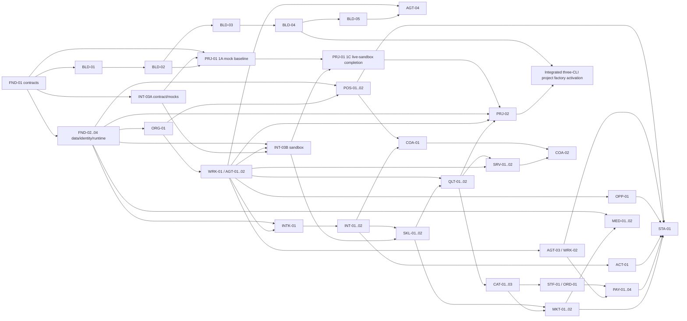

# 完整交付、拆工、測試與上線計畫

> 狀態：現行 canonical baseline（2026-09-19 低維運互惠修訂）；planning 文件，不代表已部署。

日期：2026-09-17

## 1. 交付結果

交付目標不是做出八個空選單，而是讓以下四條閉環在 production-like 環境可重複運作：

1. `PEOPLE`：登入 → 定位（2026-09-23 起新註冊必填，取代舊 optional 入口）→ 本人確認方向及主力／次要 Guild → 領取技能書 → Work Feed → 完成 Result → Now/Next/Gained。完整 CareerProfile／WorkIntent、Agent equipped Skill 屬分階段實作，不與會員「裝備＝工具／訂閱」混用。
2. `BUILD`：規格 → WorkItem → GitHub Issue → 人／Agent claim → fork/branch/PR → checks → Grok adversarial review → Claude verification → module release → ContributionRecord。
3. `AI-BUSINESS`：開源 asset → SkillPackage／Product Candidate → unpaid community QC → CommercialEdition／ServiceEngagement → Vibe＋Field＋Project assignments → proposal／delivery／support → Squad 自訂收益分配；三個不同自然人的 evidence 只控制 `commercial-ready`。
4. `COMMERCE`：SupplierOffer → SellerListing 價格 → Supplier 接受 → fork Store → 單一 Seller checkout → Seller 收款 → 自動 settlement → Supplier 履約 → refund/reversal/reconciliation。

Marketing 與 editing 是 `AI-BUSINESS`／`COMMERCE` 的放大器：canonical source facts → 草稿／剪輯 → 成員的 bounded grant／exact A4 → 發布 → attribution／成效 → 下一個工作建議。平台自身對外正式發布由 Ted 對 exact release 一鍵 A4。

## 2. 規劃假設與容量

### 2.1 五人核心團隊基準情境

核心團隊由 Ted、Hao、Mini、Jason、韋銘與 AI 共同建立完整形狀；Ted 負責 infra、platform、設計與建置並在 Day 1 一次建齊，不等待共同閱讀或其他 holder。Hao 是行銷長才、community leader 與精神領袖，負責 growth、media 與 member／community；Mini 負責 delivery PM、product quality／supply 與 commerce。
Jason 負責 Talent & Direction（定位＋陪跑）、coordination、Opportunity／Project／Squad／Work 流程，韋銘負責 dev implementation 與非作者時的獨立 QC。Grok 執行 adversarial review、Claude 執行 verification，自動 checks 驗 schema、tests、security、docs 與 contract impact。以上分工都是建議預設，在一次性的五人共同閱讀時確認；確認後各自 own track，不設固定會議或人員等待點。

| 執行配置 | 工作方式 | 時程語意 |
| --- | --- | --- |
| 五人核心團隊＋AI | 所有工作流同時拆成可執行 WorkItems，依技術依賴建立完整形狀；五人按 §3 分頭執行 | 現行基準；不承諾日期 |
| 五人核心團隊＋AI＋4–7 位穩定實作者 | 建議預設 2 個額外平行 delivery tracks；核心團隊 owner 帶領高互動與領域工作 | 40–52 週以上是建議預設，不是停止條件 |
| 五人核心團隊＋AI＋8–13 位穩定實作者 | 建議預設 3–4 個額外平行 delivery tracks | 28–36 週是建議預設，不是里程碑條件 |
| 五人核心團隊＋AI＋14–22 位穩定實作者 | 建議預設 5–7 個額外平行 delivery tracks | 20–24 週是建議預設，不是里程碑條件 |

人數只調整 throughput。identity isolation、QC versioning、payment verification、ledger reversal、idempotency、signature binding、reconciliation 與所有已列功能均保留；外部帳號／API 尚不存在時，先完成 contract、fixture、deterministic mock 與不依賴該資源的工作。

部分 package／工作卡可包給外部實作者：前提是卡上已有 contract、mock／sandbox、tests 與 AI review 路徑，並列核心團隊 owner、implementation（人＋Codex）、reviewer（Grok）、verifier（Claude）及 acceptance（標籤／evidence）。O1 帳號建立、keys／custody、Ted 的付款／法律文件／對外正式發布三類 A4、production release 與 billing 不外包。外包卡 owner 的分配是建議預設，在五人共同閱讀時確認；不影響 Ted 的 Day 1 執行。

### 2.2 Foundation Day 1 外部工作

`08 §13` 是唯一 Foundation Day 1 runbook。Ted 的 O1 Day 1 不等待任何人；Ted 同次買齊 O1，並以第一個 Seller 身分自持 Seller lane。Freedom 品牌 O2 是 Hao 的獨立 lane，可在 Day 1 或之後任何時間建立，不阻擋 O1、Seller lane 或任何其他工作；Hao 當日不便時，Ted 可用品牌名義先開，並在同日把 owner／admin 交給 Hao，帳號始終在品牌名下，不是 Platform 資產。AI 在各帳號 owner 完成登入後執行全部可自動化設定。帳號存在不表示功能上線，本文不宣稱下列項目已購買、已建立、已部署或已上線：

- O1：GitHub organization／GHEC／App、Cloudflare 全套含 Workflows、PostgreSQL、KMS／HSM signing planes、密碼管理器、LINE Login＋OA、Discord server／bot、transactional email、監控、e-sign＋A4 evidence archive、R2、平台自用 AI／render quota 與 vendor billing identity。
- O2：第一家 Store 的 `SellerParty` 建議預設為 Ted（可改為五人中任一人），由 Ted 建立 Seller-owned 綠界 ECPay sandbox 與 Seller-owned Store origin；Freedom 品牌 X／Meta／YouTube `ChannelConnection` owner 建議預設為 Hao。分工在五人共同閱讀時確認，Ted 的 Day 1 不等待確認。
- O3：其他 Seller provider、成員 repo、BYOK key、Squad storage 與 coach 收款由各 owner 自有，平台不採購。
- 首批 3–5 個實體／第三方商品、2–3 個開源軟體、2–3 個 AI implementation／professional-service opportunities 都是建議預設 seed 數量；不足不改 scope，也不阻擋其他工作。
- GitHub break-glass co-owner 建議預設為 Mini，Cloudflare 第二 Super Administrator 建議預設為 Jason；Day 1 邀請寄到各自既有、可獨立恢復、非 Freedom domain 的 email，接受與否只控制 `recovery` 標籤。分工在五人共同閱讀時確認。

外部 resource 是相應 API 真接線的技術依賴；缺少時 deterministic mock 與其他工作照常。production 與 staging resources 同日建立，production 維持零 public traffic，直到 Ted 對 exact release 一鍵 A4。

## 3. 組織 ownership 與分頭開發

### 3.1 Guild 與 module stewardship

Guild 是長期縱向職業線；Squad 是為 Project 組成的橫向交付隊。每個模組有一個 `ModuleStewardship` 與一個 accountable Guild Master office。下表分工全部是建議預設，在五人共同閱讀時確認；Ted 的 Day 1 建置不等待確認。Master 不必親自 code，但要負責設計、人力、訓練、Master Skills、delegate pool、方向與 major product decision。

| 模組／共同核心 | Accountable Master／Guild | 建議預設 holder（五人共同閱讀時確認） | 固定協作 Guild |
| --- | --- | --- | --- |
| 定位＋陪跑 | Talent & Direction Guild Master | Jason | Member Operations、各接收 Profession Guild |
| 貨品上架／Supplier／實體 QC | Product Quality & Supply Guild Master | Mini | Commerce、Marketing、Field |
| 電商／Storefront／Distribution | Commerce & Sales Guild Master | Mini | Product & QC、Settlement、Marketing |
| 自動行銷 | Growth & Marketing Guild Master | Hao | Commerce、Project、Field |
| 自動剪輯 | Media Automation Guild Master | Hao | Marketing、Vibe |
| Skills／開源軟體／商業化 | AI Vibe Guild Master OfficeAssignment holder 為單一 accountable steward | Ted | AI Vibe、AI Field、AI Project 三 Guild；Product Council consulted |
| 會員／組織／status | Member & Community Operations Guild Master | Hao | Talent、Platform Engineering |
| Opportunity | Opportunity & Partnership Guild Master | Jason | AI Project、Commerce、各行業 Profession Guild |
| Platform／Agent Control／Contracts | Platform Engineering Guild Master | Ted | Vibe、Security/Operations |
| Settlement／ledger | Commerce Settlement Guild Master | Ted | Product & QC、Finance/Ops |

Open AI Product & Skills Division 由 AI Vibe、AI Field、AI Project 三個 Profession Guild 組成；三個 Guild 的當期 Guild Master OfficeAssignment 持有人共組 Product Council，不新增第四層長官。`commercial-ready` 三個 assignment 的建議預設是 Vibe＝韋銘、Field＝Jason、Project＝Mini，在五人共同閱讀時確認；三個不同自然人的 active assignments 成立時 `commercial-ready=true`，否則維持 false，而工作、candidate、sandbox、staging、內部 demo 與發布準備照常。

Hao 在本分工中的角色描述是「行銷長才、community leader 與精神領袖」。

規則：Guild Master 是 office；Vibe／Field／Project 是每個產品各自的 `ProductRoleAssignment`，三者必須由不同自然人承擔。Ted 擔任 AI Vibe Guild Master 不與產品角色衝突，也可另在某產品自任 Vibe；該產品此時的三人即為 Ted／Jason／Mini。建議預設：平台自身軟體的 Vibe＝韋銘、Field＝Jason、Project＝Mini。

### 3.2 建議 delivery tracks

| 建議預設 holder（五人共同閱讀時確認） | Delivery tracks | 主要 repo／目錄 | Outcome |
| --- | --- | --- | --- |
| Ted | Foundation & Contracts；Platform／Agent Control；Settlement & Ledger；AI Vibe／Skills／OSS | `freedom-platform` contracts、identity、DB、integration、agent-control、settlement、registry | identity/event/job/signature spine、三 CLI control 與 settlement evidence |
| Hao（行銷長才、community leader 與精神領袖） | Growth & Media；Member & Community Operations | portal、marketing、media、growth repo、Discord／LINE | source-locked publication／clip 與 community evidence |
| Mini | Delivery PM；Open Product Quality & Supply；Commerce & Storefront | milestones、spec-index、acceptance-matrix、quality、commerce、storefront | delivery evidence、candidate→QC 與 one-Seller commerce evidence |
| Jason | Talent Journey；Coordination；Opportunity／Project／Squad／Work；Partnership | positioning、coaching、opportunity/work、project factory、WorkItem routing | free knowledge／paid time 邊界、日常派卡、claim→result 與 opportunity evidence |
| 韋銘 | Dev implementation；non-author official QC | 各 package repo／目錄與 implementation WorkItems | packages 與 Codex 配對實作、獨立 QC evidence |

同一人可在不同時間以不同 `ProfessionMembership`／acting profession 參與多個 Squad；WorkItem 必須記 acting role。平台自身建置不等待真人 reviewer：Grok adversarial review、Claude verification 與自動 checks 形成 review evidence。產品語意中的獨立自然人與 A4 signer 仍按 principal 判斷，換 Agent 不算換人，且不同自然人 evidence 只控制相應標籤。

### 3.3 AI review 與 exact A4

| 變更／action | 執行與 review | A4／標籤語意 |
| --- | --- | --- |
| module journey/domain、contracts／IDs／events、routine software PR | owning track執行；Grok adversarial review＋Claude verification＋自動 checks | 不等待真人 review；對外正式發布時由 Ted 對 exact release 一鍵 A4 |
| 平台採購或 billable action | AI 準備 exact quote、scope、diff 與 evidence | Ted 對付款一鍵 A4 |
| 法律文件、稅務／發票／客戶正式承諾 | AI 整理材料，不替人作法律決定 | Ted 對 exact 法律文件一鍵 A4 |
| official software／Skill QC、physical／third-party product QC | AI preflight／test／decision draft與 Grok／Claude review 不變；成員 QC 流程保留；具名獨立 reviewer 是五人中非作者的任一人，建議預設為韋銘，韋銘是作者時改由 Mini 或 Jason | 具名獨立自然人的 exact signature 只更新 `official`；缺少時 candidate 工作照常 |
| production signing custody | A／B technical planes 與 C offline plane 照常建立；custodian 建議預設為 A＝Ted、B＝Mini、C＝Jason，五人共同閱讀時確認 | Ted 與 Mini 的 custody evidence 控制 `production-signed`；缺少時建置照常 |
| commercial readiness | Guild Master office 不算產品角色；每個產品的 Vibe／Field／Project `ProductRoleAssignment` 必須是不同自然人。平台自身軟體建議預設為韋銘／Jason／Mini；Ted 可另自任 Vibe，此時改為 Ted／Jason／Mini | 三個具名不同自然人的 assignment evidence 只更新 `commercial-ready`；缺少時工作照常 |
| Seller price／supply terms | Seller／Supplier處理 | 雙方對 exact revision 的成員 A4 維持不變 |
| paid ServiceEngagement 分配 | Project Squad處理 | 參與人對 exact `EngagementAllocationPlan` 的成員 A4 維持不變 |
| `SettlementMandate` | 系統驗 bounds、cap、connection、idempotency 與 reconciliation | Payer 當事人對 exact `SettlementMandate` digest 的成員 A4維持；`authorized_mandate`另需 Ted 對同一 digest 的付款類一鍵 A4，缺一維持`record_only` |
| public campaign | Marketing contributor／Agent依 policy執行 | 成員以A3 grant或exact A4控制內容發布 |
| 平台自身對外正式 release | Release Captain 準備 candidate；AI review 完成 | Ted 對 exact candidate 及 consequences 簽發布類一鍵 A4 `ReleaseApproval` |
| 成員 `ProjectRelease` | 當事成員準備 exact release；系統驗證 project／release contract；見 `02 §9`、`11 §4` | 當事成員對 exact digest 簽成員 A4 |

軟體／Skill 的一般社群 review 不收費；它是 Field 熟悉度與未來 FAE／support／implementation 機會的證據。客戶帶來 funded testing、funded review、funded development 時建立獨立 `ServiceEngagement`，費率與分配由該 Squad 談，不由平台寫死公式。

## 4. Stable work packages

### 4.1 Foundation、組織與 Agent

| ID | 交付 | 依賴 | Owner Squad |
| --- | --- | --- | --- |
| FND-01 | glossary、canonical IDs、error catalog、OpenAPI/event/state schemas、XP policy schema／fixture | 無 | Foundation |
| FND-02 | PostgreSQL schemas、migrations、transactional outbox/inbox、leased jobs | FND-01 | Foundation |
| FND-03 | provider-neutral User/session、ExternalIdentity、capability、audit | FND-01/02 | Foundation |
| FND-04 | secrets、credential broker、object storage、observability、backup/restore | FND-02 | Foundation |
| FND-05 | EntityPlaybookVersion、per-instance readiness、stable item resolver與missing→WorkItem | FND-01/02, WRK-01 | Foundation/Agent |
| FND-06 | canonical entitlement keys／conditions、A4 named-application boundary與contract consistency tests | FND-01 | Foundation & Contracts |
| ORG-01 | Division/Guild/Profession/Rank/OfficeAssignment/ModuleStewardship | FND-03 | Foundation；Hao（建議預設，五人共同閱讀確認） |
| ORG-02 | equipped Skills、availability、本人可直接自述並確認的 WorkIntent 與 Guild directory | ORG-01 | Talent/Agent；Jason（建議預設，五人共同閱讀確認） |
| ORG-03 | Guild lifecycle/create/update、private-channel readiness slot、ProfessionStarterTrack與per-membership progress | ORG-01/02, FND-05 | Organization/Community；Hao（建議預設，五人共同閱讀確認） |
| WRK-01 | Opportunity/Project/Squad/WorkItem/Claim/Result；review-required publish的capacity導航 | FND-02/03, ORG-01 | Agent Workflow |
| AGT-01 | WorkContextBundle、AgentConnection、AgentRun、TaskLease、source-bound local verification receipt／failure provenance | WRK-01 | Agent Workflow |
| AGT-02 | A0–A3 ExecutionGrant、A4 exact digest Signature／bounded mandate、ActionIntent、Provenance | AGT-01 | Agent Workflow |
| AGT-03 | daily Work Feed、matching reasons、approve all/some/skip、Now/Next/Gained、profession／track XP projection | ORG-02, AGT-02 | Agent Workflow |
| AGT-04 | `freedom-agent-kit` MCP facade＋Claude/Codex/Grok Platform adapters | AGT-01/02, BLD-04/05 | Agent Workflow |
| AGT-05 | `agent.bootstrap.read`、day-one A0–A2 standing grant模板與grant instantiation | AGT-01/02, ORG-02 | Agent Workflow/Security |
| WRK-02 | Platform-native Draft/Diff/Review/Apply for non-code artifacts | WRK-01, AGT-02 | Agent Workflow |
| ONB-01 | rebuildable day-one journey、welcome ritual、Strategist/Master typed cards與deterministic stuck assistance | FND-05, ORG-03, SKL-03, AGT-05, WRK-01 | Talent/Agent/Community；Jason（建議預設，五人共同閱讀確認） |

#### 4.1.1 特定 packages 的階段與驗收

| ID | 階段 | 必須交付 | 可驗收結果 |
| --- | --- | --- | --- |
| `FND-05` | 1A contract；1B projection/API | `entity-playbook.schema.json`與fixture、version/hash、stable item ID、resolver、missing WorkItem template、逐item/status/readiness `enforcement`；第一批Guild／Profession starter／CoachingProgram／Seller Store／SkillPackage profile | 五種fixture皆可解析並重建相同readiness；missing navigation item重送只得一張claimable WorkItem；navigation缺項不造成403、不改visibility/entitlement/discoverability；action_gate負例只接受工程安全、金錢完整性、official/sellable QC、A4 exact artifact四類 |
| `FND-06` | 1A | 八個canonical entitlement keys及取得條件、`01 §12`↔catalog exact-set test、A4 named-application白名單／負例、D1三支mutation request/response/error schemas | Key集合精確為`community.member`、`opportunity.claim.basic`、`skill.submit`、`qc.review:<scope>`、`seller.list`、`store.deploy`、`coaching.offer`、`module.delegate:<scope>`；rules ack不擋一般互動，WorkIntent不做人身claim資格；self-join/equip/submission/low-risk Work/Master welcome皆不要求A4；OpenAPI無dangling ref |
| `ORG-03` | 1A contract；1B Guild commands；1C starter UX | Guild `draft→active↔degraded→archived`、Board/Ops create/update、目錄new-line WorkItem、private Discord navigation slot、versioned starter track與per-membership progress | Guild可在private channel missing時active；既有Guild self-join直接Runner且無`pending_master`；一般會員的新Guild需求只建Board WorkItem；starter每項可skip／替代evidence／materialize WorkItem，沒有completion rate/admission score，未完成仍可進Feed與claim |
| `SKL-03` | 1B contract/fake receipt；1C CLI adapter | `MemberSkillInstallation` scope/state、A1 deterministic receipt、health/outdated、remediation與精確install events；刪除孤兒adoption event | 同一member＋connection＋version冪等；wrong connection/version/fence拒絕該receipt；pass/fail/degraded/outdated fixtures可重建；fail只產生Next/help/WorkItem，membership／entitlement／discoverability不變；測試證明不能以package capability readiness、equip或AgentRun冒充verified |
| `AGT-05` | 1B | Connection-only `agent.bootstrap.read`與`day1.learn-equip-and-claim`模板；≤72h、單profession、starter package、first low-risk WorkItem、可撤 | Connection token只讀本人最小Status／Feed，A1–A3無grant皆拒絕；模板無法加入A3/A4/payment/contract/QC/release或未指定resource；一次同意後agent可preflight/equip/verify/claim/checkpoint；revoke後新動作停，grant receipt不能作A4 signature |
| `ONB-01` | 1B transaction/projection；1C automation E2E | stable-key onboarding bundle、八步journey、profession-confirmed welcome A0/A1/system steps、one-line optional answer、四種typed support card、三種stuck detector | Bundle同key同body回同一membership/WorkIntent/equip/refs，不同body 409、stale expected version 412且零partial write；定位skip可走完整路；welcome未完成仍可學／提交／claim；routine卡先到Strategist/delegate，Master只收major-version/rule/dispute/succession；所有卡略過零後果；三種stuck各顯示Next、替代路、optional help並不revoke或降discoverability |

### 4.1.2 Bootstrap、共同 Skill 與 project factory

這些不是`AGT-04`或`SKL-01`的隱含工作；它們先建立大家都從同一份plan／contracts／Skill開始build的供應鏈，`AGT-04`再接Platform MCP／登入／work APIs，`SKL-01/02`再提供一般社群Skill registry產品功能。

| ID | 交付 | 依賴 | Accountable Squad | Consulted／review evidence | 階段 | 可驗收結果 |
| --- | --- | --- | --- | --- | --- | --- |
| BLD-01 | 正式`ContractBundle`＋derived `FreedomPlanBundle` publisher；唯一authoring source、normalized file-list/JCS digests、byte-identical contracts snapshot與immutable release sidecars | FND-01 | Foundation & Contracts | Platform Engineering Guild＋release authority | 1A | Publisher-independent reference implementations與golden/negative fixtures產生同digest；PlanBundle contracts subtree逐path/bytes等於exact ContractBundle；planning scaffold無法被production channel pin（跨三CLI activation留給BLD-04） |
| BLD-02 | Canonical `freedom-build-system` package：hashed `freedom-skill.yaml`＋`SKILL.md`＋scripts/references/assets；先固定bootstrap、new/fork、preview、release、deploy/reconcile的routing／stable adapter interface與人工停點，實際project lifecycle implementation唯一屬PRJ-01，尚未提供時adapter明確fail `capability_unavailable`且不得執行雲端寫入 | BLD-01 | Open Product & Skills | Agent Workflow＋Platform Engineering Guild | 1A | Package schema、entrypoint exists/digest、path traversal、secret/authority、A4 pause與unavailable-adapter fail-closed tests通過；publisher-independent golden parsers對同一package產生同一bytes/digest（尚不宣稱三CLI已安裝或project lifecycle已可執行） |
| BLD-03 | Deterministic channel publisher：pinned resolver、immutable registry snapshot、exact dependency closure、四bundle digests、monotonic sequence、bootstrap index、signing/revocation | BLD-01/02 | Foundation & Contracts | Security/Operations＋release authority | 1A–1B | Mutable registry在簽後新增版本不改activation；range/cycle/conflict/prerelease/build ambiguity、channel/revocation minimum mismatch、fresh-install superseded-head replay、removed-old-policy新簽、key effective-boundary、rollback、revoked key/package均fail closed。無私鑰coordinator產生deterministic candidate；兩個不同deploy/admin credential與custodian的automated signer runtime各只能使用一把non-exportable key、各自驗append-only journal/high-water後簽同一digest，第三把key離線保管；quorum outage不降成1-of-N。未選定能成立此隔離的production KMS/runtime並通過rotation／compromise／journal-equivocation演練前，只可發布non-production channel |
| BLD-04 | Package外minimal installer、safe extraction、flat read-only content-addressed cache、launcher-only atomic pointer、live-session lease/GC、per-run isolated discovery namespace與immutable root；三個CLI adapters。BLD-03 owns producer/channel/key/revocation contract；BLD-04 owns activation/cache/adapter consumer contract | BLD-03 | Agent Workflow | Foundation & Contracts＋Security/Operations | 1A contract；1B implementation | 1A以schema、typed network profile、adapter interface、lease/GC、isolation/path fixtures及owner-label evidence定版但不宣稱已安裝；1B同一exact signed bootstrap index及其current channel/revocation heads＋同一active policy/chain在三CLI得到同一八輸入activation digest；native loader長連線反覆讀SKILL/reference/script/dependency時N與N+1不混bytes。Host candidates、unsafe archive、path-profile、missing/extra file、old/forked head、network cap邊界及revocation fixtures拒絕；pointer-read到durable lease持同一global lock，GC對active pointer與持鎖live leases做mark/sweep，TOCTOU/crash/rename/re-read、10 GiB cache／1 GiB reserve／64 leases／16 roots邊界fixtures不刪reachable bytes。新activation失敗只保留原pointer；每個新session仍重驗current exact heads，不掃cache或自動回退 |
| BLD-05 | Signed domain Skill runtime overlay：在既有control activation外另簽exact domain roots、runtime-scope QC、current publisher authority／revocation、`runtime_roots_set_digest`與per-run sealed loading；`domain_skill_runtime_mode`保留eligibility-only預設並新增signed isolated mode | BLD-01/03/04；1B live path另需FND-02/03、AGT-01/02 skeleton | Agent Workflow | Open Product & Skills＋Foundation & Contracts＋Security/Operations＋runtime QC reviewer pool | 1A contract；1B implementation | 1A凍結`domain-skill-overlay.schema.json`／example、roots-set JCS公式、2-of-N proof、QC independence、revocation／expiry、mode flag、cache／session layout與三adapter fixtures；1B至少一個無外部副作用domain Skill在Codex／Claude／Grok走完`eligibility-only → signed overlay → revoke → capability_unavailable`。Server-derived WorkItem refs與signed roots exact-set相等；既有八輸入control activation digest不變。Missing／extra／reordered root、package／closure／QC digest mismatch、self-review、expired index／overlay／revocation、revoked root/key、case-fold／host shadow、mid-run update與unsupported isolation均零domain execution／consequential effect；production signer/KMS技術證據未成立時不得宣稱production runtime |
| PRJ-01 | `freedom.project.yaml` validator、GitHub semantic checker、full-SHA central required workflow、strict Pages generator及`gh`＋`wrangler` project lifecycle command implementations；BLD-02只包裝這些stable interfaces | FND-01, BLD-02, INT-03A；1C live-sandbox completion另需INT-03B | Open Product & Skills | Foundation & Contracts＋Platform Engineering Guild | 1A mock；1B skeleton；1C sandbox | 1A用INT-03A deterministic mocks驗managed original、external fork、template、fork-promotion、private-withheld及new/fork/preview/release/deploy/reconcile dry runs；1B保留同一contract與command implementation skeleton；1C再以INT-03B GitHub App真實sandbox重跑；Pages格式／brand path／canonical backlink固定，fork永不繼承official；BLD-02 adapter對exact command contract互通 |
| PRJ-02 | Exact A4 release publisher、public fail-closed live-status API、ProjectStatusAttestation signer/revocation/reconciliation與Pages widget | PRJ-01, FND-02/04, AGT-02, QLT-01 skeleton | Foundation & Contracts | Open Product & Skills＋release authority＋Security/Operations | 1B–1C | Candidate→A4→immutable Release→same-artifact deploy→attestation全鏈；expired/revoked/superseded/mismatched/offline均顯示Unverified且不可由repo自報Official |

### 4.2 People 與 community

| ID | 交付 | 依賴 | Owner Squad |
| --- | --- | --- | --- |
| POS-01 | versioned deterministic assessment core、`ai-online` golden parity | FND-01/02/03 | Talent；Jason（建議預設，五人共同閱讀確認） |
| POS-02 | `GuidedDiscoveryRun`、unified positioning-card schema、CareerProfile/WorkIntent confirmation | POS-01 | Talent；Jason（建議預設，五人共同閱讀確認） |
| COA-01 | free knowledge paths、program/checkpoints、Guild handoff | POS-02, ORG-01, WRK-01 | Talent；Jason（建議預設，五人共同閱讀確認） |
| COA-02 | paid human-time booking／ServiceOffer refs、coach workbench | COA-01, SRV-01 | Talent；Jason（建議預設，五人共同閱讀確認） |
| INTK-01 | Canonical SubmissionDraft aggregate＋Portal inbox；typed create/get/confirm/reject、owner/org-operator authorization、source／HTTP idempotency、privacy/retention與local Agent document-reference adapter。External document confirm只acknowledge saved exact ref/revision/digest、不得fetch或聲稱current verification；Document WorkItem綁exact requirement，OpportunityStub不授予Agent access；之後bound local Agent才驗exact revision並記success／known-failure receipt | FND-02/03, WRK-01, AGT-01 | Agent Workflow＋Community |
| INT-01 | LINE Login／Messaging adapter、delivery status、deep links與verified LINE→SubmissionDraft source adapter | FND-03/04, INTK-01 | Community |
| INT-02 | Discord bot、Guild/channel/thread bindings、study-group入口與verified Discord→SubmissionDraft source adapter | FND-03/04, ORG-01, INTK-01 | Community |
| INT-03A | GitHub API/webhook contract、stable-ID semantic facts、deterministic mock server與repo/fork/release fixtures；沒有live credential | FND-01 | Community & Migration |
| INT-03B | GitHub App sandbox、repo bindings、Issue/PR/review/release sync | FND-03/04, WRK-01, INT-03A | Community & Migration |
| ACT-01 | canonical Activity、guest/session、round/timer、Lounge strangler | FND-02/03, INT-02 | Community |

### 4.3 Open products、Skills、QC、service

| ID | 交付 | 依賴 | Owner Squad |
| --- | --- | --- | --- |
| SKL-01 | SkillPackage manifest、registry validator、GitHub import candidate | FND-01, INT-03B | Open Product |
| SKL-02 | version/maintainer/reviewer/discussion/study group、run evidence | SKL-01, INT-02 | Open Product |
| SKL-03 | member＋AgentConnection＋PackageVersion實裝狀態、A1 receipt、health/outdated與failure→WorkItem | SKL-01, AGT-01/02, FND-05 | Open Product/Agent |
| QLT-01 | ReviewProtocol、ReviewerAppointment bootstrap、Candidate、preflight、version-scoped human QC | FND-01/02, WRK-02, ORG-01 | Open Product/QC |
| QLT-02 | official listing readiness、reviewer independence、review retraction／projection invalidation、re-review triggers | QLT-01, SKL-01 | Open Product/QC |
| SRV-01 | CommercialEdition、ServiceEngagement、SOWVersion、milestone、acceptance、support | SKL-01, WRK-01 | Open Product |
| SRV-02 | EngagementAllocationPlan、three-profession completeness、delivery evidence | SRV-01, ORG-01, AGT-02 | Open Product |
| OPP-01 | private OpportunityStub、external refs/privacy、Squad invitation | WRK-01, ORG-01 | Agent/Opportunity |

### 4.4 Catalog、Store、付款

| ID | 交付 | 依賴 | Owner Squad |
| --- | --- | --- | --- |
| CAT-01 | SupplierParty、Product、SupplierOfferVersion、QC link | FND-02/03, QLT-01 | Commerce/QC |
| CAT-02 | `SellingArrangement`、SellerListingRevision、MSRP/recommended-floor guidance | CAT-01 | Commerce |
| CAT-03 | DistributionAcceptance（accepted snapshot 即供貨承諾）、future revoke、SupplyReservation、inventory/expiry | CAT-02, AGT-02 | Commerce/QC |
| STF-01 | Store/Seller binding、master-store template、catalog SDK | CAT-03, FND-01 | Commerce |
| ORD-01 | one-Seller Cart/BuyerOrder、per-Supplier SupplyOrder、fulfillment | STF-01 | Commerce |
| PAY-01 | SellerCollectionConnection、PayerDisbursementConnection、BeneficiaryPayoutDestination與provider-neutral ports | FND-04, ORD-01 | Commerce |
| PAY-02 | verified PaymentFact、refund/chargeback、daily reconciliation | PAY-01 | Commerce |
| PAY-03 | `record_only|authorized_mandate` mode flag、SettlementMandate、atomic UsageReservation、typed Instruction、TransferJob、provider initiation／manual-required | PAY-02, AGT-02 | Commerce |
| PAY-04 | supplier receipt→FulfillmentAuthorization、dispute、reversal/netting | PAY-03 | Commerce |

### 4.5 Growth、media 與 status

| ID | 交付 | 依賴 | Owner Squad |
| --- | --- | --- | --- |
| MKT-01 | Campaign/Brief/SourceSnapshot/fact-locked content/template | SKL-01, CAT-02 | Growth |
| MKT-02 | review/schedule/channel adapters/idempotent publication/metrics | MKT-01, AGT-02, FND-04 | Growth |
| MED-01 | secure MediaAsset ingest、lifecycle、transcript/edit proposal | FND-04 | Growth/Media |
| MED-02 | timeline/render/caption/multi-format/provider reconcile/quota | MED-01, MKT-01 | Growth/Media |
| STA-01 | Now/Next/Gained/Needs attention projections＋rebuild | domain events | Foundation/Agent |

### 4.6 D1–D6 併入既有 package 的驗收增量

現行 package ID 不新增、不重編。下列條件直接納入既有 package acceptance；自然人、office與assignment refs只形成標籤 evidence，缺少時相應標籤為 false，candidate、sandbox、staging、內部 demo 與其他工作照常：

| 既有 package | 追加 acceptance |
| --- | --- |
| `FND-01`＋`AGT-03` | `xp-policy.schema.json`／example、OpenAPI兩個GET與三軌closed-set通過；projection整表刪除後只由ContributionRecord＋review outcome重建相同，每列有`policy_version`／`rebuilt_from_event_seq`，無跨profession total，且負例證明不能作entitlement／rank／appointment／A4輸入 |
| `ORG-01`＋`QLT-01` | 現行每筆ReviewerAppointment的appointer逐筆解析到 Ted 或其 scoped office holder／delegate；`qc.review:<scope>`只由有效exact-scope appointment取得，高XP／Master／換Agent負例全部拒絕；submitter與reviewer為不同自然人時`official=true`，否則維持 false |
| `QLT-02` | `accepted→retracted`追加歷史；AI checks與有效exact-scope appointment照常驗證。原reviewer以自己的有效appointment對exact retraction digest簽A4；非原reviewer發動時，另需第二位不同自然人的有效appointment與對同一digest的A4同意，單一非原reviewer不追加retraction。獨立自然人evidence缺失只使`official=false`，不影響candidate、sandbox、staging或內部demo；rebuild後該結果不進XP、matching priority、entitlement，舊receipt回`receipt_superseded_by_retraction` |
| `WRK-01`＋`OPP-01`＋`QLT-01` | `review_required=true`且scope無有效appointment時仍維持`open`／published candidate、`official=false`；正交於WorkItem lifecycle的穩定導航狀態ID為`waiting_reviewer_capacity`，並冪等建立Council support card。AI review與自動checks照常，容量出現後只更新review route、導航狀態、卡片與標籤evidence，不改寫WorkItem lifecycle |
| `WRK-01`＋`AGT-01/02` | invite／claim `expires_at`、delivery `due_at`、TaskLease／lease proof 同物件的 `expires_at`＋`fencing_token`、`ExecutionGrant.expires_at`、evidence `valid_until`各有setter／expiry／extension負例，任何共用欄位或外部timestamp代用都拒絕 |
| `PAY-03/04` | `record_only`永遠可用且只顯示「已記錄」；`money_movement_enabled=false`時即使有mandate也不建可執行TransferJob；`authorized_mandate`需Payer 當事人對exact `SettlementMandate` digest的成員A4＋Ted對同一digest的付款類一鍵A4，且mandate屬於該Seller、active並符合cap、idempotency與reconciliation invariants，缺一維持`record_only` |

每條 profession line 在 `ORG-01/03` launch fixture 與 `WRK-01/QLT-01/OPP-01` acceptance evidence 中保存三類供給責任標籤：

| 供給來源 | 標籤 evidence | 對應 package／可驗收結果 |
| --- | --- | --- |
| 訓練 | `training_supply_owner_user_ref`（Talent & Direction或該Guild delegate） | `ORG-03`：至少一個可重現starter／practice WorkItem、回饋與下一步；owner與代理路徑可查 |
| 維護／社群 | `maintenance_supply_owner_user_ref`（ModuleStewardship maintainer） | `WRK-01`：至少一個真實bug／文件／test／Skill修訂需求；不是空白示範卡 |
| 真實需求／商業案 | `real_demand_supply_owner_user_ref`（Opportunity & Partnership＋對應AI Project／Commerce holder） | `OPP-01`：至少一個已同意進件、具scope／責任方／交付者與official-label evidence route的入口 |

任一責任 label evidence 缺失時，該 profession line 的 `supply-ready=false`；這不阻擋會員加入、學習、candidate貢獻或其他 profession。所有 `review_required` seed WorkItem 即使尚無ReviewerAppointment capacity仍維持 `open`／published candidate，並使用正交於WorkItem lifecycle的穩定導航狀態ID `waiting_reviewer_capacity`，建立navigation support card與`official=false` evidence。

## 5. 依賴與平行路徑



Critical paths：

- `FND → ORG/WRK → AGT → GitHub sync` 是 AI-first 開發與大規模派工底座。
- `FND-01 → BLD-01/02`之後分成`BLD-03/04 → BLD-05`供應鏈／installer／domain overlay與`INT-03A mocks + PRJ-01 1A baseline`兩條可平行路徑；階段 1B 的`FND-03/04 + WRK-01`建立 skeleton，階段 1C 以`INT-03B sandbox`完成PRJ-01 live-sandbox驗收，PRJ-02後於three-CLI project-factory activation seam匯合。BLD-02只定stable adapter contract，不重做PRJ-01的lifecycle implementation；BLD-05只增加經簽章、QC、撤銷與隔離的domain roots，不改既有control activation。這些自舉底座都不得延後藏進一般adapter backlog。
- `QLT → CAT → Supplier acceptance → Store/Order → Payment/Settlement` 是真實商品閉環。
- `SKL → QLT → CommercialEdition/ServiceEngagement` 是 AI product／implementation 收益線。
- Positioning、Lounge migration、provider adapters、seed content 與 contracts 可同時開始，不必等整個 control plane 完成。

## 6. 階段、建議工期與 evidence

Foundation Day 1 依 `08 §13` 同次建立 O1／O2 所需帳號與 production／staging resources；本節描述其後的交付結構。順序只由 API、resource、schema 與 state 等技術依賴決定。週數皆是五人核心團隊容量下的建議預設，可因吞吐、外包量與 provider lead time重估；標籤或 evidence 缺失不停止無關工作。本文所列產品／營運／真人測試仍待跑；契約 fixture 靜態檢查見 verification/2026-09-19-revision-check.md，本機 scoped runtime milestone 見 [`docs/releases/2026-09-20-local-core.md`](../releases/2026-09-20-local-core.md)。不宣稱完整 package 或 milestone 完成。

### 階段 1A：契約凍結（建議預設第 1–2 週）

Outcome：所有團隊與三種 CLI 使用同一份可機讀 contract、ID、event、state、package、repo、runtime 與 acceptance 語言；planning fixture 不被誤認為 production artifact。

包含 packages：`FND-01`、`FND-05`、`FND-06`、`ORG-03`、`SKL-03`、`AGT-05`、`ONB-01`、`BLD-01`–`BLD-05`、`PRJ-01`、`INT-03A` 的 contract／fixture 部分。

交付內容：

- 固定 glossary、canonical IDs、OpenAPI／event／state schemas、repo layout、contract version policy、EntityPlaybook、八個 entitlement keys、A4 邊界、Guild lifecycle、Profession starter、MemberSkillInstallation、day-one grant、onboarding bundle與support cards。
- 建立正式 `ContractBundle`／derived `FreedomPlanBundle` publisher、hashed canonical `freedom-build-system` package、deterministic channel／revocation contracts、minimal installer、three-CLI adapters、signed domain overlay與project lifecycle stable interfaces。
- 固定 `freedom.project.yaml`、project-status attestation、GitHub semantic facts、fork／template distinction、generated page、environment／release policy與fail-closed status derivation。
- 把56 packages與acceptance匯入`Platform Build Program`／WorkItems；Platform DB skeleton存在前以受控YAML與GitHub Issue作bootstrap source，之後單向冪等匯入。
- 保存`ai-online`、`positioning-companion`、Guild Lounge source/archive hash、license、schema、tests與data-exposure inventory；建立provider owner／sandbox／callback／authority／rate／cost／manual-required matrix。
- 建INT-03A無credential GitHub mock server、stable-ID／fork／release fixtures，以及CareerTracks、Skills、商品、software candidates、service opportunities、Seller／Supplier、Vibe／Field／Project seed清單；所有數量均為建議預設。

階段 evidence／標籤：

- 每個 package 有 `§3.2` 的建議預設 owner（Ted／Hao／Mini／Jason／韋銘之一）、技術依賴、acceptance、repo/path、AI review path 與可查 Issue；Grok adversarial review、Claude verification 及自動 checks 均保存 evidence。
- contracts＋mocks可讓各track平行工作；credential／seed缺失只記resource technical dependency與fallback，不阻擋其他work items。
- schema、secret、dependency、signature、eight-input digest、current-head、closure、network-boundary、lease／GC、roots-set、QC、revocation、isolation的golden／negative fixtures有預期結果；目前未跑。
- signer A／B technical planes 與 C offline 已列為 Day 1 建立項；1A 只凍結其 contract、signature envelope 與 golden／negative fixtures。Custodian 為不同自然人時`production-signed=true`，否則維持 false 而建置照常。

### 階段 1B：全形狀 skeleton（建議預設第 3–10 週）

Outcome：階段 1B 建立 56 packages、9 repos、12 runtimes 的可啟動 skeleton，並涵蓋四條閉環、八模組、四個可 fork product templates／adapters、五個共同 cores 與全部 seams；各自具唯一 writer、ports、mocks、projection 與 failure path。

包含 packages：`FND-01`–`FND-06`、`ORG-01`–`ORG-03`、`WRK-01`、`WRK-02`、`AGT-01`–`AGT-05`、`ONB-01`、`BLD-01`–`BLD-05`、`PRJ-01`、`PRJ-02`、`POS-01`、`POS-02`、`COA-01`、`COA-02`、`INTK-01`、`INT-01`、`INT-02`、`INT-03A`、`INT-03B`、`ACT-01`、`SKL-01`–`SKL-03`、`QLT-01`、`QLT-02`、`SRV-01`、`SRV-02`、`OPP-01`、`CAT-01`–`CAT-03`、`STF-01`、`ORD-01`、`PAY-01`–`PAY-04`、`MKT-01`、`MKT-02`、`MED-01`、`MED-02`、`STA-01`。

交付內容：

- User/session/ExternalIdentity、Guild/ProfessionMembership/Rank/OfficeAssignment、ModuleStewardship、WorkItem/Claim/Result、AgentRun/TaskLease、A0–A3 grants、A4 exact signature、ActionIntent、provenance與Now/Next/Gained skeleton。
- PostgreSQL migrations、outbox/inbox、job lease/fencing、projection replay、credential broker、encrypted provider-token vault、separated KEK/status signer、object quarantine、structured logs、backup/PITR與recovery／rotation procedures。
- signed channel、minimal installer、activation cache、三個discovery adapters、signed domain overlay publisher／validator／sealed loader、project factory dry-run、release publisher/status attestation skeleton。
- positioning、coaching、SubmissionDraft、LINE／Discord／GitHub ports、Activity、Skill Registry、QC、CommercialEdition、ServiceEngagement、Opportunity、Catalog、Store、Order、Payment／Settlement、Marketing、Media與Status都有domain shape、API、event、UI shell、deterministic mock及manual recovery path。
- Platform自身依同一WorkItem→GitHub→AI review→Result流程dogfood；Grok與Claude不建立產品`ReviewerAppointment`，Ted只在付款、法律文件與對外正式release處理A4。

階段 evidence／標籤：

- reference CLI可走登入→WorkItem→claim→branch/PR ref→event→Status；三CLI對同一signed activation得相同digest，overlay撤銷後新session一致fail closed；目前未跑。
- duplicate/out-of-order event、stale lease、wrong community/audience/scope、409/412、projection rebuild、cache/lease/GC boundaries與fake installation receipts皆有fixtures；目前未跑。
- `review_required`工作保持`open`／published candidate；缺獨立自然人時`official=false`並建立navigation card。三個不同自然人assignment不足時`commercial-ready=false`；custodian evidence不足時`production-signed=false`。
- private Discord、LINE、GitHub或真人名冊缺失不阻擋Portal、candidate、mock、sandbox準備與內部demo。

### 階段 1C：真實 sandbox 接線（建議預設第 5–21 週）

Outcome：O1平台帳號與O2第一個營運實例都以真實sandbox接到唯一seam；O3成員／Seller／Squad自有系統只跑contract tests與deterministic mocks，不假裝平台持有其帳號或資料。

包含 packages：`FND-03`、`FND-04`、`AGT-01`–`AGT-05`、`BLD-03`–`BLD-05`、`PRJ-01`、`PRJ-02`、`INTK-01`、`INT-01`、`INT-02`、`INT-03B`、`ACT-01`、`SKL-01`–`SKL-03`、`QLT-01`、`QLT-02`、`CAT-01`–`CAT-03`、`STF-01`、`ORD-01`、`PAY-01`–`PAY-04`、`MKT-01`、`MKT-02`、`MED-01`、`MED-02`、`STA-01`，以及依賴這些接點的`POS-01`、`POS-02`、`COA-01`、`COA-02`、`SRV-01`、`SRV-02`、`OPP-01` slice。

交付內容：

- LINE Login/OA、Discord bot/server、GitHub App、transactional email、AI text/render、Cloudflare／PostgreSQL／R2／Queues／Workflows、KMS/HSM、monitoring與e-sign evidence archive以sandbox或staging真接；每類仍經Connection＋Credential Broker＋Ingress＋Job API。
- 第一個Seller-owned綠界ECPay sandbox與Seller-owned Store origin完成create／webhook／query／refund／reconciliation；平台只存connection ref、digest與fact，不持有merchant/live payment帳號。
- Portal／LINE／Discord／document四種SubmissionDraft source、local document-reference verification、GitHub Issue/PR/release sync、three-CLI project factory與Activity strangler以真實sandbox重跑；raw客戶文件留在client／Squad storage。
- optional positioning、guided discovery、onboarding bundle、member installation、Work Feed、non-code Draft/Diff/Review/Apply、candidate Skill/QC、CommercialEdition／ServiceEngagement與Opportunity在staging串成PEOPLE／BUILD／AI-BUSINESS slices。
- one-Seller/multi-Supplier order、Seller-owned collection、`record_only`、bounded mandate、refund／chargeback／reversal、manual-required、source-locked campaign、publication、transcript／clip／render與status projection在sandbox串接。

階段 evidence／標籤：

- 真sandbox receipts、webhook replay、provider query、outage、result-unknown、rebind、credential rotation、restore、queue reorder與reconciliation evidence可查；目前未跑，sandbox不表示live。
- `official`、`commercial-ready`、`production-signed`、`recovery`、`SLO`依各自evidence獨立投影；false不阻擋candidate、staging、sandbox、內部demo或發布準備。
- `money_movement_enabled=false`且每Seller預設`record_only`；`authorized_mandate`使用Payer 當事人的成員A4與Ted的付款類一鍵A4，兩者同在exact `SettlementMandate` digest並命中active mandate bounds；缺一維持`record_only`。
- production保持零public traffic；Ted對exact release的一鍵A4只作用於該次對外正式發布。

### 階段 2：垂直細節與發布成熟度（建議預設第 8–24 週）

Outcome：在完整形狀與sandbox真連上補齊領域細節、migration、可觀測性、security／load／a11y、runbooks、pilot、support與可回復發布流程，不刪減任何module或package。

包含 packages：全部56 packages依`§4`技術依賴成熟；垂直主線聚焦`POS-01/02`、`COA-01/02`、`ACT-01`、`SKL-01/02/03`、`QLT-01/02`、`SRV-01/02`、`OPP-01`、`CAT-01/02/03`、`STF-01`、`ORD-01`、`PAY-01/02/03/04`、`MKT-01/02`、`MED-01/02`、`STA-01`，共同底座`FND-*`、`ORG-*`、`WRK-*`、`AGT-*`、`ONB-01`、`BLD-*`、`PRJ-*`、`INTK-01`、`INT-*`持續提供同一契約與runtime。

交付內容：

- `ai-online` shadow parity、`positioning-companion` quick/full mapping與guarded guided-discovery evaluation；free knowledge、paid human time、cohort、coach workbench與Guild handoff細節。
- software／Skill unpaid QC、physical／third-party inspection ServiceOffer、CommercialEdition六種mode、ServiceEngagement proposal／SOW／milestone／change／acceptance／support、self-negotiated allocation與private OpportunityStub。
- `reseller|sales_agent`責任矩陣、SupplierOffer與actual price、DistributionAcceptance、reservation/revoke races、Master Store reference、Seller Store、one-Seller/multi-Supplier checkout、fulfillment、refund、chargeback與dispute。
- verified buyer payment→immutable obligation→SettlementInstruction→atomic cap reservation→TransferJob／manual-required→reconciliation→confirmed SupplierPayable→fulfillment authorization；平台不建custody wallet。
- Offer／Skill source-locked campaign、bounded A3 publication、metrics、transcript、clip proposal、timeline、render、caption、多比例output、provider result-unknown與quota/cost controls。
- Guild Lounge mapping/reconciliation/cutover rehearsals；internal dogfood、invited builders、community pilot、limited production cohorts；runbooks、load/security/a11y、restore、projection rebuild、credential rotation、provider disconnect與payment reconciliation exercises。

階段 evidence／標籤：

- 四條閉環在production-like環境有成功、重送、失敗與人工修復evidence，不靠工程師直接改DB；產品／營運測試在實跑前維持「未跑」。契約 fixture 與本機 scoped runtime 另記，不代替本階段閉環驗收。
- P0/P1為0、P2具owner／workaround／date作建議release evidence；Ops能處理replay、rebind、result-unknown、manual payment evidence與dispute。
- 每項公開宣稱如實標示live、beta、planned或unsupported；`time_to_first_gain`、review queue、settlement latency、manual exception rate與provider cost有量測基準。
- Grok adversarial review、Claude verification與自動checks完成平台review；Ted只對付款、法律文件、對外正式release三類exact artifact一鍵A4。成員的Seller／Supplier／Squad／SettlementMandate／ProjectRelease A4語意維持不變。

## 7. Platform 自己是第一個 Project

### 7.1 Bootstrap 到完全 dogfood

```text
plan/spec acceptance criterion
→ Platform Build Program / WorkItem
→ GitHub Issue with canonical work_item_id
→ suggested core-team holder or external assignee claims in an acting profession
→ Agent obtains short TaskLease
→ fork/branch/commit/PR
→ automatic checks + Grok adversarial review
→ Claude verification
→ Ted exact A4 only for external formal release
→ merge/release
→ Result + ContributionRecord + status feedback
```

階段 1A–1B 的 Platform 尚為skeleton時，canonical bootstrap file由Ted持有owner責任，經Grok adversarial review、Claude verification與自動checks後由GitHub bot同步；WRK-01具可用技術路徑時做一次性idempotent import，之後Platform為work/business state主體，GitHub仍是code state主體。不做YAML/DB雙主。

### 7.2 WorkItem 最小內容

每張工作必須讓陌生 contributor 與 Agent 不靠口頭說明即可開始：

- problem、expected user gain、scope/out-of-scope。
- acting profession、建議 rank、required SkillPackage versions。
- repo/path、dependency、inputs、allowed tools、data sensitivity。
- acceptance tests、evidence format、AI review path、product-label evidence（如適用）與signature level。
- execution mode：exclusive／collaborative／competitive。
- expected effort、可獲得的 learning/contribution/opportunity；若 funded，另附 Engagement ref，不混進一般貢獻。
- failure/retry/handback 方式與 next task suggestions。

### 7.3 Review 路徑

- 平台自身建置由自動checks指出schema、tests、security、docs與contract impact，Grok作adversarial review，Claude作verification；五人各自 own 建議預設 track，不等待真人review排程。分工在一次性五人共同閱讀時確認，Ted 的 Day 1 不等待確認。
- 產品與成員工作中的official QC仍保存exact version／protocol／evidence與scoped自然人signature；具名獨立 reviewer 可由五人中任一非作者擔任，建議預設韋銘，韋銘為作者時改 Mini 或 Jason。該 evidence 只更新`official`標籤，不冒充平台build review，也不阻擋candidate。
- A＝Ted、B＝Mini 的 custodian evidence 只更新`production-signed`；Vibe＝韋銘、Field＝Jason、Project＝Mini 的 assignment evidence 只更新`commercial-ready`。以上皆為建議預設，在五人共同閱讀時確認；缺 evidence 時工作照常。
- Identity與grant套用server-side technical invariants；付款、法律文件與對外正式release由Ted對exact artifact一鍵A4。
- 被 merge／adopt 才建立 accepted `ContributionRecord`；被關閉的提交仍保留 submission/learning evidence，不冒充採用成果。
- Discord 用來釐清；結論回 ADR、Issue 或 Platform Decision，不讓聊天成唯一真相。

## 8. Repository workflow 與 release

### 8.1 Contract-first 平行開發

1. Owning Squad 先送最小 OpenAPI/event/schema＋fixtures PR，列 consumer、error、idempotency、privacy 與 failure semantics。
2. Consumers 以 generated prerelease client＋mock 繼續工作；真 provider adapter 與 domain orchestration在 join package 才相接。
3. Additive 演進優先；breaking change 升 major、提供 migration window 與 N/N-1 contract tests。
4. 每個 repo 的 CI 驗 schema hash、generated diff、consumer fixtures、secret scan、license metadata 與 tests。
5. Implementation 合流後以 sandbox E2E 取代「假成功」，但 mocks 永久保留做離線與 failure tests。

### 8.2 Branch、PR、fork

- First-party repos 採 trunk-based、短 branch、feature flags；社群 contributor 走 fork→PR。
- Freedom-managed repos由GitHub Enterprise Cloud organization ruleset強制public中央required workflow；repo-local workflow或同名status不能替代。外部owner fork只能advisory執行公開automation，Platform不能強制其ruleset，故固定標unmanaged/not-official。若降成Team，必須先以獨立GitHub App簽發且由ruleset鎖expected source的required check取代，不得假稱Team直接提供required-workflow rule。
- 新獨立 project 從 `freedom-project-template` 建立；只有要保留 upstream lineage 的 contribution／distribution variant 才 fork。Template repo 與 fork 的 history、官方地位及同步語意不得混用。
- Agent branch 名含 `work_item_id`／`agent_run_id`，commit trailer 記 principal、acting role、SkillVersion 與 provenance ref，不放 prompt 或 secret。
- DB 用 expand → backfill → switch → later contract；worker/job payload pin schema version。
- Store/Skill forks保有自治且v1永不繼承或取得official status；官方catalog／commercial readiness只描述平台對exact release的label evidence，不遠端刪fork。新的official project使用非fork canonical repo、保留source/license lineage，並對新repository ID建立完整release/QC/signature evidence；原fork仍可繼續工作。
- GitHub Pages 只發布Ted已對exact release一鍵A4的status-neutral project introduction artifact；外部fork PR預設只有read-only build artifact，不取得deployment credential。若確有clickable preview，由trusted second-stage workflow驗證固定generator產出的artifact digest後部署到無binding／無客戶資料的隔離Cloudflare preview；不得用`pull_request_target` checkout fork code。`main`到staging；candidate build/test產生`CandidateProvenance`，經Grok adversarial review、Claude verification與自動checks後，由Ted對exact commit、artifact與consequences一鍵A4 `ReleaseApproval`；受控程序建立tag並發布immutable release，Platform驗actual release/assets後簽`ProjectStatusAttestation`並部署production/Page。Page的live widget以canonical status fail closed處理expiry/revocation。Preview/staging/production以GitHub Environments/Deployments表示，不建立長期環境branches。
- Platform release 可每週；agent-kit、storefront、growth、registry依 contract compatibility 獨立 release。每次 release 同一 exact SHA 驅動 Cloudflare runtime deploy、GitHub Page 與 Platform reconciliation。
- 完整 ruleset、page、private repo及fork例外見 `08 §6–§11`。

### 8.3 Contributor onboarding

- `good first contribution`：文案、fixture、Skill manifest、測試、translation、UI 小修。
- 結構有效且本人確認的首次 software／Skill／code submission 建 AI Vibe Runner ProfessionMembership 與起始 evidence；其他 submission 依 acting／對應 Profession 建 evidence，不要求先取得頭銜。
- Work Feed 說明「為何推薦、要花多少、能得到什麼、AI review或產品標籤evidence路徑、下一步」。
- 高頻問題沉澱成 Skill、template、fixture、runbook 或 WorkItem；每次幫助放大成下一人的捷徑。

## 9. 測試與 acceptance matrix

### 9.1 測試層

下表是目標測試矩陣。產品／營運／真人列仍待跑；契約 fixture 與本機 scoped runtime 另見 verification 與 [`docs/releases/2026-09-20-local-core.md`](../releases/2026-09-20-local-core.md)，不得把那些檢查寫成本表已通過。頻率與Owner是啟動後的建議預設，不代表測試已執行。

| Layer | 必測 | 頻率／Owner |
| --- | --- | --- |
| Schema/contract | OpenAPI、JSON Schema、events、states、generated diff、five-product-repo compatibility | every PR / Contract Steward |
| Domain/property | transitions、money split/rounding/reversal、rank/office separation、official-label independence | every PR/nightly / module |
| Integration | PostgreSQL/outbox/object、provider mocks、webhook signature/replay/order | every PR / owning Squad |
| Agent/e2e | Work Feed、grant limit、lease/fence、ActionIntent、three CLI、成員exact signature與Ted三類A4 | nightly/release / Agent Squad |
| Browser/mobile/a11y | Portal、Store、Lounge、LINE redirects | nightly/release / QA |
| Sandbox providers | GitHub/Discord/LINE/payment/payout/channel/media | release candidate / adapter owner |
| Security/privacy | IDOR、CSRF/OAuth、SSRF、upload、secret/prompt leakage、scope/audience | nightly/release / Security/QA |
| Load/failure | login burst、event check-in、queue lag、render isolation、restore/replay | milestone / SRE/Ops |
| Community UAT | wording、gain、next action、free/paid clarity、operator workload | milestone / Product/Ops/users |

### 9.2 必備 invariants

Identity／organization／agents：

- External identity 唯一；provider tenant 不等於 `community_id`；cross-user/community resource 被拒。
- Rank、CareerProfile、Discord role、office title 都不自動等於 capability。
- Grant revoke/expiry、limit exhausted、stale lease、wrong agent audience 不能執行；已開始 side effect 進 reconcile。
- HumanSignature 綁 artifact type/ID/version/hash/action；artifact 修改後簽名失效。
- 同一 principal 的多個 Agents 不能形成產品 `official` 所需的獨立自然人evidence；Agent不能成payee或Master。平台build review仍由Grok＋Claude＋自動checks處理。
- WorkContext 不包含未授權定位全文、私人聊天、其他會員資料或長效 secrets。

QC／open software／service：

- PR candidate 不自動成 official、confirmed Result 或 CommercialEdition。
- QC 決定 pin commit/package version、protocol version、environment 與 evidence；新 major／material change 需 re-review。
- Software／Skill community QC 一律零 review fee；funded testing／review 必須是獨立 `ServiceEngagement`，只有其簽署條款才可產生 payable obligation。
- CommercialEdition 保留 source/license refs；開源可商業化不等於改成 proprietary。
- Vibe/Field/Project 三職由不同自然人時`commercial-ready=true`，否則維持false而工作照常；allocation plan缺任一參與人簽名時，該payable milestone的產品action invariant不成立。

Commerce／payment：

- Browser 改 price、Seller、split、Supplier 或 acceptance ID 無效；server 依 immutable revisions 重算。
- 一個 checkout 只能有一個 Seller；多 Supplier totals、shipping/tax inputs 與 SupplyOrders 可重建。
- Supplier acceptance 缺失／過期／不符 listing revision 時不能建立付款；future revoke 不回寫 paid Order。
- MSRP/recommended floor 不作 automatic refusal；只把實際價與提示呈現給雙方。
- Payment return/authorization 不等於 paid；只有 verified webhook/poll fact 改狀態。
- Duplicate/out-of-order webhook、concurrent refund、timeout、partial refund、chargeback、transfer result unknown 不造成第二個 effect。
- SettlementMandate payer/connection/beneficiary/destination/action/scope/currency/period/timezone/cap/expiry只命中一個bound，且原子計入reserved＋consumed後才auto-initiate；超出範圍要求fresh signature。
- 併發Instructions不超Mandate cap；ready revoke釋放capacity，executing／result_unknown保留capacity並reconcile。SupplierPayable收款未確認不授權履約；Commission／Service付款不誤觸發商品履約；reversal指回原accrual/settlement，不刪舊帳。

GitHub／community／growth：

- Repo rename/transfer/private/delete、webhook redelivery、PR closed/reopened mapping 收斂。
- Discord/LINE post 只能建 draft／deep link；不能偽造 A4 signature。
- AI generated content不能改 source facts；publication retry 不重複貼文。
- Provider create/publish/render 已可能接受時，lease expiry 先 reconcile，不直接重做。
- Quota reserve/consume/release exactly once；media source 永不被覆寫。
- Guild Lounge 0/1/2/odd participant、server timer、private assignment、photo ownership/MIME、offline fallback 通過。

## 10. Migration 計畫

### 10.1 `ai-online`

1. 保存 source/hash、15 題／56 選項／8 原型、rules/content、Q14 既有係數與不等上限行為。
2. 建 golden fixtures，新 evaluator 對 raw answers 做 shadow comparison；沒有 raw answer 不虛構重算。
3. `legacy-v2` 保持可解析；新寫入切 PostgreSQL，舊頁唯讀／redirect。
4. Career assessment 只是可選證據，不自動發 profession rank、office 或 privileged capability。

### 10.2 `positioning-companion`

1. 對 quick/full `positioning-card/v2` 做單一 canonical mapping。
2. 保留 `user_words`、`ai_suggestions`、`unknowns`、`first_evidence`、`falsifier`、`fallback`；導航欄位使用 advisory `evidence_state`。
3. AI 產出 `PositioningDraft`；只有本人確認才發布 CareerProfile／WorkIntent version。
4. 它本身不建立付費 enrollment。guardrail/eval 未完成時限於 guided draft，不宣稱診斷或決策。

### 10.3 Guild Lounge

1. 先盤點並修任意 object-key read、active SVG、participant race、host token、destructive reset；若無法 hotfix，暫停危險 route。
2. 建 canonical Activity／guest actor；不以 nickname/photo 猜中央 User，活動 role 不等於 ProfessionMembership。
3. D1/R2 同一 snapshot boundary 匯出 row/object manifest、hash、mapping/disposition；staging 至少兩次全量 reconciliation。
4. 新 activity 只寫 Platform；legacy adapter 以 one-time scoped exchange 對接，逐步 read-only／retire，不能雙主。
5. 現場演練 QR、check-in、server countdown、matching、照片、斷網 fallback；留下 migration evidence（owner 依模組）。

## 11. Pilot 與冷啟動

### 11.1 兩條平行的首批驗證路徑

保留完整四條價值循環的工程設計、skeleton與sandbox，以及 56 packages、9 repos、12 runtimes；不把四線同時變成有人維護的真人服務承諾。

首批對外驗證走兩條可平行、互不前置的路徑：

1. **有限互助：** 自願、有投入上限的共同解題，例如共同做一個可重用資料整理模板／工具。雙方當次實益、容量與結束條件明示；沒有容量就不保證真人回覆。
2. **自願作品展示／外展／商機／合作／外部實收證據：** 成員可選擇公開作品、自行找需求與客戶、形成 Opportunity、談範圍／報價／明示分配、交付，並以 Seller 既有對帳記錄外部已收款事實。成交機率可以很低且如實揭露；鼓勵在不確定轉換時仍去外展。不承諾平台提供付費名單或未來收入。目前沒有已證明的真實付費成交個案。

兩條路徑都不要求先完成約十次免費互助才准找客戶。資源與容量只約束已承諾的真人服務，不約束成員參與、自助、開發或外展。收款維持 Seller 自有、平台不 custody。

每個既有Squad圍繞真實受益者、單一共同成果、各自gain與投入上限。邀請需求、使用測試、文件、開發與外展等不同參與方式；兩人能開始，3–5人／1–2週是建議預設，非資格或開工門檻。

### 11.2 真人觀察與擴張

互助路徑的起始觀察約10次真人合作、建議30天；這是採樣設定，不是外展門檻、業界標準或自動通過線。每次用既有事件與可略過的極短回報記錄雙方實益、核心補位、維持／協調工時與再參與意願；資料不足為evidence_insufficient，不讓AI填成功紀錄。不以人數100／300作為自動擴張標準。

先檢視：七天無核心催促的普通互助、兩位幫助者不再接受新工作、沒有付費客戶時的非金錢價值。平行記錄接觸、有效需求、提案、成交、交付、Seller 實收與實際參與者收益；未知就保留未知。安全、既有合約、付款與正式權益責任全程維持，不拿保護措施做停機實驗。

擴張前以versioned policy列出新增需求、已接受容量、資金、總工時與證據；未設定或資料不足維持現有有容量範圍，不擴大對外服務承諾。開發、candidate、自助、一般貢獻與外展照常。詳細指標及反例見`12 §7–10`。

### 11.3 已完成與尚未完成分開

產品／營運／真人觀察、API／並發／通知E2E及正式營運仍待跑。契約／fixture 靜態檢查見 `verification/2026-09-19-revision-check.md`；本機 scoped runtime milestone 見 [`docs/releases/2026-09-20-local-core.md`](../releases/2026-09-20-local-core.md)，涵蓋 login→claim→submit→accept→gains 的原型，不宣稱完整 package、milestone、部署、真人使用或收款證據。工程測試通過不代表真人願意持續合作，也不代表已有付費成交。

## 12. Operations automation 與人工邊界

目標自階段1B起自動化；目前功能與測試均不宣稱已上線：

- task matching、claim/lease、GitHub sync、tests、review routing、status projection。
- identity/connection health、webhook validation/dedupe、retry、polling、reconciliation。
- Skill manifest validation、QC preflight、re-review reminder；獨立自然人的產品 QC signature 只更新 `official`，缺少時candidate照常。
- Supplier listing-revision notification/acceptance、checkout enablement。
- payment verification、mandate check與每日對帳；預設record_only不執行付款，settlement initiation／supplier receipt／refund reversal僅在既有exact mandate與能力條件成立的分支執行。
- campaign drafts、fact locking、scheduled publication、media jobs、quota/cost alerts。
- Discord/LINE reminders、quiet hours、fallback deep links、dead-letter dashboards。

成員產品語意保留人的判斷／簽名：

- 職業與 WorkIntent 的本人確認；Master selection/delegation；人際或品質爭議。
- official QC conclusion、實際Supplier acceptance、價格／分配／合約、超mandate付款與ProjectRelease approval；全部綁exact artifact/digest。
- funded service scope、rate、allocation、milestone acceptance。
- 法律／稅務／發票／客戶承諾；AI可整理與檢查，不替當事人下結論。

平台自身建置固定由Grok adversarial review、Claude verification與自動checks處理。Ted的人類簽名點只有付款、法律文件與對外正式發布三類exact A4；這不刪除上述成員A4。

### 12.1 總工時、容量與資金責任

平台維持與協調摩擦按核心／非核心分列，記每週絕對量及每10次完成合作的分攤；共同解題與付費履約另列。無紀錄不當0，delegate時間必須包含。低負擔記錄使用事件＋結束頁可略過粗估，不新增週報或監控。

初始policy數字僅為未啟用建議；未取得本人接受、容量保留與資源來源時不能向使用者保證真人回覆。Appointment不代表空閒；跨Work／Coaching的capacity reservations原子處理，避免雙重占用。

普通未認領志願請求到期可結束，回饋未回為unknown；capacity card按根因聚合、有界提醒，不自動升級成核心必接。付費履約／付款／退款／安全／正式權益爭議保留owner與升級程序；預算不足停止相關新承諾，不清空既有義務。

公共維護來源分已到帳、有限承諾與未確定收入；可用創辦人上限補貼、贊助、服務案明示分配或本人志願時數。不假設成員營收自動養平台，不增設wallet、固定抽成或互助欠債。

## 13. Runbooks

下列runbook是階段2的release evidence；目前演練全部未跑，缺項更新`SLO`／release labels並產生WorkItem，不停止無關建置：

1. identity conflict/merge、session revoke、agent installation compromise、grant revoke。
2. webhook backlog/signature failure/dead-letter/replay/projection rebuild。
3. GitHub repo rename/transfer/private/delete；Discord/LINE connection outage/rebind。
4. Seller payment missing/duplicate/result-unknown、refund、chargeback、settlement discrepancy、supplier dispute。
5. Payment/payout credential rotation、mandate revoke、beneficiary change、manual evidence fallback。
6. QC evidence corrupt/re-review/reviewer conflict；listing acceptance expired/future revoke。
7. duplicate publication/channel takedown/media callback lost/cost runaway。
8. malicious upload/signed URL leak/object restore；Lounge onsite network/QR/photo/timer fallback。
9. DB restore/migration rollback-forward-fix、queue saturation、worker lease takeover、region/provider outage。

每份含 trigger、severity、on-call/owner、read-only diagnosis、safe action、不可做事項、communication template、success check 與 follow-up WorkItem。正常營運不依賴直接 SQL。

## 14. 候選 SLO 與產品指標

所有數值是建議預設working targets，尚無實測證據；restore、load、latency與availability測試目前均未跑。

| 指標 | 初始候選 |
| --- | --- |
| Portal/API availability | 99.9% monthly |
| common command p95 | < 500 ms，不含 async provider |
| high-priority Status projection p95 | < 10 s；無法隔離時誠實改 `<30 s` |
| external outbox p95 | < 30 s normal |
| verified payment fact | 99% < 2 min＋daily reconcile |
| mandate-covered settlement initiation | 99% < 5 min；provider SLA 另列 |
| duplicate financial/public effect | 0，correctness invariant |
| Work Feed task claim conflict | < 1%，且都能 recover |
| DB RPO/RTO provisional | ≤15m / ≤4h，需 restore drill 證明 |
| asset RPO/RTO provisional | ≤24h / ≤8h，需 manifest/hash restore 證明 |

產品每週看：`time_to_first_gain`、first accepted result、first paid opportunity、QC turnaround、Supplier acceptance turnaround、checkout conversion、settlement latency、manual exception rate、Agent suggestion acceptance、review bottleneck、repeat contribution與實際 useful introductions。不可用發言數或在線天數當單一貢獻分數。

## 15. Release Definition of Done

以下是module/release的DoD evidence與標籤投影，不是工作啟動條件。工作、candidate、sandbox、staging、內部demo與發布準備持續；對外正式release由Grok adversarial review、Claude verification、自動checks與Ted對exact release一鍵A4構成平台發布路徑。五人分工、具名 reviewer 與 custodian 都是建議預設，在五人共同閱讀時確認。產品／營運／真人測試在實跑前均標「未跑」；契約 fixture 與本機 scoped runtime 不代替本節 DoD。

- journey、domain entities、states、commands、events、errors、permissions 與 ownership 一致。
- OpenAPI/schema/SDK、migration、fixtures、tests、observability、runbook 同步。
- Agent 能讀懂 WorkItem；成功顯示 Now/Next/Gained，失敗有可修正原因、retry／handback。
- 外部 side effects 都有 ActionIntent、idempotency、result-unknown reconciliation 與 provenance。
- 成員產品A4與Ted的付款／法律文件／對外正式發布三類A4都綁exact artifact/version/hash；Agent、同一人多Agent或Discord/LINE回覆不能繞過。
- `official` 的具名獨立 reviewer 可由五人中任一非作者擔任，建議預設韋銘、韋銘為作者時改 Mini 或 Jason；`production-signed` 由 Ted／Mini 分持 A／B custody；`commercial-ready` 由每個產品三位不同自然人的 `ProductRoleAssignment` 成立，平台自身軟體建議預設為韋銘／Jason／Mini，Ted 自任 Vibe 時改為 Ted／Jason／Mini。缺任一 evidence 只使對應標籤為 false。
- QC、price acceptance、Order、split、settlement 與 service allocation 引用 immutable version；舊事實不原地改。
- Provider failure 不誤報 paid/published/delivered，不刪資料，不收回無關權益。
- Product/Community Ops 可用正常 UI/config 操作，不靠工程師 SQL。
- 客戶機密／raw project files不進中央PostgreSQL、R2、Queue、Workflow、log或prompt；只保存Squad/client-owned opaque reference、digest與最低consented metadata，誤收內容依隔離及限時刪除runbook處理。
- 不含自動會員／人格／內容資格封鎖；工程安全、官方產品QC與付款完整性有清楚且可修正的action-level檢查。
- 文件與UI明確區分delivered、beta、planned、manual-required與unsupported。
- Repo 的 `freedom.project.yaml`、GitHub實際 fork/visibility/release facts、generated Pages與 Portal project record一致；canonical／Pages／official production origin由trusted registry推導，URL userinfo／反斜線／encoded-authority／host混淆及未核准external-origin fixtures fail closed，fork頁面不冒充 official。

- 低維運修訂DoD：新公開互助有條款／Claim pins；容量不超卖；普通無人到期與保護義務分開；三個入口及雙方自願gain可用；實益／工時／資金／未知量分列。真人擴張證據與產品工程release驗收分開，見`12`與acceptance matrix。
