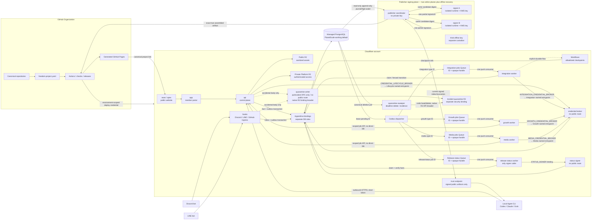

# GitHub＋Cloudflare Bootstrap、Project Lifecycle 與 GitHub Pages 標準

> 狀態：現行 canonical baseline（2026-09-19 低維運互惠修訂）；planning 文件，不代表已部署。

> 2026-09-24 現況：公開會員 beta 使用 Node＋PostgreSQL＋Cloudflare Tunnel（`deploy/public`、`deploy/staging`），不是本文件的 Workers／Hyperdrive／PlanetScale 拓撲。
>
> 已有的 GitHub App 只申請 `starring:write` 與 `metadata:read`。程式修改由會員自己的 GitHub 授權完成；原作 repo 的 App 安裝由 repo 擁有者決定。
>
> 本文件的 Day 1 清單、KMS／HSM、signed channel 與 Pages attestation 仍是後續實作，HF-I01…I17 仍無完成紀錄。見 [2026-09-24 計畫對齊](../development/audit-2026-09-24-plan.md)。

## 1. 四項基礎定義

| 使用者方向 | 本規格的精確解讀 | 狀態 |
| --- | --- | --- |
| 「開一個 GHE」 | `GHE` 精確定義為 **GitHub Enterprise Cloud**（GHEC）內一個 Freedom Organization，不自架 GitHub Enterprise Server（GHES）。Day 1 採 GHEC，以 organization ruleset 的 central required-workflow rule 防止 PR 改寫必要合併檢查 | 現行 working default；exact 報價／term／seat 數在採購時查價與記錄 |
| 「Cloudflare 開 PostgreSQL」 | 核心仍用 PostgreSQL；working default 是 Cloudflare 帳單整合的 **PlanetScale-hosted Postgres**，Worker 經 Hyperdrive 連線。它不是 Cloudflare 原生 PostgreSQL | Day 1 建 production＋staging；region／HA／PITR／費用檢查結果控制 public traffic 與 `SLO` |
| 「網址在 Cloudflare 買」 | 用 Cloudflare Registrar，DNS／TLS／WAF 同帳戶管理；Ted 對 exact domain、年限、registrant 與即時價格作付款 A4 | Day 1 採購；exact domain 與年期由付款 artifact 記錄 |
| 「兩個 CLI 管全部」 | 日常 provider control plane 只要求 `gh`＋`wrangler`。Organization 建立、billing/contact、DB 首次建立等一次性動作可能需 dashboard/API；Postgres migration 與 app build 仍由 repo scripts 執行 | 現行 operator UX；不宣稱底層只有兩個 binary |

GitHub Organization 是 repo、team 與權限的擁有容器；GitHub Enterprise Cloud 是其上的企業管理與治理層。本案只要一個 Freedom Organization，Day 1 選 GHEC 作 working default，因為 central required-workflow 是 release trust boundary，不是為了多 Organization、SAML／SCIM 或自架主機。若 Ted 改用 Team，技術架構同步採 Team＋獨立 GitHub App expected-source check，不能以 Team 假冒同一個 required-workflow 能力。

GitHub 目前列出的公開價格是 Free `US$0`、Team `US$4/user/month`、Enterprise 自 `US$21/user/month` 起；實際採購前重新查價。關鍵不是一般ruleset有沒有，而是本案用來防止PR改寫必要合併檢查的`Require workflows to pass before merging`只列在GitHub Enterprise Cloud規則中；Team的一般ruleset只能用required status check並可鎖expected GitHub App source。因此現行baseline是**GitHub Enterprise Cloud內的一個Organization**，不是GitHub Enterprise Server。若Ted改用Team，替代案是Team＋獨立GitHub App驗central run後簽發expected-source required check，並做完整negative test，不能把Team說成直接擁有required-workflow rule。Freedom v1仍不從private repo發布Pages。參考 [GitHub plans](https://docs.github.com/en/get-started/learning-about-github/githubs-plans)、[GitHub pricing](https://github.com/pricing)、[一般ruleset rules](https://docs.github.com/en/repositories/configuring-branches-and-merges-in-your-repository/managing-rulesets/available-rules-for-rulesets)與[Enterprise Cloud required workflows](https://docs.github.com/en/enterprise-cloud@latest/repositories/configuring-branches-and-merges-in-your-repository/managing-rulesets/available-rules-for-rulesets#require-workflows-to-pass-before-merging)。

## 2. Target topology



日常開發與產品運行維持兩個主要 control planes；production publisher signing另有最小化trust plane。Day 1 建立兩家外部KMS／HSM signing planes與第三把offline recovery key；這是窄provider依賴，不承載一般application workload：

- GitHub 管人對 code 的責任：repo、Issue、PR、review、checks、release、static project page 與 immutable refs。
- Cloudflare 管網路上的產品：domain、DNS、TLS、WAF、web/app/API/webhook、async jobs、object storage、runtime secrets 與 PostgreSQL connection path。

PostgreSQL 是 central platform business data store，不是各 Squad／客戶資產的集中備份站。

### 2.1 Discord、LINE、文件與 agents 共用一個入口

```text
Discord message / LINE postback / approved document reference / Portal form
  → signed ingress receipt
  → SubmissionDraft（原文留在外部或受控 object reference）
  → owner / authorized operator在Portal acknowledge已保存exact source ref/revision/digest、visibility與data boundary（external document不在此fetch／驗bytes）
  → 恰一個typed target：draft WorkItem 或 private OpportunityStub
  → Opportunity後續依正常acceptance/lifecycle才可建立Project與其WorkItems
  → any connected Codex / Claude / Grok client reads the same protocol
```

Bot 不直接決定 repo、production或付款，也不把聊天全文灌進 prompt。文件進件先選classification與owner：平台自有／明確同意公開的內容可依retention進中央R2；客戶機密、raw project files、SQL dump與原始資料一律留在Squad/client-owned storage，Platform只收opaque external reference、digest、最小consented metadata與access result，不proxy或cache正文。Portal confirm只比對owner acknowledgement與saved exact tuple；端點offline不阻擋，也不被描述成source verification。Document WorkItem才綁exact source requirement；OpportunityStub可保持metadata-only且不授予Agent access，日後Project／WorkItem需要文件時才複製該requirement。Local Agent CLI 以使用者自己的 bot/account connection，從 `api.<domain>` outbound 取得短效 WorkContext、claim工作，再以owner-side authority取exact revision、本機hash並回傳authenticated／lease-fenced assertion receipt；Platform無法獨立attest remote bytes，且normal review／A4仍適用。Known failure只留下provenance、令run失敗且零 consequential effects；client不需要開 inbound port。Server 上不必常駐一隻 LLM agent：`platform-api`＋queue/workflow就能接所有 clients。若日後需要共用 server agent，將它當成另一個有 scope、quota與可撤銷 connection 的 executor，獨立部署且不能取得所有 Squad credentials。

### 2.2 起步拓撲不租一台傳統 server

| 選項 | 現行決定 | 何時重開評估 |
| --- | --- | --- |
| Cloudflare Workers＋Queues／Workflows | **採用**；承載web、Portal、API、hooks與durable orchestration，不需先維運VM | Worker runtime限制或實測成本不合適 |
| GitHub | 管source、CI、release與static Pages；**不是**常駐application server或production agent host | 不適用；Actions仍只作bounded CI/CD |
| Vercel | 不採用；Functions同樣能做managed serverless compute，但現在加入只會多一套deploy、identity與billing control plane | 出現Cloudflare無法滿足、且Vercel能明確解決的framework／preview／region需求 |
| AWS／GCP／Oracle Cloud | 不採用為現行主平台 | Cloudflare Workers／Workflows／Containers仍無法滿足長時間CPU/GPU、特殊container、private network、固定egress IP或獨立ephemeral build fleet，且量測證明值得第三個execution plane |

這不是認定其他雲不好，而是目前工作負載正好是HTTP、webhook、queue與狀態流程；Cloudflare Workers本身是managed serverless application platform，Workflows能保存多步驟、重試與等待人類事件的狀態。GitHub Pages則明確只是static hosting。第一個重型工作出現時，把它透過queue交給隔離的compute service即可，不必先搬走Portal或控制面。參考 [Cloudflare Workers](https://developers.cloudflare.com/workers/)、[Cloudflare Workflows](https://developers.cloudflare.com/workflows/)、[GitHub Pages](https://docs.github.com/en/pages/getting-started-with-github-pages/what-is-github-pages) 與 [Vercel Functions](https://vercel.com/docs/functions)。

### 2.3 Async state只有一份真相

PostgreSQL保存canonical outbox、Job／ActionIntent state、lease、fencing token、attempt與result；Cloudflare Queues只傳`event_id`，或job的`job_id + queue_delivery_id + queue_delivery_handle + wakeup reason`，是可重送、at-least-once的喚醒／transport，不保存第二份業務狀態。Handle是高熵、短效、one-time/current opaque值，不使用另一把簽章key；PostgreSQL只存hash並綁exact job/delivery、Queue、executor group、registry digest、OAuth audience、lifecycle與不晚於Queue retention的expiry，raw handle從所有log/trace/error redact，server仍須重讀canonical row。Dispatcher依active immutable job registry的trusted `job_type→executor_group` mapping分到`integration-jobs queue → integration-worker`、`growth-jobs queue → growth-worker`、`media-jobs queue → media-worker`或隔離的`release-status queue → release-status-worker`；每個Queue恰有一個matching active push consumer，不把Queue當fan-out。Claim必帶exact `requested_job_id + queue_delivery_id + source_queue + queue_delivery_handle`，以constant-time hash check原子消耗成一個lease，再以`job_registry_version`、OAuth client的server-side type/group allowlist及來源Queue交叉驗證，只可lease那一row；caller自報group不能取得權力，integration worker無法claim growth/media，任何一般worker也無法claim status。`200`取得lease後只在canonical transition commit後ack；已消耗handle重送且exact row已terminal／superseded的`204`可ack；registry/current lease/expired delivery的`409`retry或由sweeper發新delivery＋handle；schema-invalid type/group/Queue的`400`或valid-shaped但random/mismatched handle/auth/canonical binding的`403`都不改job，只以不含handle的metadata進security alert／DLQ policy。Producer在同一DB transaction寫domain fact與outbox，dispatcher成功送Queue後記delivery attempt；Queue遺失／重送／亂序不改變真相，outbox sweeper與定期reconciliation會重送未完成項目，外部副作用仍由stable operation key及`result_unknown`查詢收斂。參考Cloudflare [How Queues works](https://developers.cloudflare.com/queues/reference/how-queues-works/)。

Cloudflare Workflows只用於policy明列的長等待／多步驟orchestration，保存執行checkpoint但不取代Order、WorkItem、Job、approval或ledger state；每一步都以canonical ID回寫PostgreSQL後才繼續。若Workflow與DB讀法衝突，以DB的version/fence為準並暫停reconcile。這讓本案可以使用Cloudflare Queues／Workflows，又不會和PostgreSQL-backed outbox/job state形成兩套queue truth。

## 3. Account、ownership 與 plan

### 3.1 GitHub

1. Day 1 建立 GHEC enterprise、Freedom organization、GitHub App 與所需帳戶；每個人使用自己的 GitHub personal account，不可多人共用 Ted 的登入、PAT 或 SSH key。
2. GitHub organization owner 是 Ted，break-glass co-owner 的建議預設是 Mini，在五人共同閱讀時確認。Ted 在 Day 1 向 Mini 的既有、可獨立恢復、非 Freedom domain email 寄出邀請，不等待接受；接受狀態只控制 `recovery` 標籤，不阻擋 organization、repo、candidate、staging、sandbox 或內部 demo。
3. Organization 擁有所有 first-party repositories；vertical lead 以 team、`Maintain`／`Write`、CODEOWNERS 與 Platform 內的 `ModuleStewardship` 負責，不把核心 repo 放進 lead 的私人 namespace。
4. Base permission 設為 `None`；成員只能經 team 取得所需 repo 權限。
5. `owners`、`platform-admins`、`release-captains`、`security` 與各 vertical team 分開；一般 contributor 不進 organization 也能由 public fork 提 PR。
6. Working default採GitHub Enterprise Cloud，因為所有canonical repos都要套organization-level required workflow；只邀真正需要organization權限的幹部／vertical leads成為paid seats，public contributor維持外部fork／PR。若Ted改用Team，合併信任改採expected-source GitHub App required check並做negative tests；Enterprise Cloud的private Environment reviewer仍只是額外檢查，production一律驗Platform exact A4 release signature。Freedom v1不從private repo發布GitHub Pages。

本案採的是GitHub Enterprise **Cloud**，v1明確使用既有personal accounts的non-EMU模式；不啟用Enterprise Managed Users，因為EMU會改變外部協作與Pages可見性，且GitHub目前限制managed-user Pages只能由organization repo發布、永遠private、不能建立organization site，與本案公開project pages衝突。SAML/SCIM、集中多organizations、指定data residency、enterprise audit及privately published Pages日後逐項另評估，若要轉EMU必須先立migration ADR並重驗public contribution/page contract。GitHub Enterprise Server只有在法規強迫self-hosting時才另立ADR；它需要自行維運appliance，也不會替自架instance提供GitHub.com的`<org>.github.io` namespace，因此目前明確排除。參考 [GitHub Pages limits for Enterprise Managed Users](https://docs.github.com/en/enterprise-cloud@latest/pages/getting-started-with-github-pages/github-pages-limits#limits-for-enterprise-managed-users)。

### 3.2 Cloudflare

1. Day 1 建立 Freedom Cloudflare account、Workers Paid、Registrar、R2、Queues、Workflows、Pages 與 Access；Ted 持有 billing owner／Super Administrator，第二 Super Administrator 的建議預設是 Jason，在五人共同閱讀時確認。Ted 在 Day 1 向 Jason 的既有、可獨立恢復、非 Freedom domain email 寄出邀請，不等待接受；接受狀態只控制 `recovery` 標籤。不同登入不得共用帳號、密碼、Global API Key或2FA device；日常自動化只拿resource-scoped member role。
2. Account 同日啟用2FA enforcement；Ted至少登錄兩種不同因素（優先WebAuthn security keys＋獨立fallback），one-time recovery codes加密／離線保存且不與主要裝置放在一起。Jason接受邀請後以自己的獨立因素與recovery material完成相同設定；這些檢查結果控制`recovery`／`SLO`標籤，不中止其他建置。
3. `preview`、`staging`、`production` 使用不同 resources、API tokens、secrets 與 DB credentials；production token 不提供給 fork PR。
4. GitHub Actions 目前依 [Cloudflare 官方 CI 指引](https://developers.cloudflare.com/workers/ci-cd/external-cicd/github-actions/) 使用 account/resource-scoped API token，放在受保護的 GitHub Environment secret；不在 repo、manifest、普通 build artifact、Discord／LINE payload 保存。若 Cloudflare 日後正式支援 GitHub OIDC，再另案改成短效 federation，不先假裝已支援。
5. 交接後與固定間隔做不破壞資源的 account-recovery drill：第二管理員登入、確認 Registrar／DNS／Workers 可見、讀取 audit log、列出並可撤銷 sessions／tokens；演練結果只更新 `recovery`／`SLO`，實際 incident 則先撤銷可疑 session／token 再 rotate secrets。
6. 付費變更與domain purchase屬Ted的付款A4；對外production release屬Ted的正式發布A4。Production secret rotation與destructive DB operation使用scoped authority、exact target、idempotency、backup／rollback與evidence，不增加另一個Ted停點。

Cloudflare官方建議帳戶有不只一位Super Administrator，並建議每位使用者設定至少兩種2FA因素且安全保存backup codes；參考 [Change Super Administrator](https://developers.cloudflare.com/fundamentals/account/change-super-admin/) 與 [Two-factor authentication](https://developers.cloudflare.com/fundamentals/user-profiles/2fa/)。

### 3.3 可預期的起步成本，不把開發方案冒充 production HA

- GitHub：Free為`US$0`、Team為`US$4/user/month`、GitHub Enterprise Cloud目前公開起價`US$21/user/month`；依當次 checkout 顯示值購買，invoice 回填 term／tax／seat，差異形成修正 Issue。Day 1直接採GHEC，不建立Free／Team過渡方案。一般public Actions builds不計minutes；Team的expected-source GitHub App替代檢查只供Ted日後改變方案時使用。
- Cloudflare：Workers Paid 目前 account最低 `US$5/month`，含較高 Workers/Hyperdrive能力；static asset requests免費。Hyperdrive本身另不收 connection pooling/cache費，但 database仍另外計價。
- PostgreSQL：PlanetScale的single-node從約`US$5/month`起，定位為development／low-traffic；network-attached最小HA目前約`US$15/month`，Metal最小`US$50/month`也明列為HA cluster。這些只是最低cluster base price，不是完整production TCO，也不保證本案選定region／architecture／SKU可用；exact compute、replicas、storage、backup、egress、PITR/restore與Hyperdrive相容性仍須依當期catalog實測試算。Single-node不等於本計畫要求的production HA/PITR已通過。
- Registrar：依 exact TLD與當下 registry價格收費，購買前才顯示；不能先寫一個固定數字。

所以最小開發環境可很低，但 production budget不能只算「Cloudflare五美元」。正式數字是 `GitHub seats + Cloudflare usage + PostgreSQL topology + domain + optional provider usage`，Day 1 採購時用實際區域/SKU重新估。參考 [Workers pricing](https://developers.cloudflare.com/workers/platform/pricing/)、[Hyperdrive pricing](https://developers.cloudflare.com/hyperdrive/platform/pricing/) 與 [PlanetScale pricing catalog](https://planetscale.com/pricing)。

### 3.4 公共維持成本與供給來源（2026-09-19新增）

§3.3供應商價格沿用2026-09-17原文件，本次未重新查價；採購依當下invoice／SKU。基礎設施費用不是完整營運成本，另外列：固定維護、例外處理次數×粗估工時、協調工時、已承諾免費真人容量，以及各自來源與到期日。

每項持續承諾綁有上限的funding／availability reference；現金、未到帳承諾、預期案源及志願時數分欄，不能混算。來源可為創辦人補貼、贊助或服務案明示公共維護分配，不預設全站抽成。未配置／不足時停止新增保證服務、保留自助與既有保護責任；不是取消Day1地基，也不是讓核心無限補位。

`contracts/operating-policy.example.yaml`數字是未啟用建議，非用戶核准預算、已取得資金或任何人的工時承諾。資源帳仍沿用既有Quota／BillingSource／ledger與Work／Coaching，不新增wallet或平行會計系統。

## 4. Domain 與 public URL 標準

正式 domain 尚未選定，先使用以下角色，不把 placeholder 寫死進 code：

| URL | 用途 | Runtime |
| --- | --- | --- |
| `https://<domain>/` 與 `www` | 品牌、產品目錄、公開內容；其中一個 canonical，另一個 301 | Cloudflare Worker/static assets |
| `https://app.<domain>/` | 登入後會員系統、Now/Next/Gained、營運 UI | Cloudflare Worker full-stack app |
| `https://api.<domain>/` | Portal、agent kit 與 storefront BFF | Cloudflare Worker |
| `https://hooks.<domain>/` | GitHub／Discord／LINE webhook ingress；只驗簽並以單一PG transaction寫canonical inbox＋outbox/job，dispatcher後續才把ID送Queue | 獨立 Worker |
| `https://assets.<domain>/` | 只放Platform-owned／member-consented、已安全轉碼且可公開的media；不收private或client-confidential raw files | 獨立public R2 bucket＋custom domain |
| `https://api.<domain>/v1/assets/<asset-id>:download` | 登入後private Platform asset；先驗session、owner/purpose與expiry再由Worker讀取，不暴露bucket key | 獨立private R2 bucket＋authenticated Worker binding |
| `https://<org>.github.io/<repo>/` | 該 repo 的標準化 project introduction page | GitHub Pages |
| `https://<domain>/projects/<project-id>` | 該 project 在 Freedom 官網的 canonical record | Cloudflare app |

`www` 與 `app` 共用 `packages/ui` 的 design tokens、components、accessibility與brand system：`www` 顯示公開 project／product目錄、案例與加入入口；`app` 顯示登入、個人頁、profession/rank、linked GitHub／Discord／LINE、工作與上架狀態。Project Page generator只取其中可公開的視覺與資料契約，不載入Portal session、private API或會員資料。

Public與private object bucket、credential及hostname完全分開。Production所有bucket停用`r2.dev`；public bucket只能由`assets.<domain>` custom domain供已核准內容，private bucket沒有custom domain/public access，只能經authenticated Worker的R2 binding讀取。若未來不用Worker streaming而改發presigned URL，它只能是短效、單object／method的R2 S3 API-domain bearer URL，因R2 presigned URL不支援custom domain；不得把public custom-domain URL包裝成「私密signed URL」。參考Cloudflare [R2 public buckets](https://developers.cloudflare.com/r2/buckets/public-buckets/)與[presigned URLs](https://developers.cloudflare.com/r2/api/s3/presigned-urls/)。

GitHub Pages 保留在 `github.io` namespace，頁面明確連回官網；不要把 apex／`www` 指給 organization Pages，避免所有 project pages 自動繼承 custom domain 後和主站路由互相干擾。若將來確實需要 `projects.<domain>`，需驗證 domain、保留 org directory routing，並另立 migration ADR。

Cloudflare Registrar 現在可由 dashboard 購買，也有 beta Registrar API；API 註冊是立即計費且成功後不可退款，所以 Skill 只能先查 availability／price，顯示 exact domain、年限、auto-renew、registrant 與價格，停下等待 A4 人工確認後才可註冊。參考 [Cloudflare register-domain guide](https://developers.cloudflare.com/registrar/get-started/register-domain/) 與 [Registrar API](https://developers.cloudflare.com/registrar/registrar-api/)。

## 5. PostgreSQL 與資料邊界

### 5.1 Working default

```text
Cloudflare Workers
  → Hyperdrive binding（pooling / supported query cache）
  → TLS
  → PlanetScale-hosted PostgreSQL（region 為建議預設，採購時依 catalog 記錄）
```

Day 1 同時建立 production HA 與 staging PostgreSQL、各自的 roles／credentials／Hyperdrive bindings、backup／PITR設定與零public-traffic production路徑；staging 建議預設 single-node，production 建議預設 network-attached HA。12個runtime各自建立最小DB role與允許的schema／procedure，或明示為不取得DB credential；runtime責任與最小角色邊界依`02 §8.3`／`02 §8.4`。Cloudflare 可從 dashboard 建立由 Cloudflare 計費的 PlanetScale Postgres；support 與 database runtime 仍屬 PlanetScale。若要全 CLI 建立，目前官方流程需要 `wrangler hyperdrive planetscale signature` 串 `pscale database create --engine postgresql`，且 Wrangler signature interface 標為 experimental。一次性 DB 建立使用 dashboard；之後日常連線與 Worker 資源由 `wrangler` 管理。需要可重播的 full bootstrap 時，把 `pscale` 鎖版放進受控 container，不向成員宣稱 `wrangler` 自己會生 PostgreSQL。參考 [Cloudflare Hyperdrive＋PlanetScale](https://developers.cloudflare.com/hyperdrive/planetscale/)。

Day 1 同日啟動 region、資料落地需求、HA、PITR、backup export／restore drill、connection limits、maintenance、support owner、持續開機費用與離開供應商還原能力的檢查；所有測試狀態均為「未跑」。結果只控制 production public traffic 與 `SLO` 標籤；建置與 staging／sandbox 工作照常進行。若結果顯示現行 provider 不合適，Hyperdrive 改接其他 managed PostgreSQL，application contract 不變。

至少設兩個 Hyperdrive bindings：auth/session/permission、Order、payment/settlement、ledger、credential metadata，以及official-status decision、attestation currentness、issuer key與revocation registry的read-after-write流程一律走cache-disabled binding；只有不影響trust banner的公開project/catalog display projection等可容忍短暫stale的查詢才使用明確TTL cache binding。Connection pooling可以共用，但不能為了速度讓授權、財務或official/revoked判斷讀到舊值。參考 [Hyperdrive FAQ](https://developers.cloudflare.com/hyperdrive/reference/faq/)。

### 5.2 中央 PostgreSQL 可以存什麼

- membership、profile、profession/rank、office、team/module stewardship。
- Discord／LINE／GitHub identity binding 的 provider subject、scope、consent、狀態與 receipt；不是聊天全文。
- password hash、WebAuthn public key、session/token digest、credential reference與權限metadata；需要由Platform代理的dynamic provider refresh token只以專用vault schema內的AEAD ciphertext＋wrapped DEK保存，絕不以plaintext或一般application column保存。
- Project、WorkItem、Claim、AgentRun、grant、signature、result、contribution 與 audit facts。
- Product/listing/QC、Order、business transaction、PaymentFact、obligation、settlement／refund／reconciliation state 與 provider IDs。
- 讓官網顯示 project、release、official status 與 GitHub Pages URL 所需的索引／projection。

### 5.3 不進中央 PostgreSQL 的資料

- 客戶 raw datasets、客戶 SQL dump、客戶 DB credentials、客戶模型 key、Squad 私有 source data。
- 卡號、銀行登入、支付工具raw payload。只有參與者明確建立的provider connection可把必要token放入下節的encrypted vault；它仍不構成平台保管款項，也不能繞過signed mandate。
- Discord／LINE 私訊全文、agent chain-of-thought、未經選取同意的私人文件全文。
- 固定的repo／Worker／Action／DB root secret、vault KEK與status-signing private key。DB只存key version／public key／digest或secret reference；root值放在per-environment purpose-scoped secret/KMS。

這個禁止範圍同樣適用中央R2、Queue payload、Workflow state、log、trace、prompt與backup，不能把「不進PostgreSQL」解讀成可改存object storage。客戶機密／raw project file的正常路徑只接受Squad/client-owned storage的opaque reference＋digest＋最低consented metadata，取用由該Squad自己的local agent/connector及權限完成。若入口在classification前意外收到body，立刻停止downstream／agent access並放入第三個、與public/private Platform assets皆分離的incident-quarantine bucket；一般web/API/worker沒有其read binding，只能呼叫無public route的quarantine handler寫入，Security的限時處置身份另行授權。只記錄不含內容的hash、size、actor與reason，依policy-defined且不超過24小時的處置窗刪除並留下deletion receipt；若法規／合約要求更短就採更短值。不得共用bucket／credential、讓一般app讀取，或把quarantine當正常upload bucket、backup與訓練資料來源。

因此「存 transactions」是存平台的不可變 business facts 與 reconciliation，不是變成 payment processor；「存 credentials」是存身份／授權的可驗證 metadata 與 secret refs，不是把所有 token 集中成一張表。

### 5.4 Credential vault Broker 與 signing key

Dynamic Discord／LINE／GitHub／seller-owned provider tokens不能一個token占一個Cloudflare secret，也不能明文進PostgreSQL。v1 working design如下：

1. 每個credential object使用獨立random DEK與AEAD；AAD至少綁`community/tenant + connection_id + provider + purpose + principal + key_version`。PostgreSQL的隔離`credential_vault` schema只存ciphertext、nonce、wrapped DEK、scope、expiry、provider subject與rotation state。
2. 只有無public route的`credential-broker` Worker具有vault DB role與unwrap能力。它不暴露一個共用superset RPC surface，而是四個named `WorkerEntrypoint`與四個deploy-time bindings：`CREDENTIAL_LIFECYCLE_BROKER → CredentialLifecycleEntrypoint`只配置給`platform-api`且只export `storeOAuthCallbackCredential/rotateConnectionCredential/revokeConnectionCredential`；`INTEGRATION_CREDENTIAL_BROKER`、`GROWTH_CREDENTIAL_BROKER`、`MEDIA_CREDENTIAL_BROKER`各指向hard-code同名executor group的entrypoint，只配置給對應worker且只export `issueJobCapability/proxyProviderOperation`。只有三個executor entrypoints的job payload限於`connection_ref + current job/lease/fencing + scope`，不能選caller/group或做credential lifecycle/export，並在secret lookup前以canonical DB重驗registry映射及running exact job。Lifecycle entrypoint則只接受verified OAuth callback/rotation receipt、exact pending/current Connection與在單次RPC記憶體內傳遞的transient credential material；它先驗provider state／PKCE、community／principal／purpose與expected connection version，立即encrypt後只回opaque secret ref或redacted receipt，絕不回傳已保存的長效credential。Web/Portal、webhook ingress、release-status worker、status-signer、Agents與所有其他deployable沒有任何Broker binding；default entrypoint沒有RPC/HTTP methods。一般RPC不被假定會自動帶calling Worker identity，body/header/argument自報role永遠不授權。Cloudflare支援將Service Binding指向具名entrypoint並以各entrypoint提供permission-role-specific methods，見[Service bindings：Named entrypoints](https://developers.cloudflare.com/workers/runtime-apis/bindings/service-bindings/rpc/#named-entrypoints)。Broker能代理單一provider operation時就不回傳長效token，否則只發最短效、最小scope capability。
3. 固定的environment root KEK、GitHub App key與status-signing key彼此分開，且不放同一DB。Day 1 在兩家不同 provider 建立 A／B non-exportable online signing planes，另建立 C offline recovery plane；custodian 建議預設為 A＝Ted、B＝Mini、C offline＝Jason，在五人共同閱讀時確認。coordinator不持私鑰，A／B使用不同runtime、deploy/admin credential與key purpose。`status-signer`是另一個無public route的Worker，只接受已核准attestation intent，使用自己的Service Binding、status DB role與signing-key binding；**只有dedicated `release-status-worker`持有該Service Binding**。`platform-api`只建立／查詢intent；`integration-worker`、`growth-worker`與`media-worker`只處理registry映射給自己的general/provider job，四者都不能直接要求簽章。Signer沒有credential-vault role／unwrap KEK，release-status worker也沒有broker binding；反過來`credential-broker`拿不到status key，任一Worker被攻陷都不能同時解密provider tokens並偽造official status。Cloudflare Secrets Store只保存少量non-production root fixtures；Secrets Store目前仍是open beta且每account最多100個production secrets，故不能當per-member token vault或production signing root。外部KMS/HSM是窄化的第三方trust control plane，不承載一般application workload。參考 [Cloudflare Workers secrets](https://developers.cloudflare.com/workers/configuration/secrets/) 與 [Secrets Store limits](https://developers.cloudflare.com/secrets-store/manage-secrets/)。
4. KEK採versioned envelope rotation：新寫入用current key，舊DEK可線上rewrap且不解密業務payload；revoke connection先阻止新capability再清除／撤銷provider token。Status signer使用獨立key與dual-control activation，不與OAuth vault KEK共用。
5. DB backup只含ciphertext；root recovery material按technical plane離線分隔、分環境分權。Ted、Mini、Jason依 A／B／C 建議預設補 custody evidence；Ted 與 Mini 是不同自然人的 evidence 只控制`production-signed`標籤，不改變A／B／C planes的建立與測試。Restore drill證明「有授權可恢復」與「只有DB backup無法解密」；任何log、trace、event、prompt、exception與support export都不得出現plaintext token／DEK／KEK。

這是現行 working-default security architecture，不宣稱帳戶、key、binding或測試已建立。Day 1 建立production與staging的root-key落點、rotation／recovery責任、兩家KMS／HSM planes與status key；所有rotation／recovery測試標為「未跑」。結果只控制`production-signed`、`SLO`與production public traffic，不阻擋sandbox connections、candidate、staging或內部demo。

## 6. Repository inventory

五個 first-party product repo 名稱維持不變（尚未建立，見 `09 §3`）：`freedom-platform`、`freedom-agent-kit`、`freedom-storefront`、`freedom-growth-automation`、`freedom-skill-registry`。另外需要四個 governance/support repo；它們不代表多四個產品服務：

| Repo | v1 visibility | 用途 |
| --- | --- | --- |
| `.github` | **public** | organization profile、issue/PR forms、workflow templates、community health、public reusable workflow entrypoints |
| `freedom-project-template` | **public** | 用 `gh repo create --template` 建立全新、無共同 git history 的 project |
| `freedom-project-page` | **public** | manifest validator、semantic GitHub checker、固定 page generator 與可 pin SHA 的 reusable workflow/action |
| `<org>.github.io` | **public** | github.io 根目錄、project directory 與回官網入口；不是正式 Portal |

此外`freedom-platform`至少canonical `docs/platform-plan/`與plan-bundle releases必須public，`freedom-skill-registry`及其released Skill packages也必須public；其餘first-party product source採public-first，真的含客戶／商業機密才依data boundary另設private project。Public repo無法呼叫一個只對private callers開放的中央reusable workflow，所以所有會被public project或community fork跨repo引用的wrapper／action／generator都放上述public repos並pin完整commit SHA。Public automation repo不得含organization allowlist值、approval records、signing/private key或provider secret；這些只在Platform DB／Cloudflare secret或核准KMS，workflow以最小scope向caller自己的environment取得必要capability。

每個可獨立維護、fork 或 deploy 的 project repo 根目錄都必須有 `freedom.project.yaml`，並通過 [`project-manifest.schema.json`](./contracts/project-manifest.schema.json)。它與`freedom-skill.yaml`都只能用`freedom-yaml-json-v1`解析：UTF-8無BOM、單一YAML 1.2 document、JSON schema scalar resolution／JSON data model，且在schema前拒絕directive、tag、anchor／alias、merge key、duplicate／complex／non-string key、非JSON number、tab indentation及trailing document；不能讓YAML 1.1或library default自行解讀。Module 若仍在 `freedom-platform` monorepo 中，只建立一份 repo-level manifest，再由以 `module_id` 為 key 的 `modules` mapping／Platform records 表示 module ownership；不要為八個模組機械式拆八個 repo。

### 6.1 共用 build profiles

Manifest 是純宣告資料，不是執行入口。它不允許填入 shell command、generator/action/workflow ref、container image、runner label 或 executable path；untrusted fork只能選中央review過的build profile名稱與schema版本，不能決定實際執行什麼。Profile名稱到實作的mapping與必要合併檢查放在public `.github` repo的中央required workflow，由GitHub Enterprise Cloud organization ruleset以`Require workflows to pass before merging`指定受保護的source repository／branch／workflow path；target PR不能以修改repo-local workflow或送出同名check取代它。中央workflow再以完整commit SHA呼叫`freedom-project-page` generator及所有第三方actions，並在run evidence記錄中央workflow commit；不得從PR版manifest／workflow、可移動tag或target repo輸入解析執行ref。中央source變更由Grok adversarial review、Claude verification與自動checks處理；Platform Engineering與Security holder建議預設為Ted並在五人共同閱讀時確認，具名獨立reviewer可由五人中任一非作者擔任，建議預設韋銘，韋銘為作者時改Mini或Jason，其evidence只控制`official`。Repo-local wrapper只可提供較快feedback，永遠不算必要合併檢查。參考GitHub [Enterprise Cloud ruleset required workflows](https://docs.github.com/en/enterprise-cloud@latest/repositories/configuring-branches-and-merges-in-your-repository/managing-rulesets/available-rules-for-rulesets#require-workflows-to-pass-before-merging)與[reusable workflow SHA pinning](https://docs.github.com/en/actions/how-tos/reuse-automations/reuse-workflows)。

| Profile | 現行 working default | 適用 |
| --- | --- | --- |
| `freedom.cloudflare-react/v1` | TypeScript、React Router v8、Cloudflare Vite plugin、pnpm、shared UI/design tokens | 官網、Portal、互動式 storefront |
| `freedom.cloudflare-worker/v1` | TypeScript、Workers runtime、Wrangler、contract tests | API、webhook、queue/integration workers |
| `freedom.typescript-library/v1` | TypeScript、pnpm、generated contract compatibility | SDK、protocol、shared packages |
| `freedom.static-project-page/v1` | fixed generator；不執行 project任意 code | GitHub introduction page |
| `freedom.agent-skill/v1` | SKILL.md metadata、scripts/reference validation、cross-agent fixtures | Codex／Claude／Grok SkillPackage |
| `freedom.custom-reviewed/v1` | Grok adversarial review、Claude verification、自動checks與Platform Engineering／Security role evidence綁exact build definition | Python、media/GPU或特殊工具鏈 |

React Router v8＋Cloudflare Vite plugin 是目前較穩的 Cloudflare-first預設；Cloudflare的 Next.js預設路徑 vinext 仍標示 beta，所以不把整個核心一開始綁上它。若產品需求證明需要 Next.js特性，再由 build profile升版，不讓各模組自行選一套。參考 [Cloudflare React Router guide](https://developers.cloudflare.com/workers/framework-guides/web-apps/react-router/)、[Vite plugin](https://developers.cloudflare.com/workers/vite-plugin/) 與 [Next.js/vinext status](https://developers.cloudflare.com/workers/framework-guides/web-apps/nextjs/)。

## 7. Project page：嚴格格式，不手刻另一份真相

### 7.1 唯一內容來源

Project page 由下列已版本化資料產生：

1. repo 根目錄的 `freedom.project.yaml`；
2. GitHub API 的 current repo、fork parent/source、exact candidate commit 與 Actions facts；
3. candidate build 產生的 `CandidateProvenance` 與預定 release metadata；
4. 可選的 `site/content/` 受控長文與 `site/assets/` 公開素材。

候選階段尚未存在published immutable release，因此不能產生`ProjectStatusAttestation`。Page candidate是一份**status-neutral**的靜態artifact：內建固定status widget與`project_id + stable repository ID + intended release tag + commit SHA`，初始／無JavaScript／離線狀態一律顯示`Unverified — verify on the canonical Freedom record`，不把`Official`永久烤進HTML。正式release發布後，widget只可呼叫Platform Trust擁有、`platform-api`提供的canonical `GET /api/v1/public/projects/{projectId}/release-status?repository_id=...&release_tag=...&commit_sha=...`；path/query形狀與endpoint origin由trusted generator／organization config固定，manifest不能覆寫或省略任何exact subject欄位。該public endpoint不收cookie／credential，每次以cache-disabled canonical status/currentness讀取驗attestation、issuer key與revocation registry；只有`200 status=official`會回resolved release ID、currentness digests與attestation proof identity/digests/validity。任何缺失、過期、撤銷、supersede、subject/assets/QC/A4/key不符只回`200 unverified`且不附proof；registry freshness無法驗證回`503`而不回stale official，malformed/unknown subject回`400/404`。所有response都用`Cache-Control: no-store`、`Pragma: no-cache`與`Vary: Origin`；只對Platform登錄的exact canonical Pages origin回相同`Access-Control-Allow-Origin`，不用`*`也不允許credentials。這是公開、非機密資料，CORS只決定browser JavaScript是否可讀，不是auth或confidentiality；curl/server client仍可存取。真正trust control是HTTPS canonical endpoint、signed attestation/currentness、完整subject逐欄比對及canonical record link。Widget每60秒內重驗，5秒timeout；凡非`200 official + valid/current proof`、schema錯誤或network error都立即顯示`Unverified`。

`dist/`／`_site/` 不 commit。Ruleset-required中央workflow呼叫固定完整commit SHA的generator；manifest、PR內容與repo-local workflow都不能覆寫該ref或替代required run。Generator只套同一版design tokens、layout、accessibility與安全的靜態文件規則，不讓每個project自己改掉trust banner。

所有網路URL必須是相對same-origin URL或明確的 `https://`；拒絕 `http:`、protocol-relative、`javascript:`、`data:` 與未知scheme。Validator必須用同一套strict URL parser解析後再輸出canonical form，拒絕username/password、反斜線、encoded authority delimiter、control character、invalid IDN與非canonical hostname，不能用字串prefix或單一regex判斷trusted origin。Canonical Platform URL、GitHub Pages URL及official production origin只可由stable repository facts＋受保護的domain registry推導，manifest不能任意供應；外部demo／documentation／support／issues origin要逐欄allowlist並經AI review與自動checks，頁面清楚顯示外部hostname，並加上適用的`rel="noopener noreferrer"`等外連保護。任何URL無法唯一正規化、與derived value不符或origin未核准，就讓page build失敗且不得取得official status。

Manifest、GitHub API、signed status、Markdown及自訂內容一律視為不可信資料：依HTML text／attribute／URL／JSON所在context做escaping，Markdown關閉raw HTML後再用allowlist sanitizer處理，對SVG與其他active content做sanitize或拒絕，且不得插入inline event handler、任意iframe或remote script。產出後還要跑URL-confusion/phishing fixtures、broken-link、mixed-content與secret/forbidden-file scan；任何驗證失敗都不發布。HTTPS由Pages設定啟用並強制；參考 [Securing a GitHub Pages site with HTTPS](https://docs.github.com/en/pages/getting-started-with-github-pages/securing-your-github-pages-site-with-https)。

GitHub Pages是static hosting，不能由repo用 `_headers` 等檔案設定自訂HTTP response headers；因此不得再宣稱generator會替Pages設定HSTS、`frame-ancestors`、COOP／COEP或完整response-header CSP。可用的 `<meta http-equiv>` 只作有限的defense-in-depth，不能取代response header。需要可驗證response headers、登入、敏感交易或active runtime的頁面必須放Cloudflare，不放GitHub Pages；Pages僅保留已escape／sanitize、無secret的公開介紹頁。參考 [What is GitHub Pages](https://docs.github.com/en/pages/getting-started-with-github-pages/what-is-github-pages) 與 GitHub staff 對 [Pages custom HTTP headers](https://github.com/orgs/community/discussions/54257) 的說明。

### 7.2 每頁固定區塊

依固定順序產生：

1. Name、one-line summary、project type、lifecycle。
2. `Official Freedom Project`、`Incubating`、`Community Fork` 或 `Independent` trust banner。
3. 解決的問題、適用對象、目前能做與不能做。
4. Demo／production、文件、source、Issue、support links。
5. Current release tag、exact commit SHA、release time、compatibility 與 changelog。
6. Accountable team／lead、maintainers、security contact。
7. License、privacy/data boundary、dependencies 與 known limitations。
8. Fork lineage：current repo、upstream repo、based-on commit、sync 狀態。
9. Generator commit、workflow run、build time 與 manifest version。
10. 明顯的「回 Freedom 官網查看 canonical project record」連結。

介紹文可擴充，但不得移除、改名或調序上述區塊。SEO canonical 指向官網的 project record；GitHub Page 是可獨立閱讀的衛星頁，不冒充登入後系統。

### 7.3 Official status 不能自我宣告，也不能永久烤進靜態頁

Manifest 內的 `requested_trust_label` 是請求顯示方式，不是權威。靜態generator只決定版型與預設的fail-closed狀態；canonical status service必須綜合驗證：

- request指向canonical repository與exact `project_id + release tag + commit SHA`；
- GitHub API 顯示repo非fork、owner在核准organization allowlist，且release已published、immutable；
- exact repository ID、release ID、commit與全部release assets已有有效Platform signed status artifact；
- 若使用 official custom domain，domain 已由 organization 驗證。

任一條件不成立就降級為 `Incubating`／`Community Fork`，不可顯示 official badge。Fork owner 最終能改自己的 code/page，因此不能靠 HTML banner 技術上約束惡意 fork；真正 trust signals 是 organization ownership、verified domain、canonical release URL、exact commit 與 Platform record。

Post-release status artifact 必須符合 [`project-status-attestation.schema.json`](./contracts/project-status-attestation.schema.json)，以可驗證簽章綁定stable repository ID、GitHub release ID、exact commit、immutable release tag、GitHub release-asset IDs／manifest／artifact digests、QC evidence、issuer key、有效期與nonce；manifest只能提供`project_id`，不能指定任意attestation endpoint或trust key。驗證器以本地可信設定與Platform trust registry找key及revocation狀態，缺失、過期、被撤銷、簽章或任一digest不符時一律視為非official。

其signed statement還必須含`release_authorization`：`ReleaseApproval`、`ActionIntent`、`HumanSignature`、signer／authority snapshot IDs、A4 meaning及approval/candidate digests。`status-signer`必須以自己的status-only DB role重讀這些canonical records，驗它們仍current、未撤銷，並且repo ID，commit、tag、asset exact set、production/Page targets逐欄相等才能簽`official`；GitHub Environment reviewer或caller傳入的「approved=true」不得代替。

Canonical Platform record永遠是權威；GitHub Page上的widget只是可丟棄projection。attestation到期、撤銷、supersede或issuer key狀態改變時，registry先原子更新權威狀態，no-store endpoint下一次查詢即fail closed，事件再排入高優先序Page audit；若發生key compromise、endpoint無法可靠驗證或頁面違規就直接unpublish。舊release page artifact不得被原地重建；新靜態內容只隨新release發布。因已開啟頁面最多要等下一次poll，頁面不得顯示無期限的official文字，只能顯示live verified結果、`verified_at`與`expires_at`；poll失敗、JavaScript停用或網路中斷時回到`Unverified`。

Bootstrap 期間 Platform 尚未能簽 status artifact 時，`freedom-platform` 自己的 Page 只能標 `Incubating`，不能用一份 owner手寫 YAML自我授予 official。第一個可驗證 official release正是 dogfood閉環的退出證據。

## 8. Fork、template 與 clone 不能混用

| 目的 | 機制 | Git history／lineage | 回 upstream |
| --- | --- | --- | --- |
| 對既有 project 貢獻 | **fork → branch → PR** | 保留 network 與完整 history | 預期送 PR |
| 建立可持續同步的社群變體／Store distribution | **fork** | 保留 upstream lineage | 可選擇同步／送 PR；永不繼承 official status |
| 建立新的獨立 project | **template** | 新 history；不是 fork | 不應假裝可直接 PR 回 template |
| 幹部在 first-party repo 做日常工作 | short **branch** | 同 repo | PR 回 `main` |
| 只在本機閱讀／測試 | **clone** | 不建立 GitHub project identity | 無 |

Public repo 的 fork 必然 public；private fork 必然 private且受 organization policy／plan 限制。Private／client-confidential project 預設禁用 fork，使用 template 建新的 private repo或在客戶／Squad 自有 GitHub space 開發；Platform 只保存 project/ref/status。參考 [GitHub forks](https://docs.github.com/en/pull-requests/reference/forks) 與 [repository templates](https://docs.github.com/en/repositories/creating-and-managing-repositories/creating-a-repository-from-a-template)。

每個合法 fork 必須：

- 若只是為 upstream送 PR 的短期 contribution fork，它是工作副本，不自動變成另一個 Platform Project，也不用發另一張 Page；upstream PR workflow以 base repository 的 canonical manifest驗證 proposed tree。
- 若 fork 要獨立維護、展示、部署或販售，先執行 adopt-fork：取得新的 `project_id`，並讓 `repository.is_fork: true`、`creation_method: github_fork`、`upstream` 含 upstream project ID／repo／based-on commit，`source_lineage[]`另固定source repository ID、exact commit與license notice。個人帳號fork用`ownership_mode: external_owner`及stable GitHub User account，不偽造不存在的organization team。CI 用 GitHub API 驗證owner、fork topology與 lineage，不能只信 YAML。
- 顯示 `Community fork — not an official Freedom release`；預設用 `<fork-owner>.github.io/<fork-repo>`，不得使用 Freedom official domain。
- release、download、support 連到 fork 本身，不偷接 canonical project 的 official release。
- 可以修改功能與品牌，但不得讓使用者誤認是official。v1的signed official contract硬性要求GitHub API `is_fork:false`，因此fork本身不能「做夠多QC就升格」；若社群變體要申請成為新的canonical official project，必須先由template／乾淨建立一個非fork repo，設`creation_method: fork_promotion`、`upstream: null`，但仍以immutable `source_lineage[].relation: fork_promotion_source`保存原source repository ID、exact commit、license／notice，再對該**新repository ID**的exact release完整走candidate／QC／A4 signature／attestation。原fork仍維持Community Fork。

## 9. 一個 project 從建立到上線

```text
Discord / LINE / document / Portal intake
  → owner-private SubmissionDraft
  → owner / authorized operator在Portal確認exact revision
  → one typed target
      ├─ draft WorkItem → existing-project / task lifecycle
      └─ private OpportunityStub
           → normal Opportunity acceptance confirms scope, owner, visibility and data boundary
           → ProjectDraft + reserved project ID（只有確實需要新Project時）
  → template new repo OR fork upstream
  → GitHub returns stable repository ID
  → materialize freedom.project.yaml with verified repository facts
  → Issue / claim / short branch
  → PR: validate + test + security + page build
  → external fork: artifact-only by default
  → optional trusted two-stage isolated preview; no production secrets
  → Grok adversarial review + Claude verification + automated checks + CODEOWNERS evidence
  → merge main → staging deployment
  → exact main SHA candidate: rebuild + test + scan + CandidateProvenance
  → private draft candidate; no public release and no v* tag
  → human A4 ReleaseApproval for exact version + SHA + artifact digests + targets
  → controlled publisher creates protected tag + immutable published release
  → Platform verifies release/assets and issues ProjectStatusAttestation
  → production Worker + status-neutral public-repo Page from released artifacts
  → Page widget resolves live status from canonical Platform record
  → Platform receives deploy/release facts and updates official website
```

### 9.1 Pull request

- Fork PR 的 workflow 只有 `contents: read`，不拿 environment secret、`pages: write` 或 production deploy token。
- Active organization ruleset對**Freedom核准organization內的managed repos**之`main`使用`Require workflows to pass before merging`，來源固定為public `.github` repo受保護`main`上的中央workflow。該workflow產生`manifest/schema`、`manifest/github-consistency`、`test`、`page/build`、`security`、`release-policy`等固定jobs/evidence；一般required-status名稱只能作補充，不能取代required-workflow identity。Target PR即使刪改`.github/workflows/**`或自行送出同名success也不能滿足必要合併檢查。外部owner repo不在Freedom ruleset控制面，即使自願呼叫公開workflow也只算advisory evidence，Portal與Page必須標`External / unmanaged`且永不official。
- 中央required workflow使用`pull_request`，若啟用merge queue也必須包含`merge_group`；不使用path／branch filter或commit skip使整個required workflow消失。昂貴步驟可在中央workflow內依trusted profile判斷後回報明確的`success/no-op + reason`；必要輸出缺失、job未執行或無法驗證時fail closed。Repo-local workflows只是developer feedback，無安全權威。參考GitHub [required workflows](https://docs.github.com/en/enterprise-cloud@latest/repositories/configuring-branches-and-merges-in-your-repository/managing-rulesets/available-rules-for-rulesets#require-workflows-to-pass-before-merging)、[workflow syntax](https://docs.github.com/en/actions/reference/workflows-and-actions/workflow-syntax)與[skipping workflow runs](https://docs.github.com/en/actions/how-tos/manage-workflow-runs/skip-workflow-runs)。
- External fork PR預設只產生供reviewer下載的page/test artifact，不自動部署任何URL。Fork的修改、workflow、dependency install與build scripts一律在無secret、read-only token、ephemeral hosted runner的第一階段執行。
- 若maintainer明確要求clickable preview，只能走受信任的第二階段：由中央controller workflow／GitHub App接受經人工選定的`repo + PR + head SHA + run ID + artifact digest`，不checkout fork、不執行artifact或其中script；先防zip-slip／symlink、驗MIME與檔案allowlist、sanitize及secret scan，再把**純靜態**artifact部署到獨立preview service／隨機origin。該origin不得共享production custom domain、cookie、DB、service binding、cache或credential，token只可寫該preview resource且部署有TTL。需要執行server/Worker code的外部PR必須先review並匯入受信任branch，不能直接preview。
- 禁止以 `pull_request_target` 或 privileged `workflow_run` checkout／執行fork code；第二階段即使使用`workflow_run`取得artifact，也必須把它當untrusted data且遵守上一項。參考 GitHub [Securely using `pull_request_target`](https://docs.github.com/en/actions/reference/security/securely-using-pull_request_target) 與 [Secure use reference](https://docs.github.com/en/actions/reference/security/secure-use)。

### 9.2 Staging

- `main` 是唯一長期開發 branch；不用 `staging`／`production` branch 表示環境。
- merge 後 deploy exact `main` commit 到 GitHub `staging` Environment，回寫 Deployment URL。
- 新 staging deployment 取消舊的 pending job；fork branch 不可直接部署 staging。

### 9.3 Production

`CandidateProvenance`不是另一套授權：它是build-profile定義、綁builder identity、source commit、materials、commands/profile version及全部candidate build-output digests的signed build statement；為避免self-hash，它明確排除provenance statement/envelope/signature本身。簽署完成後，publisher再計算完整provenance artifact的digest，並把它連同其餘assets納入`ReleaseApproval` exact set；post-release attestation再比對GitHub上包含provenance在內的完整uploaded-asset set。階段1A固定exact schema/version與signature envelope；release依賴該契約存在。`ReleaseApproval`則重用Platform既有的immutable `ActionIntent + Signature`模型，action type固定為release，target與request/consequence digests完整涵蓋candidate ID、intended tag、commit、asset exact set與deployment targets。改動任一內容都要建立新candidate與新approval，不能沿用舊簽名。

- Official stable release使用 `vMAJOR.MINOR.PATCH`，prerelease可用 `-rc.N`。候選流程只能從`main`上的exact SHA開始，在乾淨runner重新build／test／scan，產生SBOM、provenance、status-neutral page/runtime artifacts、digests與signed `CandidateProvenance`；PR artifact或staging deployment不能直接升production。`CandidateProvenance`證明「準備發布什麼」，不是official-status decision。
- 候選先成為private draft release/candidate record，所有待發布assets已附齊，並記錄預定version、exact commit、artifact digests、checks及`CandidateProvenance`；此時不得存在public GitHub Release或`v*` tag，也不能建立`ProjectStatusAttestation`。任何人類都不能對「latest main」或只有版本字串做模糊核准。
- 不論public/private或GitHub方案，A4 approval都由Platform `ActionIntent + HumanSignature`綁定`candidate_id + intended tag + commit SHA + asset exact set/digests + production targets`。GitHub `release-approval` Environment required reviewer只核准某個job/ref進入environment，沒有簽署上述完整artifact與consequence，因此不能取代`ReleaseApproval`，也不另設人員排隊條件；publisher在tag與public release前驗exact `ReleaseApproval`。
- 只有受控publisher可在重新驗證approval未撤銷、draft／assets自A4綁定後未變、SHA仍在`main`、digests相符、required checks成功且tag尚不存在後，建立protected `v*` tag並發布該draft為已啟用immutability的release；發布後不得再增刪或替換asset，tag及assets也不可move／replace；失敗或只完成部分步驟時fail closed，不deploy。參考 GitHub [Immutable releases](https://docs.github.com/en/code-security/concepts/supply-chain-security/immutable-releases) 與 [Managing releases](https://docs.github.com/en/repositories/releasing-projects-on-github/managing-releases-in-a-repository)。
- Release發布後，dedicated `release-status-worker`才以GitHub API驗證actual release ID、tag→commit、published／immutable狀態及完整asset ID/name/media type/digest集合，核對QC、`CandidateProvenance`與`ReleaseApproval`，再以唯一的private binding請`status-signer`重新驗canonical facts並簽發`ProjectStatusAttestation`。Platform API與普通integration worker沒有該binding。三份記錄分工固定：`CandidateProvenance`是build證據、`ReleaseApproval`是A4人類授權、`ProjectStatusAttestation`是post-publication official狀態；不得互相代用。
- production workflow只接受上述immutable published release，驗證post-release attestation與asset digest後，把**同一批released runtime artifacts**部署到Cloudflare；public source repo也直接部署同一份released、status-neutral page artifact。不得在production/Page job從可變branch重建或把新badge寫入artifact。成功後把URLs、release/deployment IDs、commit與digests回寫Platform，Page widget再以live canonical status顯示可到期／可撤銷的official結果。
- DB 變更採 expand → backfill → switch → later contract；migration job 與 app deploy 分開，可重跑且有 backup/rollback decision point。

GitHub Pages 每 repo 只有一個 site，且是 static hosting；所以 Pages 只放 production project page。PR preview／staging 不覆蓋它。GitHub 的目前限制包含 published site 1 GB、deployment 10 分鐘 timeout、100 GB/月 soft bandwidth；custom workflow 可避開內建每小時十次 build soft limit，但不能把 Pages 當 build farm。GitHub也明列Pages不應作online business、e-commerce或SaaS runtime，所以Freedom page只作開源project介紹／documentation／provenance，任何登入、購買、商業操作CTA都deep-link到Cloudflare Portal。參考 [What is GitHub Pages](https://docs.github.com/en/pages/getting-started-with-github-pages/what-is-github-pages)、[custom Pages workflows](https://docs.github.com/en/pages/getting-started-with-github-pages/using-custom-workflows-with-github-pages) 與 [Pages limits](https://docs.github.com/en/pages/getting-started-with-github-pages/github-pages-limits)。

Pages workflow權限固定拆兩個job：Organization／repo Actions設定採restricted default，且每份workflow在YAML top-level明列`permissions: {}`後才逐job加權。Candidate/page build job只給`contents: read`，可上傳Pages artifact但沒有deploy權；immutable release後的Pages deploy job使用GitHub官方sample的exact permissions：`contents: read`、`pages: write`、`id-token: write`。Deploy job雖有必要的`contents: read`，仍不得checkout或從branch重建source；它只部署已驗digest的released page artifact，而且沒有`contents: write`、`actions: write`或任何Cloudflare／production secret。該job指定`environment.name: github-pages`及由`actions/deploy-pages`輸出的`environment.url`。Freedom-managed official path只允許canonical public non-fork repo的受信任release event到deploy job；**external-fork PR context**、private repo與manual artifact ID均不可。已adopt、有獨立`project_id`的public community fork可在自己repo內以owner-controlled credential、same-repo immutable release event與full-SHA public generator發自己的Page；必須先在Portal對exact community release做A4 approval，並永久顯示community-fork／unmanaged品牌。此路徑不得取得Freedom deploy credential、official attestation或official domain，Platform只將其結果視為advisory；fork owner繞過流程自行發布時，Freedom只能fail closed不列入受管發布。參考 [Configuring a publishing source](https://docs.github.com/en/pages/getting-started-with-github-pages/configuring-a-publishing-source-for-your-github-pages-site) 與 [Workflow permissions syntax](https://docs.github.com/en/actions/reference/workflows-and-actions/workflow-syntax#permissions)。

### 9.4 Build volume

- 一開始用 GitHub-hosted Actions。Public repos 的 standard runners 不計 Actions minutes；private Team 目前含 3,000 minutes/month，超額另外計費。「不要為了猜測未來 build 量先買 Enterprise」只指Actions容量，不是GHEC採購條件；Day 1仍直接採GHEC。
- 每個 workflow 設 repo＋PR／environment concurrency group；新 commit 取消同 PR 舊 build。Ruleset-required中央workflow仍對每個PR執行；只有其內的page generator等昂貴step可在確認manifest／site／generator dependency未變時回報可稽核的no-op。Dependency與container layers只使用可信、與fork scope隔離的cache。
- Fork PR 先跑無 secret、低權限 validation/test；需要 production credential、昂貴 provider、GPU或大資料的工作只在受信任 merge/release後跑。
- 每週記錄 build minutes、cache hit、queue p50/p95、failure/retry與最長 job。只有 private minutes成本、排隊、特殊硬體或隔離需求實際超標，才比較 GitHub larger/self-hosted ephemeral runners或另立 build-service ADR。
- Pages、production Worker與常駐 bot都不是 build runner。若後來新增 GCP/AWS build service，它是有數據支持的第三個 execution plane，不能仍對團隊宣稱只有 GitHub＋Cloudflare。

GitHub 目前在 pricing 表列出 Free 2,000、Team 3,000、Enterprise 50,000 private CI/CD minutes/month，public repos免費；這些額度與價格會變，capacity review必須讀當期 [GitHub pricing](https://github.com/pricing) 與 [Actions billing](https://docs.github.com/en/actions/concepts/billing-and-usage)。

## 10. Public、private project pages

| Source repo | 預設 page policy |
| --- | --- |
| Public official repo | Public GitHub Page，可在 Free／Team 使用；official badge仍需 runtime verification |
| Public community fork | 可發 Page，但必須 fork branding；upstream 無法保證 fork owner不竄改 |
| Private repo（v1，包含Team） | **不得由該repo發布GitHub Pages**；只允許`page.publication: platform_only`或`withheld` |
| Private project requiring private Page | v1使用Portal authorization，不啟用Pages；未來只有真的需要「只有repo readers可看」才另案評估Enterprise Cloud |
| Client-confidential repo | 不發 GitHub Page；官網只在合約允許時顯示最小 public stub，並記錄例外理由 |

GitHub產品能力允許Team從private repo發布**公開**Pages，但GitHub明確警告site仍可能對internet公開；真正privately published Pages需要organization使用Enterprise Cloud。為避免把private source、README、log或artifact意外公開，Freedom v1採更嚴格政策：private repo一律不啟用Pages source/deploy workflow。參考 [Configuring a publishing source](https://docs.github.com/en/pages/getting-started-with-github-pages/configuring-a-publishing-source-for-your-github-pages-site)、[Creating a GitHub Pages site](https://docs.github.com/en/pages/getting-started-with-github-pages/creating-a-github-pages-site) 與 [private Pages visibility](https://docs.github.com/en/enterprise-cloud@latest/pages/getting-started-with-github-pages/changing-the-visibility-of-your-github-pages-site)。

GitHub Environment 的plan邊界也要分開看：Team可讓private repo使用environments、environment secrets與deployment branch/tag restrictions，但required reviewers／wait timer在Free、Pro、Team只支援public repo。因此Team private Environment可以縮小credential與ref範圍，卻**不是A4 release signature**；任何會解封production secret的job都驗Platform對exact candidate facts的`ActionIntent + HumanSignature`。Enterprise／public repo的原生reviewer check也不能取代exact-digest signature，且不另設人員排隊條件。參考 [GitHub deployment environments](https://docs.github.com/en/actions/reference/workflows-and-actions/deployments-and-environments) 與 [Managing environments](https://docs.github.com/en/actions/how-tos/deploy/configure-and-manage-deployments/manage-environments)。

Private source若要有公開介紹，v1只走`platform_only`：由Platform DB內另經人工核准的public projection在官網顯示；不允許private repo觸發Pages，也不建立尚無signed projection contract的public companion repo。不宜公開時用`withheld`。若未來真的需要companion，必須先另立v2 contract，至少綁source project/repository ID、欄位與asset allowlist、export digest/signature、reviewer evidence及單向隔離測試，再另案開啟。

## 11. Organization rules 與 sensitive paths

所有owner stable organization ID在Platform managed-organization registry內、且標記`freedom_project=true`的repos套同一ruleset。外部個人／其他organization fork無法由Freedom強制ruleset，只能使用公開automation作advisory validation；它的canonical record固定顯示unmanaged/community fork，不能因同名check自稱受管或official：

- GitHub Enterprise Cloud organization ruleset在`main`上啟用`Require workflows to pass before merging`，source固定為public `.github` repo的受保護branch及exact workflow path；啟用merge queue時同一workflow支援`merge_group`。這個required-workflow identity才是必要合併檢查，repo-local workflow與單純同名status check都沒有替代權。Team fallback不具此rule，必須改由ruleset required check鎖定獨立GitHub App expected source。
- `main` 禁止 delete／force push；所有變更走 PR、conversation resolution、required checks、linear history。
- 一般變更由Grok adversarial review、Claude verification與自動checks處理；release、安全、identity、money、manifest、workflow與branding paths保留相應CODEOWNERS evidence。Ted持有Platform／Agent Control／Contracts與Settlement責任，其他tracks依五人建議預設分工；具名獨立reviewer可由五人中任一非作者擔任，建議預設韋銘，韋銘為作者時改Mini或Jason，只控制`official`標籤。分工在五人共同閱讀時確認。
- 有新substantive push時舊review evidence失效；AI review與自動checks對新exact revision重跑。
- `v*` tag只由受控publisher在exact A4 approval後建立；Release Captain可核准候選，但不可手動push／move／delete release tag。Organization/repo啟用immutable releases，正式release一發布即鎖定tag/assets。
- bypass 只給 break-glass team／必要 GitHub App，並留下 audit event。

中央required workflow source本身視為critical infrastructure：變更需Platform Engineering與Security兩個role的evidence、Grok adversarial review、Claude verification與自動checks；兩個role的holder建議預設為Ted並在五人共同閱讀時確認，不授權一般vertical lead直接維護。Ruleset設定、source repository ID／branch／path與每次run實際workflow commit都匯出成evidence。GitHub的workflow execution protections目前仍是public preview，只以evaluate mode補強actor/event限制，不把preview功能列為v1唯一安全邊界。

每個 repo 至少保護：

```text
/freedom.project.yaml
/.github/**
/SECURITY.md
/LICENSE
/site/assets/brand/**
```

Public fork PR 不獲任何 secret。Build 與 production runtime 分開；若 Actions build 並行量或時間真的超過方案，另開 ephemeral build runner／build service ADR，不把 long-running agent 或 server 偷塞進 GitHub Actions／Pages。

## 12. `gh`、`wrangler` 與 Skill facade

| 操作 | 權威介面 | 備註 |
| --- | --- | --- |
| repo／Issue／PR／team-facing workflow／release／Actions | `gh`／GitHub API | Organization 首次建立仍可能需 web UI；不要共享 login |
| Worker／routes／Queues／R2／Hyperdrive／secrets／deploy | `wrangler`／Cloudflare API | 每環境獨立 config與token |
| domain availability／price／registration | Cloudflare Registrar API，由 Skill 包裝 | 註冊前停下讓人確認；billable且不可退款 |
| PostgreSQL initial create | Cloudflare dashboard；或鎖版 `wrangler`＋`pscale` bootstrap | 後者含 experimental interface，不算穩定日常操作 |
| schema migration／app build／tests | repo-local pinned scripts | 它們是 project toolchain，不是第三個雲端 control plane |

使用者／agent的共同入口是符合[Open Agent Skills specification](https://agentskills.io/specification)的`freedom-build-system` Skill。Canonical source固定由`freedom-skill-registry` repo持有並發布immutable signed release；下面三個project discovery path只在開發該package的repo內link到同一份source：

```text
freedom-skill-registry/
  bootstrap/
    install-freedom-skill                           # package外的minimal reviewed installer
  skills/freedom-build-system/                       # canonical；唯一內容來源
    freedom-skill.yaml                               # capability/dependency manifest；納入payload hash
    SKILL.md                                         # frontmatter、routing、授權、停點
    agents/openai.yaml                               # optional Codex UI metadata
    scripts/
      validate-project
      bootstrap-control-planes
      new-project
      fork-project
      deploy-preview
      release-project
      reconcile-deployment
    references/
      plan-routing.md                               # pointers only；不複製policy正文
      provider-command-adapter.md                   # Skill-specific mechanics
    assets/
      project-template/
      page-template/

  .agents/skills/freedom-build-system -> ../../skills/freedom-build-system # Codex discovery
  .claude/skills/freedom-build-system -> ../../skills/freedom-build-system # Claude discovery
  .grok/skills/freedom-build-system   -> ../../skills/freedom-build-system # Grok explicit discovery

user content-addressed activation cache/            # package外；root須通過absolute-path preflight
  active.json                                       # schema-valid、CAS/atomic、launcher-only untrusted index
  a/<activation-sha256-hex>/                        # flat activation record；不放channel/sequence/raw ID
    activation.lock.json                            # installer生成的index；不是authority
    authority/                                      # package外、read-only；activation.lock不是authority
      signed-channel.json                           # 完整statement＋2-of-N detached proofs
      channel-history/
        0000000000000000001.json                    # 19位sequence；signed rolling checkpoint到current前一版
      revocation-snapshot.json                      # 完整current statement＋proof；最長15分鐘
      revocation-history/
        0000000000000000001.json                    # 同上；最多walk 64 links
      publisher-bootstrap-index.json                # 最長5分鐘；完整transition locators＋rolling trust checkpoints
      publisher-policies/
        initial.json                                # out-of-band trust的完整initial exact policy
        current.json                                # 完整current exact policy；無rotation時與initial bytes相同
      keyset-transitions/0001.json                  # bootstrap-index locator ordinal；含已驗future transition
      registry-snapshot.json                        # signed channel pin住的immutable resolver input
      bundle-manifests/
        root-skill.json
        dependency-0001.json                        # closure exact order；最多1000
        plan.json
        contract.json
  o/<payload-sha256-hex>/                           # 每個Skill/dependency/Plan/Contract的已驗read-only payload tree

per-run shallow session root/                       # exact adapter啟動前建立並probe
  <random-16-lowerhex>/
    skills/
      freedom-build-system/                         # verified SKILL.md name即目錄名
      github-project-adapter/                       # dependency；所有name須portable-unique
    plan/                                           # PlanBundle；contracts位於plan/contracts
```

三個repo discovery path預設使用symlink／等價link，CI驗證它們解析到同一canonical directory，不各放一份可漂移的`SKILL.md`、scripts或references。即使Grok也能讀Claude discovery path，本案仍保留明確的`.grok/skills/freedom-build-system` link，避免依賴隱含fallback。Codex、Claude Code與Grok目前各自的project discovery位置見[Codex skills](https://learn.chatgpt.com/docs/build-skills.md)、[Claude Code skills](https://code.claude.com/docs/en/skills)與[Grok skills](https://docs.x.ai/build/features/skills-plugins-marketplaces)。

Codex官方目前建議跨repo／跨使用者散布時用plugin；Claude與Grok也各有plugin／marketplace包裝。v1先以package外installer＋三個native discovery adapters散布，**不發布未納入現有signed contract的wrapper**。需要一鍵marketplace安裝時，先升版定義vendor distribution projection contract：它只能由同一個已簽SkillPackage release機械產生，Skill payload逐path／bytes相同，wrapper metadata／connector宣告另行hash/pin，且不得另有可手改policy或繞過bootstrap、revocation與isolated-session驗證；vendor marketplace不能成為runtime trust root。

共同Skill不等於共同plan本身。Canonical plan authoring source固定在public `freedom-platform/docs/platform-plan/`；階段1A完成時，正式contract authoring source唯一固定在同repo root的`contracts/`並以immutable `ContractBundle` release發布。目前`docs/platform-plan/contracts/`只是planning scaffold：production channel不得pin它。正式`FreedomPlanBundle` payload由`README.md`、`00–08`及從一個exact ContractBundle release複製的byte-identical `contracts/` snapshot組成；sidecar必須記source contract repository/release ID、tag、commit與digest，CI證明snapshot逐path/bytes相等後發布。

Bundle digest演算法固定，避免self-hash、client漂移與不同filesystem alias：v1採conservative portable path profile，只收ASCII、POSIX-relative、每segment以英數開頭且不以`.`結尾、字元限英數／`.`／`_`／`-`、總長最多160且segment最多100 bytes。Publisher與installer都先拒絕任何反斜線、空／`.`／`..` segment、absolute path、symlink、hardlink、device，以及case-insensitive的Windows device basename（含有extension的`CON/PRN/AUX/NUL/CLOCK$/COM1..9/LPT1..9`）；也以逐segment ASCII-lowercase所得portable collision key拒絕`A`/`a`等跨Windows／default macOS／Linux會別名的path，絕不repair或在extract後才發現覆寫。檔案bytes不換行、不轉碼。逐檔entry固定為`{path,size,sha256}`，依accepted path的UTF-8 bytes升冪排列後用RFC 8785/JCS canonical JSON序列化；`plan_bundle_digest = SHA-256(JCS(all payload entries))`。Archive的mode／uid／gid／timestamp／ACL／xattr／ADS／resource-fork與special bits完全不作payload identity，extract時全部strip，再以manifest固定的`path-derived-readonly-v1`重建：POSIX directories `0555`、`scripts/**` regular files `0555`、其餘regular files `0444`，Windows sealed session使用等價deny-write/read或read-execute ACL；無法強制就fail closed。Script只以trusted/versioned adapter runner的exact argv執行，不以shell字串、ambient PATH、archive executable bit、file association或未驗shebang決定authority。計算`contract_bundle_digest`時只取`contracts/` entries並移除該prefix，結果必須等於來源ContractBundle用同算法算出的digest。`freedom-plan-bundle.manifest.json`、archive container metadata、signature／JWS及release envelope都是payload外的sidecars，不進上述entry set；其exact manifest與archive digest由signed channel statement分欄固定。

Skill package使用**同一個path／entry／JCS演算法**，payload只包含root `freedom-skill.yaml`、`SKILL.md`及`agents/`、`scripts/`、`references/`、`assets/`下實際發布的regular files，`skill_package_digest = SHA-256(JCS(all Skill payload entries))`。Capability manifest固定為payload內的`freedom-skill.yaml`並套用前述`freedom-yaml-json-v1`，不能只說duplicate-safe卻讓不同YAML版本解成不同值；外部逐檔清單仍叫`skill-package.manifest.json`，連同archive metadata、signature／JWS、release envelope與installer寫入的`activation.lock.json`都屬payload外sidecars，不參與self-hash。Publisher與installer都須解析已hash的capability manifest，並要求`capability.id == bundle_manifest.bundle_id == channel package_id`、三處version相等、capability source repository ID／lowercase commit／`freedom-skill.yaml` path與bundle source及file entry逐欄／bytes／digest相等；任何fork/source fact仍由GitHub API重解。

`SKILL.md`另固定更窄的`freedom-agent-skill-frontmatter-v1`，避免同一signed bytes在三個CLI取得不同authority：UTF-8無BOM、LF-only、開頭與結尾delimiter必須是exact `---` line，header以`freedom-yaml-json-v1`解析且**只准依序出現required `name`、`description`**。`name`為1–64字元、`^[a-z0-9]+(?:-[a-z0-9]+)*$`，必須同時等於package ID最後一段與native discovery parent directory；`description`為1–1024 Unicode scalar values。`license`、`metadata`等可攜但非必要欄位也留待後版；尤其禁止Claude的`allowed-tools`、hooks、model/context或其他client-specific executable frontmatter。完整body再過`static-skill-body-linter-v1`，拒絕client-specific `!` command injection、`$ARGUMENTS`／positional／`${...}` substitutions或其他auto-executing markup；只准以相對path指向已hash的package文件／scripts。新增CLI或新語法必須先升linter/profile並補compatibility fixtures，不能讓未知syntax落到各client自行解讀。這是Open Agent Skills共同格式的安全子集；目錄、frontmatter及description基礎限制以[Agent Skills specification](https://agentskills.io/specification)為準，而Claude的`allowed-tools`會預核准工具，故本profile明確不用它，參考[Claude Code Skills](https://code.claude.com/docs/en/skills)。

每個`entrypoints.*`與`agent_tasks[].entrypoint`必須符合與bundle相同的最多160-byte portable profile、是normalized POSIX relative in-payload path、對應同一file list中存在且digest相符的regular file；documentation只可指`SKILL.md`／`references/**`，install/run/task只可指`scripts/**`。拒絕identity mismatch、unknown v1 capability／frontmatter field、CRLF、dynamic body directive、absolute／dot-segment／backslash／symlink／missing／unhashed／out-of-tree path與把URL當local entrypoint。外部展示只放`demo_url`且永遠不作可執行來源，但仍須strict URL parse/canonicalization、field-specific approved origin、逐跳redirect/SSRF限制與external-host label；userinfo、反斜線、encoded-authority、control character、host混淆及private/link-local/loopback一律拒絕。

Skill manifest的package與lineage versions都必須是完整SemVer 2.0.0且沒有`v` prefix；dependency `version_range`使用mandatory `freedom-semver-range-v1` custom format，只接受：(a) 一個exact完整SemVer，或(b) 由一個ASCII space分隔的完整SemVer comparators（operator僅`= < <= > >=`），多組OR只能以exact ` || `分隔。Bare partial、`latest`、wildcard、caret、tilde、hyphen range、tab及隱含版本全部拒絕。

Dependency range只供**channel publisher**在簽發前解析；publisher須使用已pin ID／版本的deterministic resolver與一份content-addressed immutable registry snapshot，一次解出完整、無cycle/conflict且在該snapshot未撤銷的transitive closure。v1 resolver依上述grammar選最高SemVer precedence的相容版本；prerelease只有在range明確包含同一core version的prerelease comparator時才可入選，SemVer precedence相同但build metadata不同的多候選直接判ambiguous並拒絕，不能以registry回傳順序或發布時間破同分。每筆closure固定`{package_id,version,skill_package_digest}`，依`package_id`、`version`的UTF-8 bytes排序後計算`skill_dependency_closure_digest = SHA-256(JCS(entries))`；空closure也以`[]`計算，不可省略。

Installer**不得**向可變registry重新選版；它只接受signed channel已列出的exact closure。Channel的root、dependency、Plan與Contract pins各帶stable GitHub repository/release/asset IDs與asset name，installer用`gh api`按ID取件後仍逐項驗tag、commit、name、manifest、archive與payload digests，不能從hash猜網址或只信mutable tag。每個package pin還逐欄要求`bundle_kind=skill_package`及profile相等；fetched complete manifest的JCS hash必須等於`package_manifest_sha256`，manifest的`payload_digest`等於`skill_package_digest`，manifest `archive.sha256/name`等於`package_archive_sha256`與archive locator，下載bytes與安全extract後file-list再重算兩個digest。Plan／Contract pins分別只接受`plan_bundle`／`contract_bundle`，production channel一律拒絕`planning_fixture`。

Resolver input是另一个`freedom.skill-registry-snapshot/v1` immutable JSON artifact；它本身不含上傳後才產生的asset ID，外層signed channel pin才記其stable locator、whole-artifact SHA-256與snapshot semantic digest，避免self-reference。Installer逐一驗channel signature、resolver ID／version、registry snapshot、closure digest、package payload/digest，以及每個package manifest的range都由同一exact set滿足、沒有cycle／漏件／多件／conflict；root與closure的verified `SKILL.md` names還須byte及ASCII-case-insensitive皆唯一。安裝時另以受信任的current revocation metadata fail closed；若已pin package或publisher key在簽發後被撤銷，不得因舊snapshot仍有效而啟用。Plan、Contract與Skill的CI／publisher／三個installer adapters共用golden fixtures，並以identity/source/bundle-kind/profile mismatch、path normalization、排序、CRLF／frontmatter／dynamic-body mutation、duplicate path／Skill name、sidecar self-inclusion、漏檔／多檔、mutable registry在channel簽發後新增更高相容版本、ambiguous build metadata、未明示prerelease、range／closure不一致、cycle/conflict/revocation及contract-byte drift作negative tests。

[`portable-activation.schema.json`](./contracts/portable-activation.schema.json)固定上述互通線格式，其`$defs`分別是Skill／Plan／Contract bundle manifest、signed channel、revocation snapshot、publisher keyset transition、5分鐘signed bootstrap index、typed network-fetch profile、`activation.lock.json`、launcher pointer與live-session lease；[`portable-activation.example.json`](./contracts/portable-activation.example.json)只是一組fake digest/signature的`planning_fixture`，可驗schema但永遠不能啟用production。階段1A固定契約並產生至少兩套獨立實作都能驗過的真實Ed25519 golden artifacts及逐項負例。

所有channel、revocation、bootstrap-index與keyset-transition statement都先以RFC 8785/JCS產生UTF-8 payload，再用固定`EdDSA`／Ed25519、RFC 7797 `b64=false` detached JWS簽名；protected header只能是`alg=EdDSA`、`b64=false`、`crit=[b64]`、exact `kid`與artifact-specific `typ`。所有set-like arrays在JCS前固定排序並拒絕亂序：proof signatures與policy keys依`kid`，policy/index channel authorizations及channel minimums依`channel_id`，revoked keys依`kid`，revoked packages依`(package_id,version,skill_package_digest)`的UTF-8 byte tuple；exact signer set本身屬artifact identity。v1 production policy固定至少三把獨立保管的eligible public keys，threshold固定2；每個proof必須**恰有兩個**不同`kid`且兩個都驗證成功，少一個、多一個或夾帶invalid signature都拒絕，避免增刪未共同簽署的envelope entry造成malleability。Threshold與key set來自installer以第二通道取得的local trusted policy，artifact只能回報policy ID，不能自行降低門檻或引入trust root。

初始policy的完整artifact、fingerprint及installer要使用的exact `channel_id`由幹部onboarding／第二通道out-of-band交付。Policy內明列核准channel/profile、revocation registry、最低sequence、初始immutable checkpoints、registry stable ID、六個strict HTTPS distribution/history coordinates，以及不可由rotation更改的`freedom-network-fetch-v1`。Project、channel index、package或repo都不能選channel。URL採canonical lowercase-DNS HTTPS，拒絕userinfo、IP literal、port/query/fragment、percent escape、backslash、dot/empty segment與非ASCII；每次DNS解答與redirect逐跳重驗同一approved origin/path prefix及public address，拒絕private/link-local/loopback/reserved、cross-origin或downgrade，不送ambient cookie/auth，要求identity encoding並拒絕`Content-Encoding`。

Fetch profile固定：最多3次redirect、16個DNS answers、32 KiB response headers、5秒connect、每response 20秒、整次activation自首次DNS起10分鐘、1200個authority requests；authority decoded bytes總和512 MiB、payload總和1 GiB。單份bootstrap index／key transition／bundle manifest各4 MiB、channel 8 MiB、revocation snapshot 64 MiB、registry snapshot 32 MiB、bundle archive 512 MiB。Redirect／retry不重設任何deadline或總額；streaming實測bytes，不信任`Content-Length`。恰等於byte/request/redirect上限可接受，再多一單位或時間到達deadline即拒絕。兩套installer及三adapter都跑`limit-1 / limit / limit+1`、slow-body、redirect/retry與壓縮response負例，避免一端activate、另一端fail或被無界下載拖死。這些入口只做discovery，不能取代signature、digest、freshness或stable GitHub ID。

固定且out-of-band pin住的`keyset_endpoint`以無query/body的HTTPS `GET`每次回完整`freedom.publisher-bootstrap-index/v1`：index最多有效300秒，列出從initial開始的完整ordered transition locators、published head，以及每個policy-authorized channel的rolling channel/revocation checkpoints、不降低的floors，並直接pin **exact current channel與current revocation**的identity、sequence、artifact/statement digests、content-addressed URI及validity times。Installer只接受這兩個current pins；另外的mutable channel/revocation index endpoints僅供operator觀察，不可選activation bytes，因此fresh client也不能在checkpoint後任挑一份尚未過期的舊channel或撤銷前snapshot。Index由其`issued_at`當時唯一active policy做2-of-N簽署；signer須從append-only transition journal確認未漏任何`issued_at <= index.issued_at`的accepted transition，independent monitors比較signed heads。每個rotation至少在`effective_at`前900秒簽發／公布；index最長300秒，故只控制endpoint的攻擊者無法把transition公布前的舊prefix replay過cutover。Transition artifact對同一JCS statement同時滿足old-policy與new-policy threshold；第一個sequence固定1並連回initial，後續逐一加1、policy digest／ID及effective time完整相接。`keyset_endpoint`與`keyset_history_endpoint`在v1不可由rotation變更；需要改址、threshold compromise或無法滿足old threshold時，必須走明示的out-of-band root redistribution ceremony。

2-of-N不是同一process拿兩把key：Day 1 建立無私鑰`publisher-coordinator`、兩家不同provider／管理／故障邊界的A／B technical planes與C offline recovery plane。`publisher-signer-a`與`publisher-signer-b`使用不同runtime、deploy/admin credential，各自只能呼叫一把non-exportable online key，並各自從read-only append-only journal、durable local high-water及前一artifact驗證candidate後才簽同一digest；assembler只接受exact兩簽。Custodian 的建議預設是 A＝Ted、B＝Mini、C offline＝Jason，在五人共同閱讀時確認；Ted／Mini 的不同自然人 evidence 只控制`production-signed`標籤，不改變technical planes、rotation或failure exercises的建立與執行。Scheduler目標每2分鐘產生index、每5分鐘產生revocation snapshot，仍以signed 300／900秒exclusive TTL為準；任一signer、journal或scheduler失效都不降threshold，新session在authority過期後fail closed，既有持鎖sealed session只能在原grant/lease範圍內收尾。兩個Cloudflare Workers若仍由同一帳戶管理員且用可匯出的兩個secrets，只算non-production功能fixture，不得取得`production-signed`；production technical planes使用上述兩家KMS／HSM與隔離runtime。所有rotation、單signer失聯、journal fork與compromise演練目前均為「未跑」。

每把key的`not_before/not_after`要涵蓋被簽statement time，rotation的新policy在`issued_at`及`effective_at`都至少有threshold把eligible keys。Policy authority沒有「任一cached key都可信」：initial policy只對第一個`effective_at`前簽發的channel/revocation artifact有效；每個new policy只對其`[effective_at,next effective_at)`內的statement `issued_at`有效，等於boundary時即用new policy。固定60秒只容許本機在`now >= effective_at - 60 seconds`時adopt transition，**不移動signed issued_at interval**。而且由某policy簽署的channel/revocation若已有下一個transition，其`expires_at`必須`<= next effective_at`；expiry採exclusive `now < expires_at`。因此removed old keys即使在cutover後偽造較高sequence並把`issued_at`回填到cutover前，也只能產生在cutover時已失效的artifact。Cache保存initial/current policy、signed bootstrap index及index列出的完整transition artifacts；active keyset chain只是其中已跨effective boundary的exact prefix。

Revocation snapshot也採同一2-of-N envelope，且`issued_at < expires_at <= issued_at + 900 seconds`；Channel則要求`issued_at <= valid_from < expires_at`。兩者使用固定60秒not-before skew，但expiry一律exclusive：只有`now < expires_at`才current，skew絕不延長expiry。Sequence 1的三個previous欄皆為null；其後每版同時簽`previous_statement_sha256 + previous_artifact_sha256 + previous_artifact_uri`，URI必須位於該statement-time policy核准的history origin/path，下載後complete artifact與statement各自重算digest、identity/profile相同且sequence必須正好減1。Fresh installer先驗5分鐘bootstrap index，再從index的rolling exact checkpoint走到current；每條chain最多64 links，超過就fail closed等publisher發新index，而不是一年抓數萬份snapshot。完整走過的predecessors與current proofs都依schema exact filenames進read-only authority cache。

Revocation state是cumulative append-only：新snapshot必須保留每個既有revoked key/package tombstone及其所有原欄位，每個既有channel minimum必須保留且不得降低；遺漏、降floor或同identity改reason/time都拒絕。Key tombstone分開`invalid_from`與`revoked_at`：任何statement在`invalid_from`之前的歷史signature仍可驗，等於或之後才invalid；正常`retired/superseded`要求兩者相等，routine rotation主要靠policy boundary／`not_after`停止未來authority，不會倒毀舊transition chain。`compromised/policy_violation`可把`invalid_from`回溯到最早不安全時間；若因此打斷initial-to-current必要transition，就fail closed並走out-of-band root redistribution，不能悄悄略過。

每次activation還須逐欄證明snapshot `registry_id == channel.revocation_requirement.registry_id == trusted index authorization registry`、snapshot sequence不低於channel要求、index floor及本機high-water，且snapshot內恰有一筆該`channel_id` minimum；channel sequence同時不低於自身signed、snapshot registry及index三個minimum。Fresh install也做相同比較。無有效5分鐘bootstrap index或15分鐘snapshot、history gap/fork/cycle、sequence rollback、minimum不符、statement-time已invalid的signing key或被撤銷的root/dependency package digest，都fail closed。新activation任何一步失敗都不改原`active.json`，但這只是transactional保留，不是last-known-good機制：每個新session仍須證明原pointer匹配當下index的exact current heads、所有window/floors及未撤銷狀態；不符就停用，不掃cache、不猜版本、不自動rollback。這些window、64-link cap與skew是v1 security constants，變更必須升contract version。

Skill的signed channel statement必須**原子pin四個payload digest**：`skill_package_digest + skill_dependency_closure_digest + plan_bundle_digest + contract_bundle_digest`，並以不含糊的具名欄位另pin root及每個dependency的`package_manifest_sha256/package_archive_sha256`、Plan／Contract各自的`bundle_manifest_sha256/bundle_archive_sha256`、resolved exact entries、`resolver_id`、`resolver_version`與registry snapshot pin；channel signed artifact本身的digest不寫回自己的statement。Installer只從核准的PlanBundle抽取contracts，驗完threshold signature、whole payload、publisher已解析的exact dependency payloads、formal-contract source與subtree後把整個closure放進content-addressed cache。

Installer對完整signed channel／statement、完整current revocation／statement、active publisher policy、active transition-chain及完整current signed bootstrap-index／statement各算固定digest，唯一公式是`activation_digest = SHA-256(JCS({channel_artifact_sha256,channel_statement_sha256,keyset_chain_digest,publisher_bootstrap_index_artifact_sha256,publisher_bootstrap_index_statement_sha256,publisher_policy_sha256,revocation_artifact_sha256,revocation_statement_sha256}))`。Current channel與snapshot的previous artifact hashes會遞迴commit已驗history，而index digest commit rolling exact checkpoints與future transition locators；沒有任何sidecar把自己的digest寫回自身造成循環。Installer生成的`activation.lock.json`是**所有Skill/Plan/Contract payload外**的deterministic index，不參與payload digest；它逐欄複製index的兩個trusted minima與兩個exact checkpoint pins、64-link cap、三個validity windows、exact pins、policy/chain與versioned layout constants，不含installer version、verification time、host path或其他本機觀測值。同一inputs的獨立installer必須產生byte-identical JCS lock；完整lock digest由`active.json.activation_lock_sha256`固定，installer version與`updated_at`只存在pointer。每個AgentRun把channel identity／sequence、`activation_digest`及四個resolved payload digests寫進provenance，server以自己的trusted root、current bootstrap index與revocation state重驗；這證明client宣告與server載入的activation provenance一致，不是對未受信任local process的remote attestation。實際權限仍由server-side grant、typed command、exact approval與policy強制。

Cache採schema固定的`flat-content-addressed-v1`：activation record只放在`a/<activation-sha256-hex>/`，每個已驗payload tree只放在`o/<payload-sha256-hex>/`。Authority mapping不留給實作選：current channel/revocation/bootstrap index與initial/current policy是fixed filenames；channel/revocation predecessor以exact 19位zero-padded sequence；bootstrap-index transition locator用array position `0001..1000`；bundle manifests固定`root-skill.json`、closure order的`dependency-0001..1000.json`、`plan.json`、`contract.json`。空set仍建立空read-only目錄，不准另一種padding或拿raw ID／version／unpadded sequence命名。Directory hash在exact `sha256:<64hex>`通過格式驗證時取64字元lowercase hex。

Per-run session採shallow random-16-lowerhex root；所有root/dependency Skills按已hash `skill_metadata.name`放在`skills/<name>/`，names須byte與ASCII-case-insensitive皆唯一，Plan固定`plan/`且Contract snapshot固定`plan/contracts/`。Installer在寫入或切pointer前枚舉manifest導出的**所有**cache與session absolute paths，要求每條不超過240 ASCII characters，並透過實際filesystem、runtime與CLI adapter完成create/open/read/execute/delete probe；任何一層不支援、root過長或無法完整probe均回`path_profile_unsupported`且不activate。Windows、default macOS與case-sensitive Linux都跑成功／過長／reserved-name／case-fold fixtures；未通過probe的環境不宣稱可攜。

Launcher在暴露任何discovery path前，先取得installer／GC共用的global exclusive lock；在同一critical section內讀取`active.json`、完整重驗activation與quota、原子建立`s/<16-lowerhex>/lease.json`和regular `lease.lock`、取得該lease的可靠OS lock並fsync，再逐byte／digest重讀pointer後才釋放global lock。Lease固定保存pointer generation/JCS digest、activation/lock/record identity及process-start token；任何pointer變化或步驟失敗都移除尚未公布的session並從頭重試，因此GC不可能在「讀A、切B、刪A、再公布A lease」的縫隙搬走A。Native client整個生命週期持有lease lock；heartbeat以same-filesystem CAS/atomic replace更新，最長300秒，graceful close先標`closed`、fsync、解鎖再移除session。若filesystem/runtime無法提供不可偽造的non-blocking lock與process-start token，該adapter標`unsupported`，不能假裝用timestamp等效。

GC固定`lease-lock-mark-sweep-v1`與86400秒grace。它只在同一global exclusive lock內執行：每輪重讀並驗證`active.json`及所有leases，以active pointer和仍持鎖live lease為roots，遞迴mark其activation record、authority proofs與payload trees；只把未marked、regular、beneath-root且超過grace的directory原子rename進同filesystem private trash generation並fsync。不可逆刪除前再次重讀pointer／leases；只要target重新reachable、lock狀態不明、quota迫使刪marked object或發現partial generation，就restore或停止。Crash recovery須idempotent，永不follow symlink/reparse point。

Cache root含records、objects、sessions、staging與trash的hard cap是10 GiB，且所在filesystem必須保留1 GiB；最多64個live leases及16個distinct marked activation records。新activation／session在global lock內先GC再依actual allocated bytes、free space與live roots做admission；超過任一上限即`cache_quota_exceeded`，不得刪reachable或尚在grace內的資料。長跑session可以安全pin bytes，但不能無限拖垮磁碟；滿額時拒絕新work並要求關閉session／人工處置，而不是破壞現有run。Acceptance同時覆蓋held-but-late heartbeat、expired unlocked lease、並發第65個lease、第17個marked activation、10 GiB／1 GiB邊界、mark後pointer race、rename/fsync/delete各階段crash；任何reachable bytes不得被刪。

既有signed activation的singular root仍是`freedom-build-system`控制Skill，closure只含它的exact runtime dependencies；八輸入`activation_digest`公式不變。WorkItem列出的domain Skills使用另一份`freedom.domain-skill-overlay-artifact/v1`，不得偷塞進control closure或由client自行添加。建立AgentRun時request不接受`equipped_skill_version_refs`、`domain_skill_runtime_mode`或overlay；server從immutable WorkItem推導exact set並驗current equip／grant／task後選擇兩個mode之一：

- `eligibility_and_provenance_only_v1`是fail-closed預設；domain refs只作matching、資格與稽核，launcher不下載、materialize、discover或執行package。
- `signed_isolated_overlay_v1`依賴`BLD-05` contract與implementation存在：2-of-N signed overlay逐項pin exact package／archive／resolved dependency closure，AI review與自動checks對exact digests產生runtime-scope QC evidence，current bootstrap-index／policy／revocation均有效，且`runtime_roots_set_digest = SHA-256(JCS({control_activation_digest,domain_roots}))`與server-derived exact set相符。獨立自然人evidence只控制`official`標籤。Launcher把這些roots載入同一個per-run sealed view，但在provenance與cache record中仍與control activation分開。

切換是逐run、逐session的技術驗證條件，不是由member、project manifest或CLI開關。任一簽章、QC、撤銷、expiry、root-set、safe extraction、name collision或isolation檢查失敗，需要domain runtime的task立即回`capability_unavailable`且零domain Skill execution／consequential effect；不需要runtime的task可繼續走eligibility-only。未另立新contract前仍禁止多個control roots；`runtime_roots_set_digest`只加入已簽domain roots，不把它們升格成第二個control root。

`plan-routing.md`只能把任務route到pinned bundle的章節／contract，不能手抄`08`或其他policy形成第二份真相；Skill-specific provider mechanics若從plan衍生，CI必須記source digest並做generated-diff check。Plan與Skill可獨立發版，但active channel只能指向已通過compatibility matrix的一組exact digests；project manifest不能改plan、contract或Skill source/ref。

一般project repo不跨repo commit一條容易斷掉的relative symlink。首次安裝由package外、在organization bootstrap區或project template以**完整reviewed commit與預先核對digest**固定的minimal installer負責；initial policy完整artifact/fingerprint及selected `channel_id`須由幹部onboarding／第二通道交付，不能從待驗package或project manifest取得。Installer對initial policy內固定`keyset_endpoint`做exact GET，驗current signed bootstrap index、完整transition locators、active policy及該selected channel的exact current channel/revocation pins與bounded history，再依channel內stable GitHub locators用`gh`取Skill／closure／Plan／Contract。全部publisher、profile/kind、digests、minimums、revocation與path技術條件成立時atomic activate。

Installer必須拒絕archive path traversal、absolute path、hardlink／symlink escape、device file與duplicate path；先解到同filesystem temporary directory，逐檔驗manifest／digest，把payload、current signed bootstrap index、完整transition artifacts、bounded channel/revocation history與其餘proofs一起設成read-only content-addressed cache，再切換一個**只供launcher選擇新session版本**的`active.json` pointer。Pointer依`freedom.activation-pointer/v1`固定在cache root，只含generation、前一pointer JCS digest、channel/activation identity、完整deterministic lock digest、`a/<64hex>` target、installer與時間；不含任意path，也不是trust root或high-water。更新須在installer lock內CAS exact previous bytes/digest，以same-filesystem temp regular file＋fsync＋atomic replace及可用時parent fsync提交；任何rollback、conflict、escape、partial write或durability failure均不改pointer。Launcher每個新session都duplicate-safe bounded parse並重驗lock、bootstrap index/current heads、history、revocation及獨立durable high-water；pointer壞掉不得掃cache猜fallback。Fresh install沒有cache時唯一入口是out-of-band initial policy的exact `keyset_endpoint`，不是自行拼channel／registry URL；離線且無尚未過期的完整cached authority set不得activate。Organization透過5分鐘index控制exact active channel/revocation heads；project manifest不能選source、channel、key、installer ref或package ref。

Production adapter**不得**把原生CLI留在使用者的mutable global discovery namespace。Launcher讀取並驗證`active.json`後，為本次process／AgentRun建立shallow session root，把exact control root、control dependencies、Plan與Contract以read-only bind mount、ACL-enforced immutable snapshot、container layer或verified copy固定；若run選`signed_isolated_overlay_v1`，再把overlay內exact domain roots與resolved dependencies放進同一份sealed session generation。一次性的isolated agent home/config與workspace view必須disable或mask host user、workspace、repo、ancestor及plugin discovery roots，只在該CLI原生會讀的位置暴露已驗集合：永遠恰有一個control root`skills/freedom-build-system/`；另可有`runtime_roots_set_digest`列出的domain roots；每個dependency仍以自己的hashed frontmatter name為parent directory。Portable `SKILL.md`本身不含`${CLAUDE_SKILL_DIR}`或其他client substitution；若adapter內部使用client提供的skill-directory handle，resolved path必須落在相應sealed directory，supporting files不能回到host link/cache。個人GitHub／Cloudflare權限只以本次最小scope handle/env注入，不複製整個host config、token store或未pin plugins。

每個CLI adapter在啟動前依該版本的實際selector／watcher規則，於**隔離後的view**枚舉所有effective candidates；control root或overlay root不存在／重複、任何root/dependency name或case alias collision、broken/mutable link、無法完整枚舉或mask host/project/plugin precedence、control realpath不等於session `skills/freedom-build-system/`，或domain realpath／exact set不等於signed overlay，一律以`skill_discovery_collision`或`adapter_isolation_unsupported` fail closed。每個dependency selected path也須等於自己的`skills/<verified-name>/`。CLI整個生命週期只可看到同一control activation與overlay generation的sealed view；control或overlay N+1只為新run建另一namespace。三個native CLI acceptance tests在長連線中先後重讀control/domain root `SKILL.md`、nested reference、script與dependency，再於外部發布N+1或撤銷root後重讀；舊process只可在原grant／lease範圍內收尾，新process必須依current authority決定啟動或fail closed。另跑missing／extra／reordered root、QC digest mismatch／self-review、user-vs-project、parent-vs-child、plugin、link alias、case collision、frontmatter-parent mismatch、selected-realpath mismatch與watcher reload fixtures。若某CLI／OS不能建立上述隔離，就不列入supported matrix且不得以signed runtime mode建立AgentRun。

`SKILL.md`保持精簡，只放上述strict `name`／`description` frontmatter與static Markdown：何時啟用、authority boundary、流程routing、必要輸入、fail-closed規則與Ted三類A4；provider細節、runbook及長篇範例按需讀取已hash的`references/`，確定性操作放`scripts/`，模板放`assets/`。Skill執行外部寫入前讀actual state並輸出plan/diff；付款、法律文件與對外正式發布停在Ted對exact artifact的一鍵A4。Permission、secret rotation與destructive DB action由server-side scoped authority、exact target、idempotency、backup／rollback與evidence約束，不增加人員等待點。

但Skill／prompt只是共同UX與工作流程，**不是安全或授權邊界**。實際的CLI、Platform API、GitHub App與Cloudflare入口必須自行驗證principal、最小scope、target resource、expected current state、idempotency key、A4 approval signature與artifact/consequence digest；拒絕跨tenant、過期／replay approval及未列入allowlist的destructive action。即使某個agent忽略`SKILL.md`停點，server-side policy仍不得讓它越權。

本節是現行target layout。Day 1 在`freedom-skill-registry`建立canonical source、directories／links與三個CLI adapter skeleton；階段1A固定package與activation contracts，階段1B建立完整shape，階段1C接真實sandbox。帳戶、目錄、安裝與測試目前不宣稱已完成，所有測試均為「未跑」。

## 13. Foundation Day 1 runbook

本runbook是唯一地基清單。Ted在同一次Day 1工作中完成付款、法律文件、O1與第一個Seller需要真人身分的帳號動作，不等待五人共同閱讀；Hao依建議預設處理品牌帳號及Discord／LINE營運管理，品牌lane可在Day 1或之後執行且不阻擋任何工作，當日不便時由Ted以品牌名義先開並同日移交owner／admin。AI完成可自動化的IaC、repo、ruleset、schema、queue、adapter與evidence設定。帳戶存在不等於功能已上線；正式帳戶、repo、資源、deploy與測試目前都不宣稱已完成，所有測試均為「未跑」。

### 13.1 O1：平台基礎設施採購與帳號

Ted以Platform身分付款或簽engagement；平台是owner或BillingSource。下表的人員分工全部是建議預設，在五人共同閱讀時確認；Ted 的 Day 1 不等待確認。非canonical的provider、數量、slug、domain、region與cap都標為建議預設，採購時查價並把exact artifact寫入evidence index。

| ID／exact scope | 現行方案 | Ted動作與Day 1安全設定 | AI自動化設定 | 成本 | 建立事實證據 |
|---|---|---|---|---|---|
| HF-B01 GHEC enterprise＋Freedom organization＋seats＋GitHub App | GHEC non-EMU、public-first；seat數建議預設5；slug建議預設`freedom-platform`，不可得時用`freedomplatform` | 付款A4；Ted為organization owner；2FA、base permission=`None`、owner／team分離、billing alert；向Mini寄出break-glass co-owner邀請 | 9 repos、teams、properties、rulesets、Actions與App scopes | `US$21/user/month`起；採購時查價 | invoice、enterprise／organization stable IDs、seat export、invite receipt |
| HF-B02 主domain、年期、auto-renew、registrant | Cloudflare Registrar；domain建議預設`freedom-platform.org`，不可得時用`freedomplatform.org`；年期建議預設5年；URL角色見`08 §4` | 對exact domain／年期／registrant／價格作付款A4；registrar lock、DNSSEC、auto-renew、billing alert、recovery contact | DNS、TLS、routes與redirect | 採購時查價 | receipt、expiry、auto-renew、zone ID、DNS export |
| HF-B03 Freedom Cloudflare account與全套服務 | Workers Paid＋Registrar＋R2／Queues／Workflows／Pages／Access | 付款A4；Ted為billing owner／Super Administrator；2FA enforcement、WebAuthn、向Jason寄出第二Super Administrator邀請、scoped tokens、audit與alerts | IaC、4 Queues、3 R2 buckets、Workflows、Pages project、Access policies、environment bindings | Workers Paid `US$5/month`；採購時查價 | account ID、invoice、resource IDs、redacted token manifest、invite receipt |
| HF-B04 PostgreSQL production＋staging、Hyperdrive、HA／PITR／backup | Cloudflare-billed PlanetScale；production建議預設network-attached HA、staging建議預設single-node；region建議預設採近台灣的可用region，採購時依catalog確認 | 付款A4；separate admin/runtime roles、TLS policy、backup、billing alerts | migrations、schemas、least-privilege roles、Hyperdrive bindings、restore fixtures | staging `US$5/month`、production base `US$15/month`；採購時查價 | cluster IDs、region／topology、PITR／backup settings export |
| HF-B05 external KMS／HSM、A／B online signing planes、C offline recovery plane | 建議預設兩家不同provider、admin與runtime；例如GCP Cloud KMS／Cloud HSM與AWS CloudHSM；只作窄化trust plane | 付款A4；required APIs、separate identities、hardware MFA、billing alerts、no key export、audit logs；custodian A＝Ted、B＝Mini、C offline＝Jason | IaC identities、signer bindings、journal、rotation／revocation jobs | 採購時查價 | provider account／project／cluster／key-purpose IDs、policy export；不含private material |
| HF-B06 password manager／secret保存 | 建議預設1Password Business | 付款A4；Ted MFA、Emergency Kit離線、vault separation、recovery invite | secret refs、rotation metadata、CI/runtime injection paths | 採購時查價 | subscription、vault inventory、recovery receipt |
| HF-B08 LINE Official Account＋Login production／test channels | 一組production、一組隔離test；O1帳號與billing owner為Ted，營運admin為Hao；`07 §5` OD-02 | Ted建立帳號與billing；Hao使用獨立登入管理營運；owner／admin MFA、channel secrets分環境、callback allowlist | Login、Messaging webhook、deep links、delivery reconcile | 採購時查價 | OA／channel IDs、callback config、redacted credential refs |
| HF-B09 Discord server＋bot application | 一個Freedom server＋bot；O1帳號與billing owner為Ted，營運admin為Hao；`07 §5` OD-03 | Ted建立帳號與billing；Hao使用獨立登入管理營運；MFA、admin roles、bot least privilege、invite policy | channel map、signed ingress、SubmissionDraft adapter | 採購時查價 | server／app／bot／channel IDs、permission export |
| HF-B10 平台自用AI provider accounts＋monthly budgets | 建議預設OpenAI API＋Anthropic API＋xAI API；平台為BillingSource，成員BYOK屬O3；`07 §5` OD-12 | 付款A4；MFA、project keys、provider caps、no shared root key | model adapters、quota／retry／observability、sandbox smoke paths | 採購時查價 | account／project IDs、budget alerts、redacted key refs |
| HF-B11 平台自用media／render provider | 建議預設Runway API；平台為BillingSource，成員BYOK屬O3；`07 §5` OD-12 | 付款A4；MFA、scoped key、quota／retention設定 | render adapter、job polling、result reconcile、R2 delivery | 採購時查價 | account／project ID、budget alert、sandbox job receipt |
| HF-B12 transactional email | 建議預設Postmark；`mail`只作DNS紀錄，不是public URL角色 | 付款A4；MFA、sender/domain isolation、DKIM／SPF／DMARC、scoped tokens | DNS records、templates、webhooks、bounce／complaint reconcile | 採購時查價 | server ID、verified domain、DNS／webhook export |
| HF-B13 monitoring／alerting | 建議預設Sentry＋Better Stack | 付款A4；MFA、least privilege、PII scrubbing、retention、on-call target | SDK／OTel、uptime probes、queue／DB／provider alerts | 採購時查價 | organization／project IDs、alert routes、redaction config |
| HF-B14 e-signature／A4 evidence archive | 建議預設DocuSign＋R2 private evidence archive；`07 §5` OD-18 | 付款A4；MFA、Ted sole signer、tamper-evident export、retention | exact-digest envelope builder、receipt import、A4 index | 採購時查價 | account ID、template／envelope config、evidence export receipt |
| HF-B15 法務engagement | 建議預設Ted現有往來律師；若無則自選台灣事務所；scope為平台／電商／個資／e-sign | 法律文件A4；confidential channel、DPA、document access scope | AI整理issue list、差異與回答ledger | 採購時查價 | engagement letter、matter ID、submission receipt |
| HF-B16 會計／稅務engagement | 建議預設Ted現有往來會計師；若無則自選台灣事務所；scope為seller／biller／invoice／tax／refund | 法律文件A4；confidential portal、MFA、document scope | AI整理transaction model、sample ledger、回答ledger | 採購時查價 | engagement letter、case ID、submission receipt |
| HF-B17 Cloudflare R2 evidence／offline export storage | public／private／quarantine三bucket；evidence用private prefix；`08 §4`、`08 §5.3` | 納入HF-B03付款；bucket／binding分離、production停用`r2.dev`、retention、delete alerts | lifecycle rules、evidence index、redacted exports | 含Cloudflare帳務；採購時查價 | bucket IDs、binding／lifecycle export |
| HF-B18 GitHub／Cloudflare billing＋renewal register | 建議預設Ted付款工具＋password-manager record | 對付款artifact作A4；card alerts、renewal calendar、invoice archive、no chat sharing | monthly cost export、budget anomaly Issue | 採購時查價 | payer／currency／renewal register、invoice refs |
| HF-B19 WebAuthn security-key／recovery bundle | 建議預設4 keys＋2 offline recovery media；只下單一次 | 付款A4；Ted enrollment、sealed recovery copies、asset inventory | enrollment與rotation evidence templates | 採購時查價 | receipts、asset IDs、enrollment與sealed-copy records |
| HF-B21 vendor billing identity | 只支付O1供應商帳單；建議預設Ted既有主體建立invoice profile；不作任何Seller collection用途 | 建立invoice profile；billing contact MFA、payment-change alerts | vendor billing refs、invoice mapping；不保存付款工具登入 | 採購時查價 | vendor invoice profile、payment receipt refs |

### 13.2 O2角色帳號與O3自有資源

O2帳號在營運角色名下，不是Freedom Platform資產；平台只存connection／binding ref與必要fact。Ted 的 O1 Day 1 不等待任何人。第一家 Store 的 Seller lane 由 Ted 以 `SellerParty` 身分自持；Freedom 品牌 `ChannelConnection` 是 Hao 的 lane，可在 Day 1 或之後任何時間建立，不阻擋 O1、Seller lane 或任何其他工作。Hao 當日不便時，Ted 可用品牌名義先開並同日把 owner／admin 交給 Hao；帳號始終在品牌名下，不是 Platform 資產。Discord／LINE帳號仍屬O1，Ted仍是billing owner，營運admin建議預設為Hao。以上建議預設在五人共同閱讀時確認，但任何 lane 都不等待共同閱讀。

| ID／exact scope | 角色owner與現行方案 | 核心團隊人類動作與安全設定 | AI自動化設定 | 成本 | 建立事實證據 |
|---|---|---|---|---|---|
| HF-B07 第一個Seller collection＋Store origin | Ted以第一個`SellerParty`身分開綠界ECPay sandbox；第一家Store部署在Seller自有origin，建議預設Seller自己的Cloudflare account／Pages；SellerParty可改為五人中任一人；reference Master Store以`reference` mode放`<org>.github.io/freedom-storefront/`；`01 §7`、`05 §5.8`、`05 §12` | Ted以Seller角色建立帳號；MFA、sandbox隔離、webhook signing、deploy／server token分離 | ECPay `SellerPaymentAdapter`、Store binding handshake、`seller_collection` connection ref、contract tests（未跑） | 採購時查價 | Seller-owned account／Store ID、origin、binding／connection refs、sandbox receipt |
| HF-B20 Freedom品牌ChannelConnections | Hao以Freedom品牌owner身分開X／Meta／YouTube；campaign／account owner＝Hao，帳號在品牌角色名下；Hao當日不便時由Ted以品牌名義先開並同日移交owner／admin；provider組合為建議預設 | Hao以品牌owner角色建立帳號，或由Ted代行當日建立與移交；MFA、campaign/account ownership、scoped tokens、channel caps／alerts、environment separation | ChannelConnections、publication adapters、capability snapshots、publish／query／reconcile fixtures | 採購時查價 | brand account／app／channel IDs、connection refs、scope export、sandbox receipts |

O2涉及付款授權時，`authorized_mandate`需 Payer 當事人（reseller 情境下通常即 Seller）對 exact `SettlementMandate` 的成員 A4 與 Ted 付款類一鍵 A4 同在該 digest；缺一則維持`record_only`，商店、listing與對帳照常；見`07 §5` OD-28。

O3不由Ted以Platform身分採購；成員、Seller、Squad或payer／beneficiary持有自己的帳號與資料。Day 1由AI建立contract tests與deterministic mocks，真實connection在owner選擇接入時建立。

| 自有資源 | owner規則 | 平台邊界 | Day 1處理 |
|---|---|---|---|
| 其他Seller provider、coach／Squad收款 | 該自然人、商號、法人或Squad的`SellerParty`自有；`01 §7` | 只存`seller_collection` ref與verified fact；不申請、不持有merchant或live payment帳號 | contract tests＋deterministic mock；不代購 |
| 成員GitHub repo／Agent CLI／device flow | member或organization principal自有；`02 §4.2` | 只存repo／commit／grant／provenance ref；CLI不存平台管理token | contract tests＋deterministic mock；不代購 |
| BYOK AI／render key | 成員或營運者自有BillingSource；`05 §5.8` | 只以O3 connection ref經broker取得job-scoped capability | contract tests＋deterministic mock；不代購 |
| Squad／client raw storage | human／organization／Squad自有；`02 §5.2`、`02 §8.5`、`08 §5.3` | 只存opaque ref、digest、最低必要consent metadata | contract tests＋deterministic mock；不代購 |
| payer／beneficiary帳號 | payer自有`payer_disbursement`；beneficiary自有destination；`05 §5.8`、`05 §12` | 只存purpose-tagged ref、instruction與TransferFact | contract tests＋deterministic mock；不代購 |

O4權威系統規則固定：GitHub是code權威；Seller provider／bank是money權威；Discord／LINE是chat權威；client／Squad storage是raw data權威。Freedom Platform是接點、database、code協作核心與狀態機，只保存必要ref、digest與跨系統fact。平台永遠不是收款主體；每個Seller預設`record_only`，`money_movement_enabled=false`。`authorized_mandate`需 Payer 當事人（reseller 情境下通常即 Seller）對 exact `SettlementMandate` 的成員 A4 與 Ted 付款類一鍵 A4 同在該 digest；缺一則維持`record_only`，商店、listing與對帳照常；見`07 §5` OD-28。

所有Day 1邀請只影響標籤：Mini 的 GitHub break-glass co-owner 邀請與 Jason 的 Cloudflare 第二 Super Administrator 邀請接受狀態控制`recovery`；Signer A＝Ted、Signer B＝Mini 的不同自然人 custody evidence控制`production-signed`，C offline recovery custodian＝Jason；`official`的具名獨立QC reviewer可由五人中任一非作者擔任，建議預設韋銘，韋銘為作者時改Mini或Jason；平台自身軟體的Vibe＝韋銘、Field＝Jason、Project＝Mini之不同自然人`ProductRoleAssignment` evidence控制`commercial-ready`，Ted另自任Vibe時改為Ted／Jason／Mini。Guild Master office不占這三個產品角色。以上皆為建議預設，在五人共同閱讀時確認；任一標籤為false都不阻擋帳號與資源建立、candidate、staging、sandbox或內部demo。

### 13.3 Infrastructure Ready與Day 1技術順序

Infrastructure Ready只有這一份清單。勾選是建立事實與evidence記錄，不需要多人批准，也不代表`production-ready`、`official`、`commercial-ready`或任何測試已通過。`recovery`的具名建議預設是GitHub co-owner＝Mini、Cloudflare第二Super Administrator＝Jason；`production-signed`的具名建議預設是Signer A custodian＝Ted、Signer B custodian＝Mini，C offline recovery custodian＝Jason；均在五人共同閱讀時確認，且不改變下列清單。

| ID | 單一Infrastructure Ready條件 | 完成證據 | 檢查者 | 完成□ |
|---|---|---|---|---|
| HF-I01 | OD-01…OD-28與ADR-066…ADR-079已寫入現行決定 | signed decision digest；`07 §3`、`07 §5` | Ted一鍵 | □ |
| HF-I02 | GHEC enterprise、Freedom organization、Ted選定的seat數、GitHub App與9 repos存在 | invoice＋stable-ID inventory | AI自動 | □ |
| HF-I03 | 主domain、auto-renew與Cloudflare Workers Paid／Registrar／Pages／Access存在 | receipt＋account／zone／resource IDs | AI自動 | □ |
| HF-I04 | preview／staging／production resources、tokens、bindings與budget alerts分層 | redacted environment matrix | AI自動 | □ |
| HF-I05 | production＋staging PostgreSQL、Hyperdrive、PITR／backup settings與bootstrap path存在；各runtime已有最小DB role與允許的schema／procedure，或明示無DB credential，依`02 §8.3`／`02 §8.4` | cluster／binding／setting IDs＋redacted runtime-to-role matrix | AI自動 | □ |
| HF-I06 | external KMS／HSM、A／B key purposes／identities與offline C recovery plane存在 | redacted policy／key IDs | AI自動＋Ted custody | □ |
| HF-I07 | 4 Queues、3 R2 buckets、Workflows，以及12個runtime `public-web`、`portal-web`、`platform-api`、`webhook-ingress`、`credential-broker`、`status-signer`、`quarantine-writer`、`quarantine-sweeper`、`integration-worker`、`growth-worker`、`media-worker`、`release-status-worker`的resources與identities存在；`02 §8.3` | IaC state／resource／workflow IDs | AI自動 | □ |
| HF-I08 | LINE OA／Login production與test、Discord server／bot、email sender／domain、GitHub webhook endpoints存在 | provider／channel IDs | AI自動 | □ |
| HF-I09 | O1 AI providers、media／render、monitoring、e-sign accounts與Ted選定的budgets／caps存在 | account／app／project IDs＋alerts | AI自動 | □ |
| HF-I10 | password manager、Ted選定的WebAuthn keys／offline recovery數量與security／billing register存在 | redacted inventory／receipts | Ted＋AI inventory | □ |
| HF-I11 | 法務與會計engagement已送出、matter／case IDs存在；professional回覆不列入本清單 | engagement／submission receipts | Ted | □ |
| HF-I12 | AI有9 repo write、Cloudflare scoped deploy、staging DB migration與provider sandbox所需的可撤銷access path | grant／secret-ref matrix；不含值 | AI自動 | □ |
| HF-I13 | evidence index可對以上每列解析stable ID／receipt／owner／renewal／revoke path | `execution/evidence/EP-FOUNDATION-<date>/INDEX.md` | Claude；test未跑 | □ |
| HF-I14 | 第一家Store的sandbox binding handshake存在，origin在Seller自有hosting，不在Freedom account | Store／origin／binding refs＋handshake receipt | AI自動 | □ |
| HF-I15 | 第一個`seller_collection` connection ref存在；provider帳號在第一個Seller名下，平台只存ref | SellerParty／connection ref＋redacted ownership evidence | AI自動＋Ted核對角色 | □ |
| HF-I16 | Freedom品牌X／Meta／YouTube ChannelConnections存在；帳號在品牌owner名下 | brand account／channel／connection refs | Claude 核對＋Hao 核對角色（Hao 當日不便時 Ted 代核並記移交） | □ |
| HF-I17 | skill registry與`<org>.github.io/freedom-storefront/` reference Store Pages存在；Store為`reference` mode、無checkout | registry／Pages URLs＋mode／binding evidence | AI自動 | □ |

完成語句格式：`Infrastructure Ready：__/17；evidence index digest=＿＿；記錄時間=＿＿`。正式建立前保持空白，不把planning清單寫成已完成事實。

Day 1只有技術依賴決定順序；無依賴的lane並行執行：

| 順序 | 技術依賴／並行lane | 核心團隊人類動作 | AI動作 | 當日輸出 |
|---|---|---|---|---|
| 1 | 無；決定、security hardware、vendor billing identity與legacy inventory可並行 | 記錄OD與framework working defaults；建立vendor billing identity；下單security keys／offline media；開password manager；盤點legacy URL／traffic／credentials／data | 建decision／billing／evidence／legacy inventory templates | OD與ADR索引、asset orders、vendor billing identity、legacy inventory |
| 2-P | 無；O1 lane與O2 lanes並行 | Ted以Platform身分開GHEC、Cloudflare、KMS、AI／media／email／monitoring／e-sign與professional engagements；同日啟用2FA／WebAuthn／billing alerts，向Mini寄GitHub break-glass co-owner邀請、向Jason寄Cloudflare第二Super Administrator邀請 | 產生teams／roles／token／budget／cap manifests | O1 accounts、plans、project IDs、engagement receipts |
| 2-S | `SellerParty`、綠界sandbox與Seller origin無依賴；fork Master Store依賴repo存在 | 以第一個Seller身分建立`SellerParty`、ECPay sandbox與Seller自有origin | 建`SellerPaymentAdapter`、Store binding、`seller_collection` connection與未跑contract tests | Seller-owned account／origin、Store binding、connection refs |
| 2-M | 無；品牌owner lane獨立，可在Day 1或之後執行，不阻擋O1、Seller lane或其他工作 | Hao以Freedom品牌owner身分開X／Meta／YouTube accounts；Hao當日不便時由Ted以品牌名義先開並同日移交owner／admin | 建ChannelConnections、capability snapshots與publication fixtures | brand account／channel／connection refs |
| 3 | Cloudflare account存在 | 對exact domain付款並啟用auto-renew | 設DNSSEC、zones、URL roles與mail records templates | domain／zone／plan IDs |
| 4 | GitHub organization、Cloudflare account與domain存在；各lane可並行 | Ted完成需owner／billing身分的repo／database／LINE／Discord／email dashboard動作；Hao以營運admin管理Discord／LINE | scaffold 9 repos；建立production＋staging PostgreSQL、IaC、environment matrix、DB bootstrap與callback configs | repo／database／channel IDs |
| 5 | PostgreSQL與Cloudflare resources存在；與provider setup並行 | 完成剩餘dashboard clicks與invites | 建4 Queues、3 R2、Workflows，以及12個runtime `public-web`、`portal-web`、`platform-api`、`webhook-ingress`、`credential-broker`、`status-signer`、`quarantine-writer`、`quarantine-sweeper`、`integration-worker`、`growth-worker`、`media-worker`、`release-status-worker`的resources、roles／bindings與monitoring；`02 §8.3` | resource graph＋redacted access matrix |
| 6 | 各自的O1／O2 account與callback endpoint存在；O3不依賴真實帳號 | Ted以Platform／Seller身分、Hao以品牌owner／社群營運admin身分核對各自ownership與payment receipts | 對已存在的 O1／O2 建立 Connection／ResourceBinding 與 adapter sandbox 能力，以最小 smoke 真連驗證 identity、callback／binding 可達；尚未建立的品牌lane留作同lane工作，不阻擋其他connection。完整 request／webhook／reconcile paths 與 evidence 留在 1C。O3 跑 contract tests＋deterministic mock；建立三 CLI adapter configs；tests 未跑 | owner-classified connection／binding、adapter capability smoke receipt 與 mock inventory |
| 7 | 上述stable IDs可讀 | 記錄HF-I人類列 | 自動核對HF-I01…HF-I17並建立evidence index | 單一Infrastructure Ready記錄 |

2FA／WebAuthn、recovery、rotation、restore與incident exercises同日啟動並在背景持續執行；目前全部標「未跑」。結果只控制`SLO`、`production-signed`、`recovery`與production public traffic。Production與staging resources同日建立；production保持零public traffic，直到Ted對exact production release簽A4。建立失敗記為evidence與工作項，不縮小Day 1 scope。

### 13.4 Infrastructure Ready之後的階段

下列階段依契約與資源的技術依賴推進；標籤與人數不改變工作順序。日期與週數如另有記錄，都只是建議預設。

1. **1A 契約凍結**：固定canonical IDs、Domain Event Envelope、OpenAPI／schema、`freedom.project.yaml`、project-status attestation、CandidateProvenance／ReleaseApproval、portable activation、2-of-N publisher、domain Skill overlay、Job API與Credential Broker contracts；contracts的authoring source依`02 §4.6`搬入`freedom-platform/contracts/`並維持一份真相。Signing planes 在 Day 1 建立；1A 只凍結其 contract、signature envelope 與 golden／negative fixtures。測試未跑。
2. **1B 全形狀 skeleton**：階段 1B 建立 56 packages、9 repos、12 runtimes 的可啟動 skeleton，並涵蓋 4 個可 fork product templates／adapters、五個共同 cores 與全部 seams。12 runtimes 為 `public-web`、`portal-web`、`platform-api`、`webhook-ingress`、`credential-broker`、`status-signer`、`quarantine-writer`、`quarantine-sweeper`、`integration-worker`、`growth-worker`、`media-worker`、`release-status-worker`（`02 §8.3`）；同時落實 manifest validator、semantic GitHub checker、organization ruleset required workflow、full-SHA-pinned page generator、reusable workflows 及三 CLI adapters。Package IDs、repo 名稱與 runtime 名稱不得重編。測試未跑。
3. **1C 真實 sandbox 接線**：O1 platform-owned 與 O2 role-owned connections 執行全 provider sandbox 流程並保存 evidence，逐一涵蓋 request／webhook／reconcile paths；O3 維持 contract tests＋deterministic mock，直到各 owner 提供自己的 connection。執行 GitHub、LINE、Discord、email、AI／render、ECPay、Cloudflare 與 PostgreSQL 的 sandbox／staging flows，並跑 credential isolation、Queue/outbox、restore、rotation、release/status、project factory 與三 CLI fixtures。測試未跑。
4. **2 垂直細節與發布成熟度**：補齊八模組垂直行為、產品內容、operational runbooks、observability、SLO evidence、security exercises與release maturity；以`freedom-platform`完成PR artifact／isolated preview → candidate → exact A4 `ReleaseApproval` → immutable release → `ProjectStatusAttestation` → Worker＋Pages → reconciliation的dogfood閉環。對外production release與public `official`標示仍由Ted對exact artifact一鍵A4；成員A4產品語意維持不變，包括Seller listing revision、Supplier `DistributionAcceptance`、Squad `EngagementAllocationPlan`、`SettlementMandate`與ProjectRelease approval。

各階段不以「全部測試成功」作人員排隊條件；失敗產生evidence、修復工作與相應false標籤。技術上需要某資源或契約存在的操作等依賴成立時執行；其他lane照常進行。

## 14. Definition of Done

以下是驗收條件，不是完成宣告；截至2026-09-17所有測試均為「未跑」。

- 無共用human login／PAT；GitHub organization、team、repo ownership、Cloudflare Super Administrator、2FA、recovery material與break-glass邀請都有evidence。GitHub organization owner＝Ted、break-glass co-owner＝Mini，Cloudflare billing owner／Super Administrator＝Ted、第二 Super Administrator＝Jason，均為建議預設並在五人共同閱讀時確認；邀請接受狀態與recovery drill結果只控制`recovery`標籤。
- 每個 project 有 schema-valid manifest、owner、data boundary、fork policy、release policy與 canonical官網 URL。
- Manifest URL經strict parse/canonicalization與field-specific origin policy驗證；canonical／Pages／official production origin由trusted registry推導，userinfo、反斜線、encoded-authority、IDN/host混淆與未核准外部origin negative fixtures全數fail closed。
- 每個public-source project有固定格式GitHub Page；official必須有exact release的有效signed status attestation，缺失／過期／撤銷／驗證失敗即降級，fork不能靠自填文字升格。
- Active organization ruleset對每個Freedom-managed repo PR強制執行public中央required workflow或回報可稽核no-op；修改repo-local workflow、偽造同名check或manifest指定generator／workflow ref／executable皆不能滿足必要合併檢查，merge queue啟用時`merge_group`也納入測試。External fork只能advisory validate並固定unmanaged/not-official，不假稱Freedom能強制其ruleset。
- Public project與adopted public fork可從public central automation repo呼叫full-SHA-pinned workflow/action；中央repo及artifacts不含allowlist值、approval record或secret，private dependency不會讓public caller在runtime才失敗。
- External fork PR預設artifact-only；例外preview通過不執行untrusted artifact的兩階段隔離流程，沒有production secrets、bindings或same-origin trust。
- Candidate已對exact main SHA完成build/test/scan與`CandidateProvenance`；只有綁定version、SHA、digests與targets的A4 `ReleaseApproval`後才建立tag及immutable published release，發布後才簽`ProjectStatusAttestation`，production只部署released runtime artifact，Page只部署released status-neutral artifact。
- Static Page的live widget與canonical Portal能在attestation缺失／過期／撤銷／supersede／key變更時fail closed為`Unverified`；no-store查詢、60秒內poll與高優先序audit／必要時unpublish已實測，HTML不含永續official宣告，也不原地重建舊release artifact。
- Private repo沒有Pages publishing source/workflow；公開介紹只走`platform_only`，不公開則`withheld`。
- Worker 經 Hyperdrive 使用 least-privilege DB role；staging restore drill、production backup/PITR、migration rollback decision 有 evidence。
- PostgreSQL是outbox／Job／lease／ActionIntent唯一真相；Cloudflare Queues只是at-least-once wake-up transport、Workflow只是明列流程的checkpoint。Immutable registry將closed job types一對一映到integration／growth／media／release-status executor groups與各自Queue，每個Queue恰一matching active push consumer；unknown type、type/group/Queue/client不一致、integration worker claim growth/media與任何cross-family claim/mutation negative fixtures都fail closed，duplicate/loss/reorder及reconciliation fixtures仍能收斂且不重複外部effect。
- Dynamic provider tokens只有isolated broker能解密／代理；vault envelope encryption、AAD tenant binding、KEK/signing-key separation、rotation/revoke、recovery與log-redaction有測試evidence；production root keys位於兩家不同provider的A／B technical planes，C plane離線。Custodian 建議預設為 A＝Ted、B＝Mini、C offline＝Jason並在五人共同閱讀時確認；Ted／Mini 的不同自然人 evidence只控制`production-signed`。
- 只有dedicated release-status worker持`STATUS_SIGNER` binding，且不持credential-broker binding；Platform API／普通integration worker直接簽章、broker簽status與signer解vault的negative tests全部拒絕。
- Discord、LINE、文件與local agent都只先建立同一owner-private SubmissionDraft；Portal以saved exact source tuple acknowledgement確認後只生成一個draft WorkItem或private OpportunityStub，external document confirm沒有fetch／current-bytes assurance。OpportunityStub不授予Agent access；需要文件的後續Project WorkItem須copy exact requirement。Bound local Agent的exact-revision本機hash success／failure receipt、offline confirm、digest mismatch與零-consequential-effect fixtures全通過；不產生聊天/YAML/DB多主。
- 客戶機密／raw project files不進中央PostgreSQL、R2、Queue、Workflow、log或prompt；正常流程只有Squad/client-owned opaque ref＋digest＋最低同意metadata，誤收body會隔離、阻斷agent access並在核准處置窗內刪除且留receipt。
- Codex／Claude／Grok discovery paths解析到同一個已驗`freedom-build-system` release digest；untrusted repo不能指定Skill來源、trust key或任意executable ref。
- 三個launcher都先枚舉完整Skill selector collision domain；repo／ancestor／plugin／user scope同名或case-alias、selector無法枚舉、broken link及selected realpath不等於已驗session root都fail closed，不依賴各CLI precedence碰巧選對。
- 每個AgentRun記錄同一active channel核准的exact Skill、resolved dependency closure、`FreedomPlanBundle`與contract bundle digests；routing沒有手抄policy，CI能抓出plan/Skill/dependency drift，mid-run channel update不會使單一run混用N/N+1 bytes。
- Production bootstrap index與revocation snapshot由無key coordinator及兩個隔離automated signers維持exact 2-of-N；任一runtime/admin credential拿不到兩把key，第三把離線。300／900秒TTL、journal/high-water、quorum outage、rotation、compromise與OOB recovery演練都有evidence，單signer失效時不降threshold。
- 三adapter共同實作`freedom-network-fetch-v1`的redirect/DNS/header/time/request及per-resource/total byte hard bounds，所有`limit-1 / limit / limit+1`、retry、slow-body、錯誤`Content-Length`與compressed-response fixtures結果一致。
- Launcher從讀pointer到durable lease publication持同一global lock，lease綁exact pointer generation/JCS digest；GC只mark active pointer與valid live leases。10 GiB cache、1 GiB filesystem reserve、64 live leases、16 marked activations、24小時grace及各crash/TOCTOU boundary fixtures證明reachable bytes不會被刪，超限只拒絕新activation/session且不掃cache猜fallback。
- `gh`＋`wrangler` 是日常 provider操作面；例外依賴、billable停點與人工操作如實列出。
- GitHub Pages強制HTTPS，只作已escape／sanitize的公開project introduction／documentation；不假裝能設定custom response headers。會員、transactions、credentials、API與runtime留在Cloudflare／PostgreSQL邊界。
- Public/private/quarantine R2使用三個不同bucket、binding與credential；production停用`r2.dev`，`assets` custom domain只供已核准公開內容，private asset只經authenticated Worker（或明示的短效S3 endpoint presigned URL），一般app無quarantine read；wrong-owner/purpose/expiry及quarantine隔離/限時刪除tests均通過。
