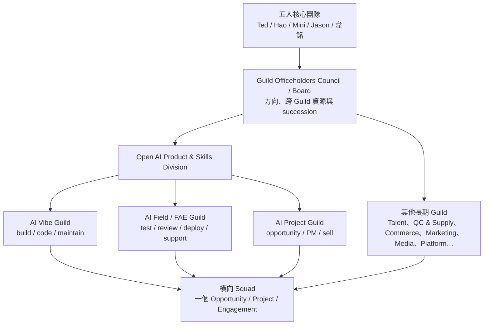
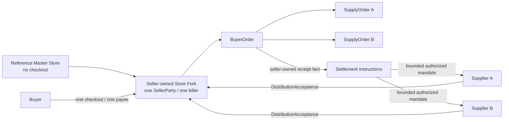

# Freedom Platform 大平台規劃與技術規格索引

> 狀態：現行 canonical baseline（2026-09-19 低維運互惠修訂）；planning 文件，不代表已部署。

> **2026-09-24 今日狀態與優先序：** 公開會員 beta 以 `main` `8338a42` 運行（root 已部署驗證，見 `09` 的 9/24 狀態）。它是 Node＋PostgreSQL 的已實作子集：email 註冊、封閉定位、18 個公會、37 本技能書（43 個原作 repo）、名片、GitHub Star 與開發資格 grant／revoke。本頁的 56 packages、12 runtimes、signed channel 與金流仍是目標，下文「未跑／不宣稱完成」只適用這些目標與真人／provider 驗收。
>
> 優先序：① 修正已上線 beta 的可用性；② 開發資格路徑（公會 → GitHub OAuth → App 安裝 → 短效 key）；③ 使用者明確要求但尚未落地的強制 Star（建議替代尚未獲同意）與找回密碼寄信；LINE Login 只是後續 adapter 需求；④ 後續架構。
>
> 矛盾與對齊表見 [2026-09-24 計畫對齊](../development/audit-2026-09-24-plan.md)，修正與完整驗證見 [全站整合報告](../development/audit-2026-09-24.md)；9/23 落差見 [落差盤點](../development/plan-drift-2026-09-23.md)。

日期：2026-09-19

## 0. 第一次看這份計畫

核心團隊由 Ted、Hao、Mini、Jason、韋銘組成。五人先做一次性共同閱讀，確認建議預設分工後各自 own 自己的 track；不設定期共同會議。這次閱讀不是閘門，Ted 的 Foundation Day 1 採購、帳號建立與基礎設施設定不等待閱讀完成。

| 人 | 建議閱讀路徑 | 可略過 |
| --- | --- | --- |
| Ted | 全部；共同閱讀時另看 `06 §3.1` 與 `08 §3／§12` 的自己那列 | 無 |
| Hao（行銷長才、community leader 與精神領袖） | README、`01`、`10`、`04 §5／§8`、`08 §13.2`；共同閱讀時另看 `06 §3.1` 與 `08 §3／§12` 的自己那列 | 其餘架構細節、contracts 與 package specs 可按工作需要查閱 |
| Mini | README、`01`、`02`、`06`、execution 的 milestones／spec-index／acceptance-matrix；共同閱讀時另看 `06 §3.1` 與 `08 §3／§12` 的自己那列 | contracts 與非負責 track 的 package specs 可按工作需要查閱 |
| Jason | README、`01`、`04 §2／§9`、`06 §5`、execution/first-work-batch、`09`；共同閱讀時另看 `06 §3.1` 與 `08 §3／§12` 的自己那列 | contracts 與非負責 track 的 package specs 可按工作需要查閱 |
| 韋銘 | README、`02`、`03`、`05`、execution/specs；共同閱讀時另看 `06 §3.1` 與 `08 §3／§12` 的自己那列 | 產品敘事與營運細節可按工作需要查閱 |

非開發者可略過 `contracts/` 與 `execution/specs/`；它們是開發者資料。`verification/2026-09-17-tree-verification.md` 只保留原版歷史檢查，不是本版驗證；本版看 `verification/2026-09-19-revision-check.md`。

共同閱讀時要確認的事：

- `06 §3.1` 的建議預設 holders 與各 track 範圍。
- Signer A／B、offline recovery、break-glass co-owner 與第二 Super Administrator 等 custodians。
- 可外包工作卡的 assignee；每張卡仍需記 owner、implementation（人＋Codex）、reviewer（Grok）、verifier（Claude）與 acceptance evidence。
- Foundation Day 1 日期；該日期的工作不等待本次閱讀完成。
- 第一家 Store 的 Seller、Freedom 品牌帳號 owner。
- `commercial-ready` 的 Vibe／Field／Project 三人與 `official` 的獨立 reviewer。
- Cost caps、market／currency 與 domain 名。

## 1. 一句話結論

Freedom Platform 是讓真實問題被共同解決、幫助者與受助者各自得利、成果被重用的自由開源協作平台。Agent、工作帳本、Guild與商業模組負責降低行政摩擦，不以核心團隊持續派任務、催促或補位維持熱度。

```text
真實需求 → 自願共同目標 → 有限投入與明確實益 → 共同成果
         → 當事人各自回報 → 合法重用／再合作 → 有預算時另開付費服務
```

每位會員首頁先回答三件事：

- `Now`：我需要協助、能提供的有限協助，以及我們的共同目標。
- `Next`：可選的求助／協助／共同成果／自助行動，明列實益、時間與容量。
- `Gained`：各自的實益、共同成果、幫到誰與可重用資產；未知、已確認及實收分列。

平台不建立萬用總分；定位、各 Guild rank、貢獻、QC 熟悉度、商業成果與權益分開保存。目前所有文件與 machine-readable artifacts 都是 planning baseline；帳號、repo、資源與 deploy 均不宣稱已完成。產品／營運／真人測試仍「未跑」；契約 fixture 靜態檢查見 [2026-09-19修訂檢查](./verification/2026-09-19-revision-check.md)，本機 scoped runtime milestone 見 [`docs/releases/2026-09-20-local-core.md`](../releases/2026-09-20-local-core.md)。不宣稱完整 package、milestone、部署、真人使用或收款證據。

### 1.1 本次修訂的執行重點

先讀 [12 低維運互惠運作契約](./12-low-ops-mutual-benefit.md)。完整架構保留（56 packages、9 repos、12 runtimes）。首批兩條平行驗證路徑：有限互助，以及自願作品展示／外展／商機／合作／外部實收證據；不再四線同時承諾真人服務，也不要求先做完十次免費互助才准找客戶。三種參與模式、雙方當次收益、最大投入及結束條件進原WorkItem；共同成果使用原Squad／cohort。

總工時計核心與其他成員，容量不足不隱性補位；普通志願請求可有界結束，付費／付款／安全／正式權益責任保留。資源與容量只約束已承諾的真人服務，不阻擋一般參與或外展。平台不承諾付費名單或未來收入；目前沒有已證明的真實付費成交。收款維持 Seller 自有、平台不 custody。產品／runtime／真人試行未完成。

## 2. 不可破壞的設計原則

### 2.1 Foundation 原則 P1–P13

以下是 `00 §1.1` 的操作摘要；精確定義以該節為準。

1. **P1 決定即執行：** Day 1 買齊、開齊 O1／O2，不以觀望替代執行。
2. **P2 只有技術依賴決定順序：** 資源、API、schema 或 state 的存在關係可以排序；人員、會議或 review 不控制開工。
3. **P3 買最終方案：** 一次建立最終目標所需方案，不買過渡方案。
4. **P4 安全設定同日做：** 2FA、WebAuthn、recovery、least privilege、rotation 與 restore 同日啟動並持續產生 evidence。
5. **P5 人說要就要：** 五人核心團隊依建議預設分工各自持有 track；Ted 的 Day 1 不等待共同閱讀，其餘 holders 與 custodians 在一次性共同閱讀時確認。
6. **P6 只有一份 Infrastructure Ready：** 唯一清單是 `08 §13`，它不等於 production readiness 或 release approval。
7. **P7 AI 與人的邊界：** AI 不採購、不決策、不簽 A4，但完成全部可自動化設定；人處理登入、付款、法律文件與相應 exact A4。
8. **P8 衝突直接改 canonical：** 現行文件只保存最新決策，不並列舊說法。
9. **P9 誠實：** 價格只用 `08 §3.3` 的 canonical 數字或「採購時查價」；帳號存在不等於上線；未實跑就寫「未跑」。
10. **P10 零阻擋：** 採購、建置、契約、實作、貢獻與發布準備持續；Ted 的人類停點只有付款、法律文件及對外正式 release 三類 exact A4。
11. **P11 最少人際對接：** 平台自身以 Grok adversarial review、Claude verification 與自動 checks 取代真人排隊。
12. **P12 名冊不是前置：** 不同自然人只控制 `official`、`production-signed`、`commercial-ready` 等標籤，不控制 candidate、staging、sandbox、內部 demo 或工作。
13. **P13 地基廣、深、全形狀：** 先建 56 packages、9 repos、12 runtimes／consumers、四個 product repo templates／adapters、五個 cores 與全部 seams，再在階段 2 補垂直細節。

### 2.2 產品與治理原則

1. **Guild 縱向，Squad 橫向。** Guild 長期維護 profession、訓練、人才與模組；Squad 依 Opportunity／Project 跨 Guild 交付。
2. **Rank 與 office 分開。** Runner → Strategist → Master 表示能力 evidence；Officer 是有任期、scope 與交接責任的職務。
3. **一人可有多個 profession。** 每次工作都記 acting role，不能混用 entitlement 或簽名權。
4. **AI-first，人承擔責任。** Agent 可以找工作、preflight、draft、測試、開 branch／PR 及在 bounded grant 內執行；Agent 不是 Member、Master、reviewer、締約人、signer 或 payee。
5. **知識開放，專屬容量有價。** 文件、Skill、Guild 教學與一般 community QC 免費；專屬時間、責任、客製、部署、代管、算力與 SLA 可以收費。
6. **Candidate 持續流動。** 人人可提交、討論與改善；缺少獨立 QC evidence 時 `official=false`，不停止 candidate 流程。
7. **開源貢獻不是永久抽成。** 貢獻形成實績、熟悉度與未來 Squad 機會；交易與服務依各自 versioned agreement 分配。
8. **一個 checkout 只有一個 Seller。** Store 綁定單一 `SellerParty`；多 Supplier 在訂單後拆成履約與 settlement obligations。
9. **規則可版本化，歷史事實不可覆寫。** 已簽、已付款、已完成及 ledger facts 只能追加更正或 supersession evidence。
10. **控制只拒絕該次無效操作。** 身份、簽名、schema、state、money、idempotency 與安全檢查不懲罰整個人。

## 3. 組織骨架



以下全部是建議預設，五人共同閱讀時確認；完整 holder 表以 `06 §3.1` 為準。

| 人 | 建議預設分工摘要 |
| --- | --- |
| Ted | Infra、Platform Engineering、Platform／Agent Control／Contracts、Settlement／ledger、AI Vibe Guild Master；GitHub organization owner、Cloudflare billing owner／Super Administrator、Signer A custodian與三類 A4 |
| Hao | 行銷長才、community leader 與精神領袖；Growth & Marketing、Media Automation、Member & Community Operations；Freedom 品牌 ChannelConnections campaign／account owner、Discord server／LINE OA 營運 admin |
| Mini | Delivery PM、Product Quality & Supply、Commerce & Sales；GitHub break-glass co-owner、Signer B custodian、`commercial-ready` 的 Project |
| Jason | Talent & Direction（定位＋陪跑）、Opportunity／Project／Squad／Work 日常協調、Opportunity & Partnership；Cloudflare 第二 Super Administrator、offline recovery custodian、`commercial-ready` 的 Field |
| 韋銘 | Dev implementation track、非作者時的 `official` 獨立 QC reviewer、`commercial-ready` 的 Vibe |

Ted 仍持有 infra／platform／設計／建置 ownership 與付款、法律文件、對外正式發布三類 A4，並在 Day 1 一次建齊，不等待共同閱讀。Mini 的 break-glass co-owner 與 Jason 的第二 Super Administrator 邀請在 Day 1 寄出；接受狀態只影響 `recovery` 標籤。AI review 由 Grok adversarial review、Claude verification 與自動 checks 完成，不設定期會議或多人簽核流程。

Hao 的精神領袖是社群角色描述，不是 office 或 A4 簽名點，也不新增權限或閘門。

Open AI Product & Skills Division 把開源 Skill、AI Product Forge 與 implementation 放在同一生命週期。Vibe／Field／Project 的建議預設分別是韋銘／Jason／Mini，五人共同閱讀時確認；三個不同自然人各自接受 assignment 時 `commercial-ready=true`，否則維持 false，產品工作照常。Exact artifact 由不同自然人完成 scoped QC 時 `official=true`；Signer A／B custodian 是不同自然人時 `production-signed=true`。同一人切角色或換 Agent 不增加自然人數。

Guild self-service 加入直接建立 `runner`；Master 收到通知以提供協助，不是 admission approval。平台自身建置的 review 由 AI review 與自動 checks 完成。

## 4. 八個 experience modules

| # | 模組 | 使用者直接得到 | 主要 accountable stewardship |
| --- | --- | --- | --- |
| 1 | 定位 | 可修正方向、profession 候選與第一步 | Talent & Direction |
| 2 | 貨品上架／Supplier／QC／分潤 | 可供應、可 review、可量化分配的商品 | Product Quality & Supply |
| 3 | 電商平台 | 可 fork、單一 Seller 結帳的 Store | Commerce & Sales |
| 4 | 自動行銷 | 商品／服務導入渠道與可審內容 | Growth & Marketing |
| 5 | 自動剪輯 | 行銷長轉短、字幕與多版本素材 | Media Automation |
| 6 | 開源 Skill 與 AI 產品 | SkillPackage、GitHub、維護者、QC 與商業化入口 | Open AI Product & Skills Division |
| 7 | 會員與狀態 | 身份、profession、Skill、Now／Next／Gained | Member & Community Operations |
| 8 | 陪跑 | 定位後的專屬協助、checkpoint 與成果 | Talent & Direction |

`ModuleStewardship` 為每個模組保存 accountable owner、delegates、版本、交接與服務狀態。建議預設 holder 依 `06 §3.1` 分布於五人核心團隊並在五人共同閱讀時確認；缺少人員 evidence 不停止工作。

### 共用 operating cores

- Organizations & Professions：Guild／Division／Squad、membership、rank、office、module stewardship。
- Opportunity / Project / Task：lead、project、service engagement、work item、claim、review、result。
- AI Agent Control：Work Feed、principal、acting role、SkillPackage、grant、AgentRun、ActionIntent、signature、provenance。
- QC & Commercialization：candidate、review protocol、version-scoped QC、CommercialEdition、product triangle。
- Distribution & Settlement：Product／Offer、Store／Seller、`DistributionAcceptance`、SupplyReservation、obligation、transfer、refund／reversal。

模組邊界、四層結構與唯一 seam 以 `02 §4.7` 為準。底層共用 Identity & Access、PostgreSQL、event／outbox、object storage、projections、quota 與 audit ledger。

## 5. 四條價值循環

| 循環 | 從哪裡開始 | 完成事實 | 主要獲得 |
| --- | --- | --- | --- |
| 社群成長 | 定位／自選 profession | 學會、做出、教會或提交 accepted result | 知識、rank evidence、人脈、下一 WorkItem |
| 成品販售 | Supplier Product＋Seller Store | 買家付款、Supplier 履約、settlement 對帳 | 銷售收入、分配、供應與市場 feedback |
| 開源 AI 產品 | repo／SkillPackage candidate | QC、角色 assignment、CommercialEdition、導入 | 客製、商業版、FAE、support、維護工作 |
| Professional Service with AI | lead／Opportunity | SOW、milestone、驗收與 Squad allocation | 專業服務收入、案例、長期客戶 |

產品與服務是 value streams，不複製會員、任務、Skill、Opportunity 或 ledger backend。

## 6. 單一 Seller 商店、金流鐵律與外部帳號



金流鐵律：平台是接點、database、code base 協作核心與狀態機；money 的權威事實在 Seller 的 provider／bank，code 在 GitHub，chat 在 Discord／LINE，客戶 raw data 在 client／Squad storage。平台只保存 ref、digest 與 fact。

- 收款方永遠是 `SellerParty`，使用自己的 `seller_collection` connection；付款方使用 payer-owned `payer_disbursement`，受款方使用 beneficiary-owned destination。
- 平台不做 merchant of record、escrow、wallet 或代收，也不申請、不持有任何 merchant／live payment 帳號。
- `money_movement_enabled=false`，每個 Seller 預設 `record_only`。`authorized_mandate` 僅在 `money_movement_enabled=true`、Payer 當事人已對 exact `SettlementMandate` digest 簽署成員 A4，且 Ted 已對同一 digest 完成付款類一鍵 A4 時可用；缺任一條件即維持 `record_only`，商店、listing 與對帳照常。
- Seller 對 exact listing 與價格簽成員 A4，Supplier 對 exact `DistributionAcceptance` 簽成員 A4。沒有 active `DistributionAcceptance` 不能進入 checkout；不同 Seller 不混合同一 checkout（`01 §7`）。`MSRP`、平台建議售價與 `recommended_floor` 只提供建議，不自動封鎖價格。
- 第一家 Store 的 SellerParty 建議預設為 Ted，五人共同閱讀時確認，也可改為五人中任一人；Store fork 部署到 Seller 自有 origin，建議預設使用 Seller 自己的 Cloudflare 帳號／Pages。Reference Master Store 以 `reference` mode、無 checkout 方式放在 `<org>.github.io/freedom-storefront/`。

外部帳號 ownership 固定分四類：

| 類別 | Owner 與範圍 |
| --- | --- |
| O1 平台基礎設施 | Ted 以 Platform 身分購買 GitHub org／GHEC／App、Cloudflare 全套、PostgreSQL、KMS／HSM signing planes、password manager、LINE、Discord、transactional email、monitoring、e-sign evidence archive、R2、平台自用 AI／render quota 與 vendor billing identity |
| O2 第一個營運實例 | Ted 只建立第一個 `SellerParty`、Seller-owned 綠界 ECPay sandbox 與 Seller-owned Store origin；Freedom 品牌 X／Meta／YouTube `ChannelConnection` 由 Hao 以品牌 owner 身分建立；Hao 當日不便時由 Ted 以品牌名義先開並同日移交 owner／admin。以上分工為建議預設，五人共同閱讀確認；Ted 的 O1 與 Seller lane 不等待確認 |
| O3 成員／Seller／Squad 自有 | 平台不購買其他 Seller provider、成員 repo、BYOK key、Squad storage 或 coach 收款帳號；只做 contract tests 與 deterministic mocks |
| O4 事實權威 | Money、code、chat、client raw data 留在各自權威系統；平台只存必要 ref、digest、fact |

Day 1 採購、角色帳號、技術依賴順序與 Infrastructure Ready evidence 見 `08 §13`。

## 7. 工具分工

| 工作 | 權威工具 | 平台保存 |
| --- | --- | --- |
| 討論、讀書會、群體協作 | Discord | channel／thread／event refs、結論草稿與 task candidates |
| 即時陪跑、客服與提醒 | LINE | consent、delivery receipt、session／deep-link refs；不鏡像私訊全文 |
| code、Issue、PR、review、release | GitHub | immutable refs、sync receipts、與 WorkItem／Result 的關聯 |
| 身份、profession、工作與簽名 | Freedom Portal | canonical records、授權、非 code diff／review、Now／Next／Gained |
| 店面 | forkable Storefront | Seller binding、listing／order refs；視覺可自由修改 |
| 收款與 settlement | participant-owned providers | connection refs、mandate、instruction、transfer／reconciliation facts；不存明文 credential、不持有 funds |

Discord bot 或 LINE 訊息可以建立草稿與 deep link；外部訊息永遠不是 A4。正式責任動作回到能顯示 exact artifact 並驗證身份的簽名介面。

## 8. AI-first 每日工作體驗

Agent 取得最小必要的 `WorkContextBundle`，包含 principal、confirmed profession／rank、equipped Skill、work intent、availability、visible WorkItem 與 standing grants。每張工作卡說明 `why_you`、acting role、expected effort、可能獲得、所需 review 與 signature。

A0 讀與解釋；A1 草稿、測試、sandbox；A2 執行有界且可撤回的工作；A3 依 exact channel／時間／數量政策公開。A0–A3 由 `ExecutionGrant` 授權，A4 則是有權自然人對 exact artifact／digest 的簽名。

成員 A4 保持產品語意：Seller listing revision、Supplier `DistributionAcceptance`、Squad `EngagementAllocationPlan`、`SettlementMandate`、ProjectRelease approval 與 scoped official QC 都由該當事人簽署。Ted 的三類 A4 只處理平台自身付款、法律文件與對外正式 release。所有外部寫入都經 idempotent `ActionIntent` 與 ledger，不保存 chain-of-thought。

Freedom Platform 自身是第一個 dogfood Project：spec 產生 WorkItem／GitHub Issue，Agent 建 branch／PR，Grok adversarial review、Claude verification 與自動 checks 產生 evidence，完成事實回到 contribution ledger。

## 9. 工程與營運方向

初期採 modular monolith＋獨立 workers。共同 identity、profession、task、event、order 與 ledger 留在單一 transaction boundary；媒體重運算、第三方 integration、growth、release status 與 Agent adapters 依 `02 §8.3` 的 12 個 runtime deployables／consumers 分離。

Foundation Day 1 依 `08 §13` 一次建立 O1／O2 與 production／staging resources。Production 保持零 public traffic，直到 Ted 對 exact release 簽對外正式發布的一鍵 A4。安全設定同日啟動並持續運作；結果只更新 `SLO`、`production-signed`、`recovery` 等標籤與 public traffic 狀態。

其後交付採 `06 §6` 四個階段：

- **1A 契約凍結：** 固定 contracts、stable IDs、events、state、A4、signed activation、module seams 與 negative fixtures。
- **1B 全形狀 skeleton：** 建出 56 packages、9 repos、12 runtimes／consumers、四個 product repo templates／adapters 與五個 cores。
- **1C 真實 sandbox 接線：** O1 平台與 O2 第一個營運實例接真實 sandbox；O3 只走 contract tests 與 deterministic mocks。
- **2 垂直細節與發布成熟度：** 補齊四條價值循環、migration、observability、安全、load、a11y、runbook、support 與可回復發布。

階段日期與週數只作建議預設；標籤缺失不停止無關工作。帳號存在、sandbox 成功或 skeleton 完成，都不等於 live。

## 10. 文件導覽

### Canonical planning

1. [需求基準](./00-current-requirements-baseline.md)：`00 §1.1` 定義 P1–P13，並保存現行需求與驗收邊界。
2. [產品、社群與組織模型](./01-product-community-model.md)：Guild／Squad、profession、journey、價值循環、五人核心團隊與 labels。
3. [架構、workspace 與 repo](./02-architecture-repositories.md)：部署單元、repo 邊界、module layers、唯一 seams 與 source of truth。
4. [領域、事件與狀態機](./03-domain-events-state-machines.md)：canonical entities、invariants、events、A4、orders、tasks 與 transitions。
5. [模組規格](./04-module-specifications.md)：八個 experience modules、五個 operating cores、流程、API、資料與 acceptance。
6. [接點契約](./05-integration-contracts.md)：LINE、Discord、GitHub、Storefront、payment、Agent、growth、media 與 webhook；O1–O4 詳見 `02 §4.7`。
7. [交付計畫](./06-delivery-plan.md)：56 packages、技術依賴、階段 1A／1B／1C／2、tests、migration 與 release DoD。
8. [決策、風險與追溯](./07-decisions-risks-traceability.md)：ADR、OD-01–OD-28 working defaults、risks 與 requirement traceability。
9. [GitHub＋Cloudflare bootstrap 與 Project lifecycle](./08-bootstrap-hosting-project-lifecycle.md)：帳戶、runtime、PostgreSQL、project lifecycle、Skill facade 與 Foundation Day 1 runbook。
10. [現況紀錄](./09-handoff-record.md)：現行 inventory、決議索引、未建立事實、驗證方式與禁止誤判清單。
11. [成員與 Agent 的一天](./10-member-agent-narrative.md)：成員從 Work Feed、測試、開發、上架到實績與收入的敘事入口。
12. [管理者與 Agent 的一天](./11-operator-agent-narrative.md)：五人核心團隊、委派、A4、labels、事故處理、domain Skill 與 Day 1 的敘事入口。
13. [低維運互惠運作契約](./12-low-ops-mutual-benefit.md)：有限容量、共同成果、雙方實益、工時、資源及真人觀察。
14. [Machine-readable contracts](./contracts/README.md)：OpenAPI、JSON Schema、event catalog、state machines 與 fixtures。

### Execution

- [Execution 索引](./execution/spec-index.md)：工作包、owner、AI reviewer／verifier 與 acceptance 導覽。
- [階段 bundles](./execution/milestones.md)：M00–M09 stable bundle IDs 對應階段 1A／1B／1C／2。
- [驗收矩陣](./execution/acceptance-matrix.md)：T01–T34、UAT-M1–M5；產品／真人狀態均以實跑evidence為準，契約 fixture 與本機 scoped runtime 另記。
- [首批工作卡](./execution/first-work-batch.md)：FW-01–FW-15；FW-01–12 有第一批靜態交付，FW-13–15 仍部分／未滿驗收。
- [Foundation Day 1 執行清單](./execution/human-foundation-plan.md)：O1／O2／O3、Infrastructure Ready 與 Day 1 技術順序。
- [Package specs](./execution/specs/)：各 package 的 scope、依賴、acceptance 與 evidence。

### Verification

- [2026-09-17 tree verification](./verification/2026-09-17-tree-verification.md)：驗證證據，不必讀。

## 11. 1A 契約凍結 artifacts

- `FND-01`：glossary、stable ID conventions、OpenAPI commands／queries、event envelope／catalog 與 canonical source schemas。
- `FND-05/06`：[`entity-playbook` schema／fixture](./contracts/entity-playbook.schema.json)、逐 item／status／readiness `enforcement`、五種首批 profile、八個 canonical entitlement keys、取得條件與 A4 named-application 邊界。
- `ORG-03/SKL-03/AGT-05/ONB-01`：[`member-onboarding` schema／fixture](./contracts/member-onboarding.schema.json)、Guild lifecycle、private-channel navigation slot、starter progress、member installation receipt、`agent.bootstrap.read`、day-one A0–A2 grant、welcome／support cards 與 stuck assistance。
- `BLD-01`：正式 `ContractBundle` file manifest／immutable-release publisher，以及 byte-identical contracts snapshot 的 derived `FreedomPlanBundle` manifest／publisher；不另擁有或改寫 glossary／stable IDs。
- Organization／profession、`SubmissionDraft` intake、WorkItem、AgentRun、ExecutionGrant 與 Signature schemas；[`submission-intake` fixture](./contracts/submission-intake.example.yaml) 固定 Portal／LINE／Discord／local document 四種來源先進 owner-private draft，只由 Portal owner／authorized operator confirm 或 reject。
- [`xp-policy` schema／fixture](./contracts/xp-policy.schema.json)：per-profession versioned `XpPolicyVersion` 與 member×profession×track rebuildable projection；無 cross-profession total，且不授權。
- Product、Offer、SellerListing、DistributionAcceptance、SupplyReservation、BuyerOrder、SupplyOrder 與 Settlement schemas。
- SkillPackage、ReviewSubmission、QualityReview 與 CommercialEdition schemas。
- `BLD-02`：canonical `freedom-build-system` 控制 Skill 的 `freedom-skill.yaml`、精簡 `SKILL.md`、stable adapter entrypoints、references／assets 與 external `skill-package.manifest.json`；缺 PRJ-01 implementation 時 fail closed。
- `BLD-03`：[`portable-activation` contract](./contracts/portable-activation.schema.json) 的 signed channel、publisher-resolved exact dependency closure、bundle pins、five-minute bootstrap index、2-of-N publisher key policy、rotation、revocation 與 golden／negative fixtures。
- `BLD-04`：package 外 minimal installer、[`activation.lock.json` contract](./contracts/portable-activation.schema.json)、typed network budgets、safe extraction、content-addressed cache、atomic pointer、live-session lease／GC、isolated discovery namespace 與 Codex／Claude Code／Grok adapters。
- `BLD-05`：[`domain-skill-overlay` contract](./contracts/domain-skill-overlay.schema.json)、runtime roots-set digest、runtime-scope QC、revocation、per-run isolation、mode 與三 CLI negative fixtures。
- `freedom.project.yaml` schema、CandidateProvenance profile、A4 ReleaseApproval／ActionIntent binding、post-release status attestation、semantic GitHub checks、status-neutral project page、live-status contract、fork lineage 與 release policy。
- Entitlement、state machine、Discord／LINE channel／template maps。
- PostgreSQL migration interface／execution plan、seed contracts、outbox／inbox contracts 與 cross-repo contract-test harness；可執行 migrations 在階段 1B 建立。

這些 artifacts 由同一 spec 拆成 Platform WorkItems 與 GitHub Issues，讓人與 Agent 依標準 branch／PR／AI review 流程共同完成。產品／營運／真人測試在實跑前維持「未跑」。

- [2026-09-19修訂檢查](./verification/2026-09-19-revision-check.md)：syntax、schema、example及狀態機靜態證據；不代表產品 runtime 或真人驗證。
- [2026-09-20 本機核心](../releases/2026-09-20-local-core.md)：scoped prototype（login→claim→submit→accept→gains）；不宣稱完整 package、milestone、部署或收款證據。
